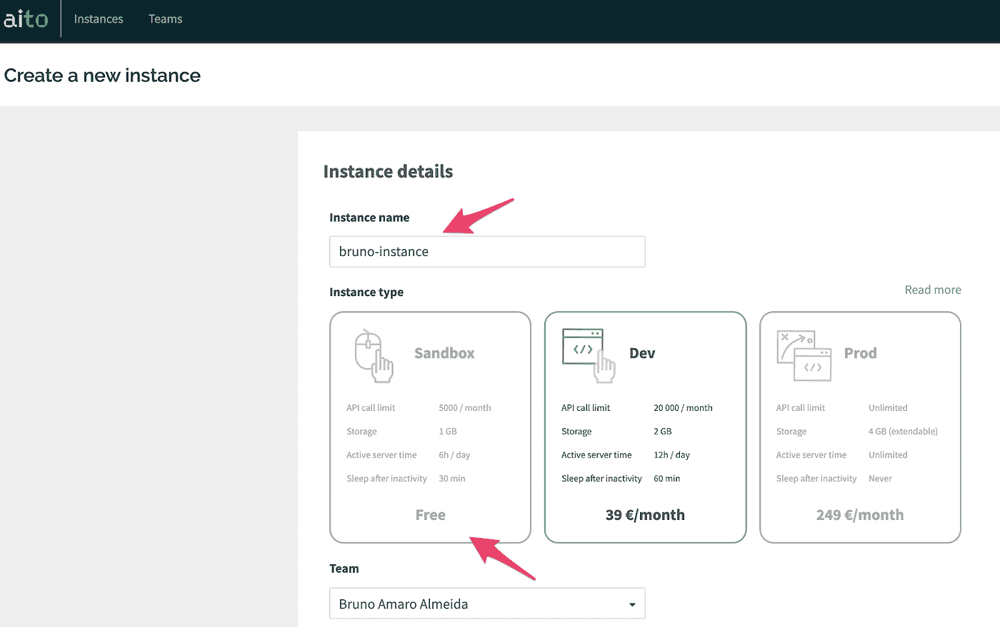
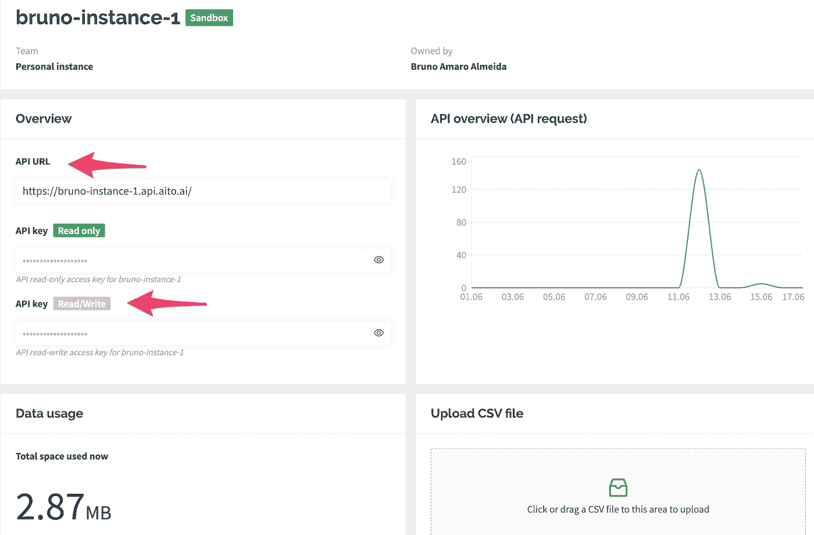
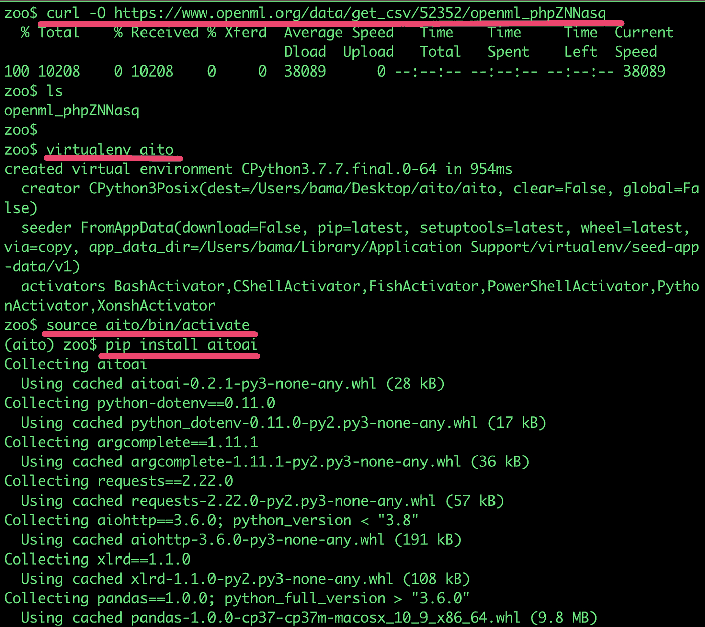
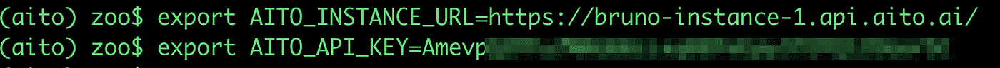
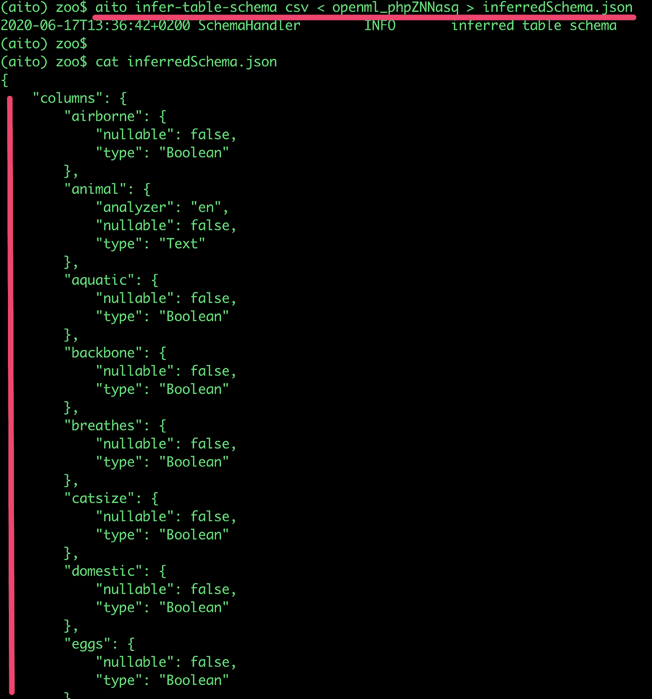
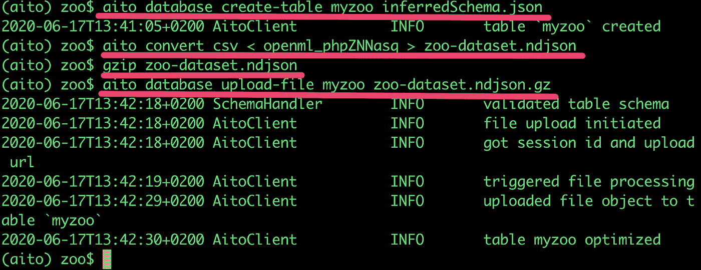
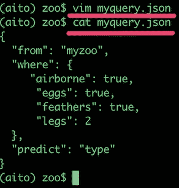
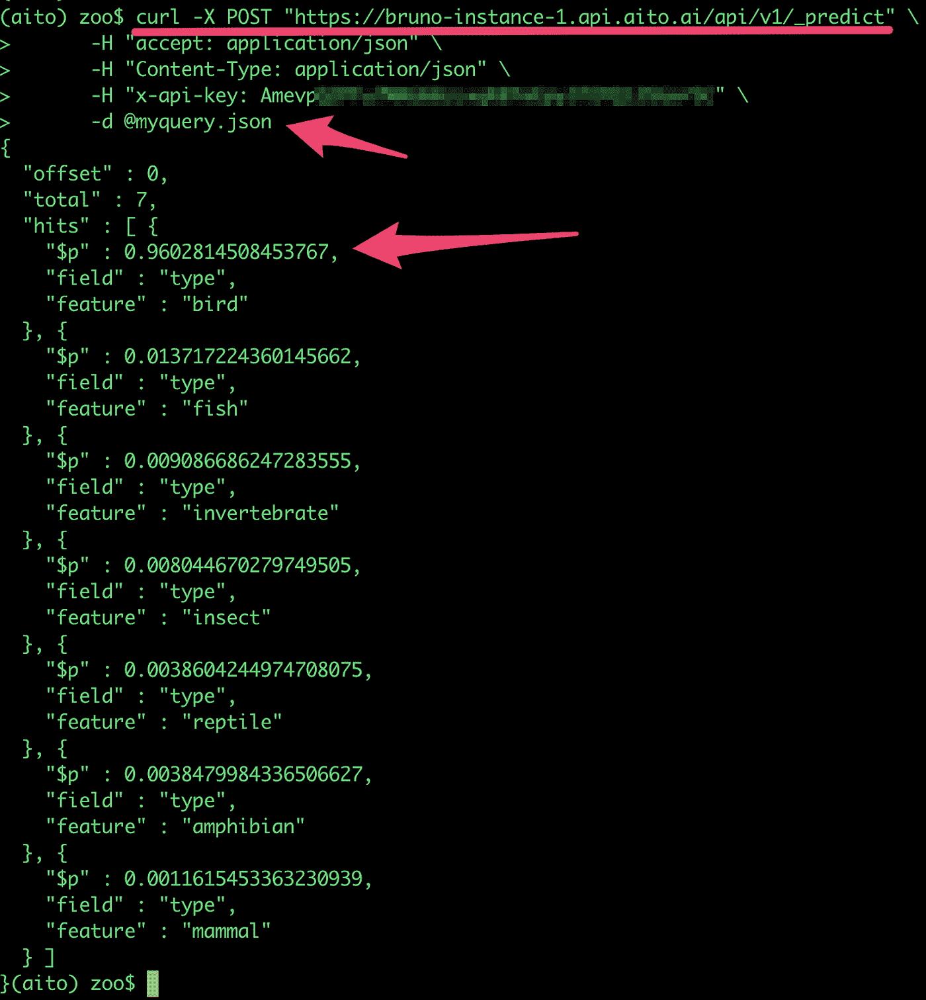

# 如何使用 Aito 引擎预测动物

> 原文：<https://towardsdatascience.com/how-to-use-the-aito-engine-to-predict-animals-6853672eac7e?source=collection_archive---------62----------------------->

## 利用自动机器学习预测的逐步指南

今天，谈论数据不可能不提到人工智能、机器学习和数据工程等话题。事实上，虽然人工智能从 50 年代就开始被研究和讨论，但只是在过去几年里它才被大肆宣传并成为商业词汇的一部分。

有时很难看到所有流行词汇背后的东西，但在过去几年中，数据和人工智能确实处于新的突破性商业模式和社会创新的最前沿。商业和技术领导者是时候利用人工智能提供的优势了。

# 自动机器学习和智能预测

在机器学习中，一个从数据中学习规则的算法和技术工具箱，预测值一直是一个受欢迎的用例。通常，数据科学家使用回归算法(如线性或逻辑)来估计从属值之间的关系，从而使他们能够预测值。

这些众所周知的机器学习例子，如预测，结合算法和云技术的成熟，导致自动机器学习(AutoML)服务和平台的诞生。

通过 AutoML，我们可以使用简单的 API 请求对数据进行智能预测。这使得任何人，如果没有事先的数据科学知识，只需利用这些预先训练的机器学习 API，就可以获得人工智能的好处。

最近的研究告诉我们，大多数人工智能项目的失败是由于缺乏熟练的员工和不切实际的期望。组织需要开始以不同的方式看待他们处理数据科学项目的方式。自动化机器学习是开始用真实数据进行实验的一种很好的方式，门槛低，可以转化为即时的商业价值。

# 智能预测引擎 Aito 简介

Aito 是一个智能预测引擎，使开发人员和专家能够获得机器学习能力。作为一个平台，它结合了数据库引擎和自动机器学习功能，如预测、相似性等。

传统的数据库平台通常专注于搜索和过滤已知信息。反过来，Aito 在此基础上增加了通过分析和索引你上传的数据的模式和特征来预测未知信息的能力。

Aito 可用于实现智能自动化，例如改善输入和预测数据、匹配系统之间的记录或自动化重复性决策。

使用案例和可能性是无穷无尽的，但 Aito 特别擅长的一个领域是机器人过程自动化(RPA)。借助 Aito，组织可以将[智能添加到现有 RPA 工作流](https://aito.ai/blog/anatomy-of-a-machine-learning-use-case-in-rpa/)中，这有助于他们降低成本，并使现有团队能够增加更多业务价值。

# 使用 Aito 预测动物类型的步骤

由加州大学欧文分校提供的[动物园数据集](https://www.openml.org/d/62)在 OpenML 中可用，它是不同动物布尔属性的一个非常简单的数据集合。这为我们提供了一个很好的基线数据集，我们可以使用它来根据动物的一些属性(如腿、尾巴、捕食者等)预测动物的类型(如鸟、鱼、哺乳动物)。

我们真的很容易预测这个动物园里的动物类型吗？通过自动机器学习和 Aito 引擎，我们可以快速回答这个问题。在几个实际步骤中，我们将向您展示如何使用 Aito 和进行预测查询。

# 创建 Aito 实例

如果你是 Aito 的新手，你可以从[注册](https://aito.ai/sign-up/)开始，创建一个新的实例。

创建过程非常简单，只需给它一个名称并选择所需的实例类型。沙盒类型是完全免费的，它给你足够的能力去尝试动物园的例子。



Aito 控制台中的实例创建面板

提交实例请求后，只需等待团队的确认。您的 Aito 实例详细信息将在 web 控制台中可见。



Aito 实例详细信息

记下仪表板中的 API url 和键。我们将使用这些参数与实例进行交互。

# 配置您的本地环境

虽然可以通过 web 控制台上传数据，但您需要使用 [Aito CLI 和 Python SDK](https://aitodotai.github.io/aito-python-tools/) 或 [REST API](https://aito.ai/docs/api/) 来适当利用引擎功能。

1.  首先，使用以下命令将数据集下载到您的计算机上:

```
curl -O [https://www.openml.org/data/get_csv/52352/openml_phpZNNasq](https://www.openml.org/data/get_csv/52352/openml_phpZNNasq)
```

2.创建一个 python 虚拟环境，并使用命令 pip install aitoai 安装 Aito CLI



下载动物园数据集并安装 Aito CLI

3.通过将环境配置到 Aito 实例来完成设置。您可以通过设置 AITO _ 实例 _URL 和 AITO_API_KEY 环境变量来定义这一点。



为 Aito 实例配置环境

# 使用 Aito CLI 输入数据

安装 Aito CLI 并准备好使用后，让我们从从 zoo 数据集推断数据模式开始。因为在其核心，Aito 引擎表现为一个数据库，这是描述我们的数据看起来如何的必要步骤。幸运的是，这可以不费吹灰之力完成。

输入数据的最快方式是使用 Aito UI 拖放功能或 CLI quick-add-table 命令。这两个选项都将模式推断和数据上传捆绑到一个操作中，并从用户那里抽象出内部细节。但是，在下面的示例中，我们采用了更长的路线，将摄取步骤分解为单独的单个操作。这给了我们完全的控制权，也让我们对 Aito 的工作方式有了更好的理解。

1.  使用 infer-table-schema 命令自动分析数据集，并将模式提取到 JSON 文件中。这个特性还使您能够在将数据提供给 Aito 之前，根据需要修改模式文件(在这个用例中不是这样)。

```
aito infer-table-schema csv < openml_phpZNNasq > inferredSchema.json 
```



自动模式推理

2.根据我们在上一步中推断的数据模式，在 Aito 实例中创建一个表(例如 myzoo)。使用以下命令:

```
aito database create-table myzoo inferredSchema.json
```

3.将动物园数据集文件从 CSV 转换为适合文件上传的[格式](https://aitodotai.github.io/aito-python-tools/quickstart.html#convert-the-data)(压缩的 NDJSON)。使用以下命令:

```
aito convert csv < openml_phpZNNasq > zoo-dataset.ndjson gzip zoo-dataset.ndjson
```

4.使用以下命令用数据填充 Aito 表(例如 myzoo ):

```
aito database upload-file myzoo zoo-dataset.ndjson.gz
```



正在将动物园数据集上传到 Aito 实例

5.数据集现在可以使用了，并准备好与 Aito API 功能一起使用。

# 使用 Aito 预测 API

从一开始，我们的目标是根据某些属性(例如腿、尾巴、捕食者等)预测动物的类型(例如鸟、鱼、哺乳动物)。通过在 Aito 中填充数据，我们获得了开箱即用的预测功能，只需查询 API 就可以访问这些功能。

1.首先准备一个 JSON 查询语句，描述我们想要使用什么属性以及我们想要预测什么。如果您想要查询在空中飞行、产卵、有羽毛和两条腿的动物类型，该语句可能是这样的:

```
{
  "from": "myzoo",
  "where": {
            "airborne": true,
            "eggs": true,
            "feathers": true,
            "legs": 2
  },
  "predict": "type"
}
```

2.将 JSON 查询语句保存到本地环境中的一个文件(例如 myquery.json)中。



JSON 查询文件

3.使用 curl 等工具将查询提交给 Aito 实例预测 API 端点。使用以下命令作为示例(填入您的实例 url 和 API 密钥):

```
curl -X POST “https://<YOUR_INSTANCE_URL>/api/v1/_predict” \> -H “accept: application/json” \
> -H “Content-Type: application/json” \
> -H “x-api-key: <YOUR_API_KEY>” \
> -d @myquery.json
```



Aito 预测 API 的查询

4.预测 API 响应将返回具有不同关联分数的多种动物类型。在这种情况下，我们的查询结果显示，我们正在寻找的动物类型有大约 96%的概率是鸟，其他动物类型的得分不到 1%。

# 进一步探索

您可以使用任何其他动物属性(检查推断的模式)来查询数据，但是从这个简单的示例用例中，我们可以看到使用 Aito 这样的服务进行数据分析有着巨大的潜力。

自动机器学习工具，如 Aito 引擎，可以简化日常操作，并通过简单的 API 请求带来真正的业务洞察力。

预测功能只是 Aito API 中 7 个以上功能中的一个。查看 [API 文档](https://aito.ai/docs/api/)并了解其他特性，如搜索、推荐、相似性等等。

如果你需要额外的灵感，看看 Aito 陈列柜，了解更多关于[预测缺失输入值](https://aito.ai/showcases/predicting-missing-input-values/)、[领导资格](https://aito.ai/showcases/high-speed-lead-qualification/)，甚至如何[将门与宜家厨房框架](https://aito.ai/showcases/intelligent-automation-matches-doors-with-ikea-kitchen-frames/)搭配。

我希望这篇文章对你有用。请分享您的反馈和想法，并随时联系 [Twitter](https://twitter.com/bruno_amaro) 和 [Linkedin](https://linkedin.com/in/brunoamaroalmeida)

布鲁诺