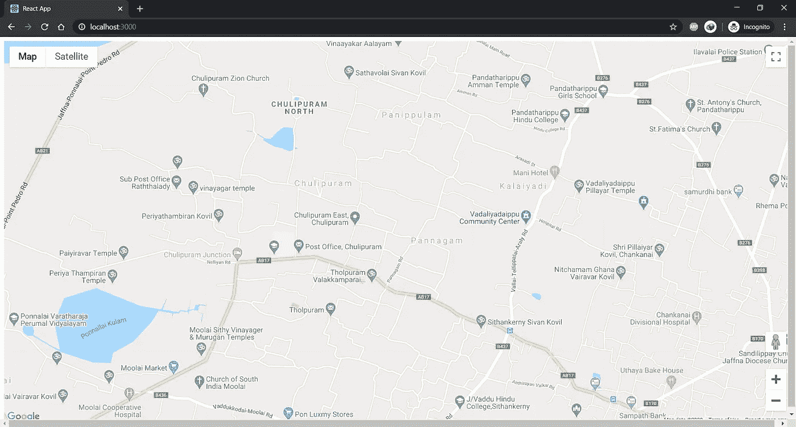
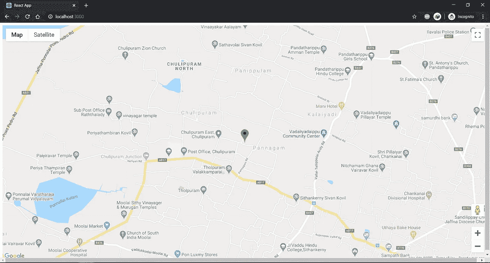

# 如何在 React.js 中使用带有自定义样式的 Google Maps API

> 原文：<https://towardsdatascience.com/how-to-use-the-google-maps-api-with-custom-styling-in-react-js-f6e7e59273df?source=collection_archive---------8----------------------->

## 前端

## 在 React 项目中集成漂亮的谷歌地图


照片由[像素](https://www.pexels.com/photo/white-ipad-38271/?utm_content=attributionCopyText&utm_medium=referral&utm_source=pexels)的[皮克斯拜](https://www.pexels.com/@pixabay?utm_content=attributionCopyText&utm_medium=referral&utm_source=pexels)拍摄

当我的朋友尝试一个新发型时，我问他“你为什么剪成这样？”他说他想成为一名出色的模特。因此，我明白了人们喜欢独特而美丽地展示它们。

当我开发个人 react 应用程序时，我想实现 google map API。我在谷歌上搜索了很多例子，最后，我找到了一个简单的解决方案。在这里，我将简要说明我如何使用该应用程序，以及我们可以添加到谷歌地图的自定义样式。这里我们将从头开始看。你可以在这里看到演示。这是我在 Medium 的第 29 篇文章。

# 首先

如果你没有谷歌地图 API 令牌注册[谷歌地图 API](https://developers.google.com/maps/documentation/) 并获得令牌使用！要获得令牌，您必须输入信用卡号码。然而，谷歌表示，如果你不亲自更新服务，他们不会向你的账户收费。做你的决定吧。一旦你有了 API 密匙，就开始开发你的应用吧！

要创建 react 应用程序，请在您的 shell/终端的特定文件夹(例如，desktop)中运行以下命令

```
npx create-react-app google-map
```

将创建一个新文件夹，并将其命名为 google-map。从这一步开始，用 [Create React App](https://github.com/facebook/create-react-app) 引导您的应用程序。有关更多信息，请单击[链接](https://github.com/facebook/create-react-app)。然后在 IDE 中打开该项目。我使用的是 VS 代码集成开发环境。


来自[突发](https://burst.shopify.com/hands?utm_campaign=photo_credit&utm_content=Picture+of+Working+Out+With+Chalk+%E2%80%94+Free+Stock+Photo&utm_medium=referral&utm_source=credit)的[妮可·德·霍斯](https://burst.shopify.com/@ndekhors?utm_campaign=photo_credit&utm_content=Picture+of+Working+Out+With+Chalk+%E2%80%94+Free+Stock+Photo&utm_medium=referral&utm_source=credit)的照片

# 着手工作

如果您打开 react 应用程序，那么您需要删除不需要的文件。因此，您需要转到 src 文件夹，删除 Logo.svg、App.css、index.css 和 App.test.js 文件。并在名为 components，assets and helpers 的 src 文件夹中创建以下文件夹，然后将 serviceWorker.js 移动到助手的文件夹中，将 App.js 文件移动到 Components 文件夹中。然后打开 index.js 文件，删除 index.js 文件中的以下代码片段。

```
*import* ‘./index.css’;
```

然后修改 index.js 导入中的 App.js 和 serviceWorker.js 文件路径，如下所示。

```
*import* App *from* ‘./components/App’;
*import* * *as* serviceWorker *from* ‘./helpers/serviceWorker’;
```

转到 Components 文件夹，打开 App.js，删除 App 函数的返回部分。

您需要安装一个依赖项来将谷歌地图作为一个组件。为此，使用下面的命令来安装依赖项。

```
npm install --save google-maps-react
```


[布鲁诺·纳西门托](https://unsplash.com/@bruno_nascimento?utm_source=unsplash&utm_medium=referral&utm_content=creditCopyText)在 [Unsplash](https://unsplash.com/s/photos/start-to-run?utm_source=unsplash&utm_medium=referral&utm_content=creditCopyText) 上拍照

# 完全（或彻底）地

在你的组件 app 里面新建一个文件，命名为 Map.js，然后你需要导入`google-maps-rect`。为此，在 Map.js 中添加以下代码片段。

```
import { Map, GoogleApiWrapper } from 'google-maps-react';
```

现在您需要呈现`Map`组件。因此，添加`Map`组件到你的渲染函数中。

在上面的代码中，我添加了普通的样式。我在 render 方法中使用了常量变量。

```
const mapStyles = {
  width: '100%',
  height: '100%',
};
```

您需要在 Maps.js 文件中添加 export default 语句，如下所示

```
export default GoogleApiWrapper({
  apiKey: 'TOKEN HERE'
})(MapContainer);
```

确保在这里输入您的 API 密钥！


来自[爆炸](https://burst.shopify.com/seasons?utm_campaign=photo_credit&utm_content=Free+The+Ice+Climbing+Adventures+Photo+%E2%80%94+High+Res+Pictures&utm_medium=referral&utm_source=credit)的[克里斯蒂安·穆里略](https://burst.shopify.com/@cmurillo?utm_campaign=photo_credit&utm_content=Free+The+Ice+Climbing+Adventures+Photo+%E2%80%94+High+Res+Pictures&utm_medium=referral&utm_source=credit)的照片

在 App.js 文件中导入`Maps`组件。所以你的 App.js 应该是这样的。

当你使用`npm start`启动你的开发服务器时，你会看到下面的结果。



嘣！你做到了，但是使用谷歌地图有什么意义呢？但是，合理地说，使用没有任何标记的谷歌地图有什么意义。因此，我们来添加一个标记。为此，更新您的`Map`组件以包含`Marker`组件。这里我使用了不同的纬度和经度，你可以使用任何你需要的纬度和经度。

```
import { Map, GoogleApiWrapper, Marker } from 'google-maps-react';
```



太好了！你在地图上添加了标记。

# 美好的事物永远是一种快乐

现在，您已经进入了本文最有趣的部分。现在，让我们来看看自定义样式。它只是一个 JSON 对象。您将在 GoogleMapStyles.js 文件中存储自定义样式 JSON。我使用的主题来自[样式向导:谷歌地图 API](https://mapstyle.withgoogle.com/)。如果你需要更漂亮的样式，那么试试时髦地图的样式，或者通过定制 JSON 对象建立你自己独特的地图样式。您的 GoogleMapStyles.js 文件将如下所示。

现在你需要在你的`Maps`组件中导入这个样式的 JSON。

```
*import* googleMapStyles *from* “./GoogelMapStyle”;
```

导入样式 JSON 后，可以将样式 JSON 设置为`Maps`组件的`defaultProps`。这可以通过在类体之外的组件类本身上定义`defaultProps`来实现，如下面的代码片段所示:

```
Maps.defaultProps = googleMapStyles;
```

然后，您需要将这个属性传递给`Map`组件的样式属性，如下面的代码片段所示:

```
<Map
  *google*={*this*.props.google}
  *zoom*={15}
  *styles*={*this*.props.mapStyle}
  *initialCenter*={{ lat: 9.761927, lng: 79.95244 }}
/>;
```

现在你的`Maps`组件将如下面的文件所示。

# **把你的脚抬起来**

在 react 中实现谷歌地图很容易。有很多 npm 包可以帮助 React 实现谷歌地图。对我来说，`google-maps-react`很容易使用，它是一个比[其他](https://www.npmtrends.com/google-map-react-vs-google-maps-vs-google-maps-react)更小的包。你可以从这个[链接](https://github.com/sabesansathananthan/react-google-map)克隆回购。

快乐编码😊！！！