# 如何在您的 Azure web 应用中使用 Microsoft 身份平台

> 原文：<https://towardsdatascience.com/how-to-use-the-microsoft-identity-platform-in-your-azure-web-app-fcb3839a44e5?source=collection_archive---------26----------------------->

## 通过身份、角色和权限管理对应用的访问

# 介绍

[微软身份平台](https://docs.microsoft.com/en-us/azure/active-directory/develop/v2-overview)是安全访问您的网络应用的关键。用户可以使用他们的 Azure AD 身份或社交帐户对你的应用进行身份验证。授权模型可用于向您的后端应用程序或标准 API(如 Microsoft Graph)授予权限。在这篇博客中，我们讨论了一个 web 应用程序，它具有以下功能:

*   1.具有用户角色的 Azure AD 登录:基本或用户角色:高级
*   2.使用已登录用户的委托权限访问 MS 图表
*   3.使用应用程序权限和应用程序角色访问后端

项目的代码可以在[这里找到](https://github.com/rebremer/ms-identity-python-webapp-backend)，架构可以在下面找到。

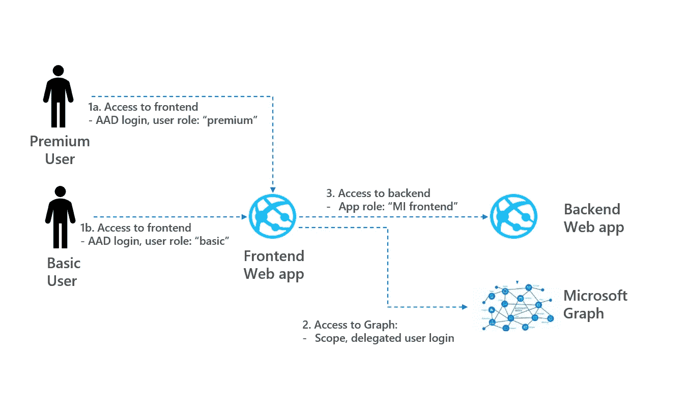

项目架构，作者图片

重点是提供一个使用微软身份平台的工作示例，并“弄脏你的手”。重点不是解释 OAuth 2.0 和 Azure AD 的内部工作方式。在本博客的剩余部分，将讨论以下内容。

*   步骤 0:准备工作—设置前端和后端
*   步骤 1:访问前端— Azure AD 登录，添加用户角色
*   步骤 2:访问图表-委托权限检索用户详细信息
*   步骤 3:访问后端—应用程序检索数据的权限
*   杂项:配置项目的其他可能性
*   结论

要了解如何使用授权或应用程序权限访问 Azure SQL 数据库，请参见我之前的[博客](https://docs.microsoft.com/en-us/azure/active-directory/develop/v2-overview)。注意，两个博客共享同一个 git repo，所以这个项目可以配置为访问 Azure SQL，而不是后端应用程序。

# 步骤 0。准备工作—设置前端和后端

这个示例展示了如何使用 Flask 和 MSAL Python 构建 Python 前端 web 应用程序，以及如何使用 Azure 函数构建后端应用程序。在该步骤中，执行以下子步骤:

*   0.1:创建前端 web 应用程序
*   0.2:创建和配置前端应用程序注册
*   0.3.创建后端 Azure 功能
*   0.4:配置 python webapp 项目
*   0.5:运行示例
*   0.6:(可选)将前端 web 应用部署到 Azure

## 0.1:创建前端 web 应用程序

若要运行此示例，您需要在本地安装它:

*   [Python 2.7+](https://www.python.org/downloads/release/python-2713/) 或 [Python 3+](https://www.python.org/downloads/release/python-364/)
*   Azure 活动目录(Azure AD)租户。有关如何获得 Azure AD 租户的更多信息，请参见[如何获得 Azure AD 租户。](https://docs.microsoft.com/azure/active-directory/develop/quickstart-create-new-tenant)
*   Git 克隆下面的项目:`git clone https://github.com/rebremer/ms-identity-python-webapp-backend.git`或者下载并解压存储库。zip 文件。

## 0.2:创建和配置应用程序注册

创建和配置应用程序注册，如下所示:

*   使用此[链接](https://docs.microsoft.com/en-us/azure/active-directory/develop/quickstart-register-app)中的步骤创建应用注册以创建应用注册。两个备注:
*   使用`http://localhost/getAToken`作为回复网址。如果您在创建过程中没有这样做，可以使用应用程序注册的**验证**选项卡添加它
*   转到**认证**并启用隐式授权中的选项 ID 令牌
*   转到**证书&秘密**创建一个秘密。复制客户端 id 和客户端密码

## 0.3:创建后端 Azure 函数

在这一部分，将部署 Azure 功能。这是按如下方式完成的:

*   使用这个[快速入门](https://github.com/MicrosoftDocs/azure-docs/blob/master/articles/azure-functions/functions-create-first-function-python.md)在 python 中创建一个 Azure 函数。
*   从 [git repo](https://github.com/rebremer/ms-identity-python-webapp-backend/tree/master/blog-webappaad-backend) 更新 **blog-webappaad-backend** 文件夹中的`requirement.txt`和`__init__.py`，再次发布功能
*   在此[快速入门](https://docs.microsoft.com/en-us/azure/app-service/configure-authentication-provider-aad#-configure-with-express-settings)之后，使用快速设置在您的 Azure 功能中启用身份验证/授权。

## 0.4:配置 pythonwebapp 项目

1.  打开`app_config.py`文件，改变下面的变量。
2.  在步骤 1.2 中创建应用程序注册时，找到文本`<<Enter_the_Client_Secret_here>>` ，并将其替换为您的应用程序密码。
3.  找到文本`<<Enter_the_Tenant_Name_Here>>`并用您的 Azure AD 租户名称替换现有值。
4.  找到文本`<<Enter_the_Application_Id_here>>`并用步骤 1.2 中应用程序注册的应用程序 ID (clientId)替换现有值。
5.  查找文本`<<your Azure Function>>`和`<<your secret>>`用步骤 1.3 中创建的 Azure 函数替换现有值。

## 0.5:运行示例

您需要使用 pip 安装依赖项，如下所示:

```
$ pip install -r requirements.txt
```

使用以下命令从 shell 或命令行运行 app.py:

```
flask run --host localhost --port 5000
```

当 app 在本地运行时，可以通过 localhost:5000(不是 127.0.0.1:5000)访问。步骤 1 之后，用户可以使用他们的 Azure AD 凭据登录，并从后端检索数据。

## 0.6:(可选)将前端 web 应用部署到 Azure

最后，请看[这个](https://docs.microsoft.com/en-us/azure/app-service/containers/quickstart-python?tabs=bash#deploy-the-sample)链接如何在 Azure web 应用中部署你的前端 flask 应用。部署代码的最简单方法是从放置 app.py 的目录中运行以下命令:

```
az webapp up -n <<your unique webapp>> --sku F1
```

确保将`https://<<your uniquewebapp>>.azurewebsites.net/getAToken`添加为回复 URL。当您登录并点击链接从 backed 中检索数据时，应显示以下屏幕:

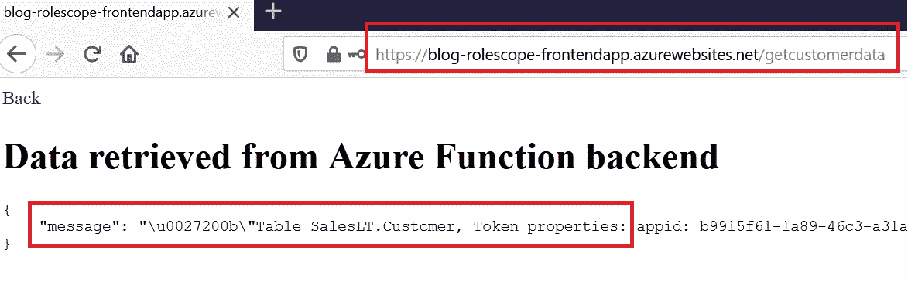

0.6.从后端成功检索到数据

然而，为了能够执行本教程的剩余步骤，也可以使用 localhost。

# 步骤 1:访问前端— AAD 登录，添加角色

在此步骤中，将为用户分配一个角色，以指示其是基本用户还是高级用户。执行以下子步骤:

*   1.1:在应用配置中设置配置
*   1.2:向清单添加角色
*   1.3:为用户分配高级角色

步骤 1 关注架构的以下部分。

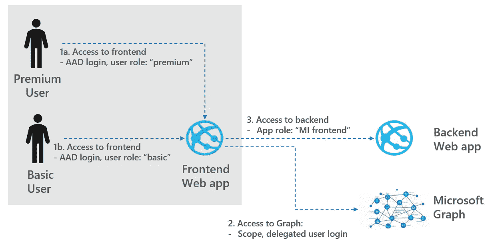

1.Azure 广告登录，配置用户角色，按作者分类的图片

## 1.1:在应用配置中设置配置

索赔验证是一个可选步骤，可以使用`app_config.py`文件中的以下设置启用:`AAD_ROLE_CHECK = True`。

## 1.2:向清单添加角色

按照本教程[中的步骤，向步骤 1.2 中创建的应用程序注册添加角色。显然，应使用以下方法:](https://docs.microsoft.com/en-us/azure/active-directory/develop/howto-add-app-roles-in-azure-ad-apps)

```
"appRoles": [
  {
    "allowedMemberTypes": ["User"],
    "description": "Basic user, read product data from backend",
    "displayName": "basic_user_access",
    "id": "a8161423-2e8e-46c4-9997-f984faccb625",
    "isEnabled": true,
    "value": "basic_user_access"
  },
  {
    "allowedMemberTypes": ["User"],
    "description": "Premium user, read all data from backend",
    "displayName": "premium_user_access",
    "id": "b8161423-2e8e-46c4-9997-f984faccb625",
    "isEnabled": true,
    "value": "premium_user_access"
  }
],
```

## 1.3:将用户分配给角色

在[链接](https://docs.microsoft.com/en-us/azure/active-directory/develop/howto-add-app-roles-in-azure-ad-apps#assign-users-and-groups-to-roles)中解释了用户的分配。作为测试，可以创建两个用户。用户 1 被分配了`basic_user_access`，而用户 2 获得了`premium_user_access`角色，另请参见下面的屏幕截图，其中 admin、student2 被分配了高级角色，而 student 1 只有基本角色。

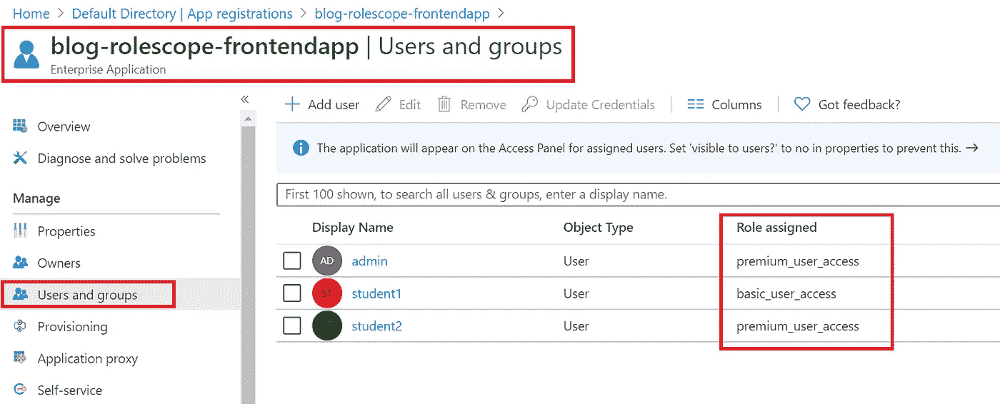

1.3a .分配给用户的角色

如果学生点击客户链接，对后端的访问将被前端拒绝，另请参见下面的消息。

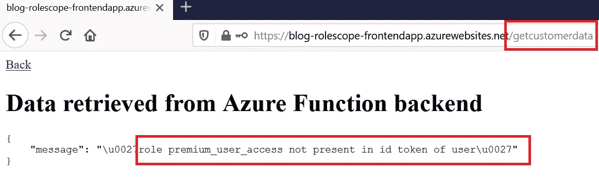

1.3b .角色为“基本拒绝访问”的用户

在下一步中，使用 Microsoft Graph API 检索用户数据。

# 第二步。对图表的访问-委托权限

[用户](https://docs.microsoft.com/en-us/graph/azuread-users-concept-overview?view=graph-rest-1.0)是 Azure 广告公司或学校用户帐户或 Microsoft Graph 中的 Microsoft 帐户的表示。在这个步骤中，使用`users.read`范围，使用登录用户的委托权限来检索自己的数据。执行以下子步骤:

*   2.1:验证应用注册中的权限
*   2.2:检索数据

第 2 步关注架构的后续部分。

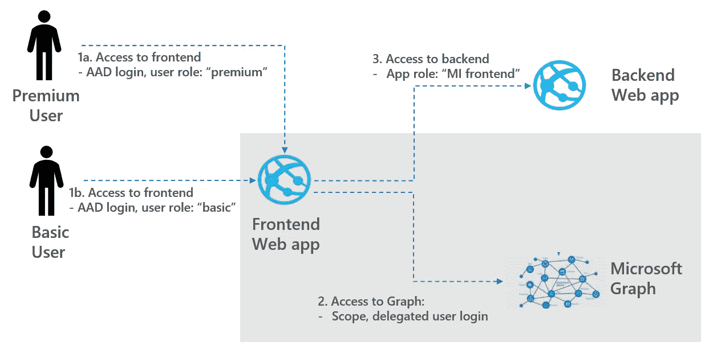

2.委托权限，按作者获取图表数据、图像

## 2.1:验证应用注册中的权限

应用程序注册需要同意从 Microsoft Graph 读取用户数据。根据 Azure AD 配置，以下类型的同意是可能的:

*   管理员同意:管理员已经同意应用程序可以代表登录的用户读取用户的数据。这种同意可以事先在应用程序注册权限中完成，也可以在管理员首次登录 web 应用程序时完成。
*   用户同意:An uses 本人已经同意 app 可以代表登录用户读取用户的数据。一旦用户第一次登录应用程序，这种同意就完成了

在这种情况下，使用事先完成的管理员许可。请参阅下面的 users.read 权限是在应用程序注册中授予的:

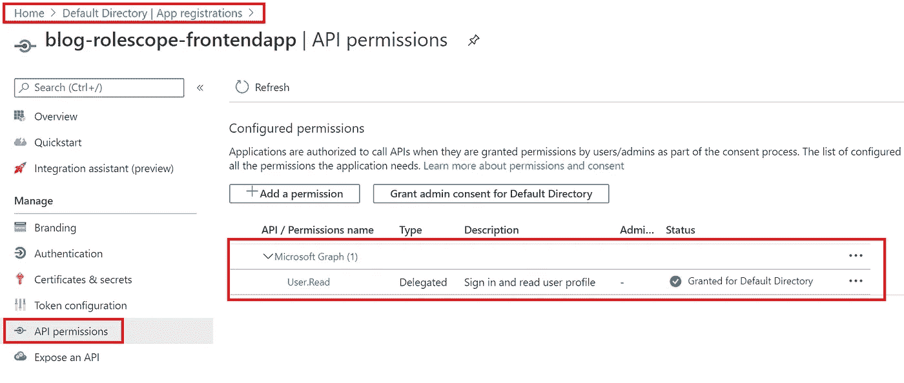

2.1a .用户。读入应用程序注册管理员同意书

随后，在 app 注册的附着企业应用中验证 App 可以代表用户读取用户的数据。

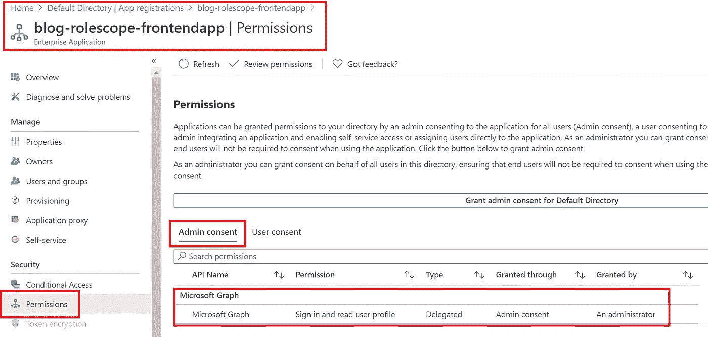

2.1b .用户。读入应用程序注册管理员同意书

注意那个用户。只读允许用户检索他自己的数据，而不是其他人的数据(只有有权限的用户才能这样做。Read.All)

## 2.2:检索图形数据

一旦应用程序获得用户同意或管理员同意检索数据，只需登录并单击链接调用 Microsoft Graph API，用户自己的数据就会返回，也见下文。

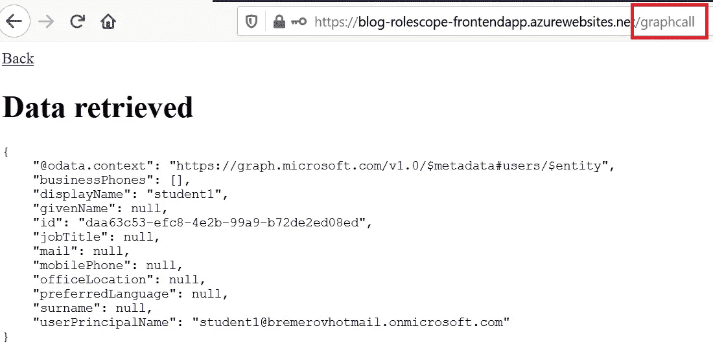

2.2.图形调用返回用户数据

# 第三步。访问后端—应用程序权限

在步骤 1 中，已经从后端检索了数据。然而，不仅前端可以从后端检索数据，同一 Azure AD 租户内的所有身份都可以检索数据。使用应用程序权限和用户分配，确保只有前端可以访问后端。

执行以下子步骤:

*   3.1:向后端和前端添加应用程序权限
*   3.2:在后端启用用户分配

第 3 步关注架构的后续部分。


3.应用程序权限，配置应用程序角色，按作者分类的图像

## 3.1:向后端和前端添加应用程序权限

转到后端应用程序注册清单，并将以下应用程序角色添加到清单中。

```
"appRoles": [
  {
    "allowedMemberTypes": ["Application"],
    "description": "frontend_app_access",
    "displayName": "frontend_app_access",
    "id": "f8161423-2e8e-46c4-9997-f984faccb625",
    "isEnabled": true,
    "value": "frontend_app_access"
  },
```

随后，进入前端的应用注册，点击 API 权限，将这些权限授予你的前端应用，也见下文。

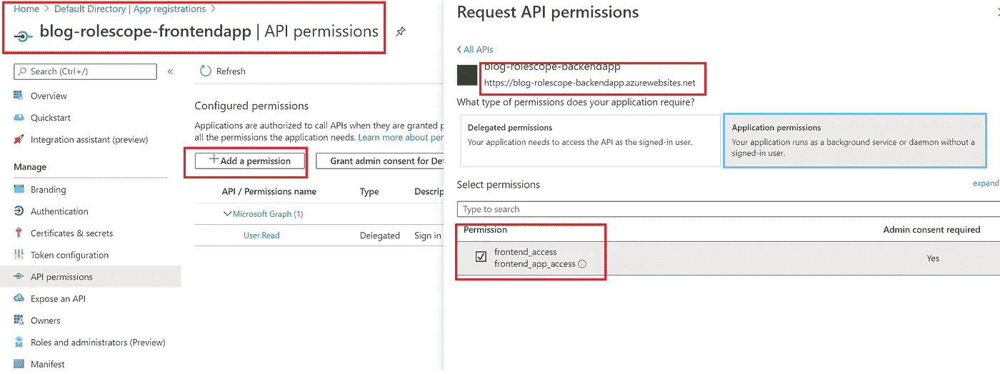

3.1a .在前端授予应用程序权限

随后，授予管理员权限，以便前端可以使用应用程序角色 front_end_access 访问后端。要验证前端是否具有应用程序角色 front_end_access，请转到后端应用程序注册、企业应用程序并查找用户/组，另请参见下文。

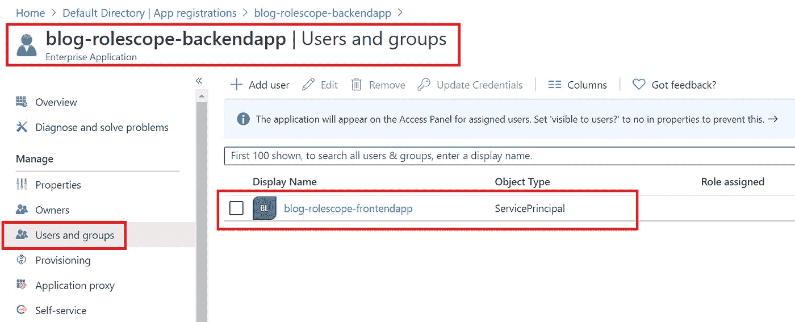

3.1b .后端的应用程序角色

请注意，角色 front_end_access 没有明确显示，但在 3.2 中将会显示该角色。

## 3.2:在后端启用用户分配

转到您的后端应用程序注册，企业应用程序，并寻找属性和启用用户分配，也见下文。

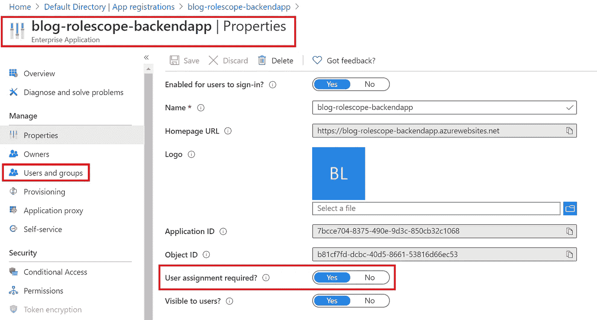

3.2a .后端中的应用程序角色

启用此属性时，前端是唯一可以从后端检索数据的应用程序，另请参见下面显示角色的位置

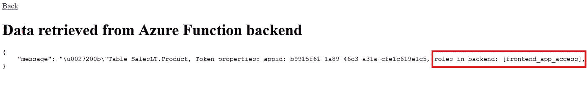

3.2b .显示的前端应用访问角色

# 多方面的

属于这个项目的 git repo 有额外的配置选项，讨论如下:

*   通过在 appconfig 中设置`DAEMON_ENABLED=True`，可以将应用程序配置为守护程序应用程序。用户不必再登录来检索数据。
*   通过在 appconfig 中设置`Option 2b. Database`，Azure SQL 数据库可以用作后端，而不是 Azure 函数。详见[这篇](/how-to-secure-python-flask-web-apis-with-azure-ad-14b46b8abf22)博客。
*   在应用程序配置中使用`Option 3b. Delegated user is used to authenticate to backend`,委托权限用于对后端而不是应用程序权限进行认证。
*   这篇博客中的第 3 步可以通过调整这个 [git repo](https://github.com/rebremer/managed_identity_authentication/blob/master/AAD_auth_ADFv2_MI_to_Azure_Function.ps1) 中的 Power Shell 脚本来实现自动化。

# 结论

Microsoft identity platform 可以帮助您保护对应用程序的访问。在这篇博客中，提供了一个具体的例子，它使用 Azure AD 以“基本”或“高级”用户角色登录用户。随后，登录用户的委托权限用于检索 Microsoft Graph 数据，应用程序权限用于访问后端，另请参见下面的架构。


项目架构，作者图片