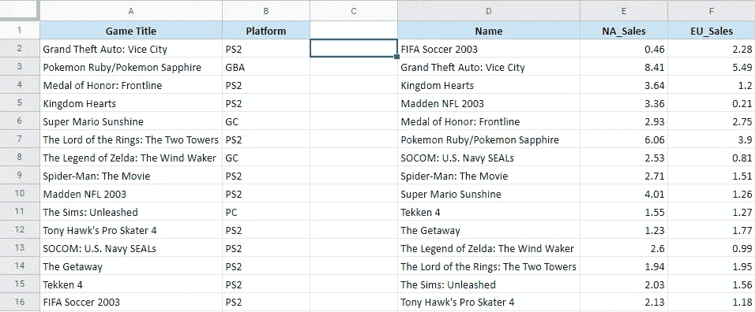
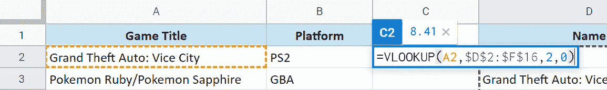
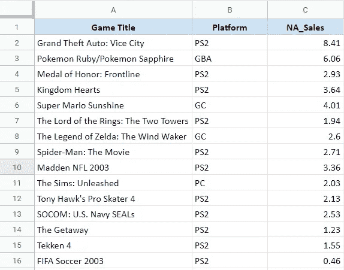

# 如何使用 Google Sheets 中臭名昭著的 VLOOKUP 功能？

> 原文：<https://towardsdatascience.com/how-to-use-the-notorious-vlookup-function-in-google-sheets-3dd6f825d4fe?source=collection_archive---------45----------------------->

## 电子表格/虚拟桌面

## 以及如何克服它带来的各种挑战。


照片由[布鲁斯·马尔斯](https://unsplash.com/@brucemars?utm_source=medium&utm_medium=referral)在 [Unsplash](https://unsplash.com?utm_source=medium&utm_medium=referral) 拍摄

Google Sheets(或 Microsoft Excel)最神奇(也最令人困惑)的功能之一是 **VLOOKUP** 。尽管从任何意义上来说都不完美，但它确实提供了强大的功能来连接两个不同的表，或者将一个表的值附加到另一个表中。

# 什么是 VLOOKUP？

VLOOKUP 是电子表格中的一个功能，它允许用户**在两个表格之间建立关系**。让我们试着用一个例子来理解它。

假设您是一家即将成立的游戏工作室的分析师，他们希望您创建一个 2002 年最畅销游戏的数据库。幸运的是，您发现了一个包含所有信息的惊人数据集，它是这样的:



它包含两个独立表格中的信息:

*   一个表格包含游戏名称和发布平台的信息。
*   第二个表包含游戏名称和北美和欧洲的销售额(以百万计)。

有关上述数据集的更多信息，您可以访问 [Kaggle](https://www.kaggle.com/gregorut/videogamesales) 。

我们如何**合并两个表**？我们可以简单地将值从一个复制粘贴到另一个。但是仔细看，两个表中的名字**不是同一个顺序**！嗯，我们可以一个一个复制粘贴。但是任务太多了！为什么不让电子表格来帮我们做呢？听起来像个计划！这就是全能的 VLOOKUP 函数出现的地方！

# 如何使用 VLOOKUP？

下面是 VLOOKUP 函数的样子:

```
=VLOOKUP(search_key, range, index, [is_sorted])
```

函数中需要的 **3 个强制参数**。以下是它们是什么以及它们是如何工作的:



VLOOKUP 函数的作用

*   **搜索关键字:**选择您**想要查找其值**的单元格。在这个例子中，我们想要找到单元格 A2 中提到的游戏标题的`NA_Sales`数字。所以搜索关键字是 A2。
*   **范围** : **你想要的数值**在哪里？在我们的例子中，它位于表中 D2 到 F16 的某个位置。因此，我们选择要从中复制值的整个表。请注意我们是如何添加许多$符号的。一旦你选择了表格范围，要做到这一点，只需按下键盘上的 F4，你会有相同的格式。

> 关于为什么使用$ signs 的一个小注意:一旦你创建了你的函数，下一个自然的步骤是向下拖动该函数并将其应用于下面的所有单元格。如果你没有按下 F4，随着**拖动公式中的搜索键**，你就是**也在拖动你所选择的范围**。这将意味着，为了找到对应于 A4 的值，您实际上是在范围 D3:F17 中搜索，而不是您原来的 D2:F16。所以如果你的 A4 值在 D2，你的函数不会读取它并抛出一个错误。这就是$符号出现的地方。按下 F4 一次，你就**冻结了选定的范围**，这样一旦你把公式拖到下面的单元格中，它就不会改变范围，而只会改变搜索关键字。

*   **Index** :在您刚刚选择的范围内，**您要抓取的列**是哪一列？在我们的例子中，它是`NA_Sales`列，这是 D2 到 F16 的选定范围中的第二列。请注意，索引号从步骤 2 中所选范围的第一列开始。
*   **已排序:**这是一个**可选的**字段。出于所有实际目的，将其设置为零或假。就我个人而言，我从未遇到过将该字段设置为其他方式的情况。

然后按回车键！这个函数现在在您提到的的**范围内，在您的搜索关键字**中找到**值，一旦找到匹配，它**就会抓取提到的索引列**并给出结果。在这种情况下，它将打印值 8.41，因为这是提到的第一个游戏在北美地区的销售额。以下是最终的解决方案:**



成功实现 VLOOKUP 后的最终结果

# 常见陷阱以及如何避免它们

以下是应用 VLOOKUP 时需要记住的几个要点:

1.  查找函数如何知道在提到的范围内匹配什么？请始终记住，查找函数**只会匹配公式中指定范围的第一列**中提到的值。在我们的例子中，我们提到的产品系列是 D2:F16。搜索关键字将只与 D2:F16 范围的 D 列中的值匹配。通常，搜索范围的第一列应该是搜索关键字所在的列。
2.  查找函数**将总是提供它得到的第一个结果**。
    例如，如果在销售表中多次提到一个游戏，它会获取第一个匹配的值并相应地提供结果。
    如果你有**同一个搜索关键字的多个实例**，VLOOKUP 是**而不是**要走的路！
3.  您需要确保在范围**中找到的**搜索关键字**和**值**与**完全匹配。不应该有多余的空格。字符串大小写应该是一样的。如果不是，它将与值不匹配，您将得不到想要的结果。
4.  当 VLOOKUP 在该范围内没有找到您要寻找的值时，它通常会抛出一个 **#N/A 错误**。这仅仅意味着该值不存在于所提到的范围内，或者该范围存在一些额外的空格或大小写问题(如上所述)。

VLOOKUP 还有另一个变种，叫做 HLOOKUP。VLOOKUP 垂直匹配值，HLOOKUP 水平匹配值。该功能的工作方式完全相同。

VLOOKUP 并不是连接两个表的完美解决方案。但是在大多数情况下，**小心执行**并记住**常见陷阱**，你可以在很多场景中使用 VLOOKUP。还有另一种更强大的方法来解决连接两个表的问题，这种方法通常被称为索引匹配函数，在下一篇文章中会详细介绍。

同时，继续分析！