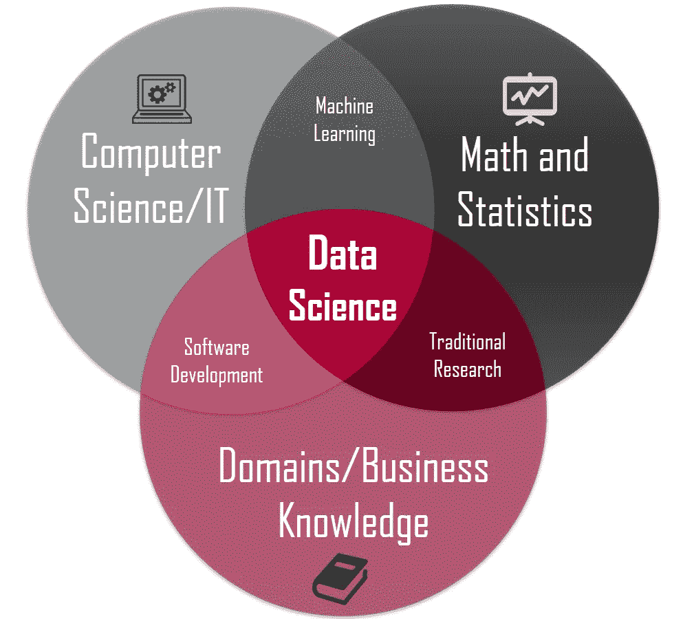

# 作为一名数据科学家，如何利用“为什么”的力量实现自己的目标

> 原文：<https://towardsdatascience.com/how-to-use-the-power-of-why-to-achieve-what-you-want-65fdbde71ea3?source=collection_archive---------29----------------------->

[(来源)](https://unsplash.com/photos/g8u5Cg6ZKWU)

成为一名数据科学家很难。

成为一名 ***伟大的*** 数据科学家更难。

作为一名伟大的数据科学家，我的意思是**对你所做的事情有热情和信念**以及用数据解决问题的能力**推动行动**。

现在…我这么说是什么意思？

[数据科学讲解](/introduction-to-statistics-e9d72d818745)

你看。如果你对业务领域、技术能力(编码、数学、统计等)有很好的理解，解决数据问题是很容易的。)以及与同事的协作。

任何人都可以解决问题，只要他们有知道做什么和如何做的技能。

然而，我相信有两个重要的因素需要*认真地*成为一个伟大的数据科学家来实现你想要的。

在这篇文章结束时，我希望你能理解拥有“为什么”的重要性，以及如何利用“为什么”的力量成为一名伟大的数据科学家，实现你想要的东西，无论是工作还是生活。

我们开始吧！

# 1.有激情，相信你所做的事情

数据科学之路并不容易。

如果你是一名数据科学家，正在阅读这篇文章。你会明白我的意思。

很艰难。这是一个不断变化的领域。它是动态的。它移动得很快。

换句话说，你需要快速学习和适应，以跟上行业的最新趋势和技术。

你现在使用的工具或语言可能会在几周或几个月后过时。

如果你对自己的工作没有热情，作为一名数据科学家，你如何确保自己能够坚持不懈地学习和提高？

更糟糕的是，如果你甚至不相信你正在做的事情，你很可能不会在这个领域呆很久。

这听起来可能有点刺耳，但却是千真万确的。

换句话说，这一切都归结为一个问题，**“你为什么做你所做的事情？”**

句号。

如果你一开始就不知道为什么要做你要做的事情，你就不会有动力每天早上醒来去做你喜欢的事情。

作为一名数据科学家，当你在整个旅程中遇到困难时，你不会有动力继续努力。

对我来说，我的“为什么”很简单。

[**我想让每个人都能接触到数据科学。**](https://www.admondlee.com/)

这才是我热爱的。

这是我所信仰的。

作为一名数据科学家，这就是我的工作。

现在你的问题是，“你的原因是什么？”

请在下面的评论中告诉我。😊

# 2.用你的“为什么”推动行动

[Simon Sinek —从为什么开始](https://www.youtube.com/watch?v=IPYeCltXpxw)

> 人们不买你做什么，他们买你为什么做。
> 
> —西蒙·西内克

如果你没有看过西蒙·西内克的 TED 演讲，那就看看吧。

几秒后你就知道为什么重要了。

那么，作为一名数据科学家，为什么推动行动对我们如此重要呢？

你看。

想象一下，你非常擅长建立预测准确度很高的机器学习模型。

酷毙了。你做得很好。

这一天到来了，你需要向你的老板和其他利益相关者展示你的预测结果。

你展示了该模型高达 95%的惊人预测准确率，这太棒了。

现在坐在桌子对面的老板问了这个问题，“结果很好。那么我们下一步能对结果做什么呢？”

你惊呆了。

**你以为你刚刚解决了一个问题，但是你忘了回答问题的核心问题。**

作为一名数据科学家，我认为我们总是需要提供可操作的见解，而不仅仅是展示结果。

通过可操作的见解，我的意思是用结果说服人们，并根据结果推荐接下来的步骤。最重要的是，我们需要告诉人们**“为什么”结果和推荐的步骤是至关重要的**。

因为当你告诉他们原因时，人们很可能会跟随你的做法。

这就是你如何通过说出“为什么”来说服你的利益相关者，从而推动行动。

# 最后的想法

[(来源)](https://unsplash.com/photos/eA2t5EvcxU4)

感谢您的阅读。

这个话题是我一直想分享的。

我希望现在你已经更好地理解了“为什么”的重要性，以及如何利用它成为一名伟大的数据科学家，以实现你想要的东西，无论是工作还是生活。

在一天结束的时候，知道“为什么”会让人们(包括你自己)在更深的层次上参与进来，从而激励人们去做。

一如既往，如果您有任何问题或意见，请随时在下面留下您的反馈，或者您可以随时通过[我的网站](https://www.admondlee.com/)或 [LinkedIn](https://www.linkedin.com/in/admond1994/) 联系我。在那之前，下一篇文章再见！😄

# 关于作者

[**Admond Lee**](https://www.linkedin.com/in/admond1994/) 目前是[**Staq**](https://www.trystaq.com)**—**的联合创始人/首席技术官，该平台是东南亚首屈一指的商业银行应用编程接口平台。

想要获得免费的每周数据科学和创业见解吗？

[**加入 Admond 的电子邮件简讯——Hustle Hub**](https://bit.ly/3pGF8jv)，每周他都会在那里分享可行的数据科学职业技巧、错误&以及从创建他的初创公司 Staq 中学到的东西。

你可以在 [LinkedIn](https://www.linkedin.com/in/admond1994/) 、 [Medium](https://medium.com/@admond1994) 、 [Twitter](https://twitter.com/admond1994) 、[脸书](https://www.facebook.com/admond1994)上和他联系。

 [## 阿德蒙德·李

### 让每个人都能接触到数据科学。Admond 正在通过先进的社交分析和机器学习，利用可操作的见解帮助公司和数字营销机构实现营销投资回报。

www.admondlee.com](https://www.admondlee.com/)