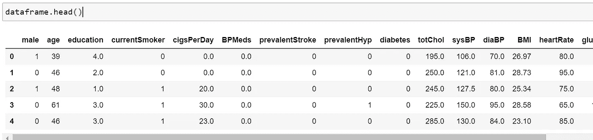
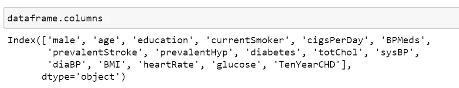
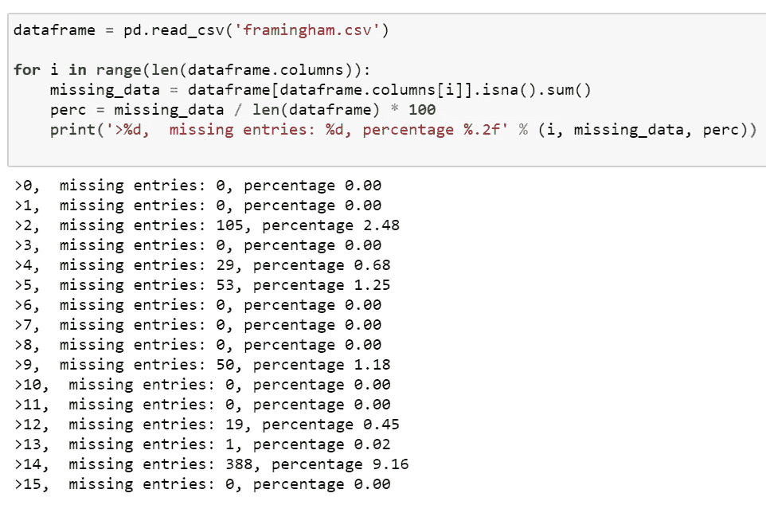
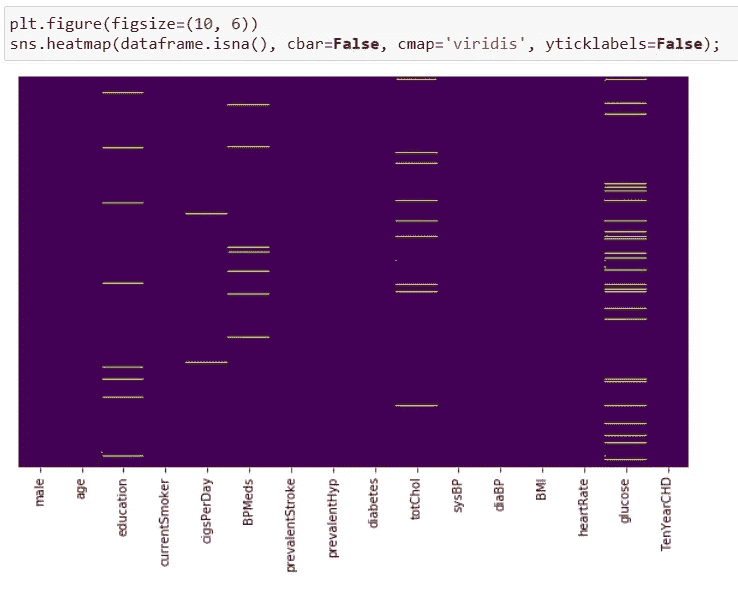
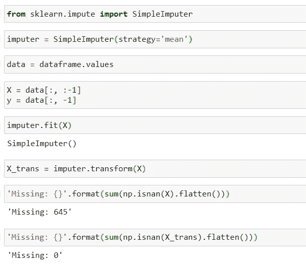
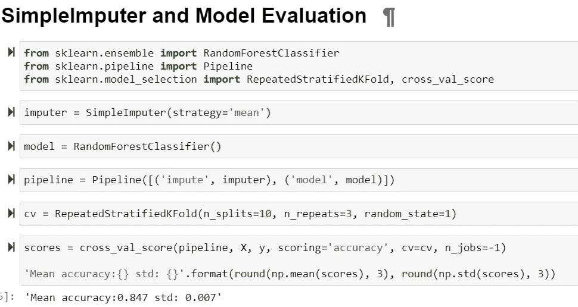
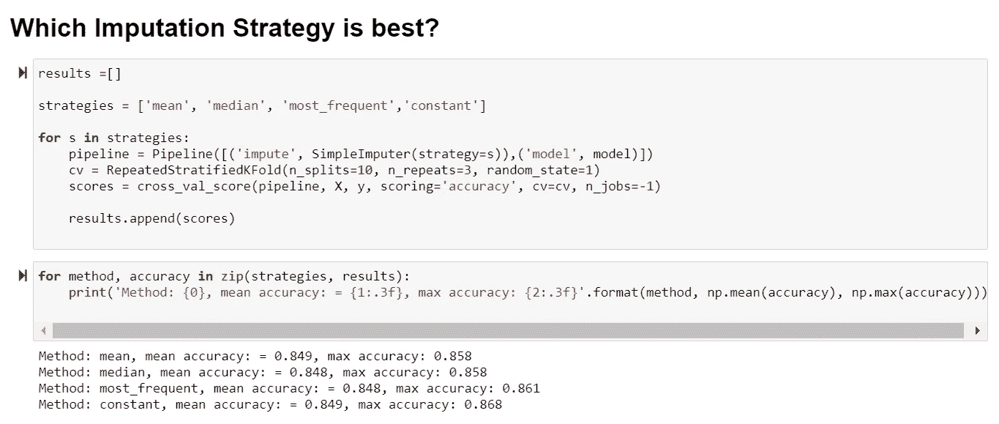
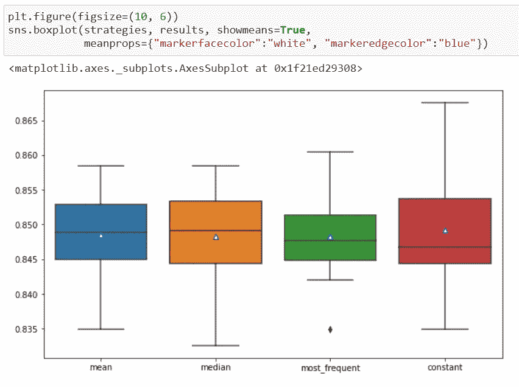
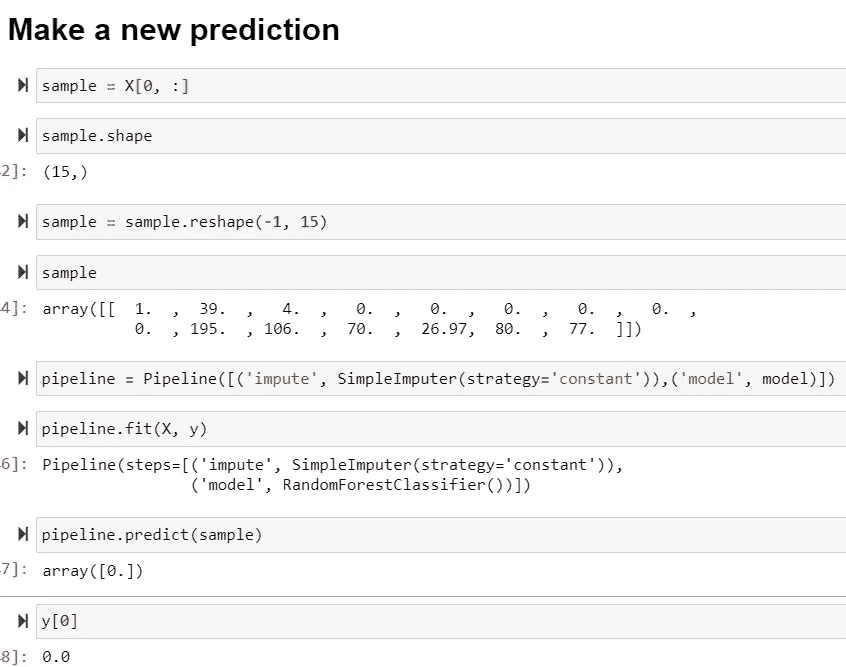

# 如何用 Python 在机器学习中使用 SimpleImputer 类

> 原文：<https://towardsdatascience.com/how-to-use-the-simpleimputer-class-in-machine-learning-with-python-10b321c94861?source=collection_archive---------30----------------------->

## 简单地使用简单估算器

图片由罗斯·斯奈登 [Unsplash](https://unsplash.com/photos/sWlDOWk0Jp8) 提供

## 缺失值插补

数据集经常有缺失值，这可能会给机器学习算法带来问题。在执行预测建模之前，识别并替换数据集每一列中缺失的值被认为是一种良好的做法。这种缺失数据替换的方法被称为数据插补。

数据集中的缺失值可能是由多种原因造成的。这些通常包括但不限于:测量设备故障、不一致数据集的整理以及实验期间数据收集的变化。

缺失数据插补的一个方便策略是用一列中其他值计算出的统计值替换所有缺失值。这种策略通常可以带来令人印象深刻的结果，并避免在构建机器学习算法时丢弃有意义的数据。常用的统计包括计算列的平均值、中值和众数，并为缺失值输入该值。此外，可以输入一个常数值来补充上述方法。

本教程旨在演示简单估算类在统计估算中的用法。

## 数据集和缺失数据评估

本教程中使用的数据集是“*逻辑回归预测心脏病*数据集，可通过这里的 [kaggle](https://www.kaggle.com/dileep070/heart-disease-prediction-using-logistic-regression) 或我的 [github 页面](https://github.com/StephenFordham/scikit-learn_tutorials)获得。

该数据集来自一项正在进行的对马萨诸塞州弗雷明汉镇居民的心血管研究。分类目标是预测患者是否有未来冠心病(CHD)的 10 年风险。数据集提供了患者的信息。它包括 4000 多条记录和 15 个属性。这些属性可以通过 kaggle 找到。我在这里的主要目的不是深入研究这个数据集，而是展示一个使用 SimpleImputer 类进行预测建模的用例。

首先导入所需的库，并执行一些探索性数据分析(EDA)。

dataframe 上调用的 dataframe 和 columns 属性的头显示了所有 15 个数据属性。

为了计算缺失值的数量以及它们相对于列的百分比，我首先对列进行迭代。对于每一列，我使用 isna()方法调用来评估 NaN 值的数量，并通过方法链接对这些值求和。

然后，我计算总行数中缺失值的数量，得到每列缺失值的百分比，并打印出这些数据。

虽然这是信息性的，但需要一些阅读来完全解释结果。确定缺失结果的更好方法可能是使用 seaborn 热图制作一个有用的图形。

我们首先传入 dataframe.isna()，如果缺少值，它将返回 True。然后，我们可以将 cbar 和 ytickslabels 都设置为 False，选择一个颜色映射(这里是字符串 viridis)，并可视化结果。

现在我们有了一个快速参考图，它可以有效地告诉我们，哪些列缺少数据。在这里，我们可以看到葡萄糖列丢失的数据值最多。

## 简单估算类的统计估算

sci-kit learn 机器学习库提供了实现统计插补的 SimpleImputer 类。

要使用 SimpleImputer，首先导入该类，然后用传递给策略参数的字符串参数实例化该类。为了清楚起见，我在这里包含了‘mean ’,这是默认的，因此没有必要显式包含。

我通过调用 dataframe 上的值将 dataframe 转换成一个 numpy 数组(不必要)，但这是我喜欢的习惯。然后我选择我的特征并把它们赋给变量 X，选择我的目标变量并把它赋给变量 y。

估算值适合数据集，用于计算每列的统计数据。然后将拟合估算值应用于数据集，以创建数据集的副本，其中每列的所有缺失值都用计算出的均值统计数据替换。

为了确认数据插补有效，我们可以评估应用和不应用数据转换的数据集上缺失值的数量。当应用数据转换时，已经估算了 645 个列值。

## 模型评估

模型评估最好使用重复的 *k-* 折叠交叉验证。要求首先在训练数据集上计算每列的计算统计量，然后应用于数据集中每个折叠的训练集和测试集。

为了实现这一点，我们可以创建一个建模管道，其中第一步是统计插补，第二步是模型本身。

以下管道使用均值策略进行统计插补，并使用 RandomForestClassifier 进行模型预测。

我们达到了 84.7%的准确率，标准偏差为 0.007。这是一个合理的结果，但了解哪种插补策略最适合预测建模性能会很有用。

## 测试插补策略

为了测试不同的插补策略，我们可以遍历这些策略。对于每个管道，我们可以构建一个新的策略，计算交叉值分数，并将它们添加到结果列表中。

我们可以使用结果列表中的数组和策略类型来生成一个盒须图，以解读哪种数据插补策略是最佳的。我已经决定检查每种策略类型的平均分数和最高分数。

盒状图和须状图表明使用常数(0)插补策略获得了最佳准确度分数。

## 对样品进行测试

现在可以使用最佳插补策略进行预测。根据所有可用数据定义和拟合管道。

我们可以获取数组中的第一行，对其进行整形，将其赋给变量名 sample，并将其作为参数传递给管道上调用的 predict 方法调用。

为了确认这是正确的结果，我们可以检查第一个 y 目标变量标签。我们的模型预测了一个 0 类，而这个类实际上也是一个 0 类。

## 摘要

简单估算类是使用计算统计数据估算缺失值的有效方法。通过使用 *k* -fold 交叉验证，我们可以快速确定传递给 SimpleImputer 类的哪个策略给出了最佳的预测建模性能。

## 链接到完整的 Jupyter 笔记本

这个教程的完整 Jupyter 笔记本的链接可以在[这里](https://github.com/StephenFordham/scikit-learn_tutorials/blob/main/heart%20disease%20model.ipynb)找到。