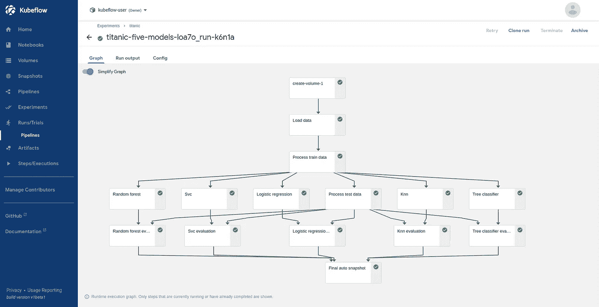

# 如何使用时间旅行来调试你的 ML 管道

> 原文：<https://towardsdatascience.com/how-to-use-time-travel-to-debug-your-ml-pipelines-efb5263372c0?source=collection_archive---------39----------------------->

## 让你的管道步骤透明化，探索它们的状态，住在 Jupyter。

丹尼尔·利维斯·佩鲁西在 [Unsplash](https://unsplash.com/s/photos/time?utm_source=unsplash&utm_medium=referral&utm_content=creditCopyText) 上的照片

机器学习项目由几个不同的步骤组成:数据获取、数据验证、数据处理、模型训练、模型评估等。每一步都接受定义明确的输入，并产生特定的输出。

> **如果我们能回到过去，在熟悉的 Jupyter 环境中探索跑步的状态，那就太好了**

**如果传入的数据有问题，该步骤可能会失败，甚至会破坏下游的分析任务。**后者可能会引入不太容易调试的重影问题:例如，数据泄漏(即，当训练数据集之外的信息用于创建模型时)可能会影响模型的泛化能力，但它不会在训练期间引发异常。

为了避免这种错误，我们应该能够窥视管道并尽早发现它们。因此，数据科学家最终会检查日志，打印原始指标并创建可视化，如学习曲线和混淆矩阵。

虽然这些工具为构建更健壮的模型提供了有价值的见解，但是如果我们能够回到过去并探索正在运行的步骤的状态，那就太好了。在这个故事中，我们探索如何在 Kubeflow 管道中做到这一点。

> [学习率](https://mailchi.mp/d2d2d4a109b5/learning-rate-newsletter)是为那些对 AI 和 MLOps 的世界感到好奇的人准备的时事通讯。你会在每周五收到我关于最新人工智能新闻和文章的更新和想法。在这里订阅！

# 安装 Kubeflow

首先，我们需要一个工作站。设置 Kubeflow 不是一件容易的事情，尤其是如果你没有使用 Kubernetes 的经验。但这不应该阻止你；我们可以在谷歌云平台(GCP)上使用 [MiniKF](https://www.kubeflow.org/docs/started/workstation/getting-started-minikf/) 在 10 分钟内构建一个单节点集群。

1.  访问 GCP 页面上的 [MiniKF](https://console.cloud.google.com/marketplace/details/arrikto-public/minikf)
2.  选择*启动，设置虚拟机配置并点击部署*

> 为了获得最佳性能，建议保留默认的虚拟机配置

MiniKF 部署—作者图片

就是这样！部署最多需要十分钟，您可以按照屏幕上的说明观看进度；ssh 进入机器，在终端上运行`minikf`,等待直到您的端点和凭证准备好。

MiniKF 的提供已完成—图片由作者提供

现在，我们准备访问 Kubeflow 仪表板。点击网址，输入你的凭证，你就可以开始了！

Kubeflow 仪表板—按作者分类的图像

有关部署过程以及如何启动 Jupyter 服务器的更多详细信息，请阅读下面的故事:

 [## 有了 MiniKF，Kubeflow 比以往任何时候都更容易访问

### 10 分钟入门 Kubernetes 最好的机器学习平台。

towardsdatascience.com](/kubeflow-is-more-accessible-than-ever-with-minikf-33484d9cb26b) 

# 调试 Kubeflow 管道

为了演示如何在某个时间点返回并探索管道步骤的状态，我们需要管道本身。无需编写一行代码，就可以轻松地从 Jupyter 笔记本上创建 Kubeflow 管道。你可以在下面的故事中看到。

 [## Jupyter 准备生产；原样

### 无需编写一行代码，即可将您的笔记本草稿转化为生产就绪的 Kubeflow 管道。

towardsdatascience.com](/jupyter-is-ready-for-production-as-is-b36f1d1ca8f8) 

对于这个例子，我们假设您已经成功地运行了一个管道。如果你想了解前面提到的故事，我们使用众所周知的*泰坦尼克号*数据集来训练五个不同的分类器。最后，您的管道应该类似于下面这样:

泰坦尼克号管道——作者图片

所以，假设我们对 SVM 算法的结果不满意。**我们想回到这一步，在训练算法和探索我们生活在笔记本中的世界的状态之前。**为此，我们求助于[韩国](https://www.kubeflow.org/docs/other-guides/integrations/data-management/)！

## 韩国快照

Rok 是一个数据管理产品，允许您对您的**完整环境及其数据**进行快照、版本化、打包、分发和克隆。它作为其支持的平台之一与 Kubernetes 进行了本机集成，并在几分钟内部署到现有的集群、本地或云上。

它预装在 MiniKF 中，所以让我们使用它:

1.  点击`smv`步骤并选择`Visualizations`选项卡
2.  跟随`Rok autosnapshot`卡内的链接
3.  复制页面顶部的韩国网址
4.  创建一个新的笔记本服务器，并在顶部粘贴复制的网址
5.  配置虚拟机资源，并为工作区指定一个有效的名称
6.  点击`LAUNCH`按钮

与韩国同行——作者图片

当笔记本电脑服务器准备就绪后，连接到它，一个新的 JupyterLab 环境将在您请求的位置准确地打开。到目前为止的所有单元格都已为您执行。您可以从该单元格继续工作；探索变量状态、数据集和您的模型。

继续你的 JupyterLab 状态——作者图片

现在，您有了一种调试错误的方法，即探索在特定时间点管道中发生了什么。这当然比原始日志更有价值，也比静态可视化更强大。

# 结论

在这个故事中，我们看到了如何使用 Rok，一种数据管理服务，在 Jupyter 笔记本中进行时间旅行，并实时探索管道步骤的状态。这给了我们调试 ML 管道的能力，也给了他们版本。如果您关心版本控制，可以看看下面的文章。

 [## 你控制 ML 项目版本的方式是错误的

### 当您可以拥有更多时，是否在寻找一种类似 git 的数据版本控制方法？是时候跳出框框思考了

towardsdatascience.com](/the-way-you-version-control-your-ml-projects-is-wrong-42910cba9bd9) 

## 关于作者

我叫[迪米特里斯·波罗普洛斯](https://www.linkedin.com/in/dpoulopoulos/)，我是一名为[阿里克托](https://www.arrikto.com/)工作的机器学习工程师。我曾为欧洲委员会、欧盟统计局、国际货币基金组织、欧洲中央银行、经合组织和宜家等主要客户设计和实施人工智能和软件解决方案。

如果你有兴趣阅读更多关于机器学习、深度学习、数据科学和数据操作的帖子，请在 twitter 上关注我的 [Medium](https://medium.com/@dpoulopoulos) 、 [LinkedIn](https://www.linkedin.com/in/dpoulopoulos/) 或 [@james2pl](https://twitter.com/james2pl) 。

所表达的观点仅代表我个人，并不代表我的雇主的观点或意见。