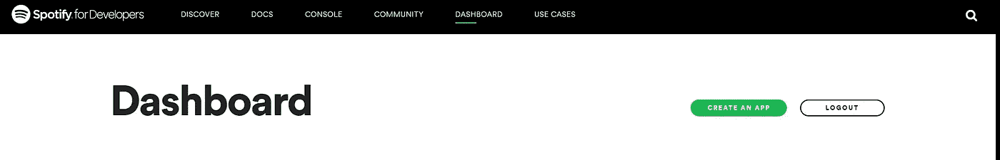
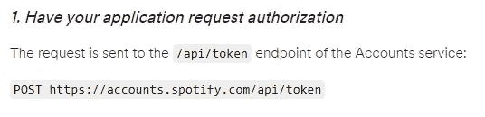
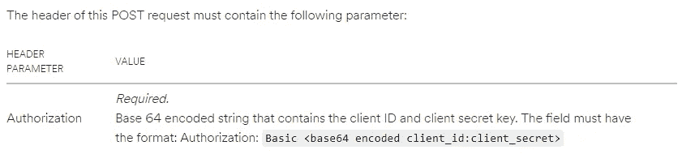
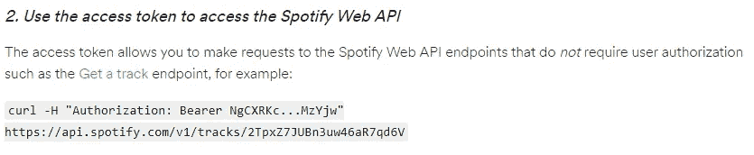
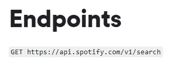
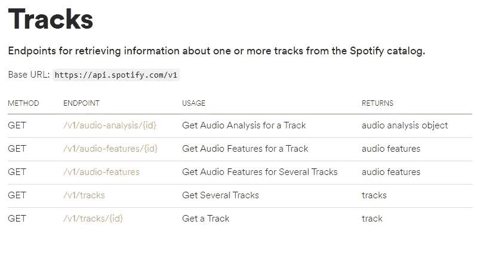
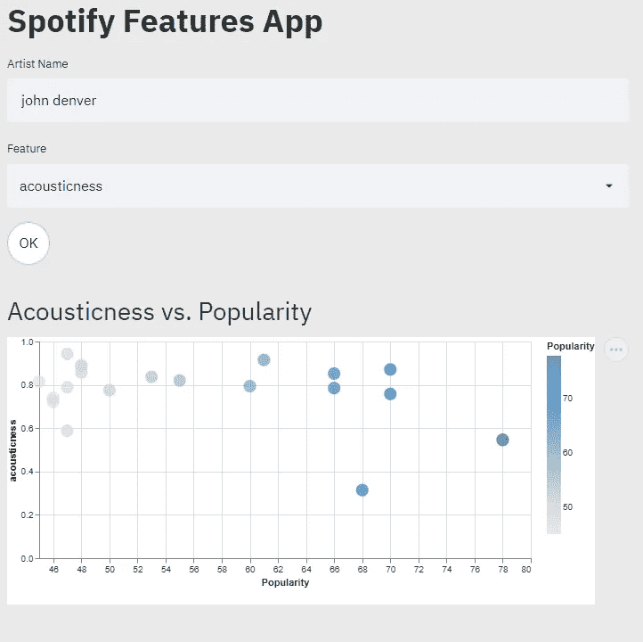
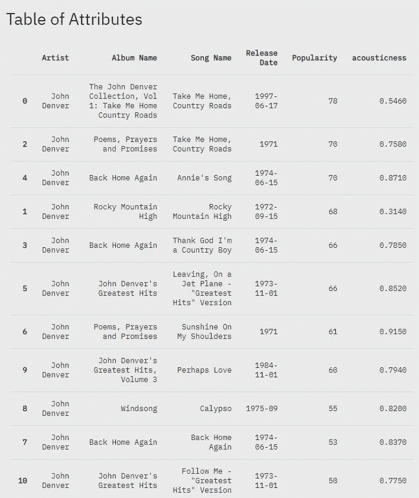

# 如何利用 Spotify 的 API 并在 Streamlit 中创建用户界面

> 原文：<https://towardsdatascience.com/how-to-utilize-spotifys-api-and-create-a-user-interface-in-streamlit-5d8820db95d5?source=collection_archive---------18----------------------->

## [实践教程](https://towardsdatascience.com/tagged/hands-on-tutorials)

## 关于如何从 API 提取数据并在交互式图表中显示用户确定的结果的演练

首先，我们必须进入下面的 Spotify 开发者页面。

 [## 我的仪表板|面向开发者的 Spotify

### 我们和我们的合作伙伴使用 cookies 来提供我们的服务，并根据您的兴趣向您显示广告。通过使用我们的…

developer.spotify.com](https://developer.spotify.com/dashboard/) 

您将使用您的 Spotify 帐户凭据登录。登录后，您可以选择“创建应用程序”。

作者照片

一旦你创建了一个应用程序，你会看到你的客户 ID 和客户密码。我们将需要这些来生成一个访问令牌，我们将使用它从 API 获取数据。

我们将把代码分成三个独立的脚本。一个将是访问 API 的 API 客户端，一个将调用客户端并在 Streamlit 中生成接口，一个将用于帮助改善 Streamlit 接口的外观。

## 构建 API 客户端脚本

我们的目标是创建一个允许我们轻松进行 API 调用的类。

为了帮助指导我们构建类，我们将遵循 Spotify 开发者页面上的授权指南。

[https://developer . Spotify . com/documentation/general/guides/authorization-guide/](https://developer.spotify.com/documentation/general/guides/authorization-guide/)

首先，我们将导入所有必需的库。

然后，我们可以开始在类中声明一些我们需要的变量以及一个初始化函数。

应该注意，访问令牌在 3600 秒后过期，因此我们将实现一些代码来检查令牌的过期时间。令牌 URL 可以在 Spotipy 文档的授权指南中找到。

[https://developer . Spotify . com/documentation/general/guides/authorization-guide/](https://developer.spotify.com/documentation/general/guides/authorization-guide/)

作者照片

然后，我们需要使用我们的客户端 ID 和客户端密码为我们的客户端凭证创建一个 base64 编码的字符串。将我们的凭证编码成 base64 字符串使它更加安全。

我们现在可以使用 get_client_credentials 函数，并在另一个函数中调用它来生成一个令牌头，我们将需要它来进行授权。

作者照片

我们还将构建一个 get_token_data 函数。

有了函数和变量之后，我们现在将编写一个函数来执行身份验证，给出函数的输出和变量的值。

有了验证我们凭证的代码，我们现在可以创建一个函数来生成令牌。下面的代码确保凭据验证正确，并将生成一个令牌。

接下来，我们将生成一个请求所需的头。您将会看到，在这个函数中，我们需要使用一个“承载”认证器，而不是我们之前使用的“基本”认证器。“载体”认证器用于令牌，而“基本”认证器与 ID 和秘密一起使用。

作者照片

一切就绪后，我们现在可以编写一些函数来获取数据。我们将使用对应于 Web API 文档中“搜索”引用的端点。

[https://developer . Spotify . com/documentation/we b-API/reference/search/search/](https://developer.spotify.com/documentation/web-api/reference/search/search/)

作者照片

下面的代码将允许我们进行查询搜索，而不必在每次我们想要进行不同的搜索时复制和粘贴函数。它允许我们搜索的方式是传入一个字典，然后用冒号{k}:{v}将字典分成一个键值对。最终，这允许我们将字典转换成字符串，这是我们需要搜索的格式。

现在，我们可以将所有内容放在一起，并将其保存为 python 文件。我将该文件命名为 spotipy_client.py，您可以随意命名，但是请记住这个名称，因为我们需要将它导入到另一个脚本中。

## Streamlit 界面 CSS 文件

接下来，我们将创建一个 CSS 文件，用于定制我们的 Streamlit 界面。

下面的代码将允许自定义背景颜色以及自定义搜索按钮。

我们可以将这个脚本保存为 CSS 文件。与客户端脚本类似，记住名称，因为我们也需要导入这个文件。

## 构建界面的脚本

在构建界面脚本之前，我们需要做的最后一件事是创建一个虚拟环境来下载成功运行最终脚本所需的包。我用 conda 为这个项目创建了我的虚拟环境。您可以通过打开 Anaconda 提示符并运行以下代码来完成同样的工作。

创建虚拟环境的原因是我们可以为特定的项目下载特定的包。这也比将包直接下载到机器的基本实例更安全。

一旦我们有了我们的环境，我们将需要激活它来下载包，然后最终运行我们的脚本。

您可以使用以下命令激活环境。

我们需要在虚拟环境中安装 Streamlit。你可以和皮普一起做这个。

最后，我们可以开始构建允许我们创建 streamlit 接口的脚本。

首先，我们将利用我们的 CSS 代码来定制我们将要生成的页面的外观。

接下来，我们将创建 streamlit 变量，该变量将允许用户向我们的 python 代码传递数据，这些代码将利用我们的 spotipy_client.py 脚本。

上面的代码创建了一个搜索栏，供用户搜索艺术家，一个下拉菜单，提供不同的功能供用户选择，还有一个按钮，供用户选择后运行代码。我们将使用所做的选择在脚本中进一步传递相应的变量。

接下来，我们将把所需的参数传递给 SpotifyAPI 类。您需要确保您的 spotipy_client.py 文件位于您当前工作的目录中，否则，它将不会加载到我们当前的脚本中。

将 client_id 和 client_secret 传递给我们的类后，我们现在就可以查询我们想要的数据了。

我们的目标是使用通过 Streamlit 接口生成的变量 Name_of_Artist 来搜索特定艺术家的曲目。您会注意到，这会以 JSON 格式返回数据。为了在我们的脚本中使用它，我们需要解析 JSON 数据并提取我们想要传递到 dataframe 中的值。在下面的代码中，“artist”是键，“Name_of_Artist”是值。

我们现在有一个数据帧，它包括一些与艺术家的音轨相关的字段。

对于我们的项目，我们还需要引入音轨的特定音频特征。我们可以通过文档了解我们具体需要将什么传递到查找 URL 中。

[https://developer . Spotify . com/documentation/we b-API/reference/tracks/](https://developer.spotify.com/documentation/web-api/reference/tracks/)

作者照片

正如我们所看到的，我们需要传入一个音轨 id 来获取我们正在寻找的音频特征数据。在我们现有的数据框架中，我们在列名“Id”下有该信息。我们一次只能查找一个“Id ”,因此我们将创建一个循环，进入我们的数据帧并将每个“Id”值传递给它。每个输出都是一行，我们可以将它附加到数据帧中，将数据转换成表格格式。

有了音轨信息的数据帧和音频特征的数据帧，我们可以将两者合并成一个组合表，并提取我们希望在界面中显示的字段。Name_of_Feat 将根据用户的选择传入。

最后，有了数据框架，我们可以构建图表和表格来显示。

我们将使用 Altair 图表，允许用户将鼠标悬停在不同的数据点上，以查看歌曲的不同方面，如流行度、音频功能、歌曲名称和专辑名称。

最后要补充的是如何测量不同音频特性的描述。我在屏幕底部添加了这个，以便我们的潜在用户在查看数据时查看。这些描述来自 Spotify 开发者网站上的音频功能文档。

 [## 获取音轨的音频功能|面向开发者的 Spotify

### 需要路径参数授权。来自 Spotify 帐户服务的有效访问令牌:参见 Web API…

developer.spotify.com](https://developer.spotify.com/documentation/web-api/reference/tracks/get-audio-features/) 

在测试我们的脚本之前，我们将把上面所有的代码放在一起，保存为一个 python 文件。

一切就绪后，我们可以测试我们的最终产品了。在您的终端中，您将运行以下命令。我将最终的 python 文件命名为 streamlit_audio_features.py，但是您可以随意命名。记得在终端中激活你的虚拟环境。此命令将在您的浏览器中打开一个新标签，并显示我们的界面。

下面展示了我们界面的一些快照。要查看界面的运行情况，您可以点击下面的 youtube 视频链接，或者自己运行代码。

作者照片

作者照片

[https://www.youtube.com/watch?v=BuVZ07DNWj0](https://www.youtube.com/watch?v=BuVZ07DNWj0)

这些代码文件的完整脚本也可以在 Github 上找到。

 [## jjevans25/Spotipy 图表

### 使用 Spotipy API 在 Streamlit 中创建交互式散点图。为了成功运行，您将…

github.com](https://github.com/jjevans25/Spotipy-Chart) 

我希望这给了你一些关于如何使用 Python、API 和 Streamlit 的见解，以及你对项目的任何潜在想法。

> spotipy_client.py 脚本修改自
> 
> 麻省理工学院许可证(MIT)
> 
> 面向企业家的版权 2020 编码