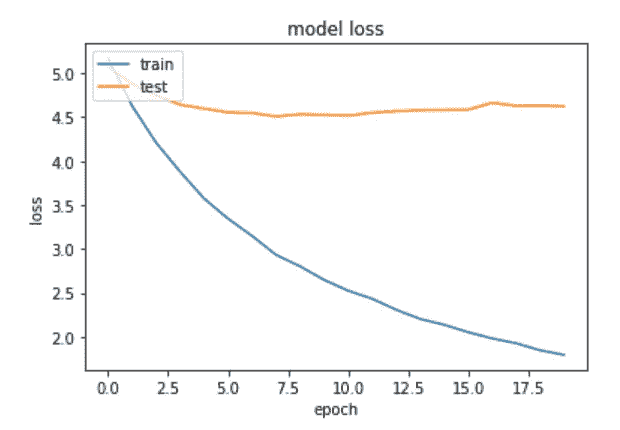
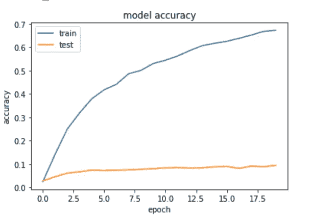
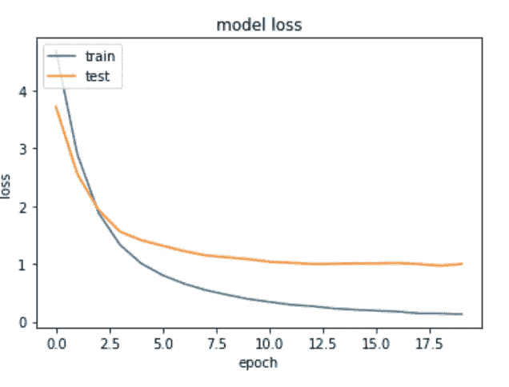
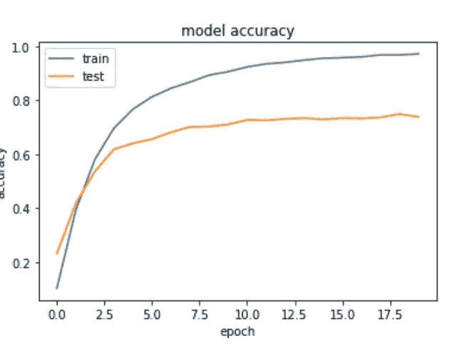
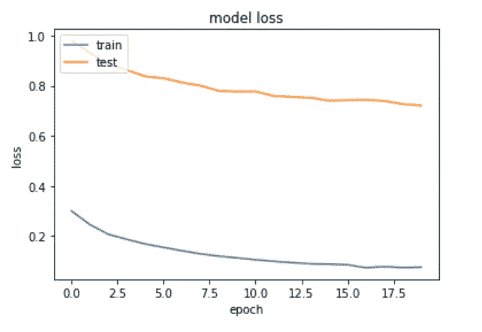
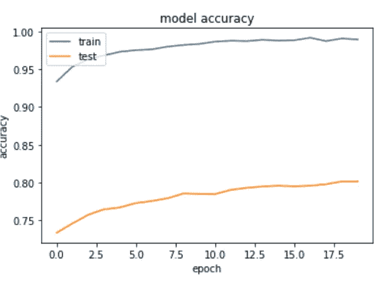

# 如何利用迁移学习和最新的深度学习模型对图像进行分类

> 原文：<https://towardsdatascience.com/how-to-utilize-transfer-learning-to-classify-images-with-state-of-the-art-deep-learning-models-d8e5d5bb35d4?source=collection_archive---------59----------------------->

在这篇文章中，我将展示如何使用一个预先训练好的最先进的图像分类模型来对自定义数据进行分类。我展示了如何在 Keras 中使用谷歌的 [efficientnet 模型](https://arxiv.org/abs/1905.11946)来应用迁移学习，对来自[斯坦福汽车数据集](https://www.kaggle.com/jutrera/stanford-car-dataset-by-classes-folder)的汽车图像进行分类。完整的 jupyter 笔记本可以在我的 [github 库](https://github.com/digital-thinking/ann-jupyter-notebooks)中找到。

# 效率网

从最初简单的卷积神经网络(CNN)开始，通常可以通过任意缩放网络维度(如宽度、深度和分辨率)来逐步进一步提高模型的精度和效率。增加使用的层数或使用更高分辨率的图像来训练模型通常需要大量的人工工作。来自谷歌人工智能的研究人员发布了 EfficientNet，这是一种基于一组固定缩放系数和 AutoML 及其他技术进展的缩放方法(例如[深度可分离卷积](https://medium.com/@zurister/depth-wise-convolution-and-depth-wise-separable-convolution-37346565d4ec)、 [swish 激活](https://medium.com/@neuralnets/swish-activation-function-by-google-53e1ea86f820)、 [drop-connect](http://yann.lecun.com/exdb/publis/pdf/wan-icml-13.pdf) )。EfficientNet 不再像以前那样独立优化单个网络维度，而是寻求一种跨所有网络维度的平衡扩展流程。

借助 EfficientNet，参数数量大幅减少，同时在 ImageNet(此类应用的基准)上实现了最先进的结果。

# 迁移学习

虽然 EfficientNet 减少了参数的数量，但卷积网络的训练仍然是一项耗时的任务。为了进一步减少培训时间，我们可以利用迁移学习技术。

迁移学习意味着我们使用预先训练的模型，并根据新数据对模型进行微调。在图像分类中，我们可以考虑将模型分为两部分。模型的一部分负责从图像中提取关键特征，如边缘、常见模式等。一部分是使用这些特征进行实际分类。

通常，CNN 由堆叠的卷积块组成，减少了图像大小，同时增加了可学习特征(滤波器)的数量，最终所有内容都被放入一个完全连接的层中，该层进行分类。迁移学习的思想是使第一部分可以转移，这样通过只替换完全连接的层(通常只是称为“顶层”)就可以用于不同的任务。

# 履行

[这款](https://github.com/qubvel/efficientnet) keras Efficientnet 实施(pip install efficientnet)带有适用于所有尺寸(B0-B7)的预训练模型，我们只需添加自定义分类层“top”即可。用`weights='imagenet'`我们得到一个预训练的模型。这个片段大致展示了它是如何工作的(完整的例子见 [jupyter 笔记本](https://github.com/digital-thinking/ann-jupyter-notebooks/blob/master/TransferLearning-EfficientNet/TransferLearning-EfficientNet.ipynb)):

```
base_model = EfficientNetB5(include_top=False, weights='imagenet')
x = base_model.output
x = GlobalAveragePooling2D()(x)
predictions = Dense(num_classes, activation='softmax')(x)
model = Model(inputs=base_model.input, outputs=predictions)# fix the feature extraction part of the model
for layer in base_model.layers:
    layer.trainable = Falsemodel.summary()
--------Total params: 28,615,970
Trainable params: 102,450
Non-trainable params: 28,513,520
```

我们只有 10 万个可训练参数，而整个网络有 2800 万个。有了这组减少的自由参数，我们可以在自定义数据上训练最后一层，而特征提取层使用来自 imageNet 的权重。

训练模型后，我们可能会看到以下结果:



训练数据集的损失(蓝色)看起来不错，但是测试数据的损失(橙色)看起来很奇怪。通常，这种损耗曲线是过度拟合的指标。



模型精度也是如此。虽然训练数据的准确性看起来还可以，但是测试的准确性却完全不行。

# 批量标准化的怪异之处

这种怪异的行为来自 BatchNormalization 层。好像有个 [bug](https://github.com/keras-team/keras/issues/9214) ，在使用 keras (2.2.4)和 tensorflow 1.x 的时候，问题好像是冻结的批量归一化层确实也冻结了归一化参数。(点击阅读更多关于不同标准化层的信息)。要解决这个问题，我们可以使 BatchNormalization 层可训练:

```
for layer in base_model.layers:
    if isinstance(layer, BatchNormalization):
        layer.trainable = True
    else:
        layer.trainable = False
```

不幸的是，我们失去了使用更大 batch_size 的能力，当我们使 BatchNormaliation 可训练时，keras 似乎需要更多的内存来存储模型。

或者，我们可以忽略上面的奇怪分数，因为我们的层仍在学习，正如我们在训练损失/准确性中看到的，随后我们以 BatchNormalization 可训练的方式训练整个网络。然而，以下是 BN 可训练时模型的得分:



训练数据集(蓝色)和测试数据(橙色)的损失现在看起来很完美。



还有准确性

当只训练最后一层时，我们仍然有好处。例如，我们有较少的可训练参数，这意味着更快的计算时间。在大型数据集上，我宁愿忽略验证分数，并通过完全冻结基本模型(包括 BN)来利用较大的 batch_size。

# 释放网络的全部能量

在训练过程中的某个点，模型没有进一步改进，是时候打开网络的其余部分来微调特征提取部分了。因此，我们使所有的层可训练，并再次适应模型。现在，我们有超过 2800 万个参数，训练需要更长的时间，但由于我们已经训练了最后一层，我们有一个更好的起点。

```
for layer in model.layers:
    layer.trainable = True
model.summary()
--------Total params: 28,615,970
Trainable params: 28,443,234
Non-trainable params: 172,736
```

注意:避免模型的早期过度拟合是很重要的，因为模型可能很难逃脱局部最小值，因此我们确保在全面训练之前和之后更好地打开网络。另外，不要忘记调整 batch_size，否则我们会运行 OOM。要估计模型所需的内存，请看这里( [stackoverflow](https://stackoverflow.com/questions/43137288/how-to-determine-needed-memory-of-keras-model) )。我也建议利用[早停](https://keras.io/api/callbacks/early_stopping/)。

第二次调用 fit()后，我们得到了一个更好的模型:



第二训练阶段的损失仍然减少，因此模型得到改进



对于训练和测试数据，模型的准确性也提高了

最后，我们在自定义数据上训练了一个最先进的 efficientnet 模型。为了使这个模型生产就绪，还有一些工作要做。如果你对如何部署这样一个模型感兴趣，你可以查看[这篇](http://digital-thinking.de/how-to-deploy-keras-cnns-with-tensorflow-serve-including-jpeg-decoding/)文章。

这篇文章最初发表在我的个人博客[这里](http://digital-thinking.de/keras-transfer-learning-for-image-classification-with-effificientnet/)。