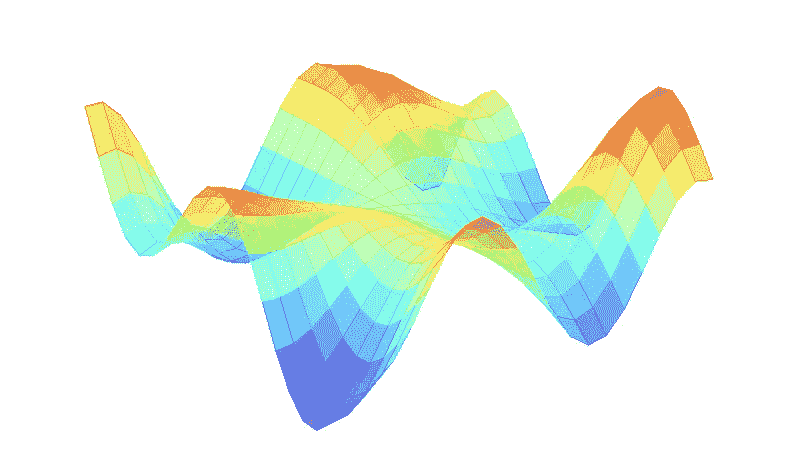
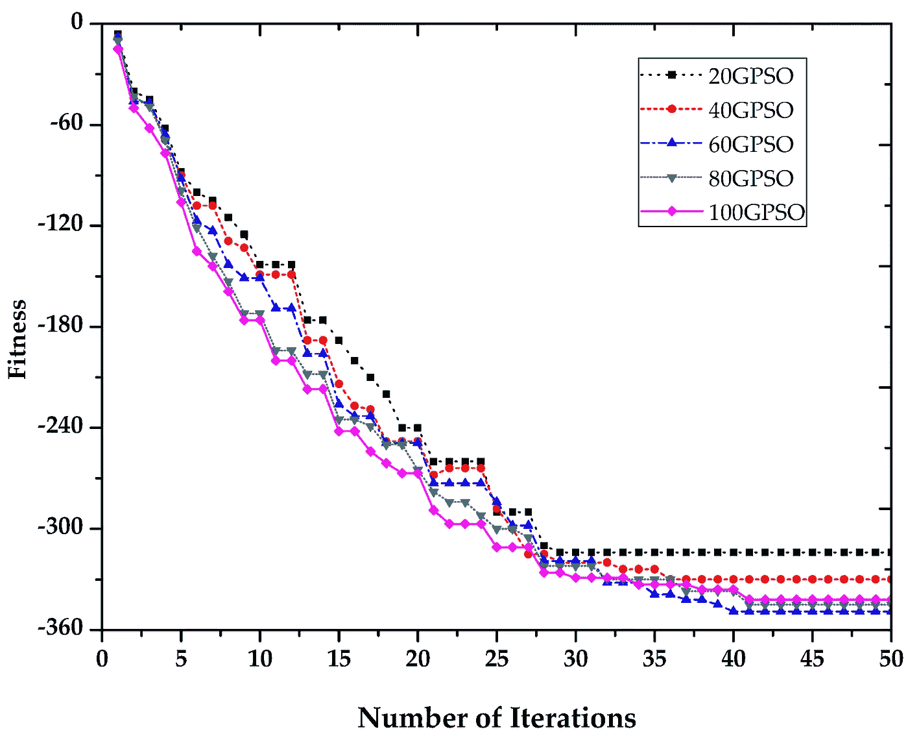
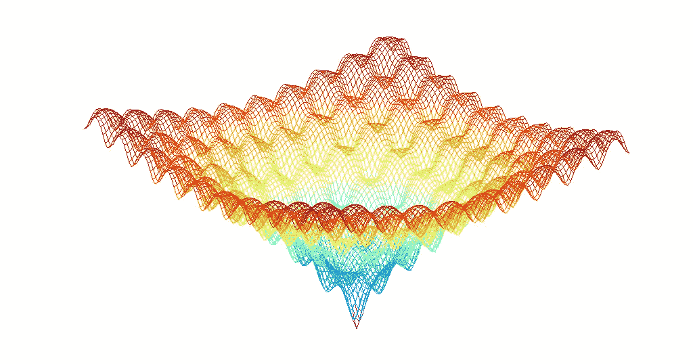
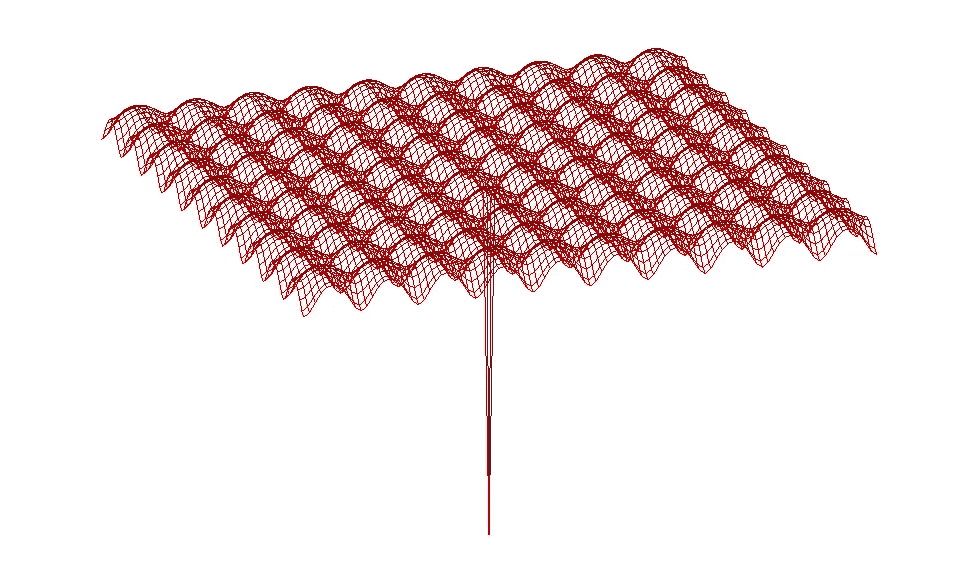
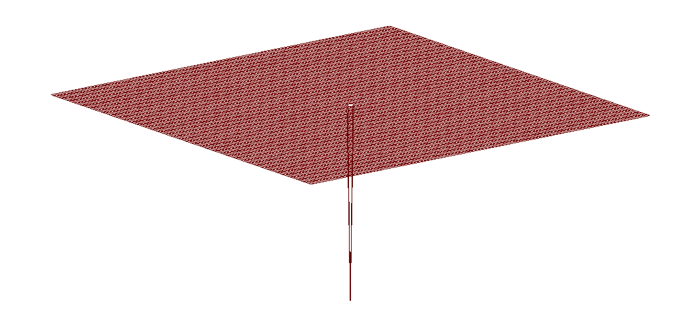
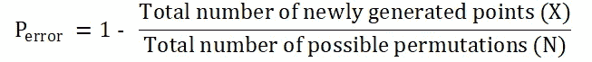
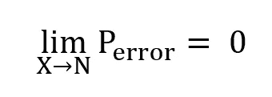
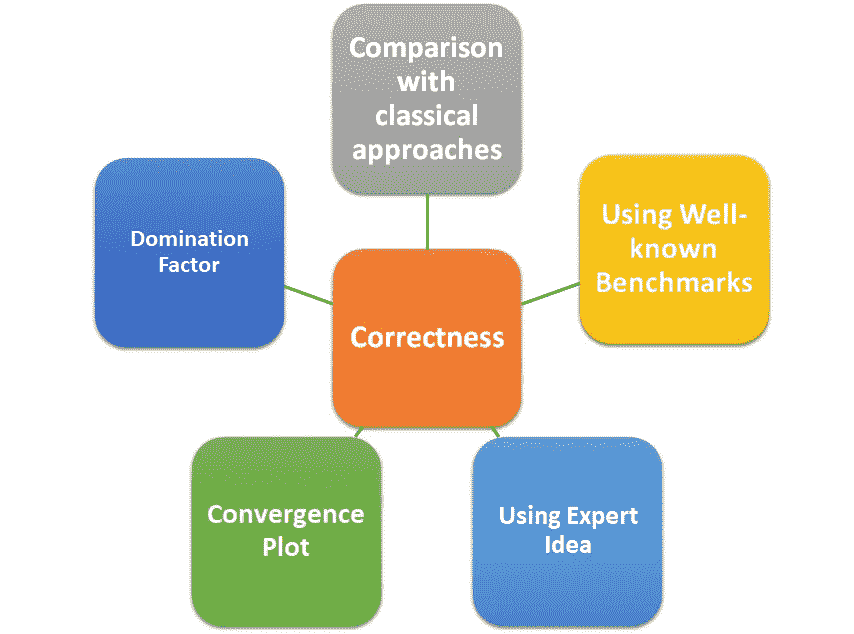

# 如何验证进化优化算法的正确性

> 原文：<https://towardsdatascience.com/how-to-validate-the-correctness-of-an-evolutionary-optimization-algorithm-570c8b71b6d7?source=collection_archive---------36----------------------->

## 检查已实现的元启发式多目标优化算法的正确性和准确性的可能方法。

f = Y . * sin(X)-X . * cos(Y)的 3D 空间

# 目录

1.  **简介**
2.  **正确性验证**
3.  **浅谈绩效考核**
4.  **结论**
5.  **参考文献**
6.  **一些相关的中帖**

# 1.介绍

进化和元启发式优化算法被认为是人工智能(AI)的子集。这些算法试图模仿自然机制并解决优化问题。例如，遗传算法(GA)使用受启发的生物机制，如繁殖、交叉、选择、突变和重组，来寻找优化问题的最佳解决方案。另一个例子是帝国主义竞争算法(ICA ),在这种算法中，统治、革命和殖民化等社会机制被用来寻找解决方案[1]。进化算法通常在复杂的优化问题中表现良好，而使用经典方法在数学上是困难的。他们可以轻松处理非线性问题，而不会陷入局部极小值。

为了用进化优化算法优化一个问题，可以使用认证的工具箱。然而，对于某些算法，要么没有可用的认证工具箱，要么可能更喜欢用任何编程语言来实现他/她自己的代码。在这种情况下，最重要的问题是——我们如何信任编写的代码？我们如何验证我们实现的进化或元启发式代码的正确性？

在这篇文章中，一些现有的检查和验证已实现的进化优化算法的正确性的方法已经得到了简要的阐述。此外，使用 [Ackley 函数](https://en.wikipedia.org/wiki/Ackley_function)的例子，讨论优化算法的性能评估。

# **2。正确性验证**

有不同的方法来检查所实现的元启发式多目标优化算法(例如，遗传算法(GA)或差分进化(DE))的正确性和准确性。下面的方法可以简单地用来检查所实现的优化算法的正确性:

A) **与经典方法的比较:**在一些问题中，可以同时运行经典方法和多变量遗传算法，以确保结果正确和准确。然而，在大多数情况下，由于数学的复杂性，使用经典方法进行比较是不可能的。

B) **使用众所周知的基准:**代码的正确性也可以通过现有的基准来证明。所使用的算法可以通过众所周知的基准进行验证[2–6]。

C) **使用专家思想:**系统的专家可以检查结果及其合理性。他们应该都同意最后的结果是合乎逻辑的。如果一个问题需要精确的最小成本值，那么使用专家的想法是没有说服力的。

D) **收敛性:**通过成本与迭代的关系图，可以容易地观察到所实现的多目标遗传算法的收敛性。还有其他因素，如舍入误差和局部极值，也有相同的观点。

[7]中的收敛图示例(适应度与迭代次数)

E) **支配因子:**NSGA-II、NSGA-III、MOPSO 等新一代优化算法通常具有将支配结果与非支配结果分离的功能。因此，所有的最终结果都应该是占优势的，并且有了适当的初始种群，很少会陷入局部极小值。然而，不能保证他们找到系统的全局最小值。有关支配的更多信息，请查看[8]。

# **3。浅谈绩效评估**

下图显示了 Ackley 函数，其中 *a* 等于 20， *b* 等于 0.2， *c* 等于 2【9】。这个函数是用于进化或元启发式优化的众所周知的基准之一。它有一个唯一的全局最小值和几个局部最小值。

a = 20，b = 0.2，c = 2 的阿克利函数。

使用下面的 MATLAB 代码可以很容易地生成上图:

通过将 *b* 的值增加到 1000，可以得到下图。正如在这个函数中可以看到的，有许多局部最小值和一个狭窄的唯一全局最小值。

a = 20，b = 1000，c = 2 的阿克利函数。

也可以使 *c* 等于零，并移除所有局部最小值。然后可以得到下图。作为全局最小值的具有窄而深的孔的平面。在这种情况下，适应度与迭代次数的关系图是没有用的。

a = 20，b = 1000，c = 0 的阿克利函数。

为了了解优化算法的性能，让我们简化这个问题。首先，我们可以离散化区域。假设 X 和 Y 的范围为-5 到 5，步长为 1，点 x = 0，y = 0 是全局最小值。所以，X 和 y 会有 121 种可能的组合，随机找到最优值的概率应该是 1/121。在最坏的情况下，找到最优值的概率是多少？

答案应该是新生成值的总数(考虑所有算法部分，如初始种群、变异、交叉、重组等)。)除以输入(基因)的总可能组合。在这种情况下，只有新生成值的数量和离散化的精度才能提高性能。下面的表达式可以用作这个例子的误差概率。

上述表达式不仅可用作最坏情况下的误差概率上限，还可用于任何其他情况。该表达式还可以证明，当离散化中的步长足够小时(N → ∞),并且迭代次数是无限的(需要巨大的计算能力),那么误差概率应该为零。

应该注意的是，给出最坏的情况是因为问题的本质很容易被绕过或减少进化算法中策略的影响。换句话说，在这个例子中，进化优化算法的策略对性能和准确性的影响很小。

寻找进化优化的性能和准确性仍然是一个没有答案的研究问题。在许多情况下，算法的策略会影响性能。例如，Arnold，D. V .等人[10]提出了一种方法来测量步长对进化优化算法输出性能的影响。但这项研究不能被视为进化优化算法的准确性和性能评估的一般解决方案。

# **4。结论**

与迭代次数、初始群体和内部函数评估相关的计算工作，这些可能与元启发式算法的性能或准确性相关。因此，计算优化算法的大 O 是有用的。

问题维度包括目标的数量、约束、输入基因的范围和数量以及优化算法的结构可以与性能相关[11]。

进化优化算法的正确性可以通过不同的方法来验证，概括如下:

检查进化或元启发式算法正确性的可能方法

# 5.参考

[1]阿塔什帕斯-加尔加里等人和卢卡斯等人(2007 年)。帝国主义竞争算法:一种受帝国主义竞争启发的优化算法。在 *IEEE 进化计算大会*(第 4661-4667 页)。

[2]姚，谢，刘，杨，林等(1999).进化编程变得更快。进化计算汇刊，3(2)，82–102。

[3]迪加拉基斯和玛格丽特(2001 年)。关于遗传算法的基准函数。国际计算机数学杂志，77(4)，481–506。

[4]m .莫尔加和 c .斯穆特尼基(2005 年)。优化需求的测试函数。优化需求的测试函数，101。

[5]杨晓生(2010)。最优化中的测试问题。arXiv 预印本 arXiv:1008.0549。

[6]s .米尔贾利利和 a .刘易斯(2013 年)。二进制粒子群优化的 s 形和 V 形传递函数。群体和进化计算，9，1–14。

[7]陈，陈，杨，江，魏(2016)。基于遗传粒子群优化的甚高分辨率遥感影像目标变化检测特征选择。*传感器*、 *16* (8)、1204。

[8] Elarbi，m .，Bechikh，s .，Gupta，a .，Said，L. B .，和 Ong，Y. S. (2017 年)。一种新的基于分解的多目标优化 NSGAⅱ。IEEE 系统、人和控制论汇刊:系统，48(7)，1191–1210。

[9]埃克利博士(2012 年)。*基因爬山的联结主义机器*(第 28 卷)。斯普林格科学&商业媒体。

[10]d . v . Arnold 和 h . g . Beyer(2004 年)。累积步长自适应进化优化的性能分析。 *IEEE 自动控制汇刊*， *49* (4)，617–622。

[11]网址:[https://www . research gate . net/post/How _ to _ assesse _ the _ performance _ of _ an _ optimization _ algorithm](https://www.researchgate.net/post/How_to_assess_the_performance_of_an_optimization_algorithm)

# 6.一些相关的中等职位

 [## 揭开机器学习优化的神秘面纱

### 优化是机器学习算法配方中最重要的成分。它从定义开始…

towardsdatascience.com](/demystifying-optimizations-for-machine-learning-c6c6405d3eea)  [## 了解 RMSprop —更快的神经网络学习

### 免责声明:我假定关于神经网络优化算法的基本知识。特别是关于 SGD 的知识…

towardsdatascience.com](/understanding-rmsprop-faster-neural-network-learning-62e116fcf29a)  [## 自适应元启发式智能粒子(AMI-P)

### AMI 粒子

towardsdatascience.com](/adaptive-meta-heuristically-intelligent-particle-ami-p-4badd123b3a2)  [## 进化策略简介

### 在这篇文章中，我们将学习使用 Python 中的进化策略(es)来训练一个没有反向传播的神经网络…

towardsdatascience.com](/introduction-to-evolution-strategy-1b78b9d48385) 

**注:** 写这篇文章的想法是在我们得到下面这篇文章的评论时开始的:

阿赫拉吉，杨，巴迭埃，a，赵，x，阿斯兰塞法特，k，肖，x，什图，s .，&马，X. (2020)。使用数字双胞胎对最新露点冷却器进行约束多目标进化优化。*能量转换与管理*、 *211* 、112772。[https://doi.org/10.1016/j.enconman.2020.112772](https://doi.org/10.1016/j.enconman.2020.112772)