# 如何对自然语言处理任务的数据帧中的文本进行矢量化——3 种简单的技术

> 原文：<https://towardsdatascience.com/how-to-vectorize-text-in-dataframes-for-nlp-tasks-3-simple-techniques-82925a5600db?source=collection_archive---------6----------------------->

## 使用 Texthero、Gensim 和 Tensorflow 的简单代码示例


Justin Luebke 在 [Unsplash](https://unsplash.com?utm_source=medium&utm_medium=referral) 上的照片

# 今天就开始学习 NLP 吧！

你可能听说过自然语言处理(NLP)是十年来最具 T4 变革性的技术之一。现在是进入 NLP 的绝佳时机，因为新的库已经抽象掉了许多复杂性，允许用户通过很少的模型训练和很少的代码获得最先进的结果。

虽然计算机实际上很擅长寻找模式和总结文档，但它必须先将单词转换成数字，然后才能理解它们。不同于[像我过去所做的那样在单词级别对文本进行矢量化](/the-simple-approach-to-word-embedding-for-natural-language-processing-using-python-ae028c8dbfd2)，我将探索以下技术在句子、段落或文档级别对数据帧中的文本进行矢量化:

[text hero:TF-IDF](https://texthero.org/docs/api/texthero.representation.tfidf)
[Gensim:doc 2 vec](https://radimrehurek.com/gensim/models/doc2vec.html)
tensor flow 2:通用语句编码器 4

作为奖励，我也将使用 t-SNE 可视化矢量！**完整代码朝向底部！**

# 下载数据集

我将不再从我最喜欢的来源中收集数据，而是从游戏《魔法:聚会中寻找[卡片。我几乎一生都在玩纸牌游戏，并在 90 年代中期大约在二年级的时候开始玩](http://MTGJSON.com)[魔法:聚会(MTG)](https://en.wikipedia.org/wiki/Magic:_The_Gathering) 。如果你有兴趣尝试一下，你可以[在线免费玩](https://magic.wizards.com/en/mtgarena)！

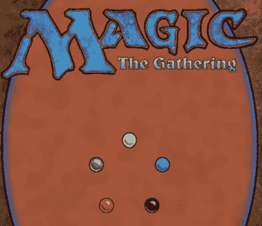

[魔法:聚会](https://en.wikipedia.org/wiki/Magic:_The_Gathering#/media/File:Magic_the_gathering-card_back.jpg) [法律](https://company.wizards.com/fancontentpolicy)

我很高兴发现所有卡片的免费数据集。要了解示例，请从[MTGJSON.com](https://mtgjson.com/downloads/all-files/)下载 **AllPrintings SQLITE** 文件

> MTGJSON 是一个开源项目，它将所有魔术编目:以可移植的格式收集卡片。

# 导入依赖项和数据

很容易将数据连接并加载到 dataframe 中，因为它已经是一个 sqlite 文件。按照三个步骤加载库、数据和数据框架！

1.导入 pandas 和 sqlite3 库
2。连接到 sqlite 文件
3。将数据加载到熊猫数据框架中。

```
#*Import dependencies*
import pandas as pd
import sqlite3*#Establish connection to sqlite database*
conn = sqlite3.connect("AllPrintings.sqlite")*#load the data into a pandas DataFrame*
df = pd.read_sql("select * from cards", conn)
```

注意，我使用 pandas **read_sql** 函数来生成一个使用原始 sql 的数据帧。我可以看到数据集中有 73 列和 54033 行。

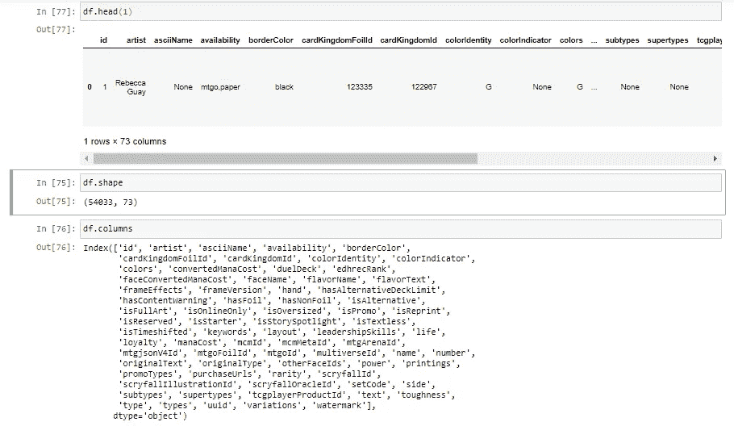

我将减少列数和行数，因为我只关心不同的卡片。在游戏*魔法:聚会*中，有 5 种核心颜色:黑色、蓝色、绿色、红色和白色。

我将探索我最喜欢的颜色，[绿色](https://medium.com/swlh/how-to-create-a-dashboard-to-dominate-the-stock-market-using-python-and-dash-c35a12108c93)。

```
df = pd.read_sql("select distinct name, text, convertedManaCost, power, toughness, keywords from cards where borderColor ='black' and colorIdentity = 'G'", conn)
```

注意，我用 **SELECT DISTINCT** 开始 SQL 查询，以排除重复的卡。这是必要的，因为一些卡片多年来已经被重印了多套。

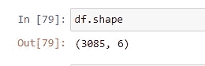

df.shape 返回数据帧的形状

删除重复项并将数据集限制为绿卡，这样我就有了 3085 行 6 列。

# 清理数据

为了清理数据并为矢量化做准备，我将使用 [***Texthero 库***](/try-texthero-the-absolute-simplest-way-to-clean-and-analyze-text-in-pandas-6db86ed14272) ，因为它简化了数据帧中文本的清理。要应用默认的文本清理脚本，运行 **hero.clean(pandas。系列)。**

使用 **clean()** 时，默认运行以下七个功能:

1.  `fillna(s)`用空格替换未赋值的值。
2.  `lowercase(s)`小写所有文本。
3.  `remove_digits()`去掉所有的数字块。
4.  `remove_punctuation()`删除所有字符串.标点(！" #$% & '()*+，-。/:;< = >？@[\]^_`{|}~).
5.  `remove_diacritics()`去除琴弦上的所有重音。
6.  删除所有停用词。
7.  `remove_whitespace()`删除单词之间的所有空格。

## 定制清洗管道

我将构建自己的管道，而不是使用默认的 clean 函数。使用我自己的管道，我可以保留尽可能多的卡片上下文以实现相似性:

```
import texthero as hero
from texthero import preprocessingcustom_pipeline = [preprocessing.fillna,
                   #preprocessing.lowercase,
                   preprocessing.remove_whitespace,
                   preprocessing.remove_diacritics
                   #preprocessing.remove_brackets
                  ]df['clean_text'] = hero.clean(df['text'], custom_pipeline)
df['clean_text'] = [n.replace('{','') for n in df['clean_text']]
df['clean_text'] = [n.replace('}','') for n in df['clean_text']]
df['clean_text'] = [n.replace('(','') for n in df['clean_text']]
df['clean_text'] = [n.replace(')','') for n in df['clean_text']]
```

注意我用了 **fillna** ，因为有些卡片没有文字。
注意我决定从管道中排除**移除括号**。这是因为 Texthero 也会删除括号中的数据！

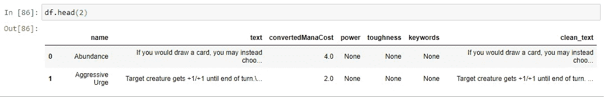

熊猫数据帧的前两行

# 使用 TF-IDF 生成矢量

[TF-IDF](https://en.wikipedia.org/wiki/Tf%E2%80%93idf) 代表**词频-逆文档频**。是一种*经典的*对单词值进行加权而不是简单计数的方法。它用于确定一个单词对集合文档中的文本有多重要。

TF-IDF 是文本的一个**词包(BoW)** 表示，描述文本语料库中**词**的出现。它不能解释单词的顺序。我将在下一节详细讨论这些限制…

TextHero 使得将 TF-IDF 应用到 dataframe 中的文本变得很容易。

```
df['tfidf'] = (hero.tfidf(df['clean_text'], max_features=3000))
```

将值添加到 dataframe 实际上只有一行代码！我建议探索不同数量的 **max_features** ，看看它如何影响向量。

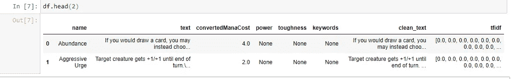

df.head(2)显示 dataframe 中新的 tfidf 列

TF-IDF 生成一个稀疏矩阵，其中包含许多 0，因为卡片上有各种各样的单词。

# 使用 Doc2Vec 生成矢量

虽然 TF-IDF 是使用经典矢量化技术建立基线的良好起点，但它有很大的局限性。由于它是一个单词包表示法，所以它没有保持单词的顺序，也没有说明太多的语义。作为稀疏矩阵，它也可能是资源密集型的。

## Word2Vec 革命

为了解决语义关系和稀疏矩阵的问题，创建了像 Word2Vec 这样的模型。以前我写过关于使用 [Gensim 库](https://radimrehurek.com/gensim/index.html)在文本数据上应用 Word2Vec 模型的文章。

[](/the-simple-approach-to-word-embedding-for-natural-language-processing-using-python-ae028c8dbfd2) [## 用 Python 实现自然语言处理中单词嵌入的简单方法

### 使用 Gensim 和 Plotly 探索单词嵌入

towardsdatascience.com](/the-simple-approach-to-word-embedding-for-natural-language-processing-using-python-ae028c8dbfd2) 

Word2Vec 模型为每个单词生成向量，但是为了计算整个文档的向量，我可以对文档中每个单词的向量进行平均。相反，我会使用更简单的路线: [**Doc2Vec**](https://radimrehurek.com/gensim/auto_examples/tutorials/run_doc2vec_lee.html#sphx-glr-auto-examples-tutorials-run-doc2vec-lee-py) 。

## 使用 Doc2Vec

2014 年推出的 [Doc2Vec](https://radimrehurek.com/gensim/auto_examples/tutorials/run_doc2vec_lee.html#sphx-glr-auto-examples-tutorials-run-doc2vec-lee-py) 是一款[](https://radimrehurek.com/gensim/auto_examples/core/run_core_concepts.html#core-concepts-model)**表示 [**文档**](https://radimrehurek.com/gensim/auto_examples/core/run_core_concepts.html#core-concepts-document) **s，段落或句子**作为 [**向量**](https://radimrehurek.com/gensim/auto_examples/core/run_core_concepts.html#core-concepts-vector) 。Doc2Vec 通常优于 Word2Vec 向量的简单平均，因此值得探索！**

**在基本层面上，Doc2Vec 算法为文档提供了另一个类似浮动单词的向量，称为 doc-vector。它有助于所有的训练预测，并像其他词向量一样被更新。查看乐和米科洛夫的[全文，了解技术方面的内容。](https://cs.stanford.edu/~quocle/paragraph_vector.pdf)**

**Doc2Vec 需要训练。为了训练模型，标签/编号需要与训练的每个文档相关联。使用 **doc2vec 可以轻松完成标记。标签文档()。****

```
from gensim.models.doc2vec import Doc2Vec, TaggedDocument*#tokenize and tag the card text*
card_docs = [TaggedDocument(doc.split(' '), [i]) 
             for i, doc in enumerate(df.clean_text)]#display the tagged docs
card_docs
```

**注意，我使用**做了简单的标记化。拆分(' ')**在清洗过的卡片文字上。**

**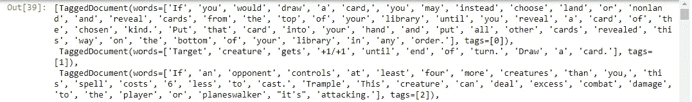**

**标记和令牌化的卡文本**

**接下来，实例化一个 [Doc2Vec 模型](https://radimrehurek.com/gensim/models/doc2vec.html)。**

**设置向量大小以确定将包括多少个维度。设置训练时期以确定它将迭代训练数据的次数。**

```
model = Doc2Vec(vector_size=64, min_count=1, epochs = 20)
```

**当设置纪元时，考虑高的数字倾向于达到递减的回报。试验超参数！[查看文档，获取所有模型参数的完整列表](https://radimrehurek.com/gensim/models/doc2vec.html)。**

**在实例化模型后构建一个词汇表，然后训练模型。**

```
*#instantiate model*
model = Doc2Vec(vector_size=64, window=2, min_count=1, workers=8, epochs = 40)*#build vocab*
model.build_vocab(card_docs)*#train model*
model.train(card_docs, total_examples=model.corpus_count
            , epochs=model.epochs)
```

**构建词汇表创建了一个字典(可通过`model.wv.vocab`访问),包含从训练中提取的所有独特单词以及计数。**

**现在模型已经训练好了，使用 **model.infer_vector** 将标记化的文本传递给模型以生成向量。**

```
*#generate vectors*
card2vec = [model.infer_vector((df['clean_text'][i].split(' '))) 
            for i in range(0,len(df['clean_text']))]card2vec
```

**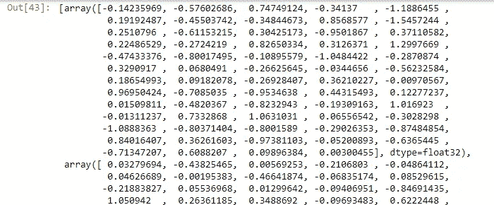**

**矢量化卡片文本**

**注意数据输出为 numpy 数组。要将向量添加到数据帧中，使用 **numpy.array()。【tolist().这将把它们保存为列表列表。然后，它们可以作为一列添加到数据帧中。****

```
import numpy as np*#Create a list of lists*
dtv= np.array(card2vec).tolist()*#set list to dataframe column*
df['card2vec'] = dtvdf.head(2)
```

**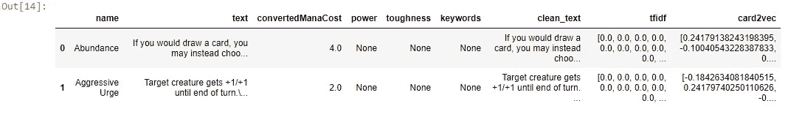**

**带有 Doc2Vec 向量的数据帧**

**注意 card2vec 列包含 Doc2Vec 向量。将向量添加到数据帧是存储它们的一种便捷方式。**

**虽然 Doc2Vec 方法只用了几行代码就完成了，而不是训练一个 Doc2Vec 模型，但是有一些预训练的选项甚至需要更少的代码！**

# **使用通用语句编码器生成向量**

**比使用 Doc2Vec 更简单的是，托管在 [Tensorflow-hub](https://tfhub.dev/google/universal-sentence-encoder/4) (tfhub)上的[通用句子编码器](https://arxiv.org/pdf/1803.11175.pdf) (USE)是一个预先训练好的模型，它将文本编码成 512 维向量。它在各种各样的文本资源上被训练。**

> **通用句子编码器将文本编码成高维向量，这些向量可用于文本分类、语义相似性、聚类和其他自然语言任务。— [文档](https://tfhub.dev/google/universal-sentence-encoder/4)**

**使用模型的最新迭代使用 TensorFlow2。我过去曾使用 Tensorflow 1 模型来[生成葡萄酒推荐](/generating-wine-recommendations-using-the-universal-sentence-encoder-d086edd13d00)，这些新模型使用起来更简单，应用起来也更快。**

**模型需要从 tfhub 下载。**

```
!pip install --upgrade tensorflow_hubimport tensorflow_hub as hub*#download the model*
embed = hub.load("[https://tfhub.dev/google/universal-sentence-encoder-large/5](https://tfhub.dev/google/universal-sentence-encoder-large/5)")
```

**接下来，通过模型运行 *cleaned_text* 来生成向量。使用 Doc2Vec 示例中的相同技术，将 numpy 数组中的向量转换为 list 列表。**

**由此，很容易将向量添加到数据帧中。就是这么简单！**

```
*#generate embeddings*
embeddings = embed(df['clean_text'])*#create list from np arrays*
use= np.array(embeddings).tolist()*#add lists as dataframe column*
df['use'] = use*#check dataframe*
df.head(2)
```

**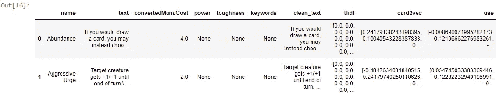**

**通用句子编码器向量**

> **恭喜你！您刚刚学习了 3 种快速简单的方法来矢量化数据帧中大于单词长度的文本！**

# **可视化矢量**

**既然我费了这么大的劲来生成向量，我还不如探索一下！使用 [Texthero 库](https://texthero.org/docs/api/texthero.representation.tsne)，很容易应用 [t-SNE 算法](https://en.wikipedia.org/wiki/T-distributed_stochastic_neighbor_embedding)来降低向量的维度，并在 2D 空间中可视化它们。**

**t-SNE(t-distributed random neighbor embedding)是一种用于可视化高维数据的[机器学习](https://en.wikipedia.org/wiki/Machine_learning)算法。t-SNE 技术应用了**非线性**维度缩减。**

```
df['tsnetfidf'] = hero.tsne(df['tfidf'])
df['tsnec2v'] = hero.tsne(df['card2vec'])
df['tsneuse'] = hero.tsne(df['use'])
```

**算法很复杂，可能需要一点时间才能完成！**

**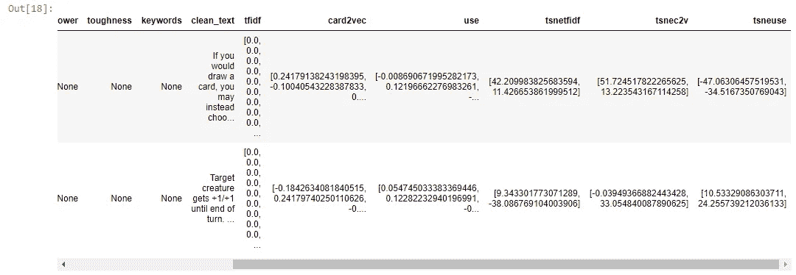**

**显示 t-SNE 结果的数据框**

**接下来，使用 [Texthero 构建 t-sne 列的散点图](https://texthero.org/docs/api/texthero.visualization.scatterplot)。Texthero 在引擎盖下使用 Plotly，因此图形是交互式的。**

```
*#create scatter plot of tfidf*
hero.scatterplot(df, col='tsnetfidf', color='convertedManaCost'
                 , title="TF-IDF", hover_data = ['name','text'])*#create scatter plot of doc2vec*
hero.scatterplot(df, col='tsnec2v', color='convertedManaCost'
                 , title="Doc2Vec", hover_data = ['name','text'])*#create scatter plot of uni. sent. enc.*
hero.scatterplot(df, col='tsneuse', color='convertedManaCost'
                 , title="U.S.E", hover_data = 'name','text'])
```

**注意我将 **hover_data** 设置为 ***name*** 和 ***text*** 。将鼠标悬停在某个点上将显示卡片名称和卡片文本。这样就很容易比较各种技术如何将相似的卡片聚集在一起。**

**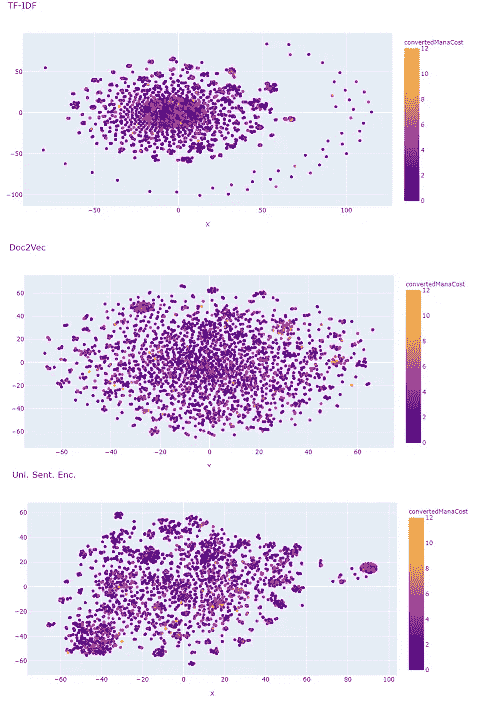**

**文本向量散点图**

**每种技术产生不同的情节，但是把相似的卡片聚集在一起。举例来说，我发现有践踏，或加+1/+1，或横置以加魔法力的牌丛。**

# **最后的想法和完整的代码**

**自然语言处理可能是一个复杂的话题，但是这些技术应该给你一个跳板，让你可以更深入地研究这个领域。我介绍了三种在段落、句子或文档级别对文本进行矢量化的简单方法:**

**[text hero:TF-IDF](https://texthero.org/docs/api/texthero.representation.tfidf)
[Gensim:doc 2 vec](https://radimrehurek.com/gensim/models/doc2vec.html)
[tensor flow 2:通用语句编码器 4](https://tfhub.dev/google/universal-sentence-encoder-large/5)**

**从文本创建向量为机器学习任务做准备，如文本分类、语义相似性和聚类。在我的其他文章中了解关于自然语言处理和数据科学的更多信息:**

**[](https://medium.com/swlh/how-to-create-a-dashboard-to-dominate-the-stock-market-using-python-and-dash-c35a12108c93) [## 如何使用 Python 和 Dash 创建控制股市的仪表板

### 自由期权订单流、价格、基本面、聊天集于一身

medium.com](https://medium.com/swlh/how-to-create-a-dashboard-to-dominate-the-stock-market-using-python-and-dash-c35a12108c93) [](/3-super-simple-projects-to-learn-natural-language-processing-using-python-8ef74c757cd9) [## 使用 Python 学习自然语言处理的 3 个超级简单的项目

### 单词云、垃圾邮件检测和情感分析的简单代码示例

towardsdatascience.com](/3-super-simple-projects-to-learn-natural-language-processing-using-python-8ef74c757cd9) 

## 完全码

这里是完整的代码或在我的 github 上找到它！

[](https://github.com/bendgame/Medium_doc2vec) [## bendgame/Medium_doc2vec

### GitHub 是超过 5000 万开发人员的家园，他们一起工作来托管和审查代码、管理项目和构建…

github.com](https://github.com/bendgame/Medium_doc2vec) 

```
#Import dependencies
import pandas as pd
import sqlite3
import texthero as hero
from texthero import preprocessing
from gensim.models.doc2vec import Doc2Vec, TaggedDocument
import numpy as np
import tensorflow_hub as hub#Establish connection to sqlite database
conn = sqlite3.connect("AllPrintings.sqlite")
#load the data into a pandas DataFrame
df = pd.read_sql("select * from cards", conn)df = pd.read_sql("select distinct name, text, convertedManaCost, power, toughness, keywords from cards where borderColor ='black' and colorIdentity = 'G'", conn)custom_pipeline = [preprocessing.fillna,
                   #preprocessing.lowercase,
                   preprocessing.remove_whitespace,
                   preprocessing.remove_diacritics
                   #preprocessing.remove_brackets
                  ]
df['clean_text'] = hero.clean(df['text'], custom_pipeline)
df['clean_text'] = [n.replace('{','') for n in df['clean_text']]
df['clean_text'] = [n.replace('}','') for n in df['clean_text']]
df['clean_text'] = [n.replace('(','') for n in df['clean_text']]
df['clean_text'] = [n.replace(')','') for n in df['clean_text']]df['tfidf'] = (hero.tfidf(df['clean_text'], max_features=3000))#tokenize and tag the card text
card_docs = [TaggedDocument(doc.split(' '), [i]) 
             for i, doc in enumerate(df.clean_text)]
card_docsmodel = Doc2Vec(vector_size=64, min_count=1, epochs = 20)#instantiate model
model = Doc2Vec(vector_size=64, window=2, min_count=1, workers=8, epochs = 40)#build vocab
model.build_vocab(card_docs)#train model
model.train(card_docs, total_examples=model.corpus_count
            , epochs=model.epochs)#generate vectors
card2vec = [model.infer_vector((df['clean_text'][i].split(' '))) 
            for i in range(0,len(df['clean_text']))]
card2vec#Create a list of lists
dtv= np.array(card2vec).tolist()#set list to dataframe column
df['card2vec'] = dtvdf.head(2)#download the model
embed = hub.load("[https://tfhub.dev/google/universal-sentence-encoder-large/5](https://tfhub.dev/google/universal-sentence-encoder-large/5)")#generate embeddings
embeddings = embed(df['clean_text'])#create list from np arrays
use= np.array(embeddings).tolist()#add lists as dataframe column
df['use'] = [v for v in use]#check dataframe
df.head(2)df['tsnetfidf'] = hero.tsne(df['tfidf'])
df['tsnec2v'] = hero.tsne(df['card2vec'])
df['tsneuse'] = hero.tsne(df['use'])#create scatter plot of tfidf
hero.scatterplot(df, col='tsnetfidf', color='convertedManaCost'
                 , title="TF-IDF", hover_data = ['name','text'])
#create scatter plot of doc2vec
hero.scatterplot(df, col='tsnec2v', color='convertedManaCost'
                 , title="Doc2Vec", hover_data = ['name','text'])
#create scatter plot of uni. sent. enc.
hero.scatterplot(df, col='tsneuse', color='convertedManaCost'
                 , title="U.S.E", hover_data = 'name','text'])
```

[](https://medium.com/swlh/become-a-sql-wizard-using-these-query-optimization-tips-a932d18c762f) [## 使用这些查询优化技巧成为 SQL 向导

### 如何对 SQL Server 查询进行性能优化

medium.com](https://medium.com/swlh/become-a-sql-wizard-using-these-query-optimization-tips-a932d18c762f) 

# 谢谢大家！

*   *如果你喜欢这个，* [*在 Medium 上关注我*](https://medium.com/@erickleppen) *获取更多*
*   [*通过订阅*](https://erickleppen.medium.com/membership) 获得对我的内容的完全访问和帮助支持
*   *我们来连线一下*[*LinkedIn*](https://www.linkedin.com/in/erickleppen01/)
*   *用 Python 分析数据？查看我的* [*网站*](https://pythondashboards.com/)

[**—埃里克·克莱本**](http://pythondashboards.com/)**