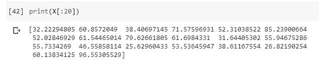
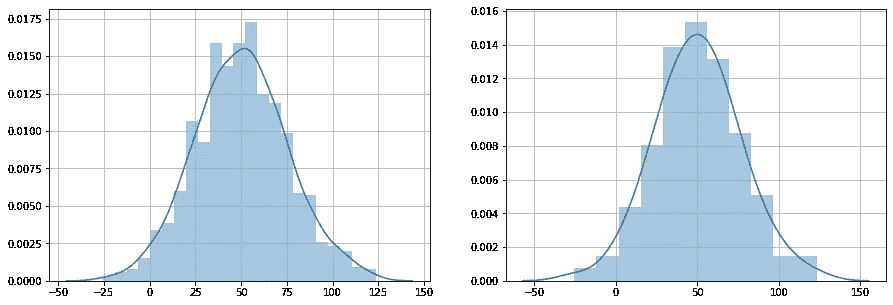
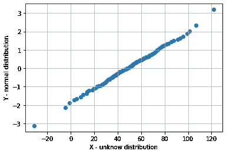
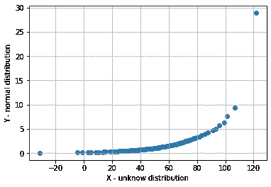
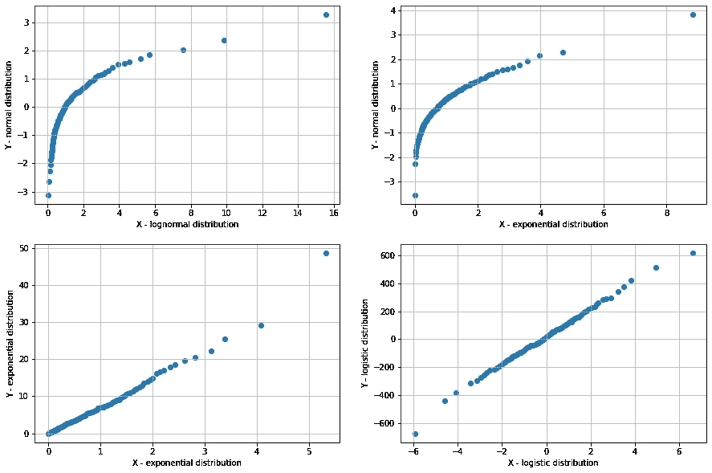

# 如何使用 Q-Q 图验证数据的分布？

> 原文：<https://towardsdatascience.com/how-to-verify-the-distribution-of-data-using-q-q-plots-acdb7ca2d576?source=collection_archive---------13----------------------->


艾萨克·史密斯在 [Unsplash](https://unsplash.com?utm_source=medium&utm_medium=referral) 上拍摄的照片

## 统计数字

## 理解 Q-Q 图并在 Python 中实现它

Q-Q 图，或分位数-分位数图，是一种验证任何随机变量(如正态、指数、对数正态等)分布的图形方法。这是一种观察任何分布性质的统计方法。

例如，如果给定一个分布，需要验证它是否是正态分布，我们运行统计分析，并将未知分布与已知正态分布进行比较。然后通过观察 Q-Q 图的结果，就可以确认给定的分布是否正态分布。

# 绘制 Q-Q 图的步骤:

1.  给定一个未知的随机变量。
2.  找到每个整数百分位值或 100 个 z 值。
3.  生成一个已知的随机分布，并对该分布执行步骤 1–2。
4.  绘制 Q-Q 图

给定一个随机分布，需要验证它是否是正态/高斯分布。为了便于理解，我们将这个未知分布命名为 **X、**，已知的正态分布命名为 **Y.**

## 生成未知分布 X:

```
X = np.random.normal(loc=50, scale=25, size=1000)
```

我们正在生成具有 1000 个值的正态分布，平均值=50，标准差=25。



(图片由作者提供)，X 的前 20 个随机值

## 查找 100%的值:

```
X_100 = []
for i in range(1,101):
    X_100.append(np.percentile(X, i))
```

计算每个整数百分位数(1%，2%，3%，。。。，99%，100%)X 随机分布的值并存储在 X_100 中。



(图片由作者提供)**，左:**X 的分布，**右:**X _ 100 的分布

## 生成已知的随机分布 Y 及其百分位值:

```
Y = np.random.normal(loc=0, scale=1, size=1000)
```

生成具有 1000 个值的正态分布，平均值=0，标准偏差=1，这些值需要与未知分布 X 进行比较，以验证 X 分布是否正态分布。

```
Y_100 = []
for i in range(101):
    Y_100.append(np.percentile(Y, i))
```

计算每个整数百分位数(1%，2%，3%，。。。，99%，100%)的值，并将其存储在 Y_100 中。

## 绘图:

为上面获得的未知分布到正态分布的 100%值绘制散点图。



(图片由作者提供)， **Q-Q 剧情**

> 这里 X-是与 Y-正态分布相比较的未知分布。

> 对于 Q-Q 图，如果图中的分散点位于一条直线上，那么两个随机变量具有相同的分布，否则它们具有不同的分布。

从上面的 Q-Q 图，可以观察到 X 是正态分布的。


## 如果两个分布不一样呢？

如果 X 不是正态分布，它有一些其他的分布，那么如果 Q-Q 图绘制在 X 和正态分布之间，分散点将不会位于一条直线上。



(图片由作者提供)， **Q-Q 剧情**

这里，X 分布是对数正态分布，与正态分布相比，因此 Q-Q 图中的散点不在一条直线上。

## 让我们有更多的观察:

这是 X 和 Y 分布的 4 种不同条件下的 4 个 Q-Q 图。



(图片由作者提供)，**左上:**对数正态分布与正态分布的 QQ 图，**右上:**正态分布与指数分布的 QQ 图，**左下:**指数分布与指数分布的 QQ 图，**右下:**logistic 分布与 logistic 分布的 QQ 图

# 实施:

(作者代码)

# 结论:

Q-Q 图可用于比较任何两个分布，也可用于通过与已知分布比较来验证未知分布。这种方法有一个主要的限制，即需要大量的数据点，因为推断较少的数据不是一个明智的决定。通过观察 Q-Q 图，可以预测两个分布是否相同。

> 感谢您的阅读