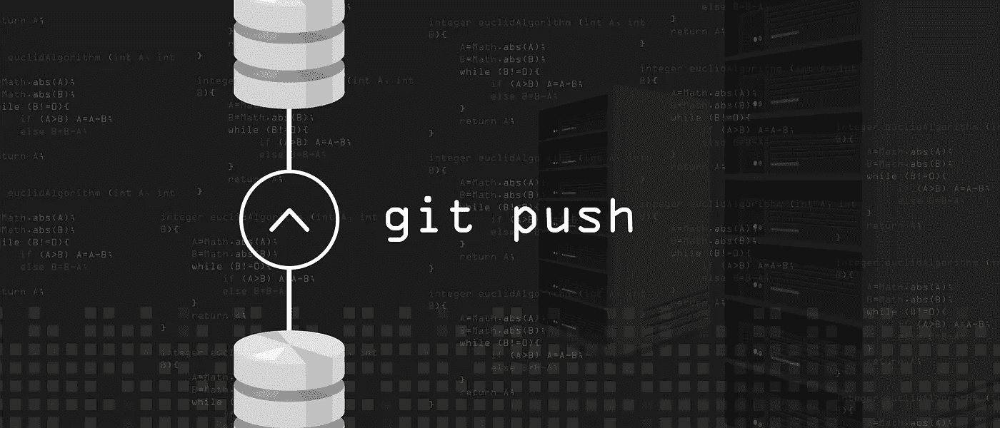
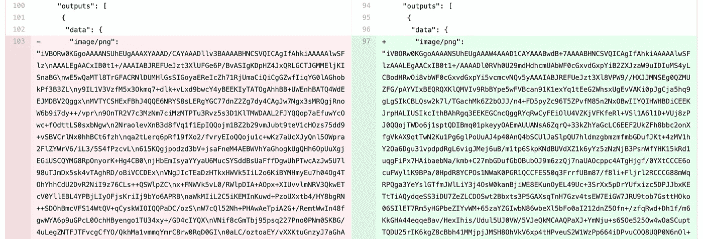

# 如何控制 Jupyter 笔记本的版本

> 原文：<https://towardsdatascience.com/how-to-version-control-jupyter-notebooks-ccf0be144319?source=collection_archive---------14----------------------->

根据 Shutterstock.com 的许可使用图像

Jupyter 笔记本在许多方面都很棒，但使用它们进行协作并不容易。在这篇文章中，我们将看看你可以利用的所有工具，让笔记本与现代版本控制系统(如 git)很好地配合！

# 为什么 Jupyter 版本控制这么难？

软件世界已经将 git 作为版本控制工具的首选。Git 主要用于人类可读的文本文件。而 Jupyter 是一个丰富的 JSON 文档，它将源代码、markdown、HTML、图像都整合到一个。ipynb 文件。

Git 不能很好地处理像笔记本这样的富文档。例如，对于长嵌套 JSON 文档的 git 合并是不可能的，对于二进制图像字符串的 git diff 是可怕的(如下所示)。

# 对笔记本版本控制有什么要求？

这是我们从现代版本控制系统中需要的-

*   创建检查点/提交的能力
*   快速检查任何过去的笔记本版本
*   查看从一个版本到另一个版本的变化(笔记本电脑的视觉差异
*   多人可以在一个笔记本上工作，轻松解决合并冲突
*   能够就特定的笔记本电池提供反馈并提出问题

这是我们的愿望清单！这篇博客将向你介绍所有能帮助你实现这些目标的重要工具。

**免责声明:我是下面列出的两个工具的作者(ReviewNB & GitPlus ),但这是对该领域所有有用工具的公正评论。**

# nbdime

nbdime 是一个用于本地区分和合并笔记本的开源库。您可以将其设置为与本地 git 客户端一起工作，以便`git diff` & `git merge`命令使用 nbdime。ipynb 文件。有了 nbdime，你可以—

*   在提交之前，运行`git diff`来查看笔记本发生了什么变化
*   轻松将远程更改与本地编辑的笔记本合并

# JupyterLab Git 扩展

以下 JupyterLab 扩展对笔记本版本控制很有用。你可以在你本地的 JupyterLab 上安装这些。

*   jupyterlab-git 可用于浏览 GitHub 库，查看已更改文件的视觉差异，并推送您的提交
*   [GitPlus](https://github.com/ReviewNB/jupyterlab-gitplus) 可用于直接从 JupyterLab UI 在 GitHub 上推送提交和创建拉取请求

# AWS SageMaker

SageMaker 是 AWS 提供的托管服务，让您可以访问托管的 JupyterLab。它与 GitHub 存储库集成，因此您可以将您的公共/私有存储库克隆到 SageMaker 实例中。它使用了 [jupyterlab-git](https://github.com/jupyterlab/jupyterlab-git) 扩展，因此你可以将你的笔记本提交到 GitHub。

使用 SageMaker，您只需点击几下鼠标，就可以构建一个强大的 EC2 实例来训练您的模型。缺点是您总是使用昂贵的云计算，即使是那些可以在本地机器上轻松完成的任务，例如浏览数据、编辑笔记本。对于大多数人来说，本地 Jupyter 会话与稀疏 SageMaker 使用(当您真正需要强大的云计算时)的健康平衡是理想的。

# 谷歌联合实验室

另一个受欢迎的选择是谷歌 Colab。他们有体面的 [GitHub 集成](https://colab.research.google.com/github/googlecolab/colabtools/blob/master/notebooks/colab-github-demo.ipynb)，你可以在 GitHub 库中打开一个特定的笔记本。您还可以将任何更改提交回存储库。

Colab 提供有限的免费 GPU，您可以升级到 Colab Pro 以获得更高的使用限制。一些限制是，

*   Colab pro 是一个付费产品，但不提供任何 GPU 时间和类型方面的资源保证。
*   一切都以单个笔记本文件为中心，您不需要克隆整个存储库或访问本地文件系统。Colab 似乎建议使用 Google Drive 作为你的虚拟文件系统。这将影响训练的速度(通过网络调用获取数据文件，而不是在磁盘上本地获取)。

# 评论 NB

[ReviewNB](https://www.reviewnb.com?utm_source=reviewnb_blog) 是一个 GitHub 应用程序，显示任何笔记本提交或拉取请求的视觉差异。您可以在特定的笔记本单元格上写下评论，以便向您的队友提供反馈或提出问题。

它对开源库是免费的，但对私有库需要付费计划。ReviewNB 应用程序已通过 GitHub &验证，获准在 [GitHub marketplace](https://github.com/marketplace/review-notebook-app) 上销售。

# 结论

当谈到 Jupyter 笔记本版本控制和协作时，没有一个工具适合所有情况。但是，您的团队可以利用以下专门构建的工具来创建可靠的笔记本工作流-

*   GitHub 存储笔记本
*   [git 命令的 jupyterlab-git](https://github.com/jupyterlab/jupyterlab-git) 扩展&丰富的本地差异
*   [GitPlus](https://github.com/ReviewNB/jupyterlab-gitplus) 扩展创建拉取请求
*   [笔记本代码评审](https://www.reviewnb.com?utm_source=reviewnb_blog)
*   如果您需要在大型云实例上运行笔记本电脑，请使用 AWS SageMaker

暂时就这样吧！黑客快乐！

*原载于 2020 年 8 月 27 日 https://blog.reviewnb.com***。**