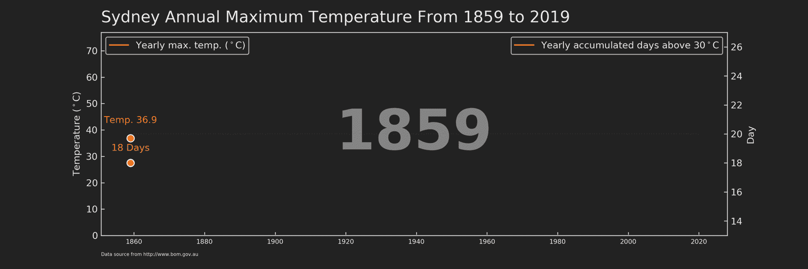
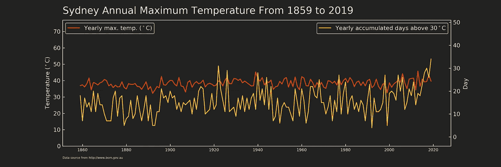
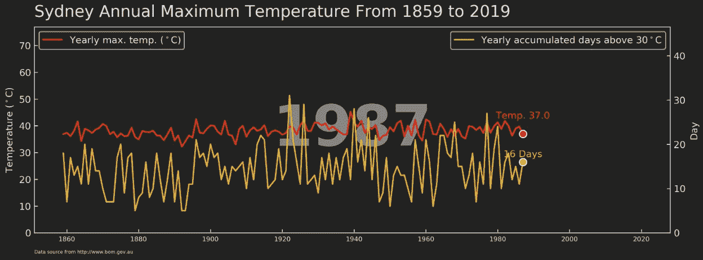

# 如何使用 Matplotlib 可视化悉尼的温度变化

> 原文：<https://towardsdatascience.com/how-to-visualise-sydneys-temperature-change-from-1859-to-2019-using-matplotlib-79b2dc7308c2?source=collection_archive---------31----------------------->



matplotlib 的动画情节

## 制作动画情节的详细指南

我相信你读过的主要时事之一一定是澳大利亚森林大火危机。这场毁灭性的灾难影响了超过 1000 万公顷的土地，这与葡萄牙的土地面积相当，估计有 10 亿只野生哺乳动物、鸟类和爬行动物被杀害(来源[此处](https://www.nature.com/articles/d41586-020-00043-2))。越来越多的证据表明气候变化/全球变暖与今年的森林大火之间的联系，例如极端温度(高于平均温度 1.5 摄氏度)和长期干旱(来源[此处](https://www.theguardian.com/australia-news/2020/jan/02/2019-australia-hottest-year-record-temperature-15c-above-average-temperature))。孤立地阅读这些数字，你可能看不到气候变化是如何随着时间的推移而演变的。从数据可视化的角度来看，使用时间序列图可能更有吸引力和信息量，而不是使用单个值来描述变化范围，时间序列图可以显示变量在大范围时间段内的动态趋势。因此，我借此机会利用悉尼的长期气温数据在`matplotlib`中练习`ax.xxx()`方法。如果你想知道`matplotlib`中的`ax.xxx()`方法是什么，请看一下[我的上一篇帖子](/plt-xxx-or-ax-xxx-that-is-the-question-in-matplotlib-8580acf42f44)。这将有助于你理解这个职位，并进一步了解`matplotlib`。

在这篇文章中，我将向你展示我是如何制作悉尼 160 年间年最高气温的动画时间序列图(如本文开头所示)的。在我们深入研究代码之前，这里有一些要点:

1.  1920 年前后，年最高气温超过 40°C 的年数从 13%增加到 30%。
2.  悉尼有史以来最高的日最高气温是 2013 年的 45.8 摄氏度。
3.  在 1920 年前后，经历长时间高温天气(定义为一年中日最高温度超过 30°C 的总天数)的几率分别为 12%和 24%。
4.  2019 年，与所有其他有记录的年份相比，我们经历了最多的高温日数(34 天)。

## 情节的结构和主题



图 1，静态版本

作为一个独立的图形(图 1)，它至少应该包含三个部分，即标题、情节和脚注。前两部分很容易理解。至于脚注，通常用来表示该图的数据来源和特别说明。

剧情无疑是整个人物最重要的部分。在这种情况下，我用两个不同的 y 轴分别表示*温度*和*日*，它们共用同一个 x 轴，即*年。* `matplotlib`提供了创建*双*轴:`ax.twinx()` / `ax.twiny()`的简单方法。具体来说，`ax.twinx()`创建一个新的`axes`，它与`ax`共享 x 轴，但可以有不同的 y 轴。同样，`ax.twiny()`返回一个共享 y 轴的`axes`，但是使用不同的 x 轴。在构建了人物框架后，我设置了一个未来色彩主题，灵感来自 [Tron Legancy](https://d23.com/a-to-z/tron-legacy-film/) 。在`matplotlib`中，我们可以通过`plt.rc()`轻松配置体形样式。`rc`代表 **C** 启动时自动 **R** un 的配置文件。

使用 plt.rc()的 Tron 主题

## 创建用于静态绘图的函数

我们来看看`matplotlib`中创建动画剧情的 lite 函数。

```
animation.FuncAnimation(*fig*, *func*, *frames=None*)
```

从本质上来说，动画`fig`只是`func`用不同的值(`frames`)获得的静态`axes`的集合。这非常像动画书动画。以我为例，`axes`(从 1859 年到 2019 年，即`range(1859, 2020, 1)`)总共有 160 帧。解决了这个问题后，我创建了一个可以普遍应用于不同`year`值的函数。

这个函数的原理是一层一层的绘制元素(或者我也可以说是`matplotlib`绘图中的原理)。我来一节一节的解释一下上面的函数。

*   `ax.clear()`和`ax2.clear()`，之前的`axes`应该在绘制新的之前被擦除，否则`axes`中的旧内容仍会留在`fig`上并记录在动画中。这也是为什么我没有把`fig, ax = plt.subplots(figsize=(12,4), dpi=300)`和`ax2 = ax.twinx()`包含在函数体中，而是在`animation.FuncAnimation()`之前分别调用。绘图空间(即`fig`、`ax`、`ax2`)只需设置一次，就像一个可重复使用的白板。
*   `df_tmp=df_sydney.loc[df_sydney[‘Year’] <= Num_Year]`，标绘输入应为数据。新的`axes`应该包含当前年度及其所有以前年度的数据(即`<=`)。因此，当`animation.FuncAnimation`在任一给定年份使用`Num_Year`调用`draw_linechart`时，静态图中的线应该从开始(即 1859 年)跨越到被调用的年份(图 2)。



图 2，一个静态图形

*   `ax.plot(df_sydney.Year, df_sydney.max_tmp_year*0, label=’_1', color=’#222222', zorder=1)`，这是第一行剧情。注意，这里使用的数据不是`df_tmp`而是完整的数据帧`df_sydney`。本节将为每个`df_tmp`的`axes`创建一个从起始年(1859)到结束年(2020)的框架。这保证了每个`axes`的 x 轴具有相同的年份范围(即 1860–2020)，而不是随着`df_tmp`的年份范围(即 1860- `Num_Year`)而变化。此外，我只需要框架和线应该隐藏这一层，所以我为 y 轴的每个值(`df_sydney.max_tmp_year`)计时 0。您可能会注意到分配给`label`的值包含一个下划线，这是为了防止该层被稍后的自动图例元素选择(`ax.legend()`)显示。这里用的另一个自变量是`zorder`，可以认为是沿 z 轴的层序列，1 表示底层。
*   从`ax.plot()`到`ax2.plot()`，这些增加了两条水平线，方便观众估算每年最高气温和累计天数的数值。
*   从`ax.plot()`到`ax.text()`这是`fig`中绘制大部分元素(线条、头点、带头点的文字)的部分。这很容易理解。我唯一想再次强调的是`ax.xxx()`的威力，它让每个`axes`的操作变得足够简单。

设置好`draw_linechart`函数后，我们通过输入具体年份来画一个静态图。如果一切顺利，您将看到图 2。

```
# run one frame to test the function
fig, ax = plt.subplots(figsize=(12,4), dpi=300)
ax2 = ax.twinx()
draw_linechart(1987)
```

## 动画图形摘要

运行下面的代码将生成所有的帧并将它们分配给对象`animator`。然后这个对象就可以通过`animator.save()`保存成你想要的任何格式。我个人的偏好是另存为`mp4`。最后要注意的是`fig`背景颜色要用`savefig_kwargs={‘facecolor’:’#222222'}`指定，否则会保存为白色，与`Tron legancy`主题不一致。

```
import matplotlib.animation as animationfig, ax = plt.subplots(figsize=(12,4), dpi=300)
ax2 = ax.twinx()animator = animation.FuncAnimation(fig, draw_linechart, 
                                   frames=np.arange(df_sydney.Year.values.min(),df_sydney.Year.values.max(),1), interval=300)animator.save('./animation5.mp4', savefig_kwargs={'facecolor':'#222222'}) 
```

在这里，我从设计到代码演示了如何使用`matplotlib`创建一个动画图表，这有助于我们更好地理解悉尼 160 年来的温度变化。你可以从我的 [Github](https://github.com/Perishleaf/data-visualisation-scripts/tree/master/matplotlib_sydney_temp) 下载数据、动画、图表和 jupyter 笔记本。

和往常一样，我欢迎反馈、建设性的批评以及听到关于您的数据科学项目的信息。你可以在 Linkedin 上找到我，现在也可以在我的网站上找到我。