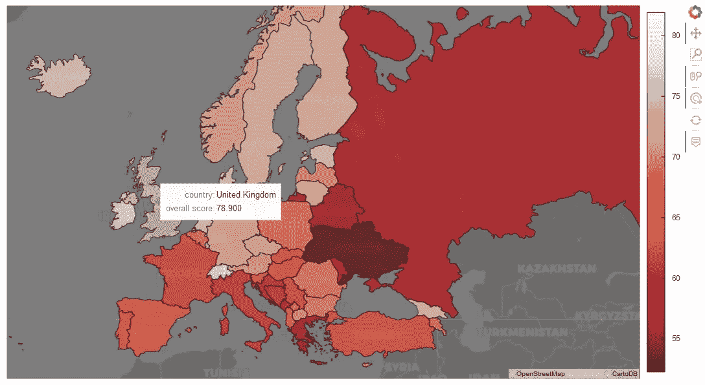
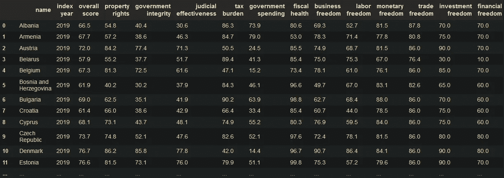
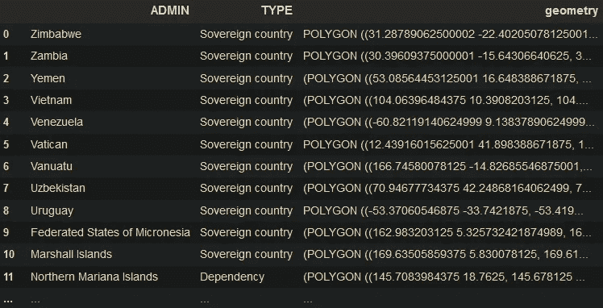
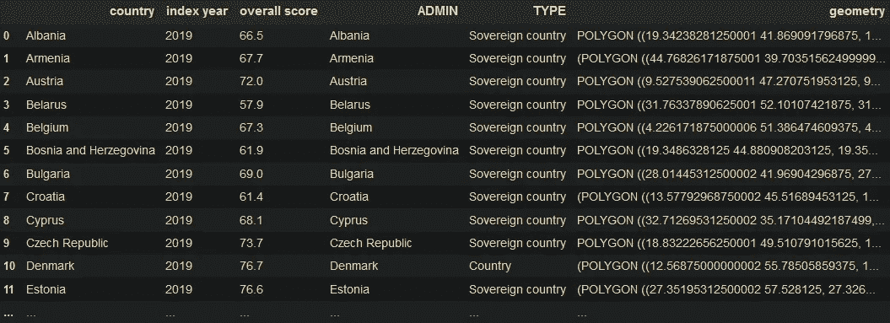
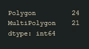
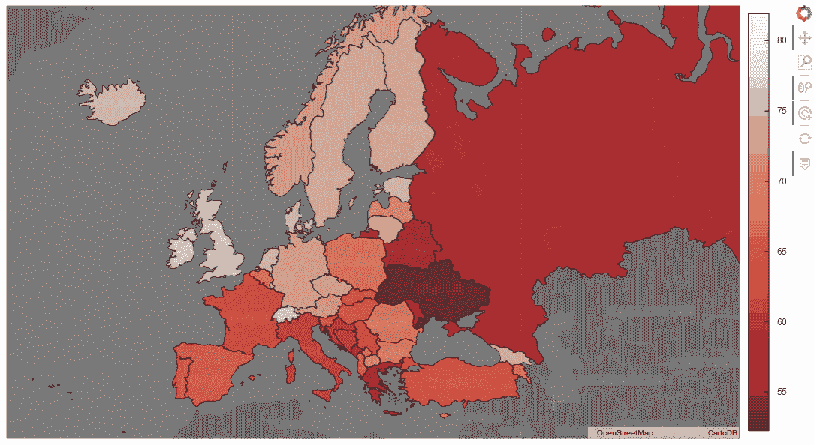
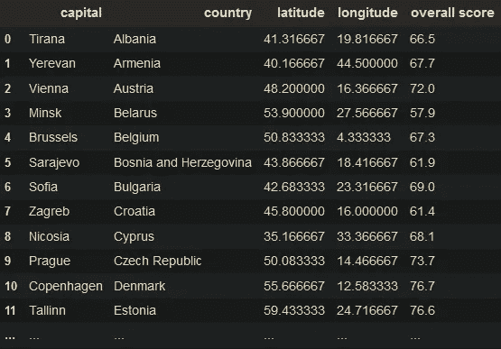
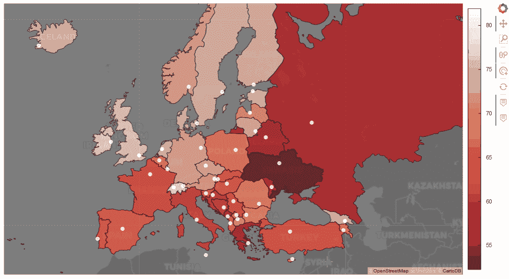

# 如何使用 Geoviews 在 Python 中创建 Choropleth 地图

> 原文：<https://towardsdatascience.com/how-to-visualize-data-on-top-of-a-map-in-python-using-the-geoviews-library-part-2-e61a48ee6c3d?source=collection_archive---------13----------------------->

## 使用 Python 和 Geoviews 多边形绘制交互式 Choropleth 地图

在另一篇[文章](/how-to-visualize-data-on-top-of-a-map-in-python-using-the-geoviews-library-c4f444ca2929)中，我们学习了如何使用`geoviews.Points`方法创建一个代表地图上特定坐标的点的绘图。我们还使用了`geoviews.tile_sources`来获得一张地图，我们可以使用它作为我们的基础图层来绘制点。由于我没有找到使用 [**Geoviews**](http://geoviews.org/) 进行 **choropleth** 绘图的指南，所以我决定写这个简短的教程。

最终结果会是这样的。



出于本教程的目的，我们将使用 **Geoviews** 库通过 **choropleth** 地图绘制一个图表来可视化欧洲国家的[经济自由度指数](https://www.heritage.org/index/)。

> 你可以在[探索标签](https://www.heritage.org/index/explore)下下载你自己选择的任何地区和年份的数据集。

首先，我们需要导入将要使用的库和方法。

```
import pandas as pd
import geopandas as gpd
import geoviews as gv
import geoviews.tile_sources as gvts
from geoviews import opts
gv.extension('bokeh')
```

如果我们阅读从遗产网站得到的 T2 文件，我们会看到这样的内容。



> 为了理解我们所看到的，数字越高，一个国家在自由方面的得分越高。如你所见，每个类别都有一个分数，这些分数加起来就是`overall score`。因此，没有必要进入每个类别的细节，所以我们将在本教程中只使用`overall score`。

从现在开始，我们将该数据帧称为`ef_df`。数据框几乎是完美的。为了更好地理解和解决我发现的一些字符串的问题，我将只添加两行代码。

```
ef_df = ef_df.rename(columns={'name':'country'})
ef_df['country'] = ef_df['country'].apply(lambda x: x.strip())
```

现在我们准备继续下一个元素，创建一个 choropleth 地图。那是一个**形状文件** ( *)。shp* )，包含我们感兴趣的国家的边界(实际上是形状)。

我真的不知道是否有更好的 shapefiles，但你可以在网上自由搜索和找到它们。我要用的那个可以从 [NaturalEarthData 网站](https://www.naturalearthdata.com/downloads/50m-cultural-vectors/50m-admin-0-countries-2/)下载。

我们可以使用`Geopandas`读取 shapefile，并将该数据帧命名为`shapes_df`。

```
shapes_df = gpd.read_file('C:/.../your_directory/ne_50m_admin_0_countries.shp', driver='ESRI Shapefile')
```

从`shapes_df`出发，我们只需要 3 列:`ADMIN`、`TYPE`、`geometry`。
`geometry`列非常重要，因为它包含地理信息，即国家形状。因此，我们将运行下面的代码行。

```
shapes_df = shapes_df[['ADMIN', 'TYPE', 'geometry']]
```

现在`shapes_df`会是这个样子。



正如我所说的，我不知道网上是否有更好的 shapefile，但在这一个中，我们还必须运行以下行来更正一些国家名称，以便与`ef_df`数据帧上的国家名称相匹配。

```
shapes_df = shapes_df.replace({'Czechia': 'Czech Republic',
                               'Republic of Serbia':'Serbia'})
```

现在我们终于可以将这两个数据帧合并成一个了。从`ef_df`开始，我们将仅保留`country`、`index year`和`overall score`列，并且仅针对`index year` = 2019。

```
merged_df = gpd.GeoDataFrame(\
            pd.merge(\
            ef_df[ef_df['index year']==2019][['country','index
                year', 'overall score']], shapes_df,
                left_on='country', right_on='ADMIN'))
```

`merged_df`会是这样的。



在我们继续之前，请运行类似的程序，确保`geometry`数据类型是多边形或多多边形。

```
merged_df['geometry'].geom_type.value_counts()
```



只是为了确保

现在，我们准备使用`geoviews.Polygons`方法绘制我们的 choropleth 图。首先，让我们将底图分配给`poly``gv.Polygons`和`carto`。

```
polys = gv.Polygons(merged_df, vdims=['country', 'overall score']).\
   opts(color='overall score', cmap='reds_r', colorbar=True,\
      width=1000, height=600, tools=['hover', 'tap'], alpha=0.7,\
      hover_line_color='black',line_color='black',\
      hover_fill_color=None, hover_fill_alpha=0.5,\
      xaxis=None,yaxis=None)carto = gvts.CartoDark.opts(alpha=0.6)
```

现在如果我们一起运行它们:

```
polys * carto
```

我们得到了我们的地图:



我们可以清楚地看到哪些国家在经济上被认为是更自由的(浅色)，哪些不是(深色)。

好处:使用 **Geoviews** 我们可以将更多的地块合并成一个。

为了向您展示这一点，我将使用一个包含国家首都及其各自地理位置(即纬度和经度)的数据集。我在这里找到了数据集。我将称之为`capitals_df.`

经过一些清理和合并，我们得到了这个样子。



现在，我们可以使用在之前的[帖子](/how-to-visualize-data-on-top-of-a-map-in-python-using-the-geoviews-library-c4f444ca2929)中看到的`gv.Points`方法，并将其分配给`points.`

```
points = gv.Points(capitals_df, ['longitude', 'latitude'],\
    ['capital']).opts(
        opts.Points(width=1000, height=600, alpha=0.8,\
            tools='hover'],\
            xaxis=None, yaxis=None, color='white',\
            size=7))
```

最后，我们将运行下面的命令。

```
polys * carto * points
```

我们会得到合并后的图。



今天到此为止。希望你觉得有用。下次见！

你可以通过点击[这里](https://www.linkedin.com/in/christoszeglis/)在 LinkedIn 上找到我。