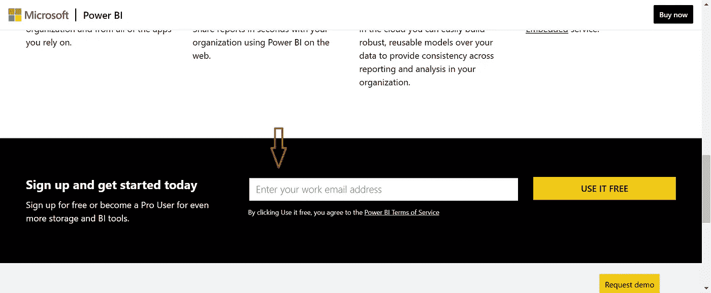
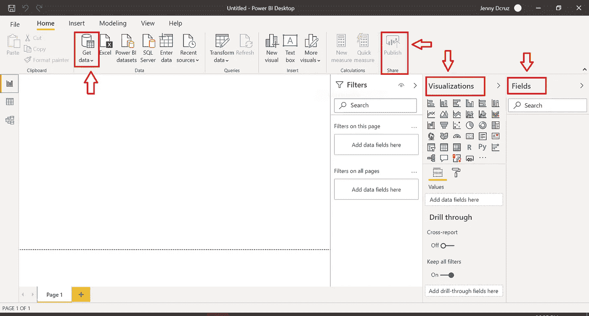
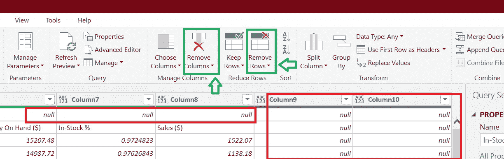
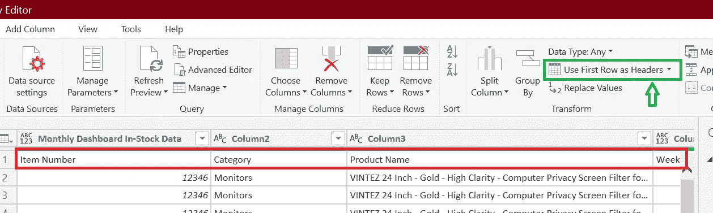
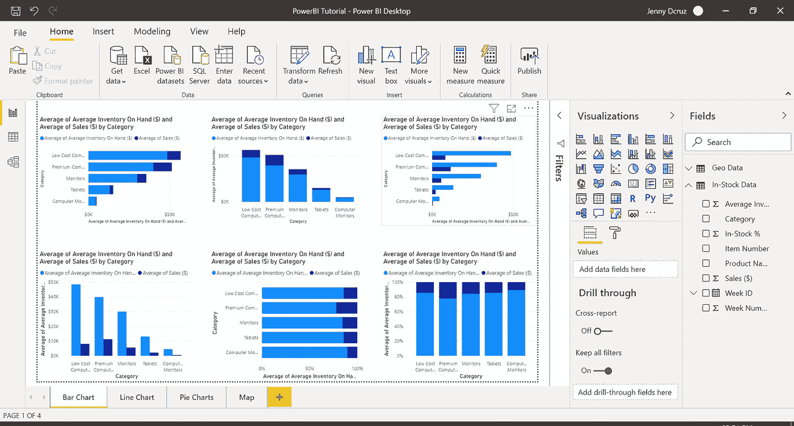
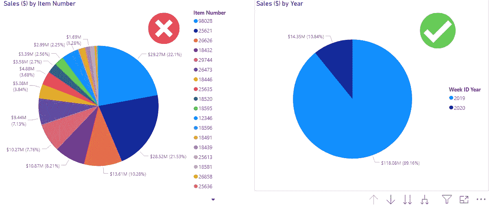
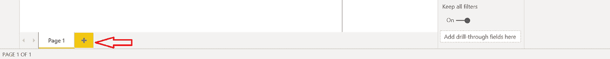
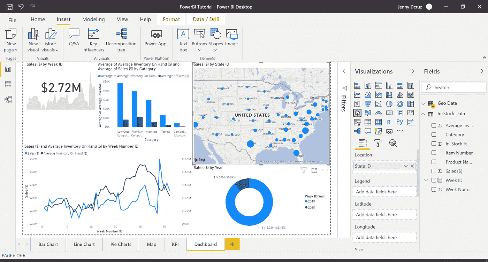
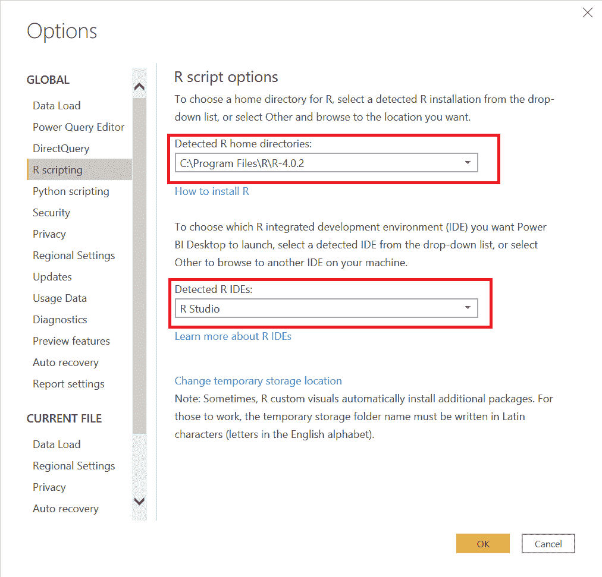
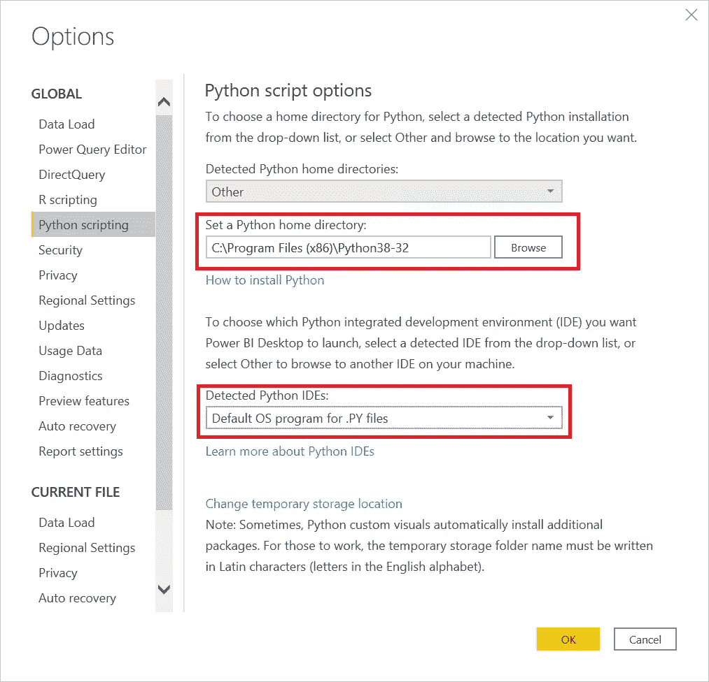

# 如何使用 Power BI 可视化数据？

> 原文：<https://towardsdatascience.com/how-to-visualize-data-using-power-bi-9ec1413e976e?source=collection_archive---------11----------------------->

## 使用 Microsoft Power BI 获得商业智能洞察。

卢卡斯·布拉塞克在 [Unsplash](https://unsplash.com?utm_source=medium&utm_medium=referral) 上的照片

# **什么是数据可视化？**

随着技术革命，数据从昂贵、难以查找和收集到丰富、廉价但难以理解。使用传统软件存储、理解和分析越来越大的数据量非常困难。然而，作为个人或组织，所有这些数据的好坏取决于我们能从中获得什么。这就是大数据发挥作用的地方。大数据用于预测分析、分析用户行为或其他数据分析流程，以给数据带来价值。然而，由于缺乏知识，这方面的原始细节仍然不确定。数据可视化有助于解决这个问题。

> 数据可视化是将数据转换为图表、图像、图形甚至视频的过程，这些数据可以解释数字，并让我们从中获得洞察力。

来自 giphy[的托尼·巴贝尔](https://giphy.com)

它使信息更加连贯，帮助我们从中创造价值，发现新模式，发现趋势。让我们举个例子:你如何向你的老板或客户解释 excel 电子表格中的大量数据行和列？创建相同数据的图表，如条形图、折线图、散点图等。这为原始数据赋予了意义和目的，现在您有了一个可视化的表示，您可以开始分析它并将其集成到您的业务中。这为许多企业和用户提供了清晰、可操作的计划洞察，让您始终保持领先地位。

# **什么是权力 BI？**

Microsoft Power BI 是一个数据可视化工具，允许您快速连接数据，准备数据，并根据自己的喜好对数据建模。它使您能够将所有数据转换为实时交互式视觉效果，创建定制的实时业务视图仪表板，从而提取业务智能以增强决策。您可以可视化数据并分享见解。该工具允许您将自定义可视化嵌入到您的应用程序或网站中，连接到数百个数据源，如 excel、google analytics、实时数据的物联网设备等。它将一切与您现有的专业环境方便地融合在一起，使您能够获得分析和报告功能。您可以发布这些报告，因此允许所有用户利用最新的信息。

你可以在这里阅读更多关于 Power BI [的内容。](https://docs.microsoft.com/en-us/power-bi/fundamentals/power-bi-overview)

现在，让我们使用 Power BI 并创建数据的基本可视化。

# **安装和设置**

下面列出了几种安装 Power BI 的方法:

1.  打开 Microsoft store，搜索 Power BI，然后单击 get 按钮安装它。
2.  您可以访问 [Power BI 桌面下载页面](https://powerbi.microsoft.com/en-us/desktop/)并选择免费下载选项。
3.  或者，您也可以通过登录并点击屏幕右上角的下载按钮，从 [Power BI service](https://powerbi.microsoft.com/en-us/landing/signin/?ru=https%3A%2F%2Fpreview.powerbi.com%2F%3FnoSignUpCheck%3D1) 网站免费下载 Power BI Desktop。

安装 Power BI Desktop 后，您现在可以访问 [Power BI 服务网站](https://powerbi.microsoft.com/en-us/landing/signin/)并登录您的帐户。如果您还没有注册，您可以向下滚动，使用您的学生或工作电子邮件地址免费注册。

作者图片

或者，如果您没有学生或工作电子邮件地址，您可以通过点击[此处](https://docs.microsoft.com/en-us/power-bi/admin/service-admin-signing-up-for-power-bi-with-a-new-office-365-trial)注册一个微软试用帐户。

安装 Power BI Desktop 后，让我们启动应用程序并探索应用程序的主要组件。

作者图片

**字段**:您可以在这里查看导入的数据及其字段。

**可视化:**此窗格由不同的视觉效果组成，您可以利用这些视觉效果来显示数据的独特可视化效果。

**发布:**使您能够将您的数据模型发布到您的 Power BI 工作区。

**获取数据:**允许您以 excel 文件、text/csv、xml 等格式导入数据。我们也可以从微软 Azure 或其他在线服务如谷歌分析、GitHub 等获取数据。

# **准备数据**

如前所述，“获取数据”选项允许您从不同的平台导入各种大小的数据。你可以从 [**这里**](https://github.com/jendcruz22/Medium-articles/tree/master/PowerBI%20Tutorial) 下载本教程的所有必要材料。

打开名为“SalesData.xlsx”的 excel 文件，从窗口左侧选择库存数据表，然后单击转换数据。这将把您带到超级查询编辑器。超级查询编辑器允许您浏览和转换数据。

太好了！现在我们已经加载了数据，让我们开始清理它。

作者图片

当我们查看库存数据文件时，我们注意到的第一件事是文件中的第一行以及第 9 列和第 10 列有空值。这样的值会降低我们模型的整体性能，所以让我们来清理一下。您可以通过分别选择“删除行”和“删除列”选项来删除行和列。

作者图片

一旦我们这样做了，我们可能会注意到数据的第一行实际上由我们的列名组成。因此，让我们通过选择“使用第一行作为标题选项”来改变这一点。

在超级查询编辑器中，单击“主页”部分左上角的“关闭并应用”,以确保我们的更改得到应用。

您甚至可以通过单击窗口左侧的数据视图图标来轻松更改列的数据类型。

清理我们的数据可能是一个漫长而乏味的过程。上面提到的是处理有一些明显异常的数据的一些基本方法，但是还有更多。在本教程的最后，你会发现我用来理解和学习 Power BI 及其功能的参考资料。

为了这个教程，我上传了一个“随时可用”的文件，名为“PowerBI Tutorial.pbix”。请参考上面的链接。一旦加载完毕，我们就可以开始有趣的部分了——可视化我们的数据。

# **创建报告**

在本教程中，我们将学习创建一些图表，并了解如何分析数据。

## **可视化:**

***条形图:*** 现在我们的数据已经加载，我们可以在屏幕右侧的字段窗格中查看它。我们可以从 visualization 窗格中选择所需的可视化，然后返回到 fields 窗格选择我们想要分析的数据。让我们从分析我们库存中的产品及其销售开始。选择平均现有库存($)、销售额($)和类别字段。

祝贺您在 Power BI 中创建了第一个图表！

此条形图比较了每个类别的平均库存总额和销售总额。然而，研究这个问题的一个合理的方法是比较我们库存的平均值和每个类别的平均销售额。我们可以通过在可视化窗格中将它的值从 Sum 改为 Average 来实现这一点。

使用相同的逻辑和字段，您可以从 visualization 窗格中拖放不同类型的条形图，并以堆积条形图、堆积柱形图、簇状条形图等形式显示数据，如下所示。

作者图片

***折线图:*** 让我们用折线图来可视化我们的数据。从“可视化”窗格中选择折线图，并从“字段”窗格中的地理数据中选择“销售”字段。将周 ID 拖放到可视化窗格的轴部分，如下面的视频所示。这向我们显示了相对于周 ID 的销售额。此外，我们还可以通过比较库存和销售额来了解产品的可用性。为此，请将“平均库存”字段拖放到可视化字段中的次轴部分。您也可以单击图表，然后从可视化窗格将其更改为面积图或堆叠面积图。

***饼图/圆环图:*** 饼图是众所周知的，但是当显示大量数据时，建议不要使用饼图，因为很难识别类别之间的微小差异。例如:清楚地确定哪个类别占用更多的面积。

作者图片

要创建饼图/圆环图，请选择饼图/圆环图可视化和适当的类别来显示数据，如下所示。

***地图:*** 你还可以用一张地图查看你在不同地方的销售情况。从可视化窗格中选择地球仪图标。现在选择所需的类别，即州 ID 和销售额。在分析一些类别时，图例非常有用。使用图例，我们还可以通过将类别字段拖放到图例部分来查看该州每个类别的销售额，如下所示。

***关键绩效指标:*** 关键绩效指标(KPI)是衡量公司绩效并评估其成功与否的指标。我们可以使用 visualization 窗格中的 card 或 gauge 选项在 Power BI 中显示这一点。使用 KPI 选项时，我们需要将周 ID 拖动到可视化窗格中的趋势轴上，以便查看 KPI 值背后的每周趋势。

**删除图表:**要删除图表，只需点击并按 delete 键。

**添加新页面:**要添加新页面，点击窗口底部的“+”图标。

作者图片

现在我们已经学会了如何可视化我们的数据，我们可以整合一切，并制作一个仪表板。

# **创建仪表板**

要制作仪表板，请将我们到目前为止创建的所有可视化效果复制粘贴到同一个页面上，如下所示。

作者图片

这基本上就是我们的仪表板。要创建此仪表板的移动视图，请单击“视图”按钮并选择“移动布局”。一旦你做到了这一点，你就可以随心所欲地将你的可视化效果拖放到手机屏幕上。

# **定制**

现在我们的仪表板已经准备好了，我们可以通过浏览 visualization 窗格的 Format 部分中的各种可用选项来配置我们的可视化。

# Power BI 中的 r 和 Python

在 Power BI 中包含 Python 和 R 是微软所做的最伟大的事情之一。Power BI 现在是使用不同库和机器学习包进行数据可视化的一站式平台。它允许您在不修改基础工具的情况下重塑数据。

## **用功率 BI 积分 R**

r 是一种用于统计计算和图形的语言和环境。我们可以使用 Power BI 中的 R 来分析我们的数据，以获得所需的结果。

**需求:**你需要在你的系统中安装 [R](https://cloud.r-project.org/) 和 [R studio](https://rstudio.com/products/rstudio/#rstudio-desktop) 以及其他必要的包和库。

作者图片

**设置:**点击 Power BI 窗口左上角的文件，选择“选项和设置”。转到 Options 下的 R scripting 选项，确保列出了包含 R 的文件夹的正确路径，并且检测到了 R studio IDE，如下图所示

**使用 R 脚本可视化数据:** R 为数据分析和可视化提供了一个惊人的平台。它允许您甚至在开始数据分析之前就将数据可视化。下面是一个数据可视化的例子，通过使用 R 脚本显示我们的销售频率。

## **集成 Python 和 Power BI**

Python 经常使用 matplotlib、Seaborn、Gleam、Plotly 等库进行数据可视化。Power BI 是一个我们可以集成和增强 Python 可视化的平台。

**需求:** [安装 Python](https://www.python.org/downloads/) 以及您将在系统中需要的其他必要的库和包

**设置:**点击 Power BI 桌面左上角的文件，进入选项和设置部分的选项下的 Python 脚本。确保 Python 主目录设置为 Python 在系统中的安装位置，如下图所示。

**使用 Python 脚本可视化数据:** Python 已经被用于数据可视化很多年了。像 matplotlib 这样的库有助于理解数据。虽然，当谈到快速方便地创建美观的图表时，Python 不是很有用。然而，当我们集成 Python 和 Power BI 时，我们获得了出版物质量的图表。下面的视频向我们展示了一个使用 Python 显示与周 ID 相关的销售额的实例。

# **保存和发布**

让我们回到我们的仪表板。现在我们已经有了一个可以发布的仪表板。

*   **保存你的工作**:进入 Power BI 桌面窗口左上角的“文件”，点击保存。您也可以使用“Ctrl + S”快捷键来保存您的工作。您还可以将您的作品导出为 PDF 或 Power BI 模板。
*   **发布:**进入 Power BI 桌面窗口左上角文件下的发布部分，点击“发布到 Power BI”。选择您的工作空间。点击“在 PowerBI 中打开 PowerBI Tutorial.pbix ”,在工作区查看您的报告。现在，您可以与其他人共享您的报告，也可以在您的工作区中编辑它。

**结论**

恭喜你完成了本教程！现在，您已经学习了 Power BI 中数据可视化的基础知识。在本教程中，我只介绍了几种类型的可视化，但是在 Power BI 中还有更多类型的可视化可供您探索。发挥创造力，以自己的方式可视化您的数据。

感谢你阅读我的文章，希望你喜欢。

## *参考文献:*

[1] Udemy，“微软认证:数据分析师助理 Power BI”:[https://www.udemy.com/share/1035gaBEISdFxVQ3s=/](https://www.udemy.com/share/1035gaBEISdFxVQ3s=/)

[2]微软的 Power BI 文档:[https://docs . Microsoft . com/en-us/Power-BI/fundamentals/desktop-getting-started](https://docs.microsoft.com/en-us/power-bi/fundamentals/desktop-getting-started)