# 如何用 Python 可视化数据中的隐藏关系 NBA 助攻分析

> 原文：<https://towardsdatascience.com/how-to-visualize-hidden-relationships-in-data-with-python-analysing-nba-assists-e480de59db50?source=collection_archive---------8----------------------->

## 使用交互式快照、气泡图和桑基图操纵和可视化数据，通过 Plotly 获得洞察力(代码和数据在我的 [GitLab repo](https://gitlab.com/jphwang/online_articles) 中)

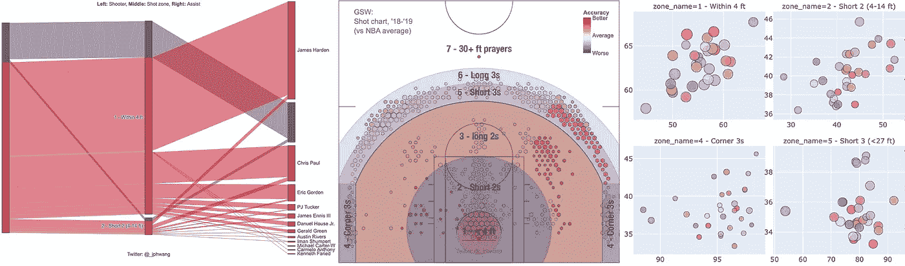

数据分析的一个非常基本的目标是理解数据中的**关系**。从简单的 Excel 图表到从事机器学习的数据科学家，这在每个分析层面都是如此。无论是预测一个值(回归)还是识别一个类型(分类)，目标都是发现输入和输出之间关系的本质。

正如你们中的一些人所知，我一直在修补篮球数据分析。我一直在研究的一个问题是，一个特定的统计数据，一个“辅助”，总体上表明了一个团队的什么。在这篇文章中，我分享了我的一些分析和输出，用来深入了解这种辅助其他绩效指标之间的关系。

尽管这个例子是专门针对篮球的，但一般的过程和可视化应该适用于其他领域，适用于他们自己的数据集。关于篮球的讨论也只是有限的，只是在解读结果的背景下，所以不要让领域知识的匮乏太让你担心。

> *我在我的*[*git lab repo here*](https://gitlab.com/jphwang/online_articles)*(****basketball _ assists****目录)中包含了这个的代码，所以请随意下载并使用它/对它进行改进。*

# 在开始之前

## 数据

我将代码和数据包含在我的 repo 中，所以如果您愿意，您应该能够通过下载/克隆 repo 来轻松地跟进。

## 包装

我假设您熟悉 python。即使你相对较新，这个教程也不应该太难。

你需要`pandas`、`plotly`和`statsmodels`。用一个简单的`pip install [PACKAGE_NAME]`安装每一个(在您的虚拟环境中)。

# 问题:助攻…有帮助吗？

在篮球比赛中，如果队友的一次传球[导致得分](https://en.wikipedia.org/wiki/Assist_(basketball))。因此，从定义上来说，助攻只是抓住了球员得分的机会。

所以，我想回答的问题是这样的:*助攻好不好？*

助攻能捕捉到一个球队获得好的*得分机会*的频率吗？数据告诉了我们什么？(*注:有些* [*现代统计学*](https://stats.nba.com/players/passing/) *已经开始捕捉‘潜在’助攻只是为了这个目的，对于这个讨论忽略它。*)

让我们开始吧。我首先回顾了投篮命中率与助攻的关系。在我们开始之前，也许简单回顾一下背景会更方便。

## 概述

在之前的文章中，我讨论了使用 Plotly 生成拍摄图。在其中，我们生成了图表，利用球场上的彩色六边形来显示射门位置、频率和准确度。

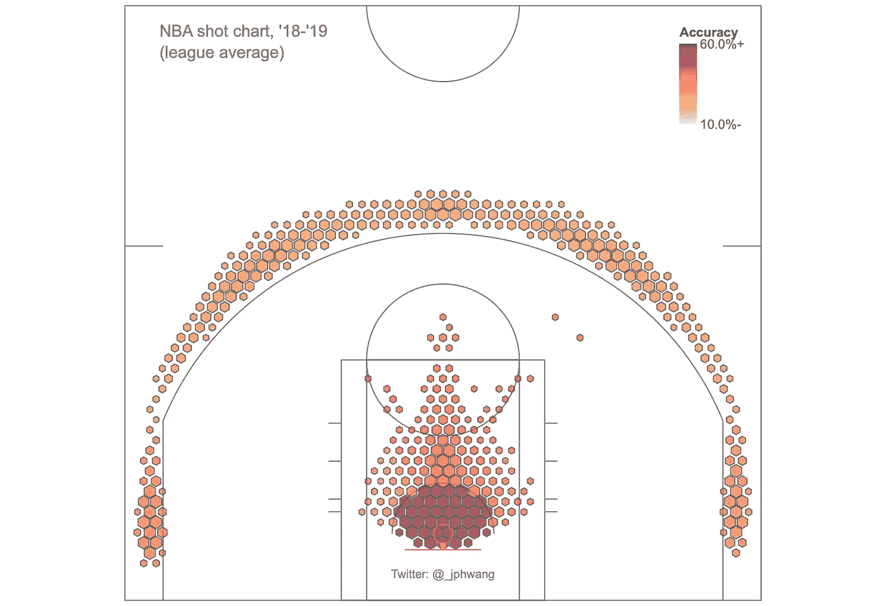

在该图中，标记位置显示了击球位置、与频率相对应的大小以及与该区域的击球准确度相对应的颜色(球场被划分为区块或“区域”以消除差异)。

> 我做了一些小的改动，但是在这里包含了代码和底层函数，所以您不必重新创建它们。(*一如既往，我还包括了本文中使用的所有数据文件。*)

我们能在地板上绘制类似的辅助率吗？

## 制图辅助费率

令人欣慰的是，这可以很容易地完成，同时循环大部分代码，并用由`assisted_shots / total_made_shots`计算的辅助百分比来代替投篮命中率。

我已经预先计算过了，所以您可以简单地加载数据并运行以下程序:

这会产生:

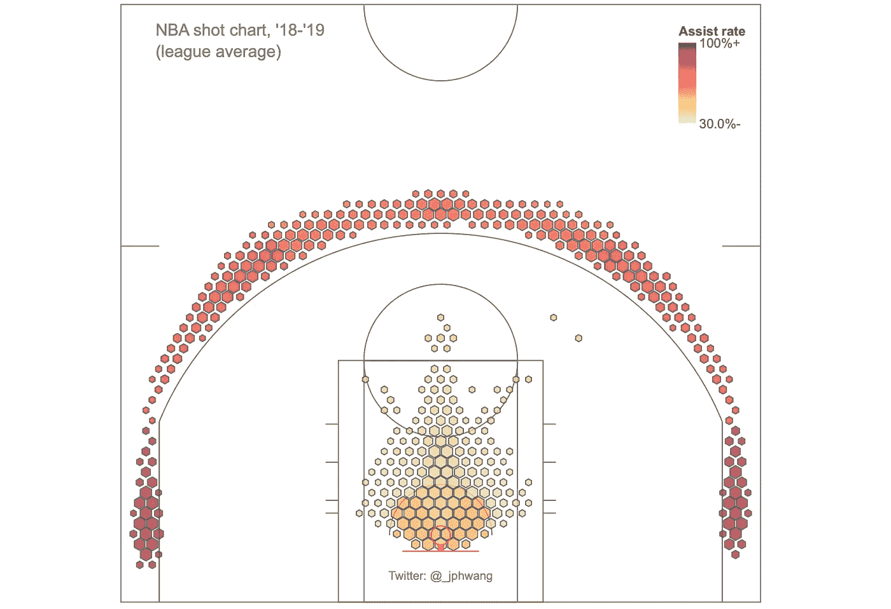

NBA 投篮排行榜——由助攻率着色

真有意思！助攻率在角落最高(大约 95%)，在篮筐周围相当低，特别是当我们开始远离篮筐时，助攻率下降到大约 40%。

但这并不能真正说明相关性。事实上，并排观察会发现这些比率是*反比*相关的(请看下文)。具有最高精度的区域实际上具有最低的绘制辅助率。这是因果关系吗？助攻*对球队不好*吗？

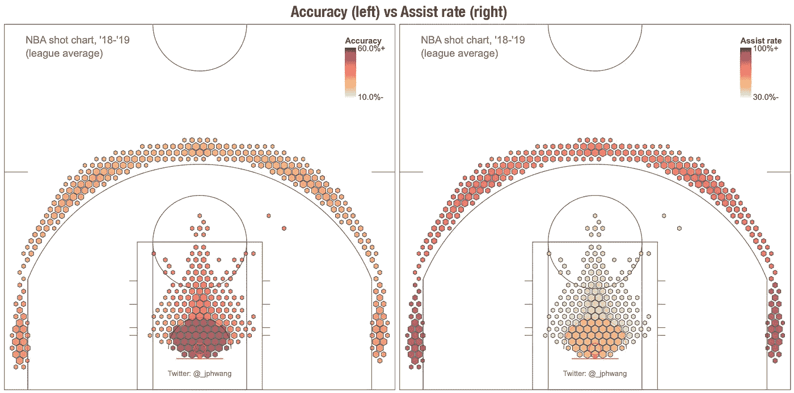

这是否说明了逆相关？还是我们忽略了其他因素？

无论从直觉上还是逻辑上，这似乎都不成立。视觉效果有误导性。原因是这些精度比辅助率更能影响射击位置。如果我们不看联盟范围的数据，而是看单个球队的数据，看看助攻率的变化对球队投篮命中率有什么影响？

## 散点图有助于理解精确度与辅助率的关系

为了进行这种分析，我们需要来自各个团队的数据。Basketball-reference.com 通过收集球队、球员和比赛的统计数据让这变得非常容易。由于我们将处理 18-19 赛季的投篮数据，我从篮球参考[这里](https://www.basketball-reference.com/leagues/NBA_2019.html)收集了球队数据。

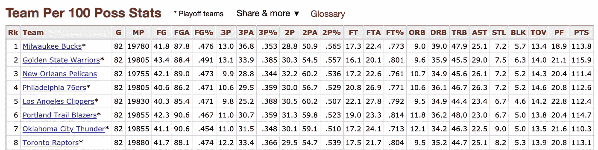

2018/2019 赛季球队每 100 分统计(basketball-reference.com)

在使用统计数据时，重要的是针对给定的目标或背景使用正确的数据。我在这里使用了每 100 分的控球统计数据来标准化球队速度的影响，这可能会稍微扭曲我们的数据(虽然不是真的，因为我们在看比率)。

散点图很简单，在我看来，它仍然是获得数据和任何相关性的最好方法之一。让我们就这么做吧，标绘准确性(投篮命中率%)对每 100 次助攻，这捕捉到了以助攻结束的控球率的%。

提醒一下，我们使用 Plotly Express 中的 scatter `function`,其中的语法基本上是传递一个数据帧，各种参数作为与该数据帧中的列名匹配的字符串传递。

所以`px.scatter(per100_df, x=’AST’, y=’FG%’`让 Plotly 知道 X 数据应该来自‘AST’列，Y 来自‘FG %’列。其余的就不言自明了。

我们还使用 Plotly 在这里添加了一条趋势线。(这就是`statsmodels`包装的目的。)，有一条简单的线性趋势线([点击这里了解更多信息](https://plot.ly/python/linear-fits/))。

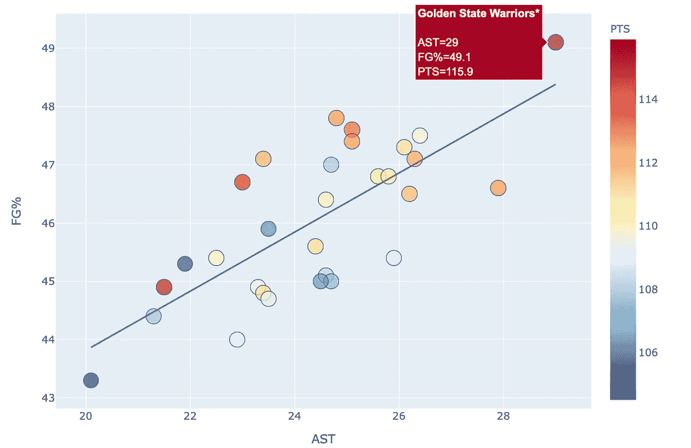

可视化精确度和辅助之间的相互关系

哇，这看起来像是助攻/100 和投篮命中率之间的一个很好的关联图。从直觉上看，这也是明智的。因为球的移动速度比防守者快，好的传球能更好地找到当时防守不严密的球员。所以，一个记录更多助攻的球队提供更多好机会是有道理的。

(如果你想知道表示 100 分的颜色，那是因为离群值(you 印第安纳)比其他人投了更多/更少的 3 分。)

如果我们进一步深入细节，查看数据，在法庭上分成不同的区域，会怎么样？

## 将数据细分为区域

还记得我们说过法庭被分成了几个区域吗？在这个分析中，我们使用简化的区域，这些区域主要基于距离，忽略了方向。

所以，法庭被分成七个区域，或者说地带，就像这样:

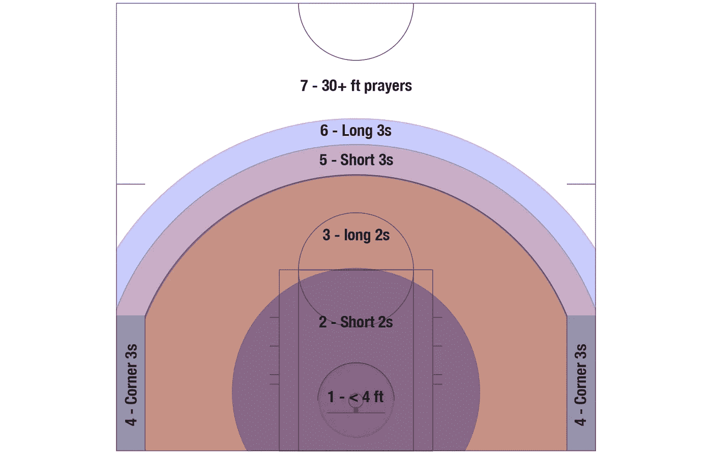

我的分析中定义的射击区域

通过将每一次投篮分配到这些区域中的一个，可以进行与上面相同的分析，以查看助攻在每个区域中的影响。由于团队数据不容易提供这个集合，我们将操纵数据框架并自己创建它。

从单个镜头的数据库开始，我已经用一个区域对每个镜头进行了编码，我们创建了一个数据帧，其中每行对每个队的一个区域的信息进行编码。

在这里，我循环遍历每个团队名称，按区域整理它们的数据，并通过在区域名称内再次循环，将每个区域的每个数据分配给一个新条目。每个条目都作为一个字典对象保存到一个列表中，然后被转换成一个数据帧。*(如果你不确定发生了什么，这里有* [*熊猫的文档。groupby*](https://pandas.pydata.org/pandas-docs/stable/reference/api/pandas.DataFrame.groupby.html) *方法，以及* [*熊猫。DataFrame*](https://pandas.pydata.org/pandas-docs/stable/reference/api/pandas.DataFrame.html#pandas.DataFrame) *功能。)*

这些数据现在可以绘制出来了——这是我之前准备的，使用了:`fig = px.scatter(flat_summary_df, x=’assist_pct’, y=’shots_pct’, color=’zone_name’, hover_name=’teamname’)`和一点格式。

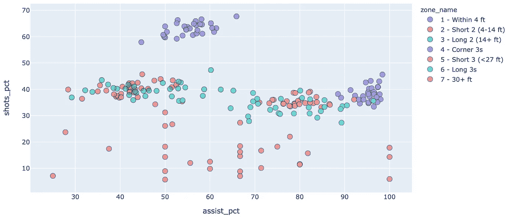

投篮命中率与助攻，按区域。

每组彩笔包括 30 个图形，每个队一个。你自己看看吧。这些标记中的许多组并没有表现出太多的相关性，但是一些明显地表现出相关性。其他一些事情也很突出/

我们现在称之为“中距离”投篮的红色和绿色轨迹显示，他们的助攻百分比最低。这可能是因为它们相对不受欢迎，因此犯罪不是为这里设计的，因此它们通常是后备选项。

紫色角落的 3 分是最理想的投篮之一，所以他们有很高的助攻率是有道理的。

底部一组 30 多英尺的照片非常分散——但考虑到它们来自最远的距离，它不会显得太不协调。由于这些投篮的低命中率，我们预计结果会有更大的差异，而且这些球队中的一些平均起来会更频繁地远距离投球。

但是从内部拍摄的照片显示了很好的线性度，可能在弯道 3 也是如此。为了更好看。实际上，让我们把它们都分离出来，单独看一下。

此外，我们将根据球队名称给他们上色，并根据每个区域的射门频率来调整大小。这样，我们也可以看到一个队从每个区域投篮的频率。

到目前为止，您(希望)已经熟悉了 Plotly Express 的'`scatter`'功能。由于使用了 facet 特性并进行修改，所以这有一点不同，所以让我们一步步来。

参数`facet_col`指定应该使用哪个类别变量来分隔这些图形，以及`facet_col_wrap`一列中有多少子情节。

通常，在这些图形中，您会为子图形使用相同的轴范围，以允许图形之间更公平的比较，因为改变比例会导致视觉上的误解。

然而，我们已经从整体上看了上面的数据。此外，我发现缩放通过将数据聚集在一起模糊了对数据的理解。

因此引入了`update_xaxis`和`update_yaxis`方法来取消轴对齐。当我们这样做时，我要确保每个轴都显示在图上，以避免误解。生成的图表如下所示*(对图表进行调整，但请记住，在轴不共享但可能被误解的情况下，您应该小心对齐图表)*:


射击精度与助攻，由支线剧情中的区域。

显然，一些区域在助攻百分比和投篮命中率之间显示出比其他区域更好的相关性。这可能说明了几件事:

一个是助攻可以帮助创造好的投篮，第二个是当我们离篮筐越远，射手的能力就成为更大的因素。

在篮筐周围，简单地创造好机会可以让球员轻松上篮和扣篮。这种影响随着距离的增加而减小，但是我们可以看到在 3 秒角时增加辅助速度的影响。

然而，当我们看到规则 3s 时，这种影响是微小的，长 3s 分布看起来像一个经典的随机分布，这里显示的是零相关。

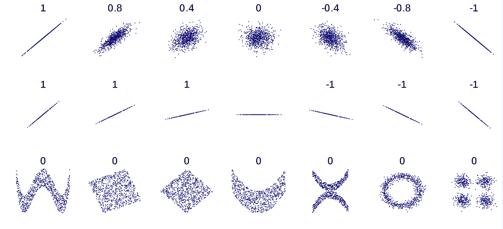

[维基百科关于分布形状&相关系数的入门](https://en.wikipedia.org/wiki/Correlation_and_dependence)。

我们能回到过去，看看篮球场上的数据吗？是的，我们可以。

## 通过拍摄图表进行关联

请记住，我们不能获得一个伟大的想法之间的投篮命中率和助攻以上。这是因为我们只是在观察绝对值，而不是一个变化对另一个变化的影响。

如果我们针对一些球队在球场上的相对助攻率和联盟平均值绘制相对准确度的图表会怎么样？

在我以前的文章中，我们看到了如何通过从相对值(球队数据)中减去基础值(联盟数据)来绘制相对准确度。在这里，我们简单地对`‘ass_perc_by_hex’`做同样的事情。为了避免重复，我在这里省略了代码——如果你想看完整版，可以看看我的 git repo。

绘制相对于助攻率的准确性图表，作为相对于联盟平均水平的相对值，我们为勇士和骑士生成了以下图表:


相对精度与辅助率，GSW 18-19

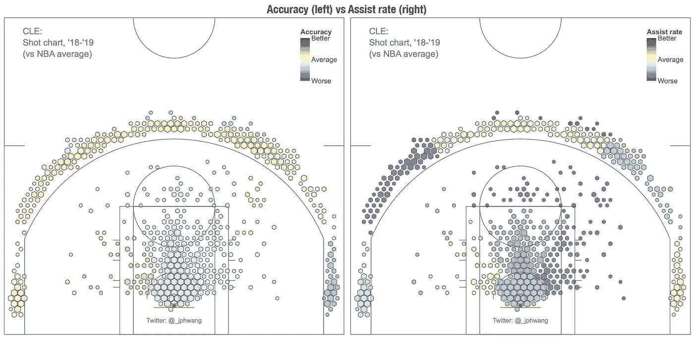

相对精度与辅助率，CLE 18-19

看一下内部的统计数据，和弯角，我们在上面看到了相关性相对较好。在这里仍然如此。

离篮筐越远，随机性的作用越大，球员能力的影响也越大，而不仅仅是在正确的地点和正确的情况下得到球。因此，这种相关性较弱，尽管它似乎仍然存在。

*(为了让外线投篮更加稳定，必须对球员的能力进行标准化处理。)*

最后，我想想象一下这些帮助来自哪里。我们将深入研究一些([喜欢 Plotly](https://plot.ly/python/parallel-categories-diagram/) )所谓的平行类别图，这类似于流量图，或桑基图。

## ParCat / Sankey 图

这些图最初被设计用来显示流动，例如液体或材料的流动。因此，他们很擅长展示关系。每一个篮筐都与投篮的球员、协助比赛的球员(有时甚至没有)以及投篮的位置有关。

使用 Plotly 很容易生成人造镜头的平行类别图:

```
teamname = 'HOU'
team_df = shots_df[shots_df.team == teamname]# Simple ParCat plot
fig = px.parallel_categories(team_df[team_df.shot_made == 1], dimensions=['player', 'shot_zone', 'assist'],
                color_continuous_scale=px.colors.sequential.Inferno,
                labels={'player':'Shooter', 'shot_zone':'Shot location', 'assist':'Assist (if any)'})
fig.show()
```

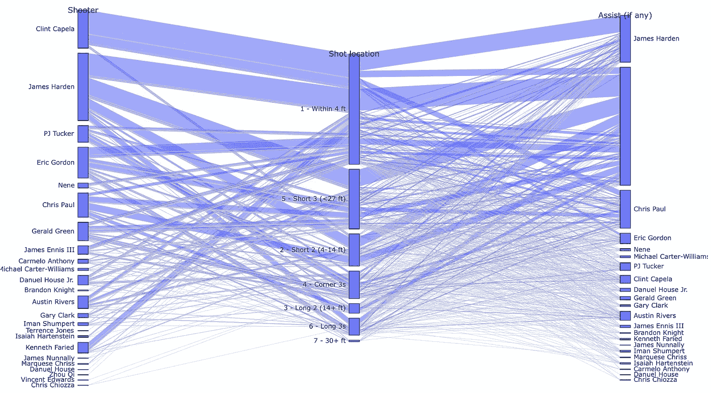

我的第一个平行分类图

这看起来令人印象深刻，但很难看出发生了什么。也许我们应该通过计数来组织左侧和右侧，并根据射门是否被辅助来给条形着色。

要按计数对数据帧进行排序，我们可以使用 pandas 的`pd.factorize`函数，提取计数，按计数排序，然后根据行顺序创建一个新的数据帧。

```
i, r = pd.factorize(makes_df['assist'])
a = np.argsort(np.bincount(i)[i], kind='mergesort')
makes_df = makes_df.iloc[a]
```

颜色可以用任何一种 Plotly Express 来分配，虽然我是用常规的`plotly.graph_objects`来分配。

除了格式化对象之外，代码的主要部分如下(完整函数& call 见 repo):

现在为几个玩家绘制这些，作为例子:

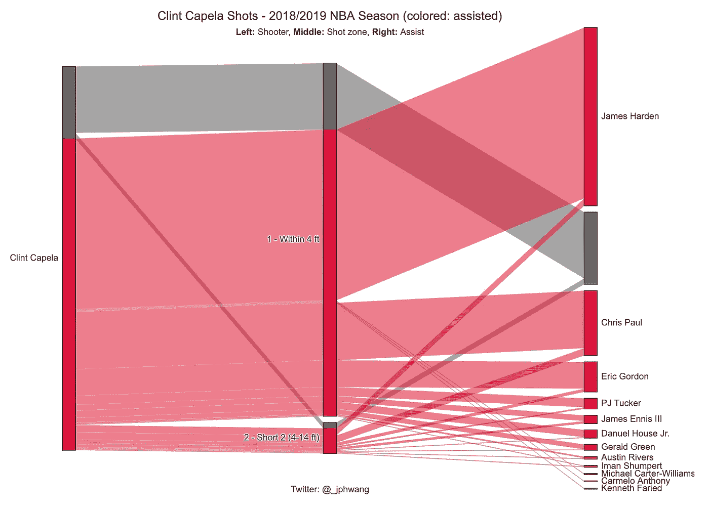

克林特·卡佩拉在 2018-19 赛季的投篮

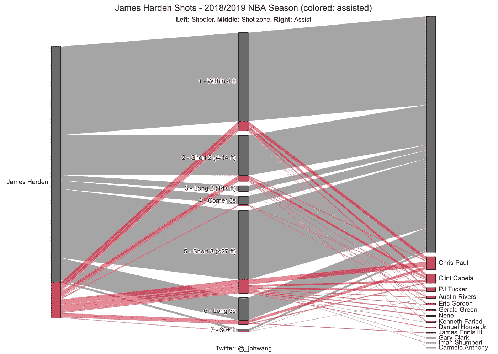

詹姆斯·哈登在 2018-19 赛季的投篮

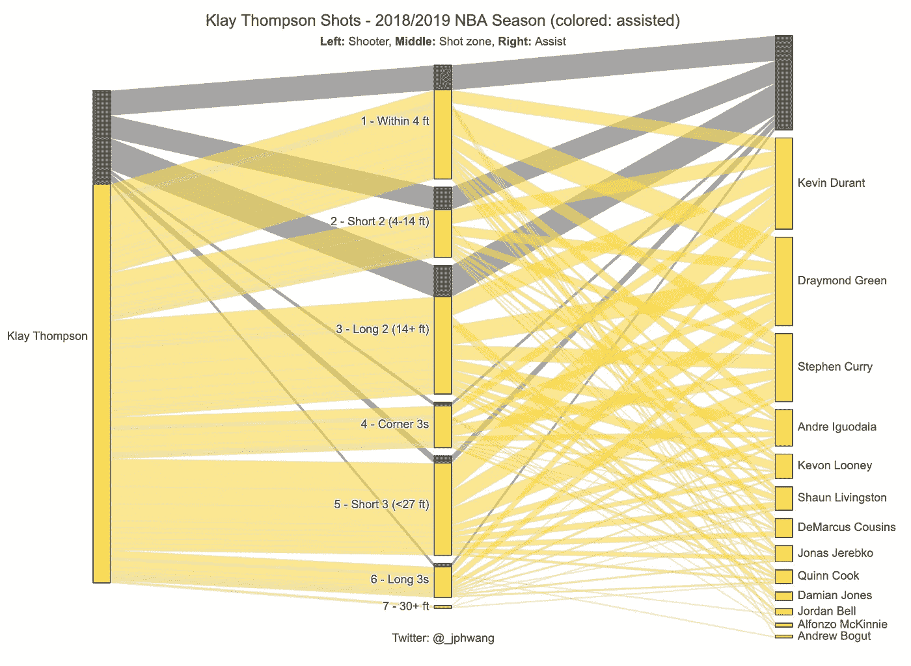

克莱·汤普森在 2018-19 赛季的投篮

我们可以立即看到球员的投篮有多少被助攻，他们喜欢从哪里投篮，他们在每个区域的投篮有多少被助攻，以及他们最有成效的合作伙伴在哪里。

上面的图表立即向你展示了卡佩拉的投篮有多少被助攻，以及哈登在卡佩拉的得分中发挥了多大的作用。

接下来的两张图表显示，尽管哈登和克莱·汤普森都是不可思议的射手，但他们的得分风格却大相径庭。汤普森的大部分投篮来自传球，而哈登几乎所有的投篮都是绝对创造的。

该图表可以扩展到显示整个团队:

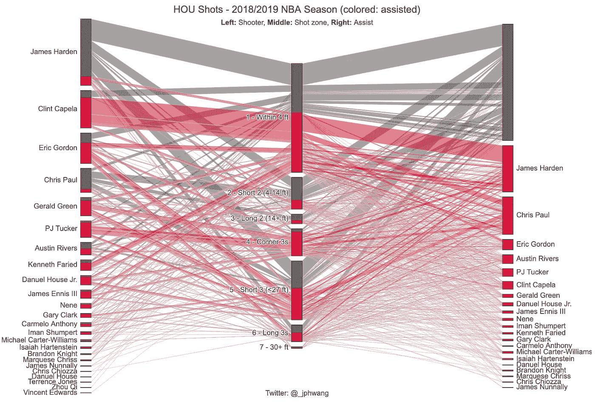

休斯顿火箭队在 2018-19 赛季的所有投篮

在 18-19 的火箭队，哈登和克里斯·保罗(在某种程度上还有奥斯汀·里弗斯)是唯一一个创造自己投篮机会的人。火箭队的大多数中距离投篮都是独立完成的，即使在这种复杂的布局下，卡佩拉-哈登的联系也是显而易见的。

正如你所看到的，我们已经在几个图表中发现了很多 NBA 各种统计数据之间的关系。作为一个额外的好处，Plotly 的交互性意味着您可以简单地悬停在数据点上并获得进一步的见解，这可能不容易获得，或者需要创建额外的图表或注释。

尽管这个例子与篮球数据有关，但我毫不怀疑这些例子同样适用于其他运动或任何其他数据集。这里的重点是调查各种数据列之间的关系的性质，这些图表使我们能够做到这一点，而无需构建或训练复杂的模型。

请下载数据和代码，玩一玩，用你自己的数据集构建类似的东西。我很想听听你的经历或评论！

如果你喜欢这个，比如说👋/在 [twitter](https://twitter.com/_jphwang) 上关注，或关注更新。我还写了一篇关于用 Plotly 可视化篮球数据的文章，如果你以前没有读过，这可能对本文有所帮助。

[](/interactive-basketball-data-visualizations-with-plotly-8c6916aaa59e) [## 用 Plotly 实现交互式篮球数据可视化

### 用 hexbin shot 图表分析体育数据，用 Plotly 和 Plotly Express 分析气泡图(源代码&我自己的数据…

towardsdatascience.com](/interactive-basketball-data-visualizations-with-plotly-8c6916aaa59e) 

这是我最喜欢的数据可视化书籍:

[](/create-impactful-data-visualizations-with-these-books-ca9fbfecfde5) [## 用这些书创建有影响力的数据可视化

### 如果没有交流，好的分析没有什么意义。数据可视化会有所帮助。以下是我对…的建议

towardsdatascience.com](/create-impactful-data-visualizations-with-these-books-ca9fbfecfde5)