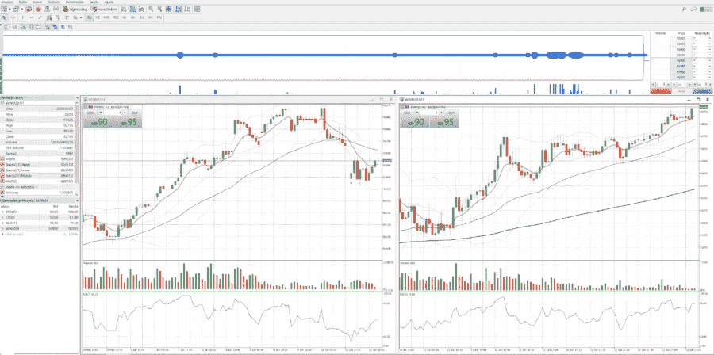
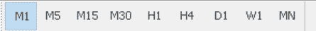
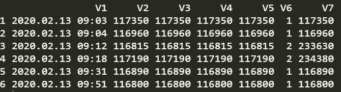
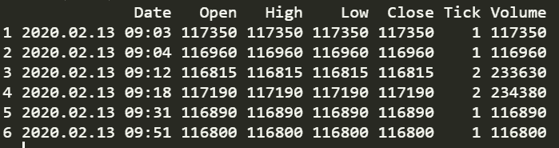
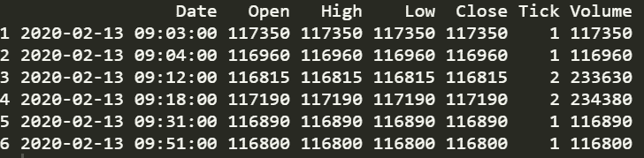
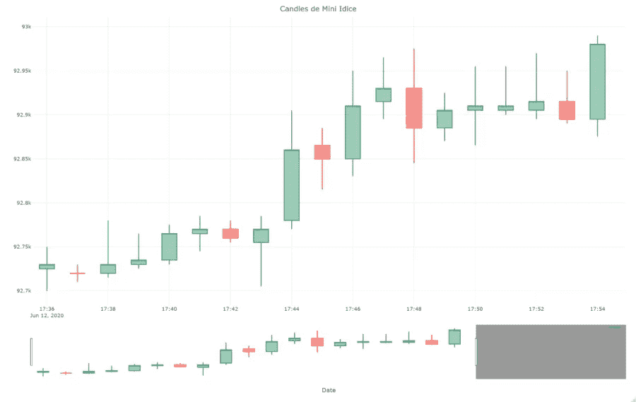

# 如何使用 Plotly 和 R 可视化高频金融数据

> 原文：<https://towardsdatascience.com/how-to-visualize-high-frequency-financial-data-using-plotly-and-r-97171ae84be1?source=collection_archive---------36----------------------->


照片由[尼克·钟](https://unsplash.com/@nick604?utm_source=medium&utm_medium=referral)在 [Unsplash](https://unsplash.com?utm_source=medium&utm_medium=referral) 拍摄

## 关于如何使用 Plotly 软件包从真实资产数据创建烛台图表的分步指南。

在本文中，我将展示如何使用 Plotly 软件包，通过 r 可视化高频率的金融数据。为了执行分析和开发交易算法，有必要以非常高的频率获取数据，以便能够采取快速而准确的行动，最大限度地提高交易中获得的利润。

今天，在美国证券交易所进行的超过 40%的操作是由机器人进行的，这些机器人被编程来分析市场，并根据市场指标进行买卖。今天我们将学习如何从被日内交易者广泛使用的名为“迷你指数”的巴西资产数据中创建蜡烛图。

# 收集数据

有几种方法可以从交易所收集高频数据。但是今天，由于我们不会实时分析数据，我们将使用 Metatrader 收集数据，这是一个用于进行自由交易的工具，可以进行资产的购买和出售。

第一步是打开工具并选择我们想要从中收集数据的资产。在我们的例子中，现在是 6 月，该月的迷你指数资产是 WINM20。



Metatrader 快照—按作者分类的图片

选择资产后，我们选择图表的时间框架。请选择一分钟的时间，以便我们可以在几秒钟内收集数据。



Metatrader 快照上的时间范围—按作者分类的图像

之后，点击文件并保存。资产数据将保存在中。csv 格式。
准备就绪，数据采集完成！我们去数据处理吧！

# 导入和分析数据

我使用 R，一种强大的免费统计编程语言，以及一些图形库来执行我的分析。打开 RStudio 后，我创建了一个. RScript 文件。

我们从导入必要的库开始

```
library(plotly) #para plotar os gráficos
library(xts) #para trabalhar com dados de séries temporais
library(tidyverse) #jeito magnífico de trabalhar com dados
```

然后，我们导入名为“WINM20M1.csv”的资产数据

```
data <- read.csv("WINM20M1.csv", header = FALSE, sep = ",", fileEncoding = "UTF-16LE", dec = ".")head(data)
```



快照—数据。框架—作者提供的图像

我们看到七个还没有名字的变量。因此，我们使用 OHLC 标准(开盘、盘高、盘低、收盘)创建一个带有变量名称的向量，并将该向量赋给 data.frame 列的名称。

`colnames_ <- c("Date", "Open", "High", "Low", "Close", "Tick", "Volume")`

```
colnames(data) <- colnames_head(data)
```



快照-数据帧-作者提供的图像

既然我们已经对数据进行了适当的重命名，我们需要将变量 Date 的类型改为 Date。但是在改变它之前，我们必须改变字符串来替换“.”按照“-”号。

```
data$Date <- gsub("\\.", "-", data$Date)data$Date <- as.POSIXct(data$Date)head(data)
```



快照-数据帧-作者提供的图像

好了，现在是数据可视化。

# 可视化数据

最后，为了可视化数据，我们使用了 Plotly 库，它非常适合这种类型的任务。首先，我们创建一个 fig 变量来存储我们的图表。我将只用最后 20 分钟，这样视觉效果不会太密集

```
fig <- tail(data, 20) %>%
  plot_ly(x = ~Date, type = "candlestick",
          open = ~Open, close = ~Close,
          high = ~High, low = ~Low)
fig <- fig %>% layout(title = "Candles de Mini Ídice")fig
```

瞧啊。



plotly-R-股票市场-快照-作者图片

问题或意见，请联系！抱抱！不要忘记订阅我们的时事通讯，接收有关数据科学、数学和金融的每周内容。