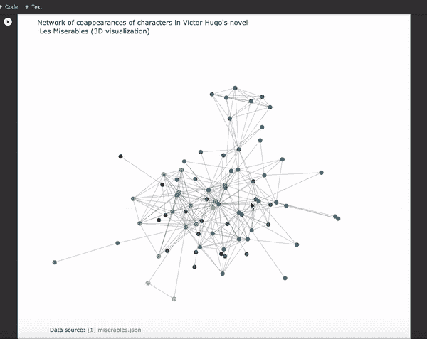
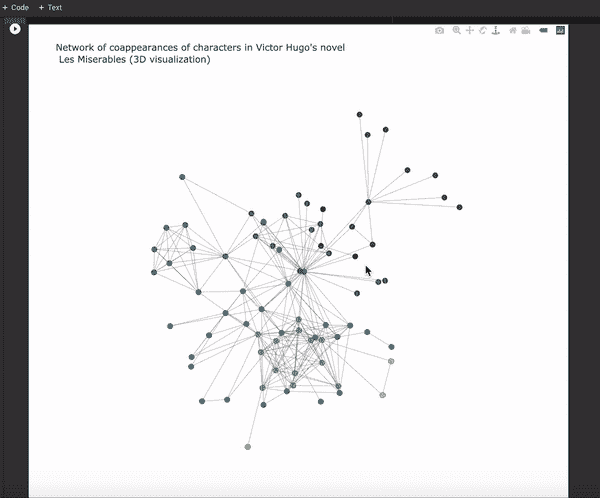

# 如何用 Python Plotly 可视化交互式 3D 网络

> 原文：<https://towardsdatascience.com/how-to-visualize-interactive-3d-network-with-python-plotly-4ef6989d83cc?source=collection_archive---------26----------------------->

## 关于 Google Colab — 2020 更新版


照片由 [JJ 英](https://unsplash.com/@jjying?utm_source=medium&utm_medium=referral)在 [Unsplash](https://unsplash.com?utm_source=medium&utm_medium=referral)

在这个数据的黄金时代，数据素养是[最受欢迎的技能之一。每家公司都在试图收集更多的数据，数据集现在很容易(而且越来越容易)在线提供给公众，各种软件正在以巨大的速度产生数据。](https://www.dataiq.co.uk/articles/articles/the-importance-of-data-literacy-in-the-workplace)

由于这种现象，可视化和理解所有这些数据的能力(数据素养)[现在是一种无价的技能](https://hbr.org/2020/02/boost-your-teams-data-literacy)。根据《哈佛商业评论》的焦点小组研究，人们缺乏的两项技能是:

> -创建易于理解的可视化效果，以便领导了解结果
> 
> -讲述一个故事，帮助决策者看到全局，并根据分析结果采取行动

在本指南中，我将使用 [Google Colab](https://colab.research.google.com/notebooks/intro.ipynb) 演示如何从头开始设置和创建您自己的 Python 脚本，以便您可以可视化您自己的 3D 网络。如果你对 Plotly 提供的内容有兴趣，请查看这些链接——[链接](https://plotly.com/python/)和[链接](https://neptune.ai/blog/plotly-python-tutorial-for-machine-learning-specialists)。

本指南改编自 Plotly 的[官方指南](https://plotly.com/python/v3/3d-network-graph/)。我对该指南所做的更改:

*   修正了一些给我错误的代码
*   从指南中删除了一些不必要的冗长代码，以便于理解

这些就是我认为写一个新的 2020 更新版本可能会有帮助的原因(这里是 [Google Colab 链接](https://colab.research.google.com/drive/1uLNdjmJMcriJdcROBWNGkQR05jHHdeq9?usp=sharing))。这是最终的可视化效果:



Les Mis 数据集来自[链接](https://bost.ocks.org/mike/miserables/miserables.json)，Gif 由作者创建

我强烈建议查看数据集，这样我们就知道 json 数据是什么样子的。在数据科学项目中，您可能会遇到的最常见的错误/缺陷之一是在处理数据之前没有将数据整理成正确的形状或形式。

如果你想写一些快速脚本，我强烈推荐使用 Google Collab。已经安装了许多公共库，所以您可以直接导入它们。对于需要安装的库/包，只需使用！pip 命令并运行它来获得这些库，如下所示:

```
!pip install python-igraph!pip install chart_studio
```

成功安装后，我们现在将导入库，然后查看导入的数据:

第 13-15 行与他们的官方指南略有不同，因为当我试图遵循他们的指南时，我得到了错误，所以我使用了 urllib.request.urlopen。

```
print(data.keys()) //returns dict_keys([‘nodes’, ‘links’])
```

我们将打印数据键，只是为了显示数据对象的键是什么样子。

```
print(N) //returns 77
...
print(data['nodes'][0]) //returns {‘name’: ‘Myriel’, ‘group’: 1}
```

有 77 个节点，我们将打印第一个节点，看看它是什么样子。

数据集的快速解释—因此每个节点都有一个“名称”标签，并属于某个“组”(不同的组用不同的颜色表示)。链接就像从“源”到“目标”的每个节点之间的边，具有特定的值。

接下来，我们将使用 kk 布局创建图形，然后准备 Xn、Yn、Zn 和 Xe、Ye、Ze。

印刷品:

```
IGRAPH U--- 77 254 -- 
+ edges:  
  0 --  1  2  3  4  5  6  7  8  9 11  
  1 --  0  
  2 --  0  3 11  
  3 --  0  2 11
...
```

*注意:写…是为了替换剩余节点的长列表*

```
[[-0.547629032126533, 3.63383245493983, 2.9142413409773], [0.9167084013128767, 4.0198261702945475, 4.588913666431853], [-0.6094374124799637, 3.772671804410202, 1.7708885944486699]] 
[(1, 0), (2, 0), (3, 0)] 
['Myriel', 'Napoleon', 'Mlle.Baptistine'] [1, 1, 1] [0.9167084013128767, -0.547629032126533, None] 
[4.0198261702945475, 3.63383245493983, None] 
[4.588913666431853, 2.9142413409773, None]
```

我花了一段时间才弄明白为什么我们必须在第 31–33 行的边上添加 None。事实证明，这是因为如果我们不传递 None，Plotly 将在其他两个轨迹之间连接第三个轨迹(线)。要了解更多，请查看这个[链接](https://stackoverflow.com/questions/42301481/adding-specific-lines-to-a-plotly-scatter3d-plot)。

最后，我们绘制节点和边的散点图，然后显示下图:

结果如下:



Les Mis 数据集来自[链接](https://bost.ocks.org/mike/miserables/miserables.json)，Gif 由作者创建

本教程到此为止，感谢您的阅读和…

快乐的数据可视化！ʕ•́ᴥ•̀ʔっ