# 如何可视化 KPI 进度—包含 3 个衡量指标的项目符号图

> 原文：<https://towardsdatascience.com/how-to-visualize-kpi-progress-bullet-graph-with-3-measures-ed40598643e7?source=collection_archive---------16----------------------->

## Tableau 分步指南

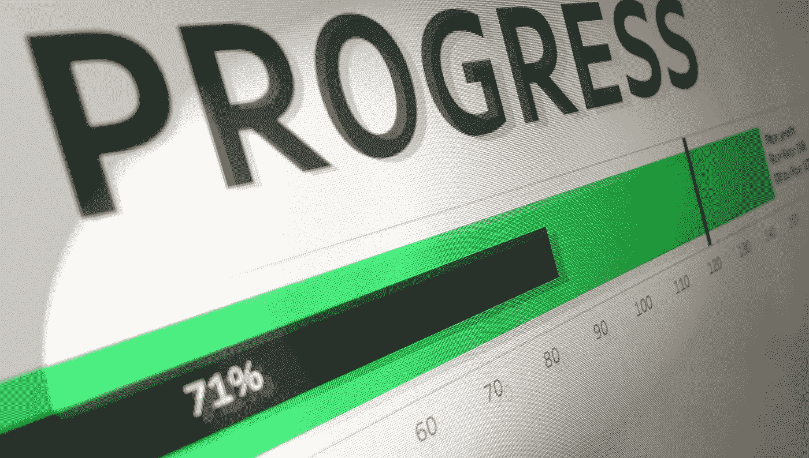

Kiril Yunakov 的[公共画面页面。](https://public.tableau.com/profile/kiril.yunakov#!/vizhome/KPIProgress/KPIDashboard?publish=yes)

答几个月前，我受命为我的团队创建一个新的仪表板，目的是查看几个关键绩效指标与我们的计划和预测相比的状况。这就是我如何找到项目符号图表类型，并为我们的业务案例做了一些修改。我相信，特别是如果你是一个 Tableau 的新用户，通过这篇教程你将能够学习和理解 Tableau 的基本原理，以及如何快速调整你的可视化效果。

## 为什么这个项目符号图有点特别？

简而言之，因为它允许您从 3 个角度(3 种不同的度量)比较特定的维度:

*   **实际表现**(你已经完成了多少)
*   **计划/目标绩效**(你需要完成多少)
*   **预测**

此外，在 Tableau 中，默认情况下您可以 ***而不是*** 从预定义的选项中构建这样一个图表，因为它们只允许您使用 2 个指标，而在我们的示例中，我们需要 3 个指标(实际、计划&预测绩效)。

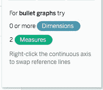

从 Tableau 的“演示”菜单中。

## 使用此自定义项目符号图，您可以回答一些业务问题:

1.  到今天为止，根据计划，我们进展如何？
2.  如果我们保持同样的速度，月底我们会在哪里结束？

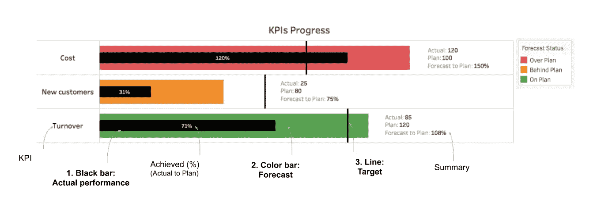

Kiril Yunakov 的[公共画面页面。](https://public.tableau.com/profile/kiril.yunakov#!/vizhome/KPIProgress/KPIDashboard?publish=yes)

*   **复杂程度:** *初学者*
*   **完成时间:** ~5 分钟。
*   **需求:**格式化数据， [Tableau 公共/桌面](https://public.tableau.com/en-us/s/download)

## 步骤 1: **数据角力**

这可能是关于教程最关键的一步。根据您的数据，您可能需要首先[透视](https://www.flerlagetwins.com/2018/06/pivoting.html#:~:text=The%20simplest%20method%20is%20to,fields%20and%20values%20as%20desired.)您的数据集。这是一个重要的步骤，因为它将允许您对您的每个 KPI*(营业额/新客户/成本)*使用所有 3 个衡量指标*(实际/计划/预测)*，并基本上将其应用于项目符号图。以下是我将使用的数据集示例:

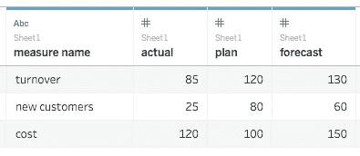

样本数据集

## 2.**将数据导入 Tableau**

只需打开 [Tableau](https://public.tableau.com/en-us/s/download) 并连接到您的数据源。在我的例子中，它是一个简单的 csv 文件，如上所示。

## 3.**添加测量和尺寸**

选择 **#actual** 尺寸，并通过拖放将其放置到柱架上。对**#预测**和重复同样的操作，对**【ABC】测量名称**进行操作，但对行货架进行操作。

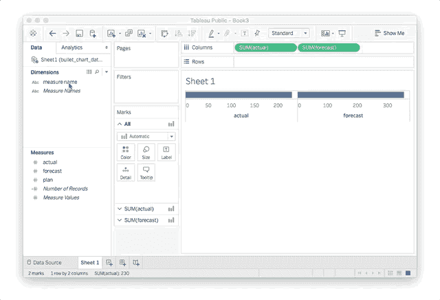

## 4.**创建一个双轴图形**

选择列架上的任何药丸(在我的情况下为 **#forecast** ),并从下拉菜单中选择**双轴**选项。

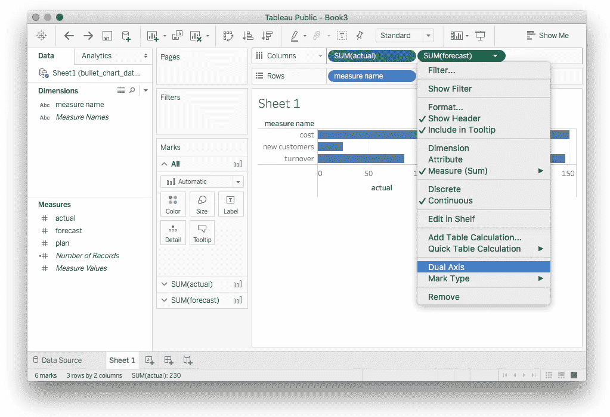

## 5.将图表类型更改为条形图

从“标记”卡的“全部”下，选择“酒吧”。这将把图形的类型变成条形图。

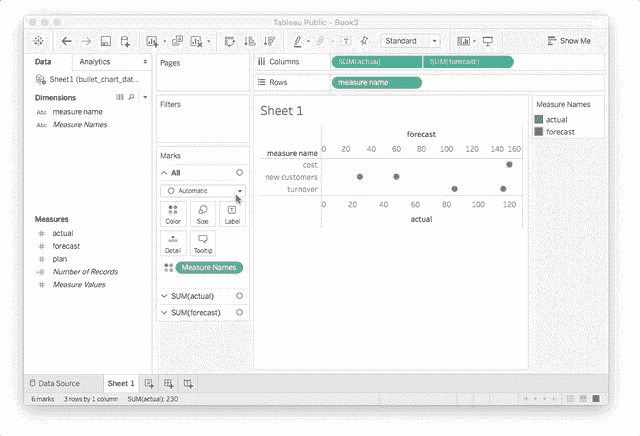

## 6.切换#实际药丸和#预测药丸

通过这一步，您将看到列/行货架上药丸的顺序有多重要。目前，**#预测**测量显示在**#实际测量**上方。这是因为它在**#实际**药丸的右边。为了反转它们，我们只需将# **实际的**药丸拖放到列架的右侧。当你看到一个橙色的小三角形后，把它放在那里。

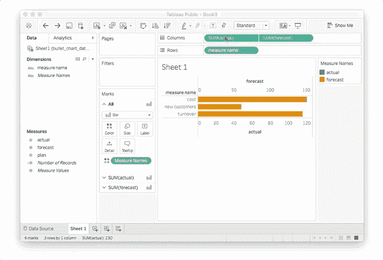

## 7.更改条形大小

我们现在有了**#实际**测量值和**#预测值**，但是为了查看它，我们需要改变条形的大小。从标记卡中选择**总和(实际)**字段，并从*尺寸*选项中向左拖动滑块。

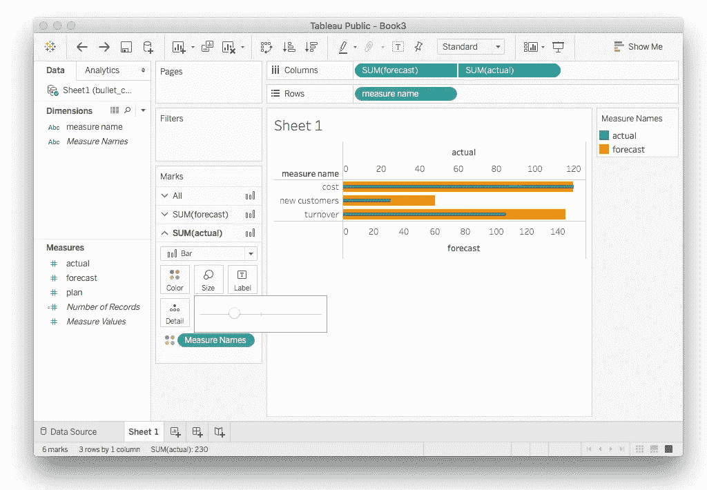

## 8.同步轴

右键单击任意轴(在我的例子中是**#预测**)并选择*同步轴*。

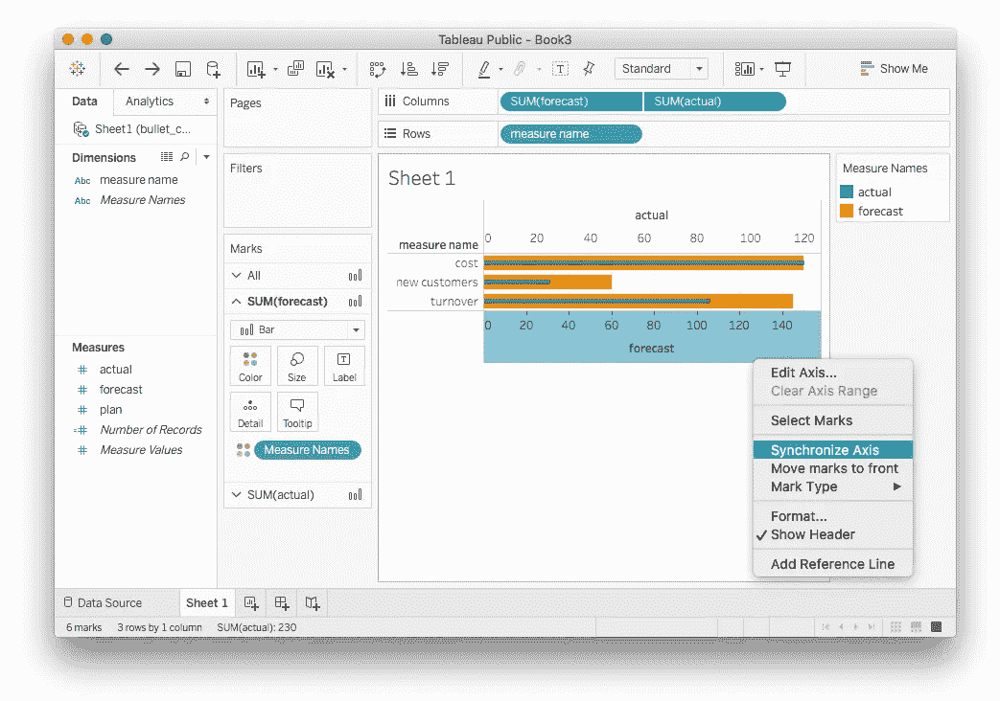

## 9.添加#plan measure 作为参考行

将 **#plan** measure 从数据窗格中拖放到 **SUM(actual)** 的标记卡中，并放入 *Detail* 选项中。这使您可以在不直接影响项目符号图视图的情况下使用这种方法。

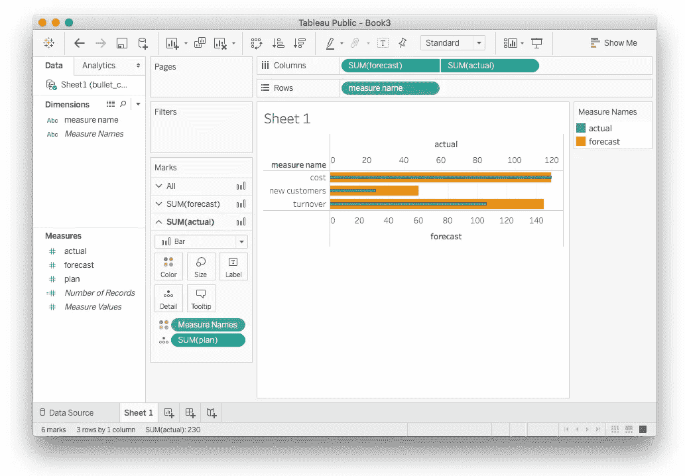

从分析窗格中，将*参考线*选项拖放到条形图视图上，并确保将其放置在每个*单元格*的字段上，每个*总和(实际)。*

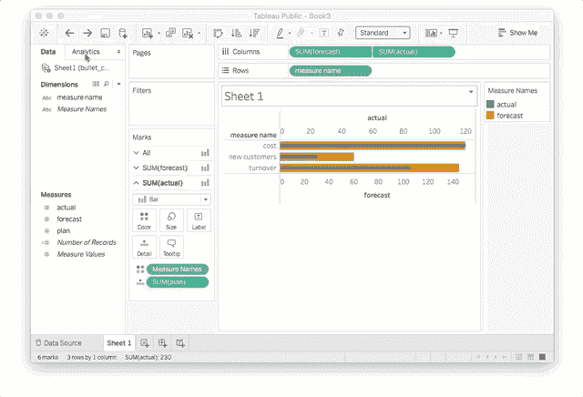

然后，将出现一个窗口，并从选项中选择:

*   值—选择**总和(计划)**，计算**总和**
*   线条——将颜色改为黑色，并使其更粗一点。

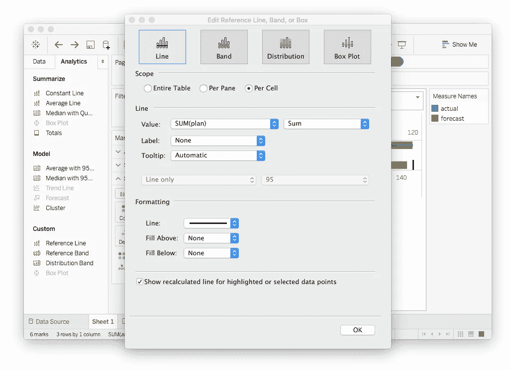

## 10.创建计算字段—#实际到计划

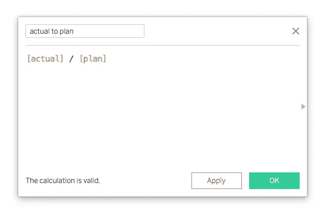

从分析菜单中选择创建一个计算字段*(或右键单击数据窗格并从中选择)*。给它一个合适的名字，并使用截图所示的计算。通过该字段，我们现在可以看到作为一个比率，我们完成了多少计划。

然后在*标签*选项的*总和(实际)*下拉菜单下，将**#实际到计划**测量拖放到*标记卡*。

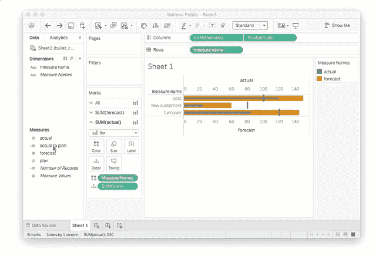

## 11.创建计算字段—#预测至计划

与上一步相同，唯一不同的是您需要在**详细信息**选项的**总和(预测)**下拉菜单下的标记卡中拖放新字段。

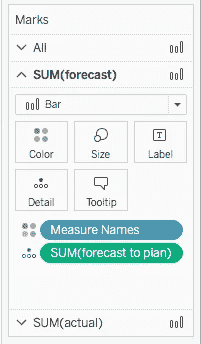

## 12.创建计算字段—状态

通过这一步，您可以更容易地确定哪个 KPI 已经步入正轨，哪个 KPI 需要更多关注。右键单击数据窗格，创建计算字段并使用以下代码:

```
IF [forecast to plan] > 1.2 then “Over Plan”
ELSEIF [forecast to plan] < 0.8 then “Behind Plan”
ELSE “On Plan”
END
```

创建后，您可以将字段拖放到**总和(预测)**下拉菜单中的**标记**卡上的*颜色*选项中。我们稍后会调整颜色。

## 13.添加摘要框

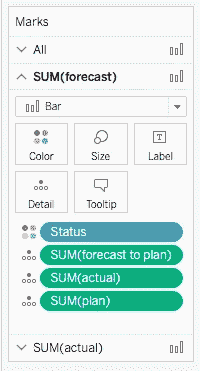

为了添加汇总框，您需要在**标记**卡的**总和(预测)**下拉菜单中添加一些指标。拖拽**#实际**和**#计划。**

然后右键单击视图中的任意预测条，并选择**注释** > **标记…**

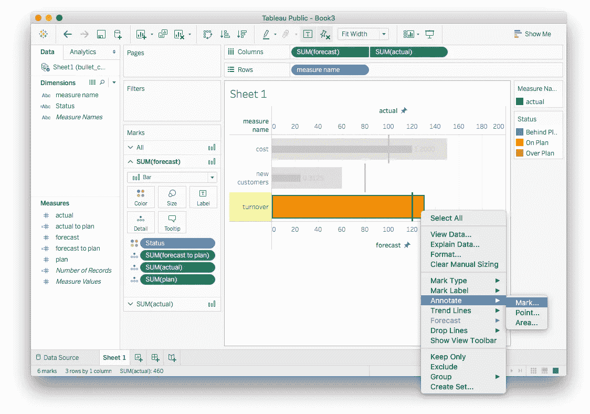

只保留**实际**、**计划**和**预测**、**到计划**的措施。对所有其他度量名称(成本/新客户)重复相同的步骤。

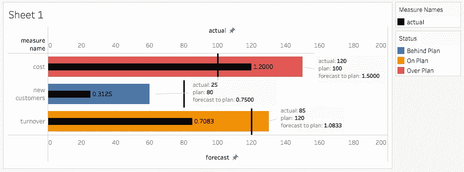

## 14.格式化

*   右键点击两个轴，取消**显示标题**。
*   右键单击标题**工作表 1** ，并将其重命名为 **KPIs 进度。**
*   右击**测量名称**并选择**隐藏行**的字段标签。
*   右击**#实际到计划**测量，默认属性，格式数字- >百分比带 0 位小数。重复**#预测到计划**测量的步骤。
*   从**标记**卡中选择**总和(实际)**，并选择**标签**选项。从**字体**选项中设置**校准**到**中间**和颜色为白色。
*   从**标记**卡中选择 **SUM(forecast)** ，并选择 **Color** 选项，为不同的状态应用合适的颜色。
*   右击其中一个摘要框，选择**格式**，将**底纹**改为**无**。对其他盒子重复该步骤。

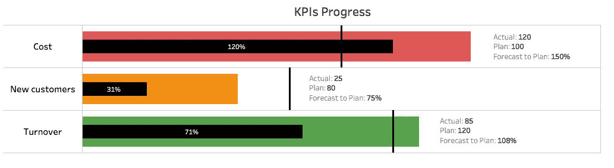

最终可视化。基里尔·尤纳科夫的[公开画面页面。](https://public.tableau.com/profile/kiril.yunakov#!/vizhome/KPIProgress/KPIDashboard?publish=yes)

要下载最终的 Tableau 工作簿，请访问我的[公共 Tableau 页面。](https://public.tableau.com/profile/kiril.yunakov#!/vizhome/KPIProgress/KPIDashboard)

> 如果你觉得这篇文章有用，你不同意其中的一些观点，有问题或建议，请不要犹豫，在下面给我留言。非常感谢您的反馈！
> 
> ***LinkedIn:****[*圭纳科夫*](https://www.linkedin.com/in/kyunakov/)*