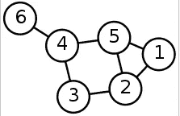
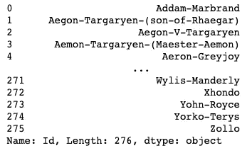
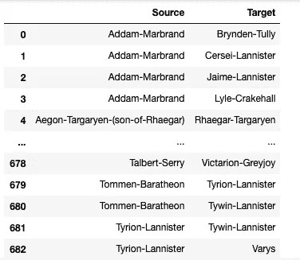
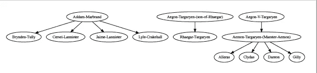
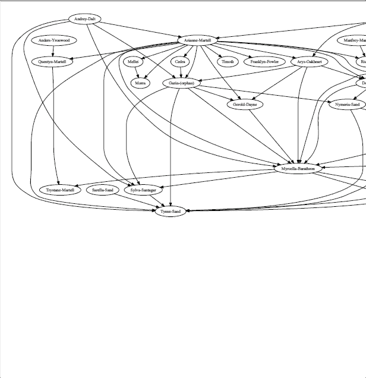

# 如何用图论可视化社交网络

> 原文：<https://towardsdatascience.com/how-to-visualize-social-network-with-graph-theory-4b2dc0c8a99f?source=collection_archive---------15----------------------->

## 找出《权力的游戏》中的影响者

# 动机

读完 G. R. R .马丁的《冰之歌与被解雇》系列*的书，作为《权力的游戏》的忠实粉丝，你可能会好奇谁是维斯特洛最有影响力的人。或者你知道艾德·史塔克和蓝道·塔利是有联系的，但不太清楚它们到底是如何联系的。他们是由第三人还是第四人联系在一起的？如果能把网络形象化，是不是很棒？*


照片由[威廉·克劳斯](https://unsplash.com/@williamk?utm_source=medium&utm_medium=referral)在 [Unsplash](https://unsplash.com?utm_source=medium&utm_medium=referral) 上拍摄

作为数据爱好者，您决定搜索相关数据进行分析。幸运的是，你找到了乔治·r·r·马丁《冰与火之歌》的[人物互动网络数据](https://github.com/mathbeveridge/asoiaf)。这是多么令人兴奋啊！但是数据包含节点和边的列表。它们到底是什么意思，你应该从哪里开始？别担心。我支持你。让我们来理解什么是图，以及图如何帮助我们理解社交网络。

# 什么是图？

图是包含**个顶点**(或节点)和**的结构，每一对相关的顶点称为一条边**。这些边可以是有向的或无向的。定向意味着一个方向。人 A 可能喜欢人 B，但是人 B 可能不喜欢人 A。如果 A 和 B 握手，那也意味着 B 和 A 握手



有六个顶点和七条边的图。检索自[维基百科](https://en.wikipedia.org/wiki/Graph_(discrete_mathematics))

有了图的结构，它可以用来有效地可视化社会网络。想知道团队中成员的影响者？我们可以立即看到拥有最多连接(边)的人(节点)是影响者。


从[微软](https://appsource.microsoft.com/es-es/product/power-bi-visuals/WA104381236?tab=Overview)检索

太好了！我们知道为什么图表在可视化网络方面是有用的。让我们看看如何创建图表，并使用它来可视化《权力的游戏》中的角色网络！

# 探索数据

我把几本书的多个数据合并成两个文件:节点数据`‘ASOIAF_nodes.csv’,`和边数据`‘ASOIAF_edges.csv’.`你可以在这里找到数据[的](https://github.com/khuyentran1401/Game-of-Thrones-And-Graph)

```
import pandas as pdnodes = pd.read_csv('ASOIAF_nodes.csv')
nodes = nodes['Id']
num_nodes = nodes.shape[0]
nodes
```



酷！所以我们在变量`node.`中有一个字符列表，总共有 276 个节点(字符)。现在让我们探索边缘。在`‘ASOIAF_edges.csv’`文件中，还有关于权重(交互次数)和图的种类(无向)的信息。但是因为我们只关心连接，所以我们使用前两列

```
edges = pd.read_csv('ASOIAF_edges.csv',usecols=[0,1] )
edges
```



总共有 683 个连接！哇哦。在整个系列中建立了许多联系。但是我们如何把这些数据做成图表呢？我们可以认为:

*   每个字符作为一个顶点
*   两个相连的顶点作为一条边

现在我们已经准备好可视化网络了！

# 用 Graphviz 可视化图形

[Graphviz](https://graphviz.readthedocs.io/en/stable/manual.html) 是一个用于绘制图形的 Python 接口。要安装它，请运行

```
$ pip install graphviz
```

通过实例化一个新的`Digraph`对象来创建一个图

```
from graphviz import Digraphdot = Digraph(comment='VIP graph')
```

让我们想象前十个节点

```
nodes_G = []
for node in edges[:10]['Source']:
    if node not in nodes_G:
        nodes_G.append(node)
for node in edges[:10]['Target']:
    if node not in nodes_G:
        nodes_G.append(node)
```

向图中添加节点和边

```
dot = Digraph(comment='VIP graph')for i in range(len(nodes_G)):
    dot.node(nodes_G[i])for i in range(len(edges[:10])):
    edge = edges.iloc[i]
    dot.edge(edge['Source'], edge['Target'])
```

视觉化:

```
dot.render('VIP-graph_10.gv', view=True)
```



不错！我们可以在图表中清楚地看到角色之间的互动。但是把整个网络可视化怎么样？当然，我们可以这样做。但是我们应该预料到这个系列的 5 章中的角色网络将会是巨大的

```
dot = Digraph(comment='VIP graph')for i in range(num_nodes):
    dot.node(nodes[i])for i in range(len(edges)):
    edge = edges.iloc[i]
    dot.edge(edge['Source'], edge['Target'])dot.render('VIP-graph.gv', view=True)
```

表演时间到了！



在这里找到这张 Gif 图片

酷！有了图，我们可以有效地将网络形象化。但是我们能创建自己的图形类吗？

# 创建图表

首先创建顶点(节点)类。我们希望顶点类有什么属性和方法？嗯。添加连接`(addNeighbor)`，知道当前节点与哪些节点连接(`getConnections`)，找出节点名称(`getId`，连接强度如何(`getWeight`)

用图形的一些基本方法创建一个图形类:

# 结论

恭喜你！在本文中，您已经学习了什么是图，以及如何使用图来可视化社交网络。那么你能用这些知识做什么呢？也许查阅本文中的[数据](https://github.com/khuyentran1401/Game-of-Thrones-And-Graph)和**创作的人物图**你很好奇去**分析他们的关系**？

或者，如果你根本不是《权力的游戏》的粉丝，你可以分析你关心的其他社交网络的数据，如 Twitter、脸书，以分析你和你的朋友或粉丝之间的网络。你将练习使用图表以及理解你和你朋友的关系。你是直接认识他们还是通过与他人的联系认识他们的？这将是如此迷人的知道！

你可以在我的 [Github](https://github.com/khuyentran1401/Game-of-Thrones-And-Graph) 里找到这篇文章的代码。在我的笔记本上，我还讲述了如何用深度优先搜索遍历断开的节点，用广度优先搜索**找到两个字符**之间的距离**。**

我喜欢写一些基本的数据科学概念，并尝试不同的算法和数据科学工具。你可以在 LinkedIn 和 Twitter 上与我联系。

如果你想查看我写的所有文章的代码，请点击这里。在 Medium 上关注我，了解我的最新数据科学文章，例如:

[](/convex-hull-an-innovative-approach-to-gift-wrap-your-data-899992881efc) [## 凸包:包装数据的创新方法

### 如何利用包装算法实现数据可视化

towardsdatascience.com](/convex-hull-an-innovative-approach-to-gift-wrap-your-data-899992881efc) [](/how-to-create-interactive-and-elegant-plot-with-altair-8dd87a890f2a) [## 如何用 Altair 创建交互式剧情

### 在 5 行简单的 Python 代码中利用您的数据分析

towardsdatascience.com](/how-to-create-interactive-and-elegant-plot-with-altair-8dd87a890f2a) [](/what-graphical-excellence-is-and-how-to-create-it-db02043e0b37) [## 什么是卓越的图形以及如何创建它

### 作为一名数据科学家，了解如何制作重要的图表至关重要

towardsdatascience.com](/what-graphical-excellence-is-and-how-to-create-it-db02043e0b37) [](/how-to-learn-data-science-when-life-does-not-give-you-a-break-a26a6ea328fd) [## 当生活不给你喘息的机会，如何学习数据科学

### 我努力为数据科学贡献时间。但是发现新的策略使我能够提高我的学习速度和…

towardsdatascience.com](/how-to-learn-data-science-when-life-does-not-give-you-a-break-a26a6ea328fd)