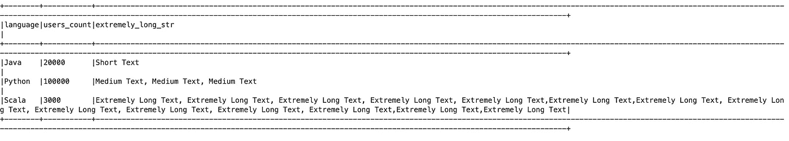
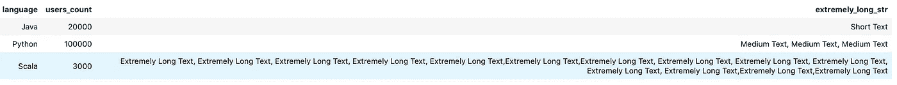
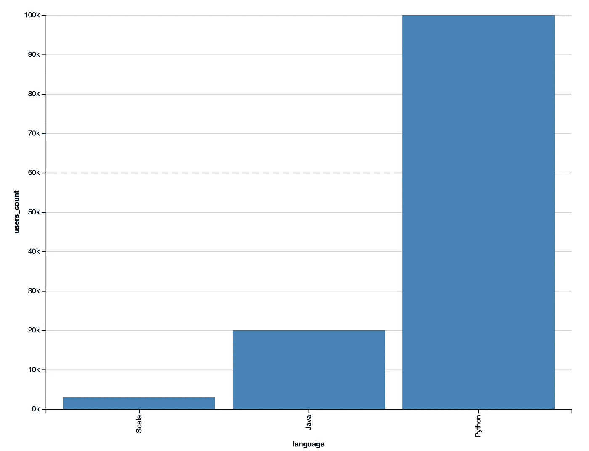
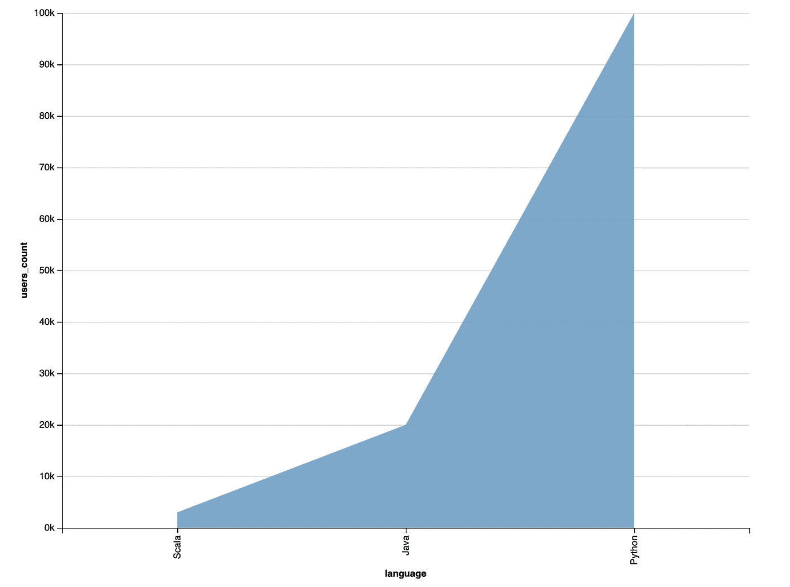
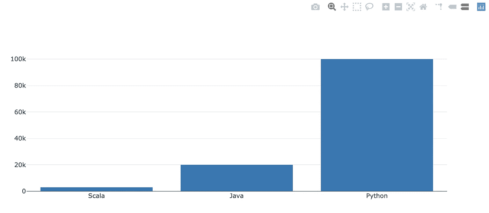

# 如何在 Scala 中可视化 Spark 数据帧

> 原文：<https://towardsdatascience.com/how-to-visualize-spark-dataframe-in-scala-b793265b6c6b?source=collection_archive---------26----------------------->

## 您只需要 Scala 的更好的可视化体验


Scala 中的数据可视化火花(作者)

数据集的可视化是探索数据并向最终用户提供有意义信息的一种令人信服的方式。借助 Spark DataFrame，大规模数据处理从未像当前堆栈那样自然。对于用 Python 写代码的人来说，有很多可视化选项可以选择；PySpark 工程师可能不关心数据可视化。然而，对于用 Scala 编写 Spark 的人来说，没有多少开源选项可用。

对于 Scala 数据框架可视化中的 Spark，如果你在谷歌上搜索“**Spark In Scala data frame Visualization**”，一个选项列表与供应商或商业解决方案密切相关。如果你正在使用数据块，函数`display`很方便。如果您使用的是 HDInsight Spark，则可以使用内置可视化功能。如果你正在使用 Zeppelin(开源)，可视化按钮可以使它变得简单。但是，如果你没有上面提到的任何一个环境，还想使用 Jupyter Notebook 这样的开源，那么数据可视化在这里也不是不可能完成的任务。幸运的是，有定制的函数，库可以使这个过程变得简单。在这篇文章中，我们将只为**的** Scala **探索更好的可视化体验。**

## Jupyter 笔记本更好的“展示”体验

在 Spark 中，控制台中的一个简单可视化是 [**显示**功能](https://spark.apache.org/docs/latest/api/scala/index.html#org.apache.spark.sql.Dataset)。 **show** 函数将 DataFrame 中的一些记录(默认为 20 行)显示为表格形式。 **show** 功能的默认行为是启用截断，如果长度超过 20 个字符，则不会显示值。通过这种方式，您可以让所有内容都显示正确。有时，您可能希望禁用截断以查看单元格中的更多内容。那么你的数据显示可能会很混乱，因为它不会排队，它变得难以阅读。

下面的例子中我们有一个名为`extremely_long_str`的列，我们故意设置它来观察单元格内扩展内容的行为。在这种情况下，show 函数的格式不会很好。

```
import spark.implicits._
val columns = Seq(“language”,”users_count”, “extremely_long_str”)val data = Seq((“Java”, “20000”,”Short Text”), (“Python”, “100000”,”Medium Text, Medium Text, Medium Text”), (“Scala”, “3000”,”Extremely Long Text, Extremely Long Text, Extremely Long Text, Extremely Long Text, Extremely Long Text,Extremely Long Text,Extremely Long Text, Extremely Long Text, Extremely Long Text, Extremely Long Text, Extremely Long Text, Extremely Long Text,Extremely Long Text,Extremely Long Text”))val rdd = spark.sparkContext.parallelize(data)
val df = spark.createDataFrame(rdd).toDF(columns:_*)df.show(false)
```

一旦您执行了下面的代码，它将显示下面几行。我们可以认识到一个超长的记录不适合一行。如果你有几百行，阅读起来会很困难，因为一个单元格内的上下文会分成多行。随着 turncate 的关闭，长上下文破坏了格式良好的 show 函数。你可能会注意到阅读起来很麻烦，如果你有像这样的多列布局，那就更麻烦了。



默认显示不截断(按作者)

在 Jupyter 笔记本中，修复对齐问题。我们可以应用 HTML 来显示内容，而不是使用 show 函数。HTML 在这里会灵活得多，它可以管理单元格合并，这样它在多行中会显示得更漂亮，这里的输出读起来更舒服。



showHTML()函数(作者)

要完成这项工作，你只需要安装一个 Jupyter 笔记本内核，名为[杏仁](https://almond.sh/docs/quick-start-install)(Jupyter 的一个 Scala 内核)，并实现一个定制的功能。要在 Jupyter 笔记本中安装杏仁内核，可以按照[的说明](https://almond.sh/docs/quick-start-install)进行操作。

[Aivean](https://github.com/Aivean) 为此在 Github 上发布了一个很有用的[函数](https://github.com/almond-sh/almond/issues/180)，一旦添加了 helper 函数，就可以调用`df.showHTML(10, 300)`函数，该函数生成一个包含 DataFrame 结果的 HTML 代码块 wrap，并显示十行，每个单元格 300 个字符。它现在在 Jupyter 笔记本上看起来好多了，如上图所示。要添加的函数如下所示:

```
// Credit to Aiveanimplicit class RichDF(val ds:DataFrame) {
    def showHTML(limit:Int = 20, truncate: Int = 20) = {
        import xml.Utility.escape
        val data = ds.take(limit)
        val header = ds.schema.fieldNames.toSeq        
        val rows: Seq[Seq[String]] = data.map { row =>
          row.toSeq.map { cell =>
            val str = cell match {
              case null => "null"
              case binary: Array[Byte] => binary.map("%02X".format(_)).mkString("[", " ", "]")
              case array: Array[_] => array.mkString("[", ", ", "]")
              case seq: Seq[_] => seq.mkString("[", ", ", "]")
              case _ => cell.toString
            }
            if (truncate > 0 && str.length > truncate) {
              // do not show ellipses for strings shorter than 4 characters.
              if (truncate < 4) str.substring(0, truncate)
              else str.substring(0, truncate - 3) + "..."
            } else {
              str
            }
          }: Seq[String]
        }publish.html(s""" <table>
                <tr>
                 ${header.map(h => s"<th>${escape(h)}</th>").mkString}
                </tr>
                ${rows.map { row =>
                  s"<tr>${row.map{c => s"<td>${escape(c)}</td>" }.mkString}</tr>"
                }.mkString}
            </table>
        """)        
    }
}
```

## 在 Scala-Vegas(VEGA+Scala)中制作漂亮的剧情

Vegas 是一个用于声明性统计数据可视化的 Scala API。它与 Scala 以及 Apache Spark 和 Apache Flink 等现代数据框架集成得很好。因为 Vegas 是声明性的，所以我们需要做的就是定义数据源并传递关于如何显示图表的参数，而不需要显式地写下更多的额外代码。

首先，您需要添加以下两个依赖项

```
import $ivy.`org.vegas-viz:vegas_2.11:0.3.11`
import $ivy.`org.vegas-viz:vegas-spark_2.11:0.3.11`
```

因为我们有一个之前定义的 Spark 数据帧，所以我们可以重用它。一旦定义了数据帧，剩下的就是将`withDataFrame`指向 Spark 数据帧，因此 Vegas 知道如何将 Spark 数据帧解析为数据源。为了美观地展示图表，您可能希望对 x 轴进行排序，否则绘图将按语言名称进行排序和显示，这是默认行为。

```
import vegas._
import vegas.render.WindowRenderer._
import vegas.sparkExt._Vegas(“Language Usage”)
 .withDataFrame(df)
 .mark(Bar) // Change to .mark(Area)
 .encodeX(“language”, Nom, sortField=Sort(“users_count”, AggOps.Mean))
 .encodeY(“users_count”, Quant)
 .show
```



拉斯维加斯酒吧阴谋(作者)



维加斯地区图(作者)

## 使用 Plotly 作为替代

Vegas 是一个非常好用的库，它可以与 Scala 和 Spark 无缝协作。虽然拉斯维加斯的情节看起来很酷，但你可能不仅仅局限于一个可视化选项。此外，您可能希望有一个更具交互性的图表模式。 [Plotly](https://github.com/alexarchambault/plotly-scala) 在这里可能是正确的选择。Plotly 是另一个出色的数据可视化框架，它已经在 Python 和 JavaScript 中得到了广泛应用。为了让 Plotly 与 Scala 和 Spark 一起工作，我们需要更多地重塑我们的数据，因为 Plotly 目前不直接支持 Spark 数据帧。

首先，你需要为 Jupyter 实验室安装 [plotly-scala](https://github.com/alexarchambault/plotly-scala)

```
jupyter labextension install @jupyterlab/plotly-extension
```

然后，您需要将 DataFrame 更改为 RDD 并收集，以强制将数据收集到驱动程序节点。为了避免向驱动程序接收太多的数据，在 Spark driver 上收集数据之前，您需要过滤或聚合接近最终结果的数据集，并且不要依赖可视化框架来执行数据转换。

```
val (x, y) = df.collect.map(r=>(r(0).toString, r(1).toString.toInt)).toList.unzip
Bar(x, y).plot()
```

Plotly 的一个更精致的特性是它的图表比 Vegas 创建的图表更具交互性。您可以悬停在条形图上并查看数据值，或者选择右上角的选项，如放大/缩小，以满足您的要求。



用 Scala 编程(作者)

## 最终想法

尽管 Scala 中有一些数据可视化选项，但仍然有可能构建令人印象深刻且富有创意的图表来通过数据交流信息。对于用 Scala 为 Spark 编写代码的人来说，通过额外的转换，我们仍然可以利用一些开源库来可视化 Scala 中的数据。希望这篇文章能介绍一些如何在 Scala 中可视化 Spark DataFrame 的思路，帮助你获得更好的 Scala 可视化体验。

希望这个故事对你有帮助。本文是我的工程&数据科学系列的**部分，目前包括以下内容:**


[赵承志](https://chengzhizhao.medium.com/?source=post_page-----b793265b6c6b--------------------------------)

## 数据工程和数据科学故事

[View list](https://chengzhizhao.medium.com/list/data-engineering-data-science-stories-ddab37f718e7?source=post_page-----b793265b6c6b--------------------------------)47 stories

你也可以 [**订阅我的新文章**](https://chengzhizhao.medium.com/subscribe) 或者成为 [**推荐媒介会员**](https://chengzhizhao.medium.com/membership) 可以无限制访问媒介上的所有故事。

如果有问题/评论，**请不要犹豫，写下这个故事的评论**或者**通过 [Linkedin](https://www.linkedin.com/in/chengzhizhao/) 或 [Twitter](https://twitter.com/ChengzhiZhao) 直接联系我**。