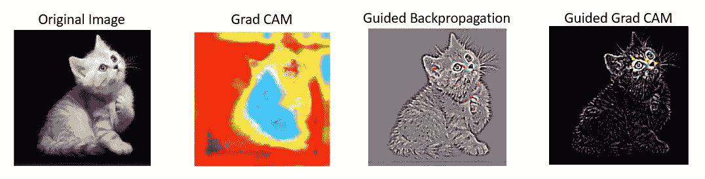
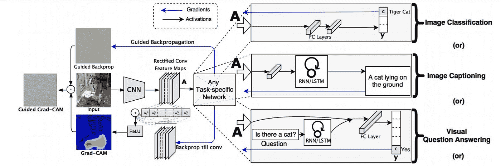
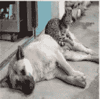
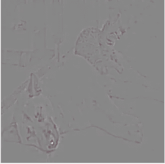
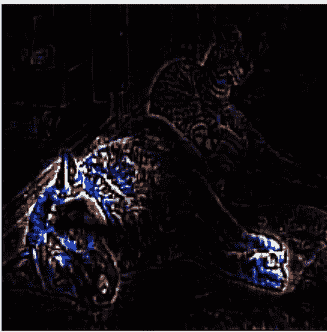

# 如何直观地解释任何基于 CNN 的模型

> 原文：<https://towardsdatascience.com/how-to-visually-explain-any-cnn-based-models-80e0975ce57?source=collection_archive---------12----------------------->

## 理解并实现引导 Grad CAM，为任何基于 CNN 的模型直观地解释类别区分可视化

> **CNN 深度学习模型——它为什么解释它所解释的东西？**

深度学习模型现在能够给出非常高的准确度。在图像分类、对象检测、语义分割、图像字幕或视觉问答中大规模采用计算机视觉算法的最关键部分是理解 CNN 模型为什么解释它们所解释的内容。

> CNN 模型的可解释性或可解释性是建立信任和采用信任的关键

只有当我们理解了为什么模型不能识别一个类或一个对象时，我们才能集中精力解决模型的失败。更好的可解释或可解释的深度学习模型将帮助人类建立信任，并导致更高的采用率。

> 一个好的可解释或可理解的模型应该突出图像中的细粒度细节，以直观地解释为什么模型预测了一个类。

有几种方法可以解释 CNN 模型，比如

*   **导向反向传播** **可视化图像中的精细细节**。它的前提是:**神经元就像特定图像特征的检测器**，所以**当反向传播时，梯度、负梯度被设置为零**以突出图像中重要的像素。
*   **类别激活图(CAM)是类别鉴别的**，它定位图像的类别或类别。CAM 要求要素地图直接位于预测图层之前。 **CAM 因此适用于在预测层**之前对卷积映射执行全局平均池的 CNN 架构，因此不适用于其他计算机视觉算法。
*   **Grad CAM 可视化**具有**类区分性**并定位相关图像区域**，但不会像导向反向传播一样突出精细像素的重要性**；然而，与 CAM 不同的是， **Grad CAM 适用于任何 CNN 架构。**

**引导式 Grad CAM 结合了 Grad CAM 和引导式反向传播的优点，Grad CAM 具有类别区分能力，可定位相关图像区域，而引导式反向传播可将负梯度设置为零的图像的梯度可视化，从而在通过 ReLU 层反向传播时突出显示图像中的导入像素。**



由作者生成的代码:比较不同的技术来解释 CNN

> 导向梯度加权类激活图(导向梯度凸轮)具有类区分性，并突出显示图像的细粒度重要区域，用于任何 CNN 架构的高分辨率预测。

# 制导 Grad CAM 高级工作



**图像通过 CNN 网络前向传播，生成特征图，然后应用特定于任务的网络来获得类别的分数。**

**不同类型的任务可以是图像分类、图像字幕、物体检测、视觉问答**等。

**所需类别的梯度设置为 1，**所有其他类别的梯度设置为零。这样做是为了获得类别区分定位图。

关于激活的梯度被反向传播，直到最后的卷积层；这抓住了重要的特征。**前向激活图和反向传播梯度的加权组合后跟随一个 ReLU，以获得梯度凸轮定位**(蓝色热图)，该定位解释了模型为做出特定决策而查看的特征。

**应用引导反向传播来计算梯度，然后将负梯度和反向传播归零。**

最后一步，**将 Grad CAM 热图与导向反向传播进行逐点相乘，以获得导向 Grad-CAM 可视化**。**这些可视化现在具有类别区分性，并以高分辨率定位相关图像区域。**

# 梯度凸轮、导向反向传播和导向梯度凸轮在 TensorFlow 中的实现

在下面的代码中，我们将通过 VGG19 模型的 Conv 层向前传播图像。

非负梯度被反向传播到感兴趣的校正卷积特征图。然后，将这些梯度组合起来计算粗略的 Grad-CAM 定位，表示图像中的特征，模型在图像中寻找这些特征以做出特定的决定。

最后，我们应用梯度 CAM 热图与引导反向传播的逐点乘法来获得引导梯度 CAM 可视化，其既是高分辨率的又是概念特定的或类别判别式的。

```
# Import the required libraraies
**import cv2
import tensorflow as tf
import tensorflow.keras.backend as K
import numpy as np
from skimage.transform import resize
import matplotlib.pyplot as plt
%matplotlib inline**#Setting the image apth and the last conv layer for VGG19
**IMAGE_PATH = 'cat_and_dog1.jpg'
LAYER_NAME='block5_conv4'**#Load the image
**img = tf.keras.preprocessing.image.load_img(IMAGE_PATH, target_size=(224, 224))**# Displaying the original image
**plt.axis("off")
plt.imshow(img)
plt.show()** # Preprocess the image using vgg19 preprocess function
**img =  tf.keras.preprocessing.image.img_to_array(img)
x = np.expand_dims(img, axis=0)
preprocessed_input = tf.keras.applications.vgg19.preprocess_input(x)**
```



原象

我们在 Imagenet 数据集上使用 VGG19 迁移学习模型。

```
#Create the transfer learned model
**model = tf.keras.applications.vgg19.VGG19(weights='imagenet', include_top=True)**
```

我们从 VGG19 传输学习模型直到最后一个卷积层创建一个模型。Conv 层保留了当我们在深度学习 CNN 模型中应用全连接层时丢失的空间信息。

```
'''create a model till  last convolutional layers to have the best compromise between high-level semantics and detailed spatial
information'''
**gb_model = tf.keras.models.Model(
    inputs = [model.inputs],    
    outputs = [model.get_layer(LAYER_NAME).output]
)**
**layer_dict = [layer for layer in gb_model.layers[1:] if hasattr(layer,'activation')]**
```

通过应用 [**@tf**](http://twitter.com/tf) **覆盖 ReLU 的渐变。custom_gradient** 允许对梯度进行细粒度控制，以便反向传播非负梯度，从而获得更有效或数值稳定的梯度。

```
[**@tf**](http://twitter.com/tf)**.custom_gradient
def guidedRelu(x):
  def grad(dy):
    return tf.cast(dy>0,"float32") * tf.cast(x>0, "float32") * dy
  return tf.nn.relu(x), grad**
```

将引导式 ReLU 应用于所有重新激活的 Conv 图层

```
**for layer in layer_dict:
  if layer.activation == tf.keras.activations.relu:
    layer.activation = guidedRelu**
```

使用梯度带记录前向传递的预处理输入图像，这将有助于计算后向传递的梯度。使用 GradientTape 对象捕捉最后一个 Conv 图层上的渐变。

这里，我们找到了目标类分数相对于最后一个卷积层的特征图的梯度

```
**with tf.GradientTape() as tape:
 inputs = tf.cast(preprocessed_input, tf.float32)
 tape.watch(inputs)
 outputs = gb_model(inputs)[0]****grads = tape.gradient(outputs,inputs)[0]**
```

## Grad 分类激活图(Grad CAM)

对梯度进行空间平均，其中每个条目是特定要素地图通道上梯度的平均强度。根据梯度重要性建立一个有权重的过滤器图。结果是最终的类别区分显著图。

```
**weights = tf.reduce_mean(grads, axis=(0, 1))
grad_cam = np.ones(outputs.shape[0: 2], dtype = np.float32)
for i, w in enumerate(weights):
    grad_cam += w * outputs[:, :, i]**
```

用最大强度值
除热图的每个强度值，以标准化热图，使所有值落在 0 和 1 之间，并在图像上绘制渐变类别激活图

```
**grad_cam_img = cv2.resize(grad_cam.numpy(), (224, 224))
grad_cam_img = np.maximum(grad_cam_img, 0)
heatmap = (grad_cam_img - grad_cam_img.min()) / (grad_cam_img.max() - grad_cam_img.min())****grad_cam_img = cv2.applyColorMap(np.uint8(255*heatmap), cv2.COLORMAP_JET)****output_image = cv2.addWeighted(cv2.cvtColor(img.astype('uint8'), cv2.COLOR_RGB2BGR), 0.5, grad_cam_img, 1, 0)** **plt.imshow(output_image)
plt.axis("off");
plt.show()**
```


Grad CAM

## 导向反向传播

使用**引导反向传播来捕捉神经元检测到的像素，而不是抑制神经元的像素。导向反向传播计算目标输出相对于输入**的梯度，其中**负梯度在通过 ReLU 层**反向传播时被抑制

```
#Visualizing the guided back prop
**guided_back_prop =grads****gb_viz = np.dstack((
            guided_back_prop[:, :, 0],
            guided_back_prop[:, :, 1],
            guided_back_prop[:, :, 2],
        ))       
gb_viz -= np.min(gb_viz)
gb_viz /= gb_viz.max()

imgplot = plt.imshow(gb_viz)
plt.axis("off")
plt.show()**
```



导向反向传播

## 导向梯度类激活图(导向梯度凸轮)

**导向梯度 CAM 通过逐元素乘法结合了梯度 CAM 和导向反向传播的最佳方面。制导 Grad CAM 的可视化既具有高分辨率，又具有类别区分能力**

```
**guided_cam = np.maximum(grad_cam, 0)
guided_cam = guided_cam / np.max(guided_cam) # scale 0 to 1.0
guided_cam = resize(guided_cam, (224,224), preserve_range=True)**#pointwise multiplcation of guided backprop and grad CAM **
gd_gb = np.dstack((
        guided_back_prop[:, :, 0] * guided_cam,
        guided_back_prop[:, :, 1] * guided_cam,
        guided_back_prop[:, :, 2] * guided_cam,
    ))****imgplot = plt.imshow(gd_gb)
plt.axis("off")
plt.show()**
```



制导 Grad CAM

可视化突出显示了耳朵、鼻子、狗的身体和它的爪子的像素，模型看起来要对狗和猫的特征进行预测，但没有突出显示。

## 结论:

制导 Grad CAM 具有类别识别能力，在突出显示精细像素细节的同时定位相关图像区域。使用引导 Grad CAM 的可视化有助于解释 CNN 模型在进行预测时看什么，从而解释为什么模型解释它所解释的内容，从而明确建立对深度学习模型的信任。

# 参考资料:

[Grad-CAM:通过基于梯度的定位来自深度网络的视觉解释](https://arxiv.org/pdf/1610.02391.pdf)

[https://www . si cara . ai/blog/2019-08-28-可解释性-深度学习-tensorflow](https://www.sicara.ai/blog/2019-08-28-interpretability-deep-learning-tensorflow)