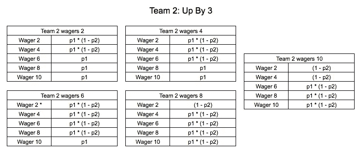
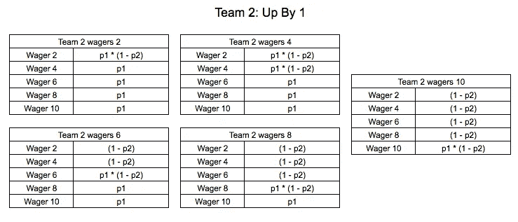

# 如何在酒吧琐事的最后一题下注

> 原文：<https://towardsdatascience.com/how-to-wager-at-the-final-questions-in-bar-trivia-594a1d746bb2?source=collection_archive---------34----------------------->

## 什么时候下大注，什么时候下小注

乔治·巴科斯在 [Unsplash](https://unsplash.com/photos/83HwuZirc-c) 上的图片

几周前，我和我的朋友在镇上我们最喜欢的酒吧玩酒吧琐事。对于那些不知道的人来说，酒吧琐事是一种比赛，团队试图回答越来越难的琐事问题以获得分数。最后得分最多的队获胜。在游戏的最后一个问题中，各队在听到问题后可以下注 2、4、6、8 或 10 分。如果他们答对了，他们会把他们下注的点数加到他们的分数上。如果他们做错了，他们会损失一半。

到了最后一题，我和朋友们落后第一名队伍 5 分。我想我们已经想出了正确的答案，所以我想赌最多 10 分，但我的队友想更谨慎，而不是赌 8 分。第一名的队伍和我们正确地回答了问题，但是因为第一名的队伍下注 4 分，我们以一分之差结束了比赛！我突然想到，如果我们赌 10 分，我们就会赢一分。我想知道是否有一种方法可以证明下注 10 点是我们这种情况下的最佳赌注。

在这篇文章中，我将推导出一个酒吧琐事团队的最佳赌注，条件是他们与第一名团队之间的积分差异。在这个过程中，我们还会看到第一名队伍的最佳赌注是什么。在这个分析中，我将最优赌注定义为最大化团队获胜机会的赌注。我假设所有的团队都试图最大化这个概率。领先的团队是团队 2，假设他们答对问题的概率是 p2。另一个团队是团队 1，假设他们答对问题的概率是 p1。

有 5 种情况需要考虑，让我们开始吧！

# 第一组:第二组领先了 5-11 分

对于两个团队可以进行的每种下注组合，我已经计算了团队 1 获胜的概率，并且我已经在之前的表格中列出了它们。我应该说，这个特定的表格是针对第二组正好领先五个点的情况，但是我们在这种情况下得出的最优策略对于 6-11 的值是相同的。

例如，假设第二队在最后一个问题中下注 2 分。如果团队 1 下注 6 分，如果他们答对了问题而团队答错了，他们就能赢。这以概率 p1 * (1 — p2)发生。这解释了左上角表格第三行中的条目。如果团队 1 下注 8 分，如果他们答对了，团队 2 答错了，或者两个团队都答对了，他们就能赢。这意味着获胜的总概率是 p1 * (1-p2) + p1 * p2 = p1。

查看表格，我们可以看到，无论团队 2 下注多少，团队 1 都通过下注 10 分来最大化他们的获胜概率。相反，团队 2 通过下注 6、8 或 10 分来最大化他们获胜的机会。

**策略:**第一队要赌 10 分。如果两个队都答对了，第二队应该下注第二队获胜所需的最少点数。在领先 5 个百分点的情况下，这将是 6 个百分点。

# 案例 2:第二队领先 4 分

在这种情况下，我重新计算了概率，并以与前一种情况相同的表格格式展示出来。与前一种情况类似，P1 *(1–p2)的值意味着团队 1 如果做对了就赢，团队 2 做错了就赢。p1 值意味着如果团队 1 答对了，团队 2 答错了，或者两个团队都答对了，那么团队 1 就赢了。我想解释一下(1–p2)的值，我们在前面的例子中没有看到。这对应于团队 1 做对的概率和团队 2 做错的概率以及两个团队都做错的概率:p1 * (1-p2) + (1-p1) * (1-p2) = (1-p2)。

**策略:**在这种情况下没有优势策略。除了团队 2 下注 10 分之外，团队 1 在所有情况下都下注 10 分，以最大化他们获胜的机会。然而，当团队 2 下注 10 时下注 10 是次优的，仅仅因为团队 1 在他们弄错问题的情况下不能赢。如果第一组认为它能答对这个问题，它可能会下 10 英镑的赌注。

# **案例 3:第二队领先 3 分**

就像案例 2 一样，这种情况有点棘手，因为团队 1 没有单一的策略可以用来最大化他们的获胜机会。如果团队 2 下注 2、4 或 6 分，那么团队 1 总是通过下注 10 分来最大化他们的机会。如果团队 2 下注 8 或 10 点，团队 1 总是通过下注 2 点来最大化他们的机会。

显然，团队 1 不能查看团队 2 的赌注，因此这不是一个可以在实践中使用的策略。也就是说，我认为团队 1 可以使用一个经验法则来提出一个好的赌注。这里的关键是要认识到，无论如何，如果团队 1 做对了，团队 2 做错了，团队 1 就会赢。换句话说，表格中的每个单元格都有 p1 * (1-p2)值。只是值为 p1 的单元格中多了一个 p1 * p2 项。带有(1-p2)的单元格中有一个额外的(1-p1) * (1-p2)项。

**策略:**团队 1 需要评估 p1 是否> (1-p1)，即他们是否更有可能答对问题。如果他们认为他们能答对这个问题，他们应该下注 10 分，因为这样可以通过答对这个问题最大化他们获胜的机会。如果他们认为他们会错，他们应该赌 2 分。同样的经验法则也适用于团队 2。

# **案例 4:第二队领先 2 分**

与前一种情况类似，对于团队 1 来说，不存在对团队 2 的所有下注都是最优的策略。我们可以看到，如果 p1 > (1-p2)，那么下注 10 点对于所有情况都是最优的，除了当团队 2 下注 10 点时。如果(1-p2) > p1，那么下注 2 点对于所有情况都是最佳的，除了当团队 2 下注 2 或 4 时。由于团队 1 不知道 p2 或团队 2 的赌注，这不是一个可以在实践中使用的策略。然而，他们可以用 p1 的值来近似 p2 的值——毕竟，团队非常接近，所以他们有相似的琐事知识。通过这样做，我们恢复了与前一个案例相同的经验法则。

**策略:**如果 p1 > (1-p1)，他们应该赌 10 点。否则，他们应该赌 2 分。同样的经验法则也适用于团队 2。

# **案例 5:第二队领先 1 分**

**策略:**这种情况和“涨 2”的情况**非常相似。**如果 p1 > (1-p1)，他们应该赌 10 点。否则，他们应该赌 2 分。同样的经验法则也适用于团队 2。

# 外卖食品

我认为最重要的一点是，你几乎应该总是下注最少或最多的点数。唯一不应该的情况是当你的球队领先至少 4 分的时候。当第一队仅领先 3 分或更少时，我们看到不可能为另一队所有可能的赌注提出一个占优势的策略。在这种情况下，团队应该评估他们是否有可能答对问题。如果是这样，他们应该下注最大点数。如果没有，它们应该是最小值。

这个结论表明，我的团队应该在几周前我们落后 5 分的时候下注 10 分。我迫不及待地想向我的团队展示这一点，并提高我们未来的机会！