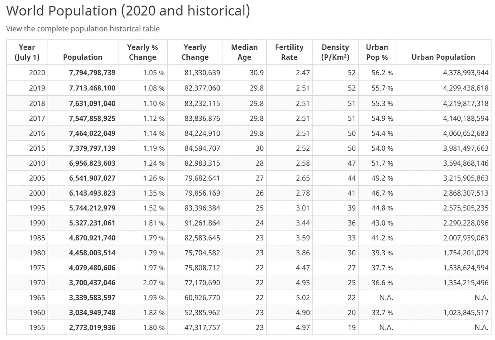
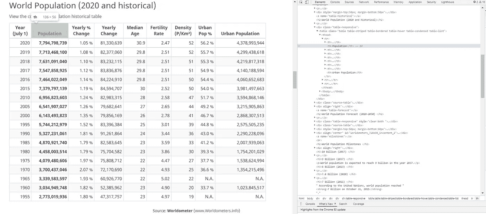
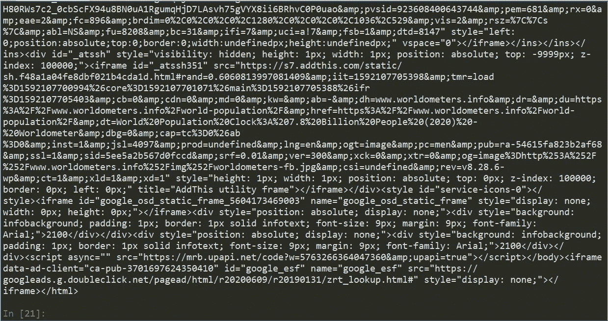
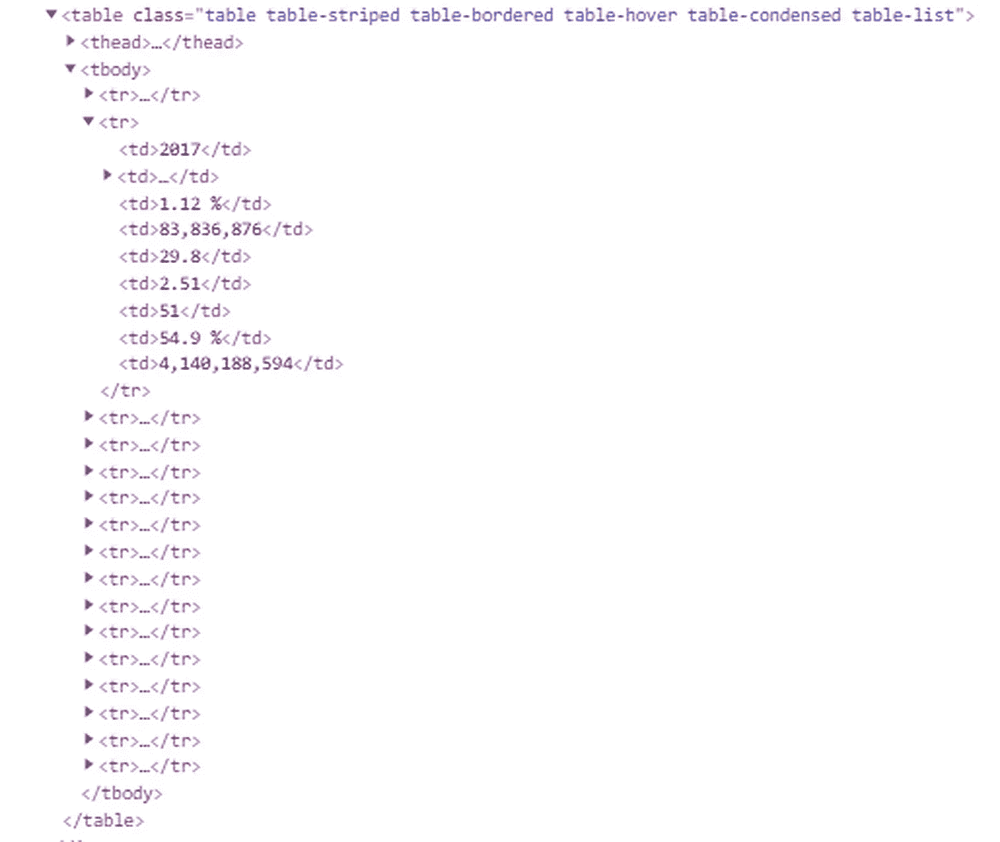
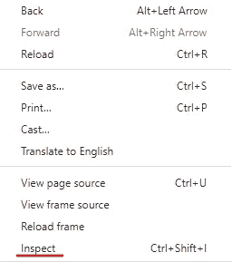
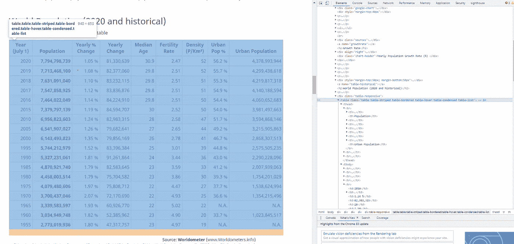
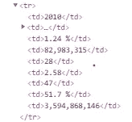
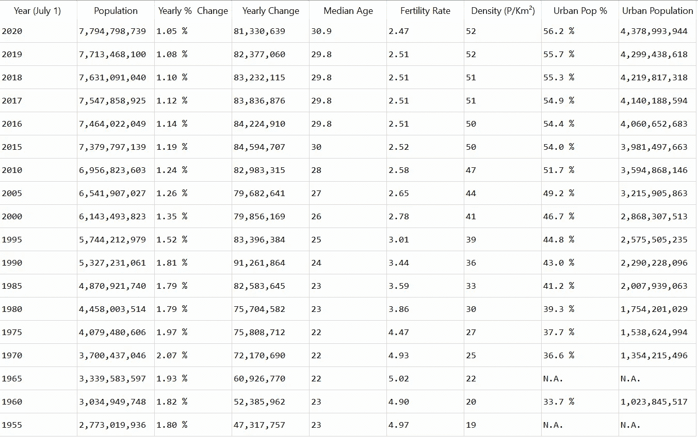

# 如何在 8 分钟内完成网页抓取

> 原文：<https://towardsdatascience.com/how-to-web-scrape-in-8-minutes-4a100a672397?source=collection_archive---------9----------------------->

## 我将向你展示如何在 8 分钟内成为一名 Python 网页抓取者


克里斯托弗·高尔摄于 Unsplash

你知道你现在读的是什么数据吗？对你来说，这可能只是几个词，但在后端，你在网上读到的一切都是可以被提取、分离和操作的数据。这就是 Web Scraper，我将向你展示如何在 8 分钟内成为一名 Web Scraper。

# 世界计量仪

[Wordometers](https://www.worldometers.info/world-population/) 是一个提供生活世界统计数据的网站，也是我们要刮的网站。具体来说，我们将收集表格中的世界人口数据(如下所示)。从表格中抓取数据是最常用的网络抓取形式之一，因为通常我们在表格中需要的数据是不可下载的。因此，我们让计算机在几秒钟内完成，而不是手动获取数据。



# 美味的汤

我知道这是一个奇怪的名字，但 Beautiful Soup 是最强大的网络抓取库之一，在我看来也是最容易学习的，这就是为什么我们要使用它。但是首先我们必须安装它。

要在您的计算机上安装 Beautiful Soup，请进入您的 Anaconda 控制台(只需在任务栏中搜索),并分别键入每一行代码。

```
pip install beautifulsoup4 
pip install lxml
pip install requests
```

如果事情最终出错了，这里有一个文档的链接，它会告诉你问题是什么以及如何解决:[美汤文档](https://www.crummy.com/software/BeautifulSoup/bs4/doc/)

# Python 代码

现在我们已经完成了设置，我们终于可以开始编写代码来清理表格了。

我们首先导入刚刚安装的库和其他一些需要的库。

```
import requests
from bs4 import BeautifulSoup
import pandas as pd
```

然后，我们希望获得我们正在抓取数据的网站，为此，我们使用一个名为 **requests.get()** 的函数，当输入一个 url 时，我们就可以访问网站上的数据。

```
url = 'https://www.worldometers.info/world-population/'
requests.get(url)
page = requests.get(url)
```

要查看请求是否成功，在使用适当的 url 运行代码后，应该会弹出这个窗口。

```
Response [200]
```

相反，如果它说响应[404],这意味着它不能给你访问该网站，你不能抓取数据。

现在我们已经可以访问网站的数据，我们实际上必须去获取数据。为了做到这一点，我们使用了一个解析器，它将遍历网站的 HTML 代码，并给出网站上的所有数据。

解析器将抓取与网站上看到的所有数据相对应的后端数据



突出显示的蓝线是与网站上看到的人口文本相对应的 HTML 代码

这是我们将使用 Beautiful Soup 的地方，因为我们将使用它的“lxml”解析器。

```
soup = BeautifulSoup(page.text, 'lxml')
```

这个 soup 变量现在拥有了来自网站的所有数据。如果你输入 **print(soup)** 就可以看到这一点，因为会弹出这样的行。



目前我们在网站上有所有的数据，只是 HTML 格式的。所以现在我们必须分离 HTML 来得到我们想要的数据，也就是表中的数据。

# 超文本标记语言

要理解代码的下一部分，你必须对 HTML 格式有一个简单的了解。

HTML 使用标签来保存信息并确定它在站点上的位置。

例如，顶部的紫色文本表示 table 是一个标记，它下面的所有内容都是包含表内数据的其他标记。



要真正看到哪段 HTML 代码对应于页面上的一段特定数据，一个技巧是在站点的任何地方单击鼠标右键，然后按 inspect。



这将打开网站的 HTML，在右边可以看到。


这项功能只在谷歌浏览器中有效，但是在弹出的 HTML 框的左上角有一个类似这样的图标。


当图标被按下时，你可以点击网站上的任何一条信息，与该条信息相对应的 HTML 将以蓝色突出显示，如下所示。



# 返回代码

现在我们对 HTML 格式有了一个简单的了解，我们将使用它来获取表中的标签。我们通过使用一个名为 **find()的函数来做到这一点。** Find 将遍历 HTML，只返回您想要查找的 HTML。不言自明。

看上面的照片，我们看到我们想要的表对应于那个表标签和那个唯一的类名(每个表都有一个唯一的类名以区别于其他表)。为了获得 HTML 和表中的数据，我们编写…

```
table_data = soup.find('table', class_ = 'table table-striped table-bordered table-hover table-condensed table-list')
```

我们使用 soup.find，因为如果你还记得我们在 soup 变量中从站点中获取的所有 HTML。

现在，我们只有我们想要的 HTML 和数据，我们可以开始获取数据，并把它放在一个漂亮干净的数据框架中，类似于网站上的那个。

## 头球

首先，我们将编写一段代码来获取表格的列标题。这些标题有一个标签“th ”,你可以通过点击左上角的小图标看到它，就像我上面展示的那样，然后点击任何一个标题。

因为所有的头都有相同的标签，我们将遍历每个头，并把它添加到一个列表中。为此，我们将使用 **find_all()** 函数。就像 find()函数一样，它会找到你要找的东西，但现在它会返回它的所有情况。

这段代码看起来像这样…

```
headers = []
for i in table_data.find_all('th'):
    title = i.text
    headers.append(title)
```

headers 变量首先是一个空列表，我们将把它添加到。下一行是一个 for 循环，它将遍历所有带有“th”标签的数据。在这种情况下，只有标题具有“th”标签。这段数据将存储在 I 变量中，我们使用 i.text 将头转换成 python 中的字符串。最后，我们将标题添加到标题列表中。

最后，我们有了所有标题的列表，我们将开始通过编写来创建数据帧

```
df = pd.DataFrame(columns = headers)
```

这将创建一个空的 dataframe，用我们的标题列表作为列名。

## 身体

最后一步是获取表体。用于此目的的代码类似于获取头的代码。表格中的每一行对应一个“tr”标签。我们将再次使用 find_all()函数来获取表中所有的“tr”标记和行。这里的区别是我们将再次使用 find_all()函数。这是因为我们不能一次抓取整行。在“tr”标记内是“td”标记，它们实际上对应于行中的特定数据。这是我们需要得到的。



因此，我们将在“td”标签上使用 find_all()函数来获取一行中的所有数据。

```
for j in table_data.find_all('tr'):
        row_data = j.find_all('td')
```

现在我们已经有了行中的数据，我们只需要把它放入一个列表中，下面的行将为我们完成这项工作。

```
row = [tr.text for tr in row_data]
```

最后，我们只需将行添加到数据帧中，就完成了。

```
length = len(df)
df.loc[length] = row
```

最后，我们创建了一个与网站上的表格完全相同的表格。

## 站点表:


## Web 抓取的表格:



## 最终代码:

# Python A-Z Bootcamp 2023 中的网页抓取

如果你觉得这篇文章很有用，并且对学习网页抓取感兴趣，我有一个课程教你如何从完全的初学者到高级的网页抓取者，课程教你一步一步如何用它赚钱。

请点击下面的链接查看！

[](https://christopher-zita-24ef.mykajabi.com/web-scraping-in-python-course) [## Python 课程中的网络抓取

### 介绍你准备好学习当今就业市场最受欢迎的技术技能之一了吗？这个 15 小时的训练营…

christopher-zita-24ef.mykajabi.com](https://christopher-zita-24ef.mykajabi.com/web-scraping-in-python-course)