# 如何在 Pandas 中使用 Excel 文件

> 原文：<https://towardsdatascience.com/how-to-work-with-excel-files-in-pandas-c584abb67bfb?source=collection_archive---------0----------------------->

## 当您拥有 Excel 格式的数据时，需要知道一些有用的事情

背景图片由[**bongkarn thanyakij**](https://www.pexels.com/@bongkarn-thanyakij-683719?utm_content=attributionCopyText&utm_medium=referral&utm_source=pexels)来自 [**像素**](https://www.pexels.com/photo/macbook-pro-on-white-table-3787903/?utm_content=attributionCopyText&utm_medium=referral&utm_source=pexels)

就我目前所见，CSV 似乎是数据科学家中最流行的存储数据的格式。这是可以理解的，它完成了工作，并且是一种非常简单的格式；在 Python 中，即使没有任何库，也可以用不到 10 行代码构建一个简单的 CSV 解析器。

但是您可能并不总能找到 CSV 格式的数据。有时，唯一可用的格式可能是 Excel 文件。比如，这个关于 ons.gov.uk 犯罪的数据集，只有 xlsx 格式；我将在下面的例子中使用的数据集。

## 读取 Excel 文件

将 Excel 文件读入 pandas 数据框的最简单方法是使用下面的函数(假设您使用了`import pandas as pd`):

`df = pd.read_excel(‘path_to_excel_file’, sheet_name=’…’)`

其中`sheet_name`可以是我们要读取的工作表的名称，它是索引，或者是我们要读取的所有工作表的列表；列表的元素可以混合:工作表名称或索引。如果我们想要所有的表，我们可以使用`sheet_name=None`。在我们希望读取更多工作表的情况下，它们将作为数据帧的字典返回。这种字典的关键字将是一个工作表的索引或名称，这取决于我们在`sheet_name`中如何指定；在`sheet_name=None`的情况下，键将是工作表名称。

现在，如果我们用它来读取我们的 Excel 文件，我们会得到:

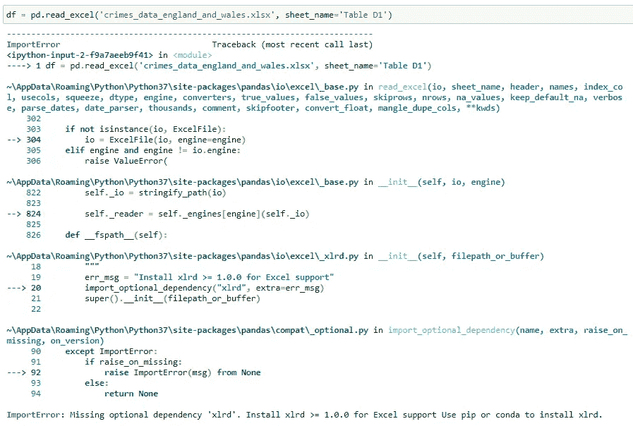

没错，一个错误！事实证明，pandas 本身无法读取 Excel 文件，因此我们需要安装另一个 python 包来完成这项工作。

我们有两种选择:`xlrd`和`openpyxl`。包`xlrd`可以同时打开 Excel 2003(。xls)和 Excel 2007+(。xlsx)文件，而`openpyxl`只能打开 Excel 2007+(。xlsx)文件。因此，我们将安装`xlrd`，因为它可以打开两种格式:

`pip install xlrd`

现在，如果我们再次尝试读取相同的数据:

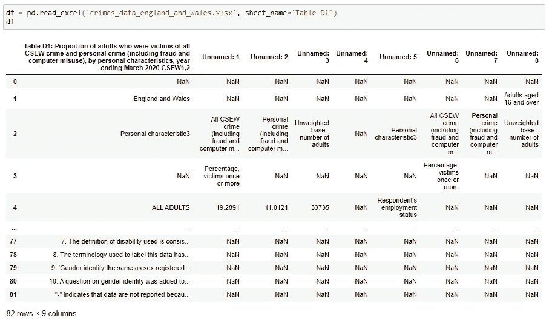

有用！

但是 Excel 文件可能会有点混乱。除了数据之外，在第一行和/或最后两行，他们可能有其他注释/解释。

要告诉 pandas 从特定的行开始读取 Excel 表，可以使用参数 header = 0-索引行从哪里开始读取。默认情况下，header=0，第一行用于给出数据框列的名称。

若要跳过工作表末尾的行，请使用 skipfooter =要跳过的行数。

例如:

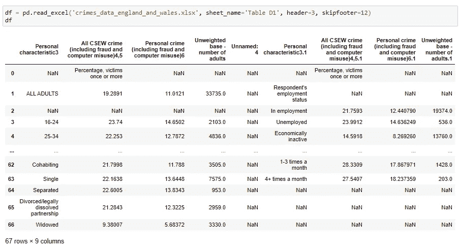

这个稍微好一点。仍然有一些特定于该数据的问题。根据我们想要实现的目标，我们可能还需要以另一种方式重新排列数据值。但是在本文中，我们将只关注数据帧的读写。

除了上面的方法，另一种读取 Excel 文件的方法是使用一个`pd.ExcelFile`对象。这样的对象可以通过使用`pd.ExcelFile(‘excel_file_path’)`构造函数来构造。一个`ExcelFile`对象有几种用法。首先，它有一个`.sheet_names`属性，是打开的 Excel 文件中所有工作表名称的列表。

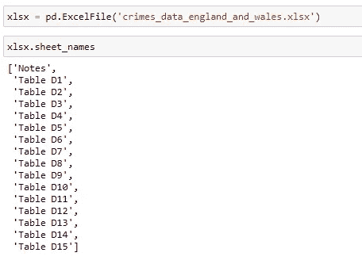

然后，这个`ExcelFile`对象也有一个`.parse()`方法，可以用来从文件中解析一个工作表并返回一个数据帧。这个方法的第一个参数可以是我们想要解析的工作表的索引或者它的名字。其余参数与`pd.read_excel()`功能中的相同。

解析第二个工作表(索引 1)的示例:

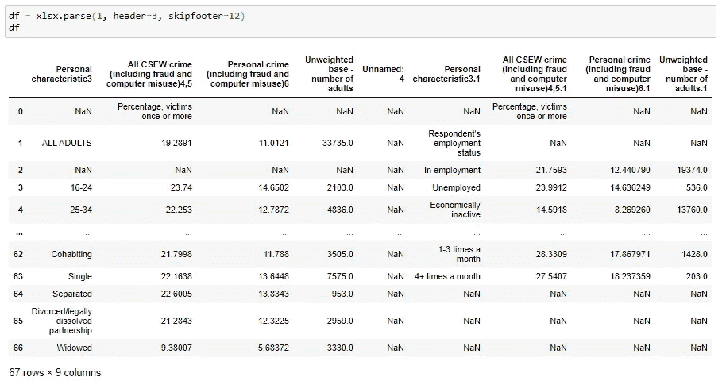

…这里我们使用名称而不是索引来解析同一个工作表:

`ExcelFile` s 也可以用在`with … as …`语句中，如果您想做一些更复杂的事情，比如只解析名称中有两个单词的工作表，您可以这样做:

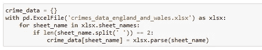

同样的事情你可以用`pd.read_excel()`代替`.parse()`的方法来做，就像这样:

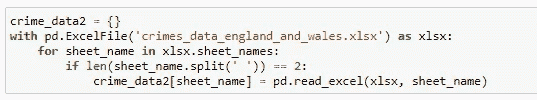

…或者，如果您只是想要所有的纸张，您可以:

## 编写 Excel 文件

现在我们知道了如何读取 excel 文件，下一步我们还可以将数据框写入 excel 文件。我们可以通过使用数据帧方法`.to_excel(‘path_to_excel_file’, sheet_name=’…’)`来实现。

让我们首先创建一个用于写入 excel 文件的简单数据框:

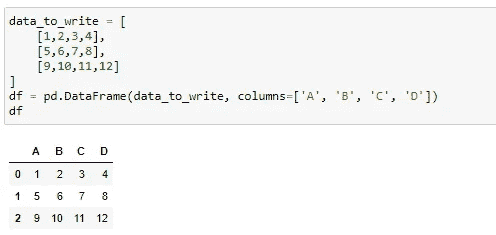

现在我们想把它写到一个 excel 文件中:

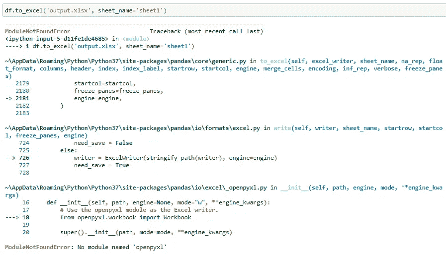

…我们得到了一个错误。

还是那句话，熊猫不能自己写 excel 文件；我们需要另外一个包装。我们的主要选择是:

*   `xlwt` —仅适用于 Excel 2003(.xls)文件；不支持追加模式
*   `xlsxwriter` —仅适用于 Excel 2007+(。xlsx)文件；不支持追加模式
*   `openpyxl` —仅适用于 Excel 2007+(。xlsx)文件；支持追加模式

如果我们想给老人写信。xls 格式，我们应该安装`xlwt`，因为它是唯一处理这些文件的。因为。xlsx 文件，我们将选择`openpyxl`，因为它也支持追加模式。

`pip install xlwt openpyxl`

现在，如果我们再次运行上面的代码，它的工作；创建了一个 excel 文件:

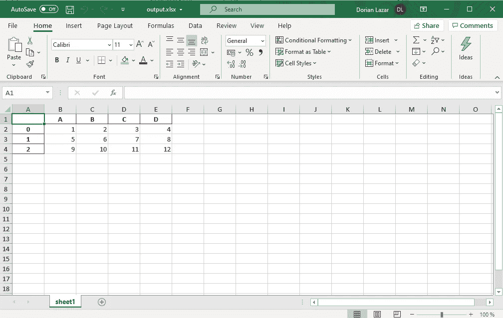

默认情况下，pandas 还会将索引列与我们的列一起写入。要消除它，使用下面代码中的`index=False`:

索引列现在不在那里:

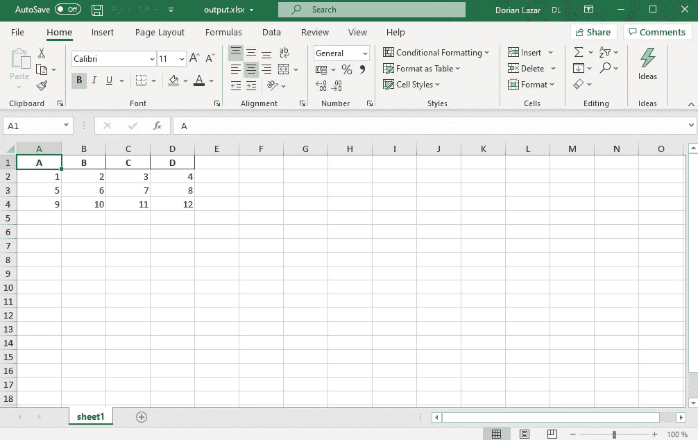

如果我们想写更多的表呢？如果我们想在前面的文件中添加第二页，你认为下面的代码可行吗？

答案是**否**。它只会用一张纸覆盖文件:sheet2。

要将更多的工作表写入 Excel 文件，我们需要使用如下所示的`pd.ExcelWriter`对象。首先，我们为 sheet2 创建另一个数据框，然后我们打开一个 Excel 文件作为`ExcelWriter`对象，我们在其中写入 2 个数据框:

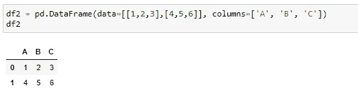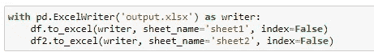

现在我们的 Excel 文件应该有 2 张。如果我们想在其中添加另一个工作表，我们需要在 append 模式下打开该文件，并运行与前面类似的代码。例如:

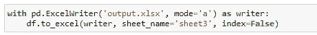

我们的 Excel 文件现在有 3 张表，如下所示:

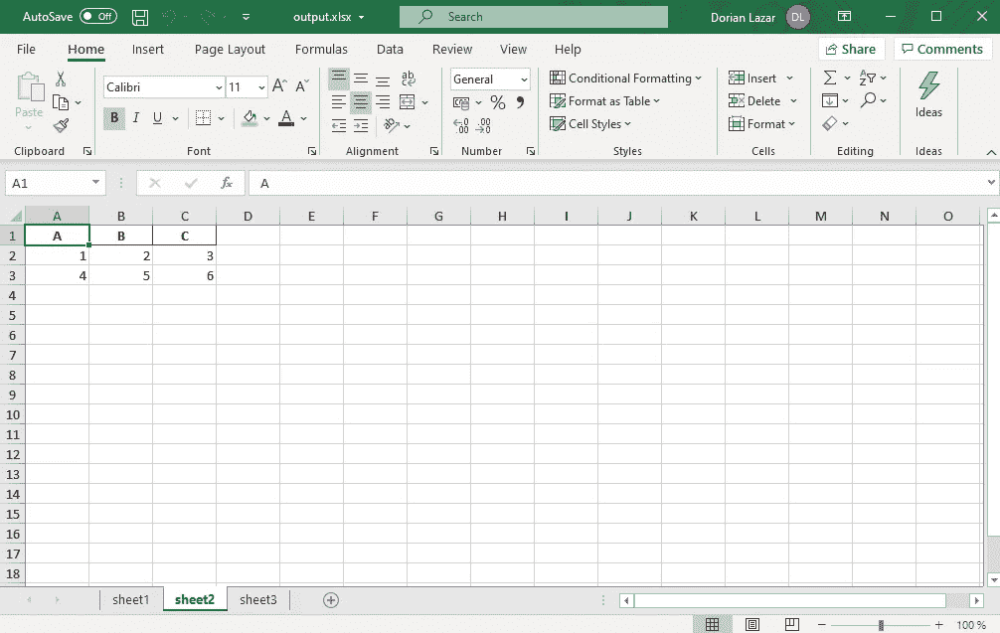

## 使用 Excel 公式

此时，您可能对 Excel 公式感到疑惑。他们怎么了？如何从有公式的文件中读取？怎么把它们写到 Excel 文件里？

嗯……好消息。这很容易。将公式写入 Excel 文件就像只写公式的字符串一样简单，这些字符串会被 Excel 自动解释为公式。

举个例子:

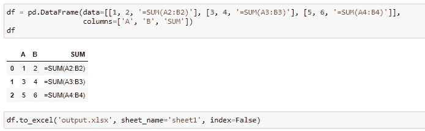

上面的代码生成的 Excel 文件是:

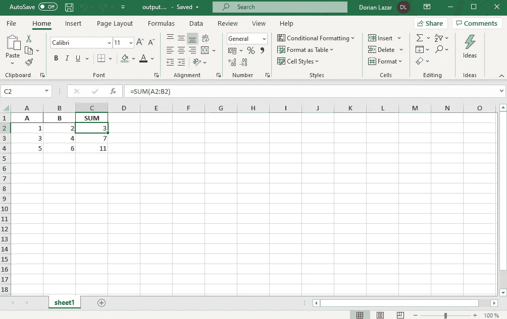

现在，如果我们想读取一个包含公式的 Excel 文件，pandas 会将这些公式的结果读入数据框。

例如，让我们读取我们之前创建的文件:

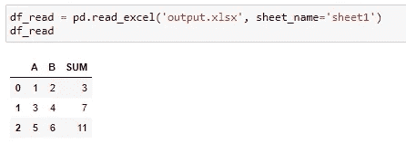

有时，您需要手动保存 Excel 文件，这样才能工作，并且不会得到零而不是公式的结果(在执行上面的代码之前按 CTRL+S)。

下面是 Jupyter 笔记本的代码:

*我希望这些信息对您有用，感谢您的阅读！*

这篇文章也贴在我自己的网站[这里](https://www.nablasquared.com/how-to-work-with-excel-files-in-pandas/)。随便看看吧！