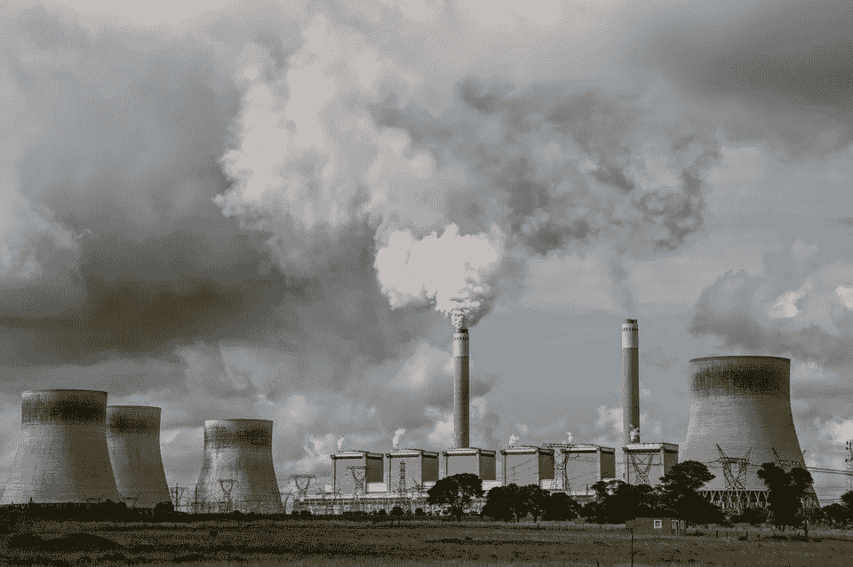
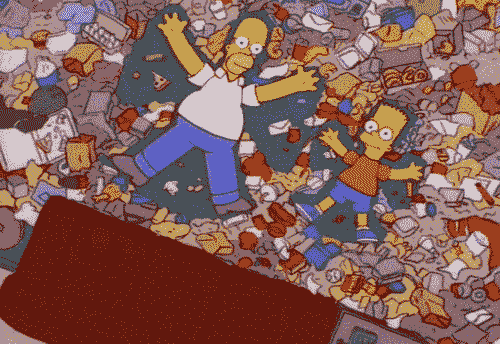
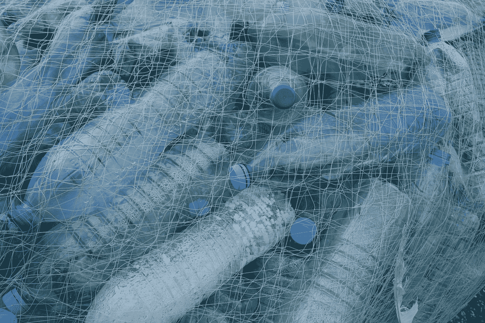

# 关于数据来源的一切

> 原文：<https://towardsdatascience.com/how-to-work-with-someone-elses-data-6c45d467d7a2?source=collection_archive---------8----------------------->

## 非结构化数据、继承的数据、耗尽的数据、混淆的数据和其他小精灵

如果你正准备加入公民[数据科学家](http://bit.ly/quaesita_datasci)的行列(一头扎进[新冠肺炎](http://bit.ly/quaesita_covid)的数据，也许？)关于数据来源，您应该知道一些事情…

# 数据出处:“谁收集的，为什么？”

社会被关于[数据](http://bit.ly/quaesita_hist)的扭曲预期所困扰，充斥着像*“数字不会说谎”**“在你给我看数据之前，这只是你的看法”*(不，仍然是[你的看法](http://bit.ly/quaesita_confirmation))和*“我看了数据，所以现在我是知情的。”*

在每个孩子的一生中，总会有那么一段时间，他们必须认识到:牙仙不是真的。事情不会因为你有一些数字就奇迹般地解决。这些数字从何而来真的很重要。(有些孩子比这个发展里程碑晚了几十年。)

任何人都可以把一些[电子涂鸦](http://bit.ly/quaesita_hist)放在一个表格里，称之为数据。从你与科学联系的意义上来说，这并不意味着它是好的/真实的/有用的/有价值的。

即使数据集被仔细地收集，你确定你知道它在到达你的途中发生了什么吗？恶棍不会从你的梦数据集中删除不方便的行的唯一原因(*“对你隐藏数据？我绝不会。这些都是离群值。”*)或者在与你分享数据之前，以扭曲信息的方式聚集东西，这太容易了。(自重的小人更喜欢挑战。)

对来源进行推理的能力是数据素养的基本要求之一，所以让我们做一些区分:

*   ***主要数据与继承(次要)数据***
*   ***采集数据对比排气数据***
*   ***结构化数据与非结构化数据***
*   ***原始数据对加工数据***

然后总结它们的相对优点来完成这篇文章。

# 初级与次级

如果你(或你所在的团队)直接从现实世界中收集了[的观察数据](http://bit.ly/quaesita_vocab)，你就在使用 ***原始数据*** 。换句话说，您可以控制如何记录和存储这些测量结果。

相反的是什么？ ***继承(次级)数据*** 是那些你从别人那里获得的数据。(例如，您可以在这里获得超过 2000 万个数据集[。)](http://bit.ly/quaesita_datasearch)

继承的数据集就像继承的牙刷:使用它们是一种绝望的行为。如果可能的话，你总是更喜欢使用自己的数据集，因为二手数据集充满了陷阱。不幸的是，你可能没有这个选择。

如果你对我对继承数据集的深入研究感兴趣——包括如何使用它们的建议——在这里绕一个小弯。

# 捕获与排放

***捕获数据*** 是为了特定的分析目的而有意创建的，而排气数据是数字化/在线活动的副产品。 ***耗尽数据*** 通常发生在网站出于调试或数据收集等目的而非特定分析目的存储活动日志时。

> 捕获的数据是为数据科学专业人员用于特定目的而创建的，而排气数据则不是。

尾气数据可能是[分析](http://bit.ly/quaesita_hero)的宝库，但却是[统计推断](http://bit.ly/quaesita_statistics)的噩梦。(我关于统计学和分析学的区别的文章是[这里](http://bit.ly/quaesita_versus)。)如果您正在进行谨慎的数据驱动的决策，如果可以选择，您会更喜欢捕获的数据。另一方面，如果你在寻找惊喜或希望激发原创想法的灵感，你可能想将目光投向捕捉到的数据集之外。

如果你习惯于处理为分析而创建的数据，你可能会觉得在这个乱七八糟的数据仙境中有些东西不太对劲…但你又不能确切地指出它。如果您习惯的所有惯例都被忽略，并且日志记录选择感觉有点古怪，原因很简单:这些数据集不是为您的眼球设计的。因此，如果尾气数据感觉像是需要额外清理和处理的垃圾，你也不应该感到惊讶。深呼吸，分配额外的时间给你的争吵。

# 结构化与非结构化

与此相关的是，我很难接受“非结构化数据”这个新名字，直到我意识到这只是商业世界重新发现一个非常古老的概念:一团糟。

> 你称之为非结构化数据的东西只是需要你把它结构化的数据。

如果我们迂腐的话，就没有非结构化数据这种东西(因为通过存储，它们必然被迫具有某种结构)，但是让我大方一点。以下是该定义想要表达的意思:

*   *结构化数据被整齐地格式化，准备进行分析。*
*   ****非结构化数据*** 不是你想要的格式，它们强迫你把自己的结构放在上面。(想想[巨魔](http://bit.ly/trollololo)留下的图片、邮件、音乐、视频、文字评论。)*

**

*你称之为非结构化数据的东西只是需要你把它结构化的数据。迷因:[来源](https://giphy.com/gifs/the-simpsons-trash-garbage-5xaOcLCBzBw4QrtdDP2)。*

*例如，您可能希望以[漂亮的表格格式](http://bit.ly/quaesita_slkid)处理图像数据，但是您却发现一个文件夹中充满了各种不同扩展名和格式的图片。雪上加霜的是，你发现了一个文本文件，里面有各种网站上更多图片的链接。恶心恶心。*

*把东西存放得如此混乱需要一种特殊的天赋，这就是为什么你通常会发现背后的罪魁祸首是人类。至少像日志文件这样的机器生成的尾气数据有某种标准化的格式(即使是愚蠢的格式)，这就是为什么我们称那些东西为半结构化数据。*

> *一个分析师的垃圾是另一个分析师的财富。*

*把结构化数据想象成整洁的图书馆，把非结构化数据想象成混乱的阁楼，这不会伤害你。和数据一样，世界上图书馆的数量远远少于乱七八糟的藏书。(我可以从我的桌子上看到一个。)当然，旁观者清。您可能会发现图像数据从定义上来说是杂乱的，而我可能只会在它们以上述方式到达时才发现它们是杂乱的。一个分析师的垃圾是另一个分析师的宝藏。*

> *非结构化数据“革命”背后的观点是，您对非标准数据格式的耐心可能会获得丰厚的回报。*

*对于非结构化数据，你唯一能做的就是[分析](http://bit.ly/quaesita_hallows)。为了将它用于[统计推断](http://bit.ly/quaesita_versus)或 [ML/AI](http://bit.ly/quaesita_simplest) ，你必须对它进行结构化。当您的数据从非结构化转向结构化时，您通常会侵蚀其中的一些信息，就像您在准备沙拉时扔掉洋葱的薄片一样。*

*由于非结构化数据在您使用它们时就变得结构化了，因此它们的真正“优势”是您一开始就拥有它们。如果企业必须让他们所有的数据都符合你的口味，他们可能会对所涉及的努力嗤之以鼻，懒得存储那么多数据。结果，你能接触到的数据挖掘的来源就少多了。*

# *生的与加工的*

*说到清理， ***原始数据*** 是采集后未被改动的数据，而 ***处理后的数据*** 是被清理和/或转换的数据。换句话说，原始数据以原始形式到达，没有被陌生人篡改。原始数据几乎总是需要一点爱(阅读:清洁工的工作)才能变得有用。*

*你可能认为这意味着处理过的数据优于原始数据…但这是一个陷阱！因为数据科学专业人员编写代码来处理他们的数据(参见*“非破坏性编辑”*)，真正优越的选择是原始数据和处理代码。如果您正在共享数据，这是最好的方法(除非有法律/隐私原因需要在处理过程中隐藏一些数据，或者原始数据集非常庞大)。*

> *真正优越的选择是伴随处理代码的原始数据。*

*让自己脱离电子表格并编写代码来为自己做数据工作，可以确保在清理过程中不会破坏任何信息，并允许您改变主意，比如说，像剪掉一些有问题的代码一样容易地去除离群值或进行类别聚合。*

*如果我们要细化，那么让我们命名一些种类的**处理过的数据**:*

*   ****转换后的数据*** —信息被改变，从而无法重建*
*   ****聚合数据*** —原始的信息内容在观察值上折叠*
*   ****混淆数据*** —信息被有意隐藏(例如通过删除或噪声注入)*
*   ****礼貌数据*** —嗯？*

*最后一个是我喜欢做的半开玩笑的区分。只要在转换/聚合过程中没有丢失任何信息，我不反对接收一个格式良好的原始数据集的礼貌版本(具有良好的文档和有意义的变量名)。例如，如果你要给我发送数据，并且你知道我喜欢用千克而不是磅，那么用我觉得更容易使用的 *weight_kg* 列替换你那令人困惑的 *wlb* 列是礼貌的；这比给我发送原始数据稍微好一点。但是如果你用二进制列*替换 *wlb* 是超重的*，你将向我发送不礼貌的处理过的数据。那是因为你不必要地破坏了原始数据中的一些信息…谁说我会同意你对超重的定义？*

**

# *选择数据集*

*原始数据至高无上…如果你负担得起的话。如果你要使用其他人的数据，最好使用原始的/礼貌的数据，除非他们的领域专长远远超过你。如果你问的问题与最初的收集者感兴趣的问题相同，那么捕获的数据更有优势。如果你想从尚未有人想到的方向中获得灵感，排气数据可能是一个更好的选择(因为捕获的数据更有可能给你留下与原始收集者相似的结论)。快速总结:*

***主要**数据优势:对质量的控制。
**次要**数据优势:省时省钱。*

***抓取**数据优势:统计推断和决策。
**穷尽**数据优势:激发原创想法。*

***结构化**数据优势:需要清理的少。
**非结构化**数据优势:有些东西不会以其他方式存储。*

***Raw** 数据优势:几乎一切。
**处理过的**数据优势:应对海量原始数据集。*

# *使用他人数据的建议*

*在这里继续阅读第 2 部分…*

# *感谢阅读！人工智能课程怎么样？*

*如果你在这里玩得开心，并且你正在寻找一个为初学者和专家设计的有趣的应用人工智能课程，这里有一个我为你制作的娱乐课程:*

*在这里欣赏整个课程播放列表:[bit.ly/machinefriend](http://bit.ly/machinefriend)*

# *与凯西·科兹尔科夫联系*

*让我们做朋友吧！你可以在 [Twitter](https://twitter.com/quaesita) 、 [YouTube](https://www.youtube.com/channel/UCbOX--VOebPe-MMRkatFRxw) 和 [LinkedIn](https://www.linkedin.com/in/kozyrkov/) 上找到我。有兴趣让我在你的活动上发言吗？用[这个表格](http://bit.ly/makecassietalk)联系。*