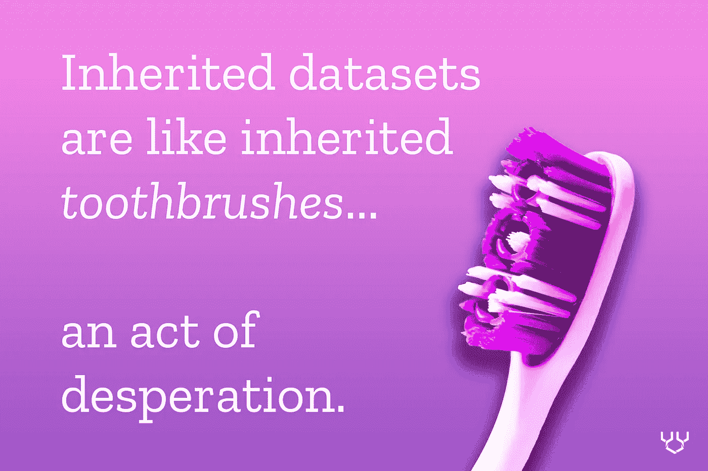
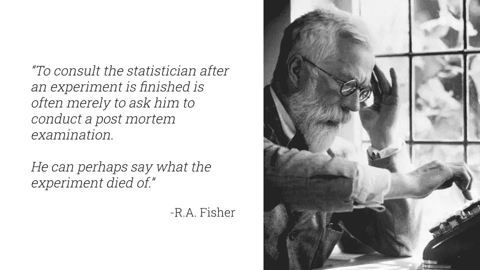
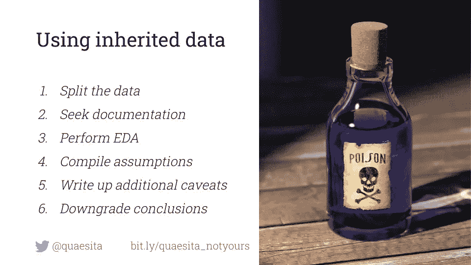

# 如何使用他人的数据

> 原文：<https://towardsdatascience.com/how-to-work-with-someone-elses-data-f33485d79ed4?source=collection_archive---------18----------------------->

## 处理继承数据指南

# 定义

如果你(或你所在的团队)直接从现实世界中收集了[的观察结果](http://bit.ly/quaesita_vocab)，那么你就在使用*的原始数据。换句话说，您可以控制如何记录和存储这些测量结果。*

*相反的是什么？ ***继承(次级)数据*** 是你从别人那里获得的那些数据。(例如，您可以在这里获得超过 2000 万个数据集[。)](http://bit.ly/quaesita_datasearch)*

**想要其他相关术语的定义吗？在我的主文* [*上找到它们的数据出处*](http://bit.ly/quaesita_provenance) *。(你正在读第二部分。)**

**

# *买家当心*

*继承的数据集就像继承的牙刷:使用它们是一种绝望的行为。如果可能的话，你总是喜欢用你自己的。不幸的是，你可能没有这个选择。收集原始数据可能非常昂贵。*

> *收集自己的数据是一种奢侈，不是每个人都能负担得起的。*

*虽然原始数据带有一股让人想起手工奶酪的优越感，但任何坚持认为你没有利用继承数据的价值的人都应该检查一下他们的特权。个人(以及没有强大数据传统的公司或某个领域的新来者)可能没有资源独自收集数据，特别是当项目需要非常大的数据集或专业技能/设备时。例如，不是每个人都能负担得起在生物安全等级高的实验室环境中进行病原体测量。*

> *有时候你唯一的选择就是尽量利用别人的数据。*

*但是，如果你被迫使用其他人的数据，如果事情没有像你希望的那样发展，不要感到惊讶。不能保证继承的数据能满足你的需求……(而且，牙仙也不是真的。)*

> *购买者请注意:不能保证继承的数据能满足您的需求。*

**

*仅仅因为有人卖给你一个标有“晚餐用品”的包装，并不意味着你可以用它做一顿美味的晚餐。如果里面只装了一堆卫生纸呢？小心使用继承的数据；它可能不适合你的需要。*

*下面是我喜欢的 R.A .费舍尔的一句话:*

> *“在一个实验完成后咨询统计学家往往只是要求他进行一次事后检查。他也许可以说实验死于什么。”*

*这也适用于您继承的数据集——它的收集在您到达现场之前就已完成，因此它不是为满足您的需求而设计的。就你的预期目的而言，它可能已经过时了，你最多只能从中挤出一次尸检。我希望你已经绕着太阳走了足够多的路程，不要让这个激怒你。*

> *继承的数据更容易获得，但更难信任。*

*如果你正处于抗议的边缘，认为有一些数据总比没有数据好，那就用“*噪音*”/*谎言*/*干扰*”来代替“*数据*，然后再试试你的句子。质量就是一切，如果您没有自己收集数据集，您就无法控制测量的内容和(可能更重要的)遗漏的内容。有些数据只比没有数据好*些*倍。*

**

*当您被迫处理继承的数据时，您有五个主要问题需要担心:*

*   ***目的** —收集数据集的目的是否与您的目的相似？*
*   ***能力** —你相信收集数据的团队能够胜任测量工作吗？*
*   ***议程** —你相信数据集不会被其作者的[偏见](http://bit.ly/quaesita_biasdef)和议程所污染吗？([不要太快相信](http://bit.ly/quaesita_aibias)！)*
*   *清晰 —是否有清晰的文档来防止你误解数据集的内容？*
*   ***处理** —你确定数据集没有被转换、扭曲或篡改吗？*

**

# *使用他人数据的建议*

*您应该如何处理继承的数据？就像你接触到的任何数据集一样，你的第一个动作，习惯——本能！—应该是 [SYDD](http://bit.ly/quaesita_sydd) 。(*“拆分你那该死的数据。”将任何未指定用于探索的数据放在安全的地方。**

## *证明文件*

*接下来，寻找关于继承数据集如何产生的文档是至关重要的。如果可能的话，试着找出并联系负责数据收集的罪犯，诶，项目成员，找出他们到底做了什么，并问他们澄清问题。如果与最初的团队协商是不可能的(或者如果他们忘记了他们做了什么)，你将被迫依赖书面文档。(看到了吗？这也是为什么好的文档如此重要的另一个理由。)*

*如果你是一名[分析师](http://bit.ly/quaesita_versus)(不做[统计](http://bit.ly/quaesita_statistics)推断)，你可以采取一种轻量级的方法:找出有多少文档存在，有多详细，对数据质量是否值得你的时间投入进行一次直觉检查，然后只在你通常的探索性数据分析需要时使用文档( [EDA](http://bit.ly/quaesita_hallows) )。然而，如果你认为你发现了足以激励决策者的东西，彻底检查文档，以确保你没有陷入明显的红鲱鱼。*

*如果你正在做 [ML/AI](http://bit.ly/quaesita_emperor) ，你可以采取类似的方法，在粗略浏览文档之后，使用继承的数据进行[训练](http://bit.ly/quaesita_mrbean)，但是——看在上帝的份上！— [仔细验证](http://bit.ly/quaesita_idiot)并[根据您自己的原始数据测试您的模型](http://bit.ly/quaesita_donttrust)。如果你没有彻底检查原始数据的表现，那就不算数。你对自己和他人都是一种威胁。请不要发射。*

*统计学家不会轻易放过任何事情。如果您正在从事一个数据驱动的决策项目，那么在处理继承的数据之前，您必须彻底了解文档。这听起来非常无聊，但这是你为了安全地使用不是你自己创建的数据而必须付出的代价。具体来说，确保您编写了自己的文档，详细说明了您对采样过程、潜在偏差以及生成您所继承的数据的实际操作的理解。*

## *数据质量*

*当您研读文档时，请查找变量名的确切含义，并请一位分析师朋友帮助您做一些 EDA 工作，以确保数据不会完全混乱。例如，应该为正的事物没有负值，没有无差异的列，没有重复，没有矛盾，等等。如果你不确定要注意什么，你可能想从标准健康检查中查找一些关于数据质量的关键词:*

***是否涵盖了正确的主题？***

*   *目的*
*   *有用*
*   *关联*
*   *相似性*
*   *综合性*

***是否存在准入障碍？***

*   *有效性*
*   *易接近*
*   *清楚*
*   *储存；储备*

*你能相信消息来源吗？*

*   *能力*
*   *可靠性*
*   *可靠性*
*   *议程*
*   *偏见*

***你能相信你所看到的吗？***

*   *准确(性)*
*   *一致性*
*   *有效期*
*   *独特性*
*   *处理*

***你能相信你看不见的东西吗？***

*   *完全*
*   *一致性*
*   *及时*
*   *潜伏*

## *假设和警告*

*非常重要的一点是，你不要做出过早的假设——仅仅因为某样东西被称为“重量”并不意味着它就是你所认为的那样。它可以是 SI 单位或重要性权重或其他任何东西——人们将最糟糕的标签放在他们的数据集中，特别是如果他们在创建这些标签时没有考虑到其他数据科学家。*

> *不要做不成熟的假设。*

*另外，不要相信任何人！即使文档中说“重量”是指以千克为单位的重量，也要记住抄写错误和其他测量错误是一回事。例如，如果该列声称包含权重，您可能会问自己:*是否使用了秤？(或者只是眼球？我哪里知道？)尺度有多精确？有不止一个音阶吗？它们被仔细校准了吗？测量人员训练有素吗？**

**

*我自己量一下，谢谢。图片:[来源](https://www.catster.com/wp-content/uploads/2017/10/A-fat-cat-on-the-scale-licking-his-lips.jpg)。*

*当您在文档中回答这些问题时，您会惊讶地发现“*这是什么#$%@呢？”*和*“这在现实生活中是如何实现的？”*你能得到好的、精确的答案的问题。*

> *这意味着你必须放弃吗？你可以继续……保持适当的谨慎和谦逊。*

*这意味着你必须放弃吗？不。你可以继续…带着适当的谨慎和谦逊。每次你发现一个问题，你都会义不容辞地对你被迫做出的关于在数据收集过程中到底发生了什么的猜测大加赞赏。*

**

*你会在以下事情上花费大量无聊的时间:*

*   *陈述你被迫做出的假设。*
*   *写下要包括在你最终报告附录中的警告注释。*
*   *写下注意事项，警告决策者(和你的其他读者)由于潜在的数据问题，研究的结论需要降级。*

> *你欠读者和决策者的道歉程度取决于你对类似数据的经验和专业知识。*

*简单地说:你对收集数据的真实环境了解得越多，你的假设就越不可信，你就越不需要在听众面前卑躬屈膝。*

*如果你是该领域的专家——例如，如果你是一名与流行病学家一起工作的经验丰富的生物统计学家，你比我更有资格对新冠肺炎数据集收集过程中发生的事情做出合理的假设。如果我厚颜无耻地在没有经验丰富的主题专家支持的情况下钻研这些数据，我将欠我自己和我的观众一份对我的无知的评估(以书面形式！)之后再继续。*

> *“由于我们的项目团队没有参与规划研究或数据收集，我们可能遗漏了关键的背景，从而导致我们的结论无效。”*

*除了写下软化结论的笔记，每个有自尊的作者都应该记得附上这样一个总括性的继承数据警告:*“由于我们的项目团队没有参与规划研究或数据收集，我们有可能遗漏了关键的上下文，从而导致我们的结论无效。”**

> *这与完美主义无关。试图用数据稍微增加你(不完美的)理解是完全合理的。只是不要忘记承认你有多少不知道的。*

*这与完美主义无关。试图用数据稍微增加你(不完美的)理解是完全合理的。请记住，多学一点并不等于什么都知道…不要忘记承认你有多少不知道。如果你做不到这一点，你会把任何信任你的人直接带下悬崖。*

*谦逊可能是媒体断奶的注意力持续时间的罗嗦，但过度自信的替代方案更糟糕。*

# *感谢阅读！人工智能课程怎么样？*

*如果你在这里玩得开心，并且你正在寻找一个为初学者和专家设计的有趣的应用人工智能课程，这里有一个我为你制作的娱乐课程:*

*在这里欣赏整个课程播放列表:[bit.ly/machinefriend](http://bit.ly/machinefriend)*

# *喜欢作者？与凯西·科兹尔科夫联系*

*让我们做朋友吧！你可以在 [Twitter](https://twitter.com/quaesita) 、 [YouTube](https://www.youtube.com/channel/UCbOX--VOebPe-MMRkatFRxw) 、 [Substack](http://decision.substack.com) 和 [LinkedIn](https://www.linkedin.com/in/kozyrkov/) 上找到我。有兴趣让我在你的活动上发言吗？使用[表格](http://bit.ly/makecassietalk)取得联系。*