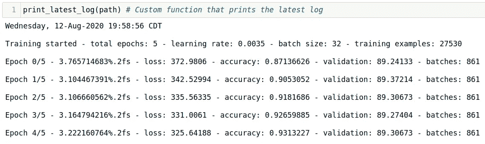
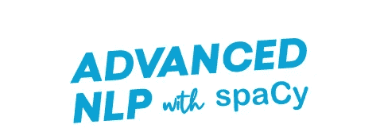
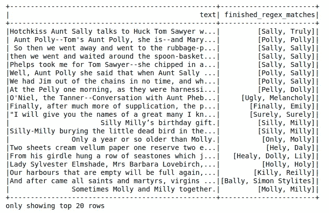
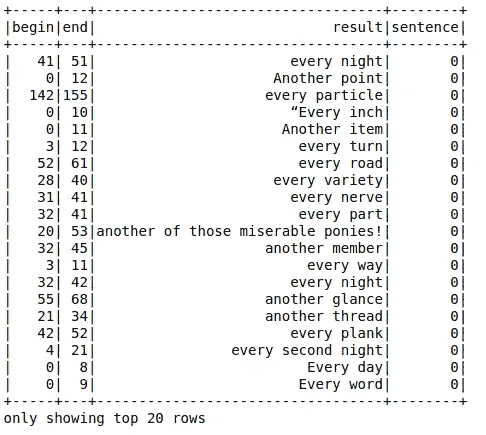
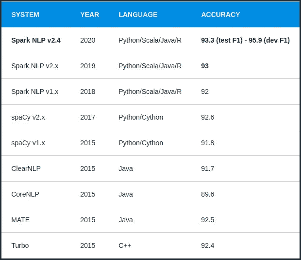

# 如何理解 Spark NLP

> 原文：<https://towardsdatascience.com/how-to-wrap-your-head-around-spark-nlp-a6f6a968b7e8?source=collection_archive---------36----------------------->

## *跟进*“如何在两周内开始 SparkNLP 第一部分”*


[摄影:Pixabay](https://www.pexels.com/photo/pine-trees-by-lake-in-forest-against-sky-247474/)

欢迎阅读 Spark NLP 文章的第二部分。在第一部分中，目标是为 NLP 从业者提供一个破冰的平台，并让他们对 Spark NLP 有所了解。对任何基于 Spark 的库的最大偏见来自于这样一种思想流派*“Spark 代码与常规 Python 脚本有点不同”*。为了消除这种偏见，我们分享了学习策略，如果你遵循了这些策略，你就为下一阶段做好了准备。

在本文的这一部分，我们将比较 spaCy 和 Spark NLP，并深入探讨 Spark NLP 模块和管道。我创建了一个笔记本，使用 spaCy 和 Spark NLP 来做同样的事情，进行完美的图片比较。SpaCy 表现不错，但是在速度、内存消耗、精度方面 Spark NLP 胜过它。因此，就易用性而言，一旦 Spark 的初始摩擦被克服，我发现它至少与 spaCy 不相上下，这要归功于管道带来的便利。

由 Spark NLP 创建者准备的 smart、[comprehensive notebook](https://github.com/JohnSnowLabs/spark-nlp-workshop/tree/master/tutorials/Certification_Trainings/Public)的使用，提供了大量真实场景的示例，以及我为实践而创建的 [repo](https://github.com/aytugkaya/spark_nlp) 强烈建议在所需的技能集方面表现出色。

**第 8/9 天:了解 Spark NLP 中的注释器/转换程序和使用 Spark 的** [**文本预处理**](https://github.com/JohnSnowLabs/spark-nlp-workshop/blob/master/tutorials/Certification_Trainings/Public/2.Text_Preprocessing_with_SparkNLP_Annotators_Transformers.ipynb)

**Spark NLP 库原生构建于 Apache Spark 和 [TensorFlow](https://www.analyticsindiamag.com/a-hands-on-primer-to-tensorflow/) 之上，为机器学习管道提供了简单、高效且准确的 NLP 符号，可在分布式环境中轻松扩展。这个库重用了 Spark ML 管道以及集成的 NLP 功能。**

**该库涵盖了许多常见的 NLP 任务，包括标记化、词干化、词汇化、词性标注、情感分析、拼写检查、命名实体识别，所有这些都是开源的，可以由训练模型使用您的数据。Spark NLP 的注释器利用基于规则的算法、机器学习和一些在引擎盖下运行的 [Tensorflow](https://www.tensorflow.org/) 来支持特定的深度学习实现。**

**在 Spark NLP 中，所有的**标注器**要么是估算器，要么是变换器，就像 Spark ML 一样，由两种类型组成:**标注器方法**和**标注器模型。任何在数据帧上产生模型的标注器训练都是标注器方法。那些通过一些模型将一个数据帧转换成另一个数据帧的是*注释者模型*(例如 *WordEmbeddingsModel* )。通常，如果注释器在转换数据帧时不依赖于预先训练的注释器(例如*标记器*)，它就不会使用*模型*后缀。下面是注释器及其描述的列表:****

**Spark NLP 提供的注释器列表，来源:[Spark NLP 介绍—基础和基本组件](/introduction-to-spark-nlp-foundations-and-basic-components-part-i-c83b7629ed59)**

**为了完成自然语言处理过程，我们需要对原始数据进行预处理。除了 SQL 过滤器、转换和用户定义的函数之外，Spark NLP 还附带了用于该任务的强大工具。***Document assembler***是一个特殊的转换器，它创建文档类型的第一个注释，这个注释可能会被管道中的后续注释器使用。**

*******Doc2Chunk*** 将文档类型注释转换为带有块 Col 内容的块类型，而 ***Chunk2Doc*** 将块类型列转换回文档。在尝试对块结果进行重新标记或进一步分析时非常有用。****

*******修整器*** 将注释值输出到一个字符串中，以方便使用。一旦我们的 NLP 管道准备就绪，我们可能希望在其他实际可用的地方使用注释结果。****

****如前所述，管道被指定为一系列阶段，每个阶段要么是转换器，要么是估计器。这些阶段按顺序运行，输入数据帧在通过每个阶段时会发生转换。****

****下面是这条管道在 Spark NLP 中的编码方式。****

```
**from pyspark.ml import Pipelinedocument_assembler = DocumentAssembler()\
 .setInputCol(“text”)\
 .setOutputCol(“document”)sentenceDetector = SentenceDetector()\
 .setInputCols([“document”])\
 .setOutputCol(“sentences”)tokenizer = Tokenizer() \
 .setInputCols([“sentences”]) \
 .setOutputCol(“token”)normalizer = Normalizer()\
 .setInputCols([“token”])\
 .setOutputCol(“normal”)word_embeddings=WordEmbeddingsModel.pretrained()\
 .setInputCols([“document”,”normal”])\
 .setOutputCol(“embeddings”)nlpPipeline = Pipeline(stages=[
 document_assembler, 
 sentenceDetector,
 tokenizer,
 normalizer,
 word_embeddings,
 ])pipelineModel = nlpPipeline.fit(df)**
```

****当我们在具有 Spark 数据帧(df)的管道上`fit()`时，它的*文本*列首先被送入`DocumentAssembler()`转换器，然后在*文档*类型(*注释者类型*)中创建一个新列“*文档*”。如前所述，这个转换器是任何 Spark 数据帧的 Spark NLP 的初始入口点。然后将它的文档列送入`SentenceDetector()` ( *注释者方法*)中，将文本拆分成一个句子数组，并在文档类型中创建一个新列“*句子”。然后将“句子”列输入到`Tokenizer()` ( *注释器模型*)中，对每个句子进行标记化，并在标记*类型中创建新列“*标记”。诸如此类。请参考 [Spark NLP workshop 预处理笔记本](https://github.com/JohnSnowLabs/spark-nlp-workshop/blob/master/tutorials/Certification_Trainings/Public/2.Text_Preprocessing_with_SparkNLP_Annotators_Transformers.ipynb)和 [my repo](https://github.com/aytugkaya/spark_nlp) 查看注释器和转换器的工作情况。*****

******第 10 天:Regex**
*正则表达式本质上是一种嵌入在 Python 中的微小的、高度专门化的编程语言，并通过* `[*re module*](https://docs.python.org/3/library/re.html#module-re)` *可用。* *使用这个小语言，你为你想要匹配的可能字符串集合指定规则；这个集合可能包含英语句子，或者电子邮件地址，临床实体，或者任何你喜欢的东西。您还可以使用正则表达式来修改字符串或以各种方式拆分它。*****

****Regex 是 NLP 的主要构件之一，我们不仅将使用它进行预处理，还将它作为 Spark NLP 管道中`RegexMatcher`的一部分。由于有时可能相当复杂，我推荐 Maria Eugenia Inzaugarat 的这个[课程](https://learn.datacamp.com/courses/regular-expressions-in-python)，以便快速掌握高级主题，请参考[官方 python 文档](https://docs.python.org/3/library/re.html)以及精彩的 python [regex how to](https://docs.python.org/3/howto/regex.html#regex-howto) 教程。我用来掌握 regex 的另一个关键组件是 [Regex101](http://regex101.com) ，这是一个非常强大的 API，可以让你在文本块上测试几乎任何正则表达式。****

****大多数时候正则表达式被忽略了。相信我:你会需要它，你会使用它。你知道的越多越好。****

******第 11 天:预训练模型******

****前面提到过，经过训练的标注器被称为*标注器模型*，这里的目标是通过指定的模型(经过训练的标注器)将一个数据帧转换成另一个数据帧。Spark NLP 提供多种语言的预训练模型，您需要做的就是加载预训练模型并相应地配置其参数。当您可以通过一种`transform()`方法直接应用预先训练好的 SOTA 算法时，为什么还要担心从头开始训练新模型呢？在[官方文档](https://nlp.johnsnowlabs.com/docs/en/models)中，您可以找到关于如何使用哪些算法和数据集来训练这些模型的详细信息。[笔记本样本可在此处找到](https://www.johnsnowlabs.com/spark-nlp-in-action/)。****

```
**MODEL_NAME='sentimentdl_use_twitter'documentAssembler = DocumentAssembler()\
    .setInputCol("text")\
    .setOutputCol("document")use = UniversalSentenceEncoder.pretrained(name="tfhub_use", lang="en")\
 .setInputCols(["document"])\
 .setOutputCol("sentence_embeddings")sentimentdl = SentimentDLModel.pretrained(name=MODEL_NAME, lang="en")\
    .setInputCols(["sentence_embeddings"])\
    .setOutputCol("pr_sentiment")nlpPipeline = Pipeline(
      stages = [
          documentAssembler,
          use,
          sentimentdl
      ])empty_df = spark.createDataFrame([['']]).toDF("text")pipelineModel = nlpPipeline.fit(empty_df)result = pipelineModel.transform(spark_df1)**
```

******第 12/13 天:文本分类******

****Spark NLP 中有几个文本分类选项:****

*   ****Spark NLP 中的文本预处理和使用来自 [Spark ML](https://spark.apache.org/docs/latest/ml-guide.html) 的 ML 算法****
*   ****Spark ML 的 Spark NLP 和 ML 算法中的文本预处理和单词嵌入(Glove、Bert、Elmo)****
*   ****Spark ML 的 Spark NLP 和 ML 算法中的文本预处理和句子嵌入(通用句子编码器)****
*   ****Spark 自然语言处理中的文本预处理和分类器****

****正如在关于 Spark NLP 的文章[中所讨论的，在`ClassifierDL`之前的所有这些文本处理步骤都可以在一个流水线中实现，这个流水线被指定为一系列阶段，每个阶段要么是一个转换器，要么是一个估计器。这些阶段按顺序运行，输入数据帧在通过每个阶段时会发生转换。也就是说，数据按顺序通过拟合的管道。每个阶段的`transform()` 方法更新数据集并将其传递给下一个阶段。在`Pipelines`的帮助下，我们可以确保训练和测试数据经过相同的特征处理步骤。](/introduction-to-spark-nlp-foundations-and-basic-components-part-i-c83b7629ed59)****

****你可以用这个`ClassiferDL`在 Spark NLP 中构建一个包含`Bert`、`Elmo`、`Glove`和`Universal Sentence Encoders`的文本分类器。样本分类器笔记本可以在[这里](https://github.com/JohnSnowLabs/spark-nlp-workshop/blob/master/tutorials/Certification_Trainings/Public/5.Text_Classification_with_ClassifierDL.ipynb)和[这里](https://github.com/aytugkaya/spark_nlp/tree/master/toxicity)找到。****

```
**document_assembler = DocumentAssembler() \
    .setInputCol("comment_text") \
    .setOutputCol("document")\
    .setCleanupMode('shrink')tokenizer = Tokenizer() \
  .setInputCols(["document"]) \
  .setOutputCol("token")

normalizer = Normalizer() \
    .setInputCols(["token"]) \
    .setOutputCol("normalized")\
    .setLowercase(True)stopwords_cleaner = StopWordsCleaner()\
      .setInputCols("normalized")\
      .setOutputCol("cleanTokens")\
      .setCaseSensitive(False)lemma = LemmatizerModel.pretrained('lemma_antbnc') \
    .setInputCols(["cleanTokens"]) \
    .setOutputCol("lemma")bert = BertEmbeddings.pretrained('bert_base_uncased', 'en') \
      .setInputCols("document", "lemma") \
      .setOutputCol("embeddings")\
      .setPoolingLayer(0) # default 0embeddingsSentence = SentenceEmbeddings() \
      .setInputCols(["document", "embeddings"]) \
      .setOutputCol("sentence_embeddings") \
      .setPoolingStrategy("AVERAGE")classsifierdl = ClassifierDLApproach()\
  .setInputCols(["sentence_embeddings"])\
  .setOutputCol("prediction")\
  .setLabelColumn("toxic")\
  .setMaxEpochs(5)\
  .setEnableOutputLogs(True)\
  .setBatchSize(32)\
  .setValidationSplit(0.1)\
  .setDropout(0.75)\
  .setLr(0.0035)\
  #.setOutputLogsPath('logs')clf_pipeline = Pipeline(
    stages=[document_assembler, 
            tokenizer,
            normalizer,
            stopwords_cleaner, 
            lemma, 
            bert,
            embeddingsSentence,
            classsifierdl
           ])clf_pipelineModel = clf_pipeline.fit(sdf)**
```

********

******第 13–14 天:SpaCy 或 Spark NLP —基准比较******

****在本节中，我们将获得大量的练习编码！我们将使用从 Gutenberg.org 下载的七部不同经典著作组成的图书馆。该语料库包括大约 490 万个字符和 9.7 万个句子。我们将使用 spaCy 和 Spark NLP 的类似过程构建相同的输出数据帧，然后比较结果。****

****Spacy 是我见过的记录最好的图书馆之一，我惊喜地发现现在他们包括了一门免费课程，我以前上过。如果需要的话，这是一个提升你技能的好机会。****

********

****比较的整个笔记本和语料数据可以在我的 [GitHub repo](https://github.com/aytugkaya/spark_nlp/tree/master/spaCy_SparkNLP_comparison) 中找到。让我们从检查空间方式开始。****

```
**### 2.1 Clean Tabs and Whitespace
clean_shrink = lambda text : text.replace(r'\n|\t|\s+',' ').replace('\s+',' ').strip()
df.loc[:,'document']=df.text.map(clean_shrink)### 2.2 Tokenizer
sentence_tokenizer = lambda sent : [token for token in nlp(sent)]
df.loc[:,'token']=df.document.map(sentence_tokenizer)### 2.3 Normalizer
normalizer = lambda tokens : [re.sub(punct,'',token.text)  for token in tokens if re.sub(punct,'',token.text) != '']
df.loc[:,'normalized']=df.token.map(normalizer)### 2.4 Remove Stop Words
normalizer_and_stop = lambda tokens : [re.sub(punct,'',token.text)  for token in tokens if re.sub(punct,'',token.text) != '' and not token.is_stop]
df.loc[:,'cleanTokens']=df.token.map(normalizer_and_stop)### 2.5 Lemmatize
normalizer_and_stop_lemma = lambda tokens : [re.sub(punct,'',token.lemma_)  for token in tokens if re.sub(punct,'',token.text) != '' and not token.is_stop]
df.loc[:,'lemma']=df.token.map(normalizer_and_stop_lemma)### 2.6 Stemmer
stemmer = PorterStemmer()
stems = lambda tokens : [stemmer.stem(token.text) if len(tokens)>0 else [] for token in tokens]
df.loc[:,'stem']=df.token.map(stems)### 2.7 Part of Speech Tagging
normalizer_and_stop_pos = lambda tokens : [re.sub(punct,'',token.pos_)  for token in tokens if re.sub(punct,'',token.text) != '' and not token.is_stop]
df.loc[:,'pos']=df.cleanTokens.map(normalizer_and_stop_pos)### 2.8 Token Assembler
token_assembler = lambda tokens : " ".join(tokens)
df.loc[:,'clean_text']=df.cleanTokens.map(token_assembler)### 2.9 Tagger
tagger = lambda text : [(ent.text, ent.label_) for ent in nlp(text).ents]
df.loc[:,'ner_chunks']=df.loc[:,'document'].map(tagger)### 2.10 Regex Parser
noun_chunker = lambda text : [(chnk,(chnk[0].pos_,chnk[1].pos_,chnk[2].tag_ ))for chnk in nlp(text).noun_chunks if len(chnk.text.split())==3\
                              and  chnk.text.replace(' ','').isalpha()   and chnk[0].pos_ == 'DET'and chnk[1].pos_ == 'ADJ' and chnk[2].tag_ in ['NN','NNP']
                             ]
df.loc[:,'RegexpParser'] =df.loc[:,'document'].map(noun_chunker)**
```

****让我们暂停一下，观察正则表达式解析器的输出。我们要求名词组块器返回由一个**限定词**、一个**形容词**和一个**名词**(专有、单数或复数)组成的组块。****

```
**[chunk for chunk in df.RegexpParser.values if chunk!=[]]**
```

****结果看起来相当不错。****

```
**[[(My dear Robinson, ('DET', 'ADJ', 'NNP'))],
 [(this accidental souvenir, ('DET', 'ADJ', 'NN'))],
 [(a great deal, ('DET', 'ADJ', 'NN'))],
 [(a great amount, ('DET', 'ADJ', 'NN'))],
 [(the local hunt, ('DET', 'ADJ', 'NN')),
  (some surgical assistance, ('DET', 'ADJ', 'NN'))],
 [(a remarkable power, ('DET', 'ADJ', 'NN'))],
 [(a good deal, ('DET', 'ADJ', 'NN'))],
 [(a fresh basis, ('DET', 'ADJ', 'NN')),
  (this unknown visitor, ('DET', 'ADJ', 'NN'))],
 [(the obvious conclusion, ('DET', 'ADJ', 'NN'))],
 [(their good will, ('DET', 'ADJ', 'NN'))],
 [(my dear Watson, ('DET', 'ADJ', 'NNP')),
  (a young fellow, ('DET', 'ADJ', 'NN'))],
 [(a favourite dog, ('DET', 'ADJ', 'NN'))],
 [(the latter part, ('DET', 'ADJ', 'NN'))],
 [(that local hunt, ('DET', 'ADJ', 'NN'))],
 [(a heavy stick, ('DET', 'ADJ', 'NN'))],
 [(a professional brother, ('DET', 'ADJ', 'NN'))],
 [(the dramatic moment, ('DET', 'ADJ', 'NN'))],
 [(a long nose, ('DET', 'ADJ', 'NN'))],
................**
```

****让我们继续搭积木吧。****

```
**### 2.11 N-Gram Generator
ngram_generator = lambda input_list: [*zip(*[input_list[i:] for i in range(n)])]
n=3
df.loc[:,'triGrams'] = df.loc[:,'token'].map(ngram_generator)### 2.12 Word2Vec Embeddings
vector = lambda tokens: [(token.text, token.has_vector, token.vector, token.is_oov) for token in tokens]
df.loc[:,'vectors'] = df.loc[:,'token'].map(vector)### 2.13 Regex Matcher
rules = r'''\b[A-Z]\w+ly\b|Stephen\s(?!Proto|Cardinal)[A-Z]\w+|Simon\s[A-Z]\w+'''
regex_matchers = lambda text : re.findall(rules,text)
df.loc[:,'Regex_matches'] =df.loc[:,'document'].map(regex_matchers)**
```

****让我们来看看正则表达式匹配****

```
**df.Regex_matches[df.Regex_matches.map(len)>1]**
```

****结果如下:****

```
**13123                      [Polly, Polly]
25669                      [Sally, Sally]
27262                      [Sally, Sally]
27273                      [Polly, Sally]
27340                      [Polly, Sally]
28311                      [Pelly, Dolly]
42016                      [Feely, Feely]
49802                    [Finally, Emily]
52129                    [Lively, Lively]
58295                      [Silly, Milly]
62141                      [Silly, Milly]
64811                       [Only, Molly]
71650                        [Hely, Daly]
74427                      [Healy, Dolly]
77404                      [Molly, Milly]
77437                      [Milly, Molly]
81557                     [Molly, Reilly]
84023          [Szombathely, Szombathely]
89594                       [Healy, Joly]
92206    [Simon Dedalus, Stephen Dedalus]
92980      [Firstly, Nelly, Nelly, Nelly]
93046               [Szombathely, Karoly]
94402       [Reilly, Simon Dedalus, Hely]
94489    [Stephen Dedalus, Simon Dedalus]**
```

****让我们冒险进入角色…****

****既然我们有了一个包含许多要素的数据集，我们就有了大量的选项可供选择。让我们检查一下书中的人物……让我们找到带有**“人”**标签的 **NER 语块**，由两个单词组成。****

```
**flatlist = lambda l : [re.sub("[^a-zA-Z\s\']","",item[0]).title().strip()  for sublist in l for item in sublist if item[1]=='PERSON' and len(item[0].split())==2]
ner_chunks = df.ner_chunks.to_list()
names=(flatlist(ner_chunks))
len(sorted(names))**
```

****上面的代码返回了 4832 个名字，这看起来有点可疑，因为这个数字很高。让我们检查一下`Counter`对象的结果:****

```
**('St Clare', 306),
 ('Buck Mulligan', 96),
 ('Aunt Chloe', 76),
 ('Martin Cunningham', 74),
 ('Masr George', 45),
 ('Ned Lambert', 44),
 ('Solomon Northup', 43),
 ('Tom Sawyer', 42),
 ('Aunt Sally', 37),
 ('Uncle Tom', 37),
 ('Ben Dollard', 36),
 ('Myles Crawford', 35),
 ('Blazes Boylan', 28),
 ('Uncle Abram', 24),
 ('J J', 22),
...... 
 ('L L', 5),
 ('Mark Twain', 5),
 ("Tom Sawyer'S", 5),
 ('Chapter Xi', 5),
 ('Chapter Xix', 5),
 ('Dey Wuz', 5),
 ('George Jackson', 5),
 ('Levi Bell', 5),
 ('King Lear', 5),
 ('Simon Legree', 5),
 ('Garrett Deasy', 5),
 ('A E', 5),
 ('S D', 5),
 ('Josie Powell', 5),
 ('Mrs Purefoy', 5),
 ('Ben Howth', 5),
 ('Bald Pat', 5),
 ('Barney Kiernan', 5),
 ('Michael Gunn', 5),
 ('C C', 5),**
```

****不幸的是，许多标签是不准确的。请注意一些章节标题以及大写首字母被错误地返回为`PER`标签。****

****在编写上面的代码时，使用了映射来确保快速调整，并且模拟了下面将要实现的 Spark NLP 管道。一旦我们在 Spark NLP 中运行类似的代码，我们将在内存使用、速度和准确性方面比较结果。****

****是时候用 NLP 的方式做事了！****

```
**documentAssembler = DocumentAssembler()\
.setInputCol(“text”)\
.setOutputCol(“document”)\
.setCleanupMode(“shrink”)sentenceDetector = SentenceDetector().\
    setInputCols(['document']).\
    setOutputCol('sentences')tokenizer = Tokenizer() \
    .setInputCols(["sentences"]) \
    .setOutputCol("token")ngrams = NGramGenerator() \
            .setInputCols(["token"]) \
            .setOutputCol("ngrams") \
            .setN(3) \
            .setEnableCumulative(False)\
            .setDelimiter("_") # Default is spacenormalizer = Normalizer() \
    .setInputCols(["token"]) \
    .setOutputCol("normalized")\
    .setLowercase(False)\
    .setCleanupPatterns(["[^\w\d\s\.\!\?]"])stopwords_cleaner = StopWordsCleaner()\
      .setInputCols("normalized")\
      .setOutputCol("cleanTokens")\
      .setCaseSensitive(False)\lemma = LemmatizerModel.pretrained('lemma_antbnc') \
    .setInputCols(["cleanTokens"]) \
    .setOutputCol("lemma")stemmer = Stemmer() \
    .setInputCols(["token"]) \
    .setOutputCol("stem")pos = PerceptronModel.pretrained("pos_anc", 'en')\
      .setInputCols("clean_text", "cleanTokens")\
      .setOutputCol("pos")chunker = Chunker()\
    .setInputCols(["sentences", "pos"])\
    .setOutputCol("chunk")\
    .setRegexParsers(["<DT>+<JJ>*<NN>"])  ## Determiner - adjective - singular nountokenassembler = TokenAssembler()\
    .setInputCols(["sentences", "cleanTokens"]) \
    .setOutputCol("clean_text")\tokenizer2 = Tokenizer() \
    .setInputCols(["clean_text"]) \
    .setOutputCol("token2")glove_embeddings = WordEmbeddingsModel.pretrained('glove_100d')\
          .setInputCols(["document", "lemma"])\
          .setOutputCol("embeddings")\
          .setCaseSensitive(False)onto_ner = NerDLModel.pretrained("onto_100", 'en') \
          .setInputCols(["document", "token", "embeddings"]) \
          .setOutputCol("ner")ner_converter = NerConverter() \
  .setInputCols(["sentences", "token", "ner"]) \
  .setOutputCol("ner_chunk")rules = r'''
\b[A-Z]\w+ly\b, starting with a capital letter ending with 'ly'
Stephen\s(?!Proto|Cardinal)[A-Z]\w+, followed by "Stephen"
Simon\s[A-Z]\w+, followed by "Simon"
'''with open('ulyses_regex_rules.txt', 'w') as f:

    f.write(rules)regex_matcher = RegexMatcher()\
    .setInputCols('sentences')\
    .setStrategy("MATCH_ALL")\
    .setOutputCol("regex_matches")\
    .setExternalRules(path='./ulyses_regex_rules.txt', delimiter=',')**
```

****既然我们的零件都准备好了，让我们来定义装配线。****

```
**nlpPipeline = Pipeline(stages=[
 documentAssembler,
 sentenceDetector,
 tokenizer,
 ngrams,
 normalizer,
 stopwords_cleaner,
 lemma,
 stemmer,
 tokenassembler,
 tokenizer2,
 pos,
 chunker,
 glove_embeddings,
 onto_ner,
 ner_converter,
 regex_matcher

 ])empty_df = spark.createDataFrame([[‘’]]).toDF(“text”)pipelineModel = nlpPipeline.fit(empty_df)lib_result = pipelineModel.transform(library)**
```

****让我们根据我们的搜索标准检查 regex 匹配:
-以大写字母开头并以' ly '结尾的整个单词，
- 'Stephen '后面没有' Cardinal '或' Proto '，但后面有以大写字母开头的单词。--“Simon”后面是一个以大写字母开头的单词。我们希望每个句子中至少出现两次…****

```
**match_df.filter(F.size('finished_regex_matches')>1).show(truncate = 50)**
```

****让我们来看看结果…****

********

****我们管道中的 chunker 注释器将返回由限定词、形容词和单数名词组成的组块。****

```
**lib_result.withColumn(
    "tmp", 
    F.explode("chunk")) \
    .select("tmp.*").select("begin","end","result","metadata.sentence").show(20,truncate = 100)**
```

****以下是 chunker 结果的前 20 行。****

********

****让我们冒险进入角色…火花 NLP 方式。****

****在这里，我们检查书中的角色…这一次我们将使用 Spark NLP 机制。请注意准确性与空间的差异。****

```
**l = result_ner.filter(result_ner.ner_label == "PERSON").select(F.expr("ner_chunk")).collect()names = list([re.sub("[^a-zA-Z\s\']","",l_[0]).title() for l_ in l if l_[0].replace(' ','').isalpha() and len(l_[0].strip().split())==2 and "’" not in l_[0]])len(set(names))**
```

****这一次，我们的字符数被限制在 1284。让我们来看看最常见的 350 个名字。****

```
**('Buck Mulligan', 93),
 ('Aunt Chloe', 82),
 ('Martin Cunningham', 71),
 ('Bayou Boeuf', 48),
 ('Aunt Sally', 39),
 ('Ned Lambert', 39),
 ('Mary Jane', 38),
 ('Solomon Northup', 36),
 ('John Thornton', 34),
 ('Myles Crawford', 33),
 ('Ben Dollard', 31),
 ('Sherlock Holmes', 30),
 ('Tom Sawyer', 30),
 ('John Eglinton', 29),
 ('Nosey Flynn', 28),
 ('Corny Kelleher', 27),
 ('Mrs Breen', 27),
 ('Father Conmee', 26),
 ('Uncle Tom', 25),
 ('John Wyse', 24),
 ('Henry Baskerville', 23),
 ('Uncle Abram', 22),
 ('Blazes Boylan', 19),
 ('Bob Doran', 18),
 ('Davy Byrne', 18),
 ('Coombe Tracey', 17),
 ('Aunt Phebe', 17),
 ('Simon Dedalus', 17),
........................
 ('Sandy Hill', 8),
 ('Theophilus Freeman', 8),
 ('Father Cowley', 8),
 ('Gregory B', 7),
 ('George Harris', 7),
 ('Rachel Halliday', 7),
 ('George Shelby', 7),
 ('Anne Hampton', 7),
 ('Peter Tanner', 7),
 ('Almidano Artifoni', 7),
 ('Hugo Baskerville', 6),
 ('Laura Lyons', 6),
 ('Aunt Polly', 6),
 ('Peter Wilks', 6),
.........................**
```

****名单看起来更准确。难怪 Spark NLP 是企业首选！****

********

****SpaCy 不错，但是 Spark NLP 更好…****

******我们来谈谈资源消耗:**
本次研究使用的系统是一个 8 核英特尔酷睿 i7–9700k CPU @ 3.60 GHz，32820MB 内存。操作系统是 Ubuntu 20.04。****

*****与 spaCy 相比，Spark NLP 使用的内存更少，运行速度是 spaCy 的两倍。这个事实，再加上 Spark NLP 更高的准确性，为掌握这个库提供了很好的理由！*****

****目前就这些。本文的主要目的是给中级水平的从业者一个如何使用 Spark 在 NLP 领域实现目标的指南。一些 Spark NLP 概念在开始时可能很难学习，但是，本文中介绍的文章、课程和示例笔记本将提供一个很好的起点。spaCy-Spark NLP 的初始开销可能很高，但比较显示了差异。掌握 Spark NLP 并不容易，但也不太难…如果你的目标是企业领域，这绝对是一项让你在简历上大放异彩的技能！****

****请点击[链接进入文章的第一部分。](/how-to-get-started-with-sparknlp-in-2-weeks-cb47b2ba994d)****