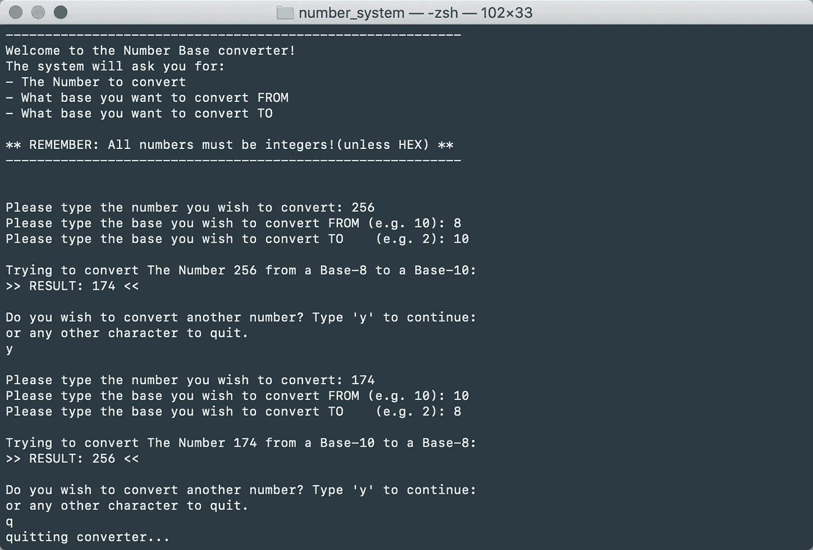
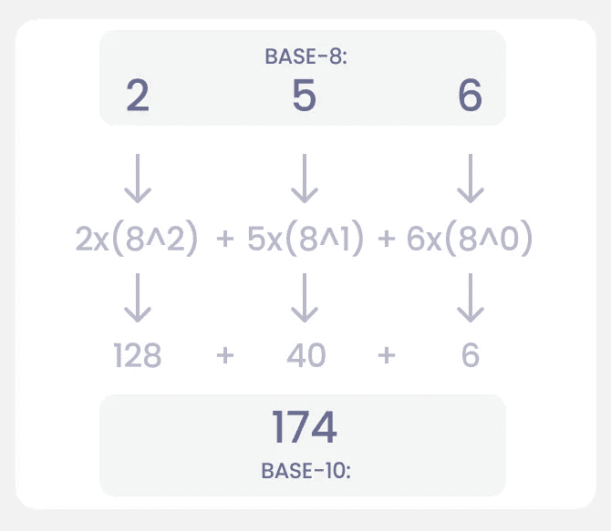
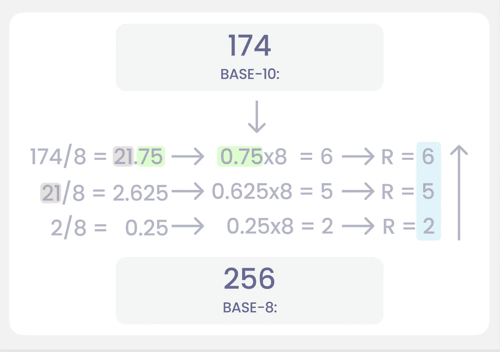

# 如何用 Python 编写一个数字系统计算器

> 原文：<https://towardsdatascience.com/how-to-write-a-number-systems-calculator-in-python-b172557cb705?source=collection_archive---------8----------------------->

## 二进制，十进制或十六进制，冲我来，兄弟！


照片由来自 [Pexels](https://www.pexels.com/photo/woman-holding-books-3768126/?utm_content=attributionCopyText&utm_medium=referral&utm_source=pexels) 的[安德里亚·皮亚卡迪奥](https://www.pexels.com/@olly?utm_content=attributionCopyText&utm_medium=referral&utm_source=pexels)拍摄

在本文中，我们将构建一个计算器，可以用来将任意基数的任意数字转换成任意基数的任意数字。在数字系统中，“基数”告诉我们你有多少个可用的数字。二进制有 2，八进制有 8，十进制有 10 等等。

我们将要编写的程序可以处理我们扔给它的任何`number`和`base`。当我们搞清楚背后的数学，就很容易成立了。

## 我们将创造什么:



# 但是首先，数学

这个计算器是以数学为基础的(不都是吗？).我们可能需要刷新我们对碱基转换理论的记忆(或者学习一些新的东西。)

如果你在学校学过科学驱动的数学，或者学过任何级别的计算机，你很可能已经从一种数字系统转换到另一种了。你可能还记得二进制表或者谈论过的"**十进制"*，**八进制"*，*十六进制"*。**

**十进制(以 10 为基数)是我们日常计数时使用的。0, 1, 2, 3, 4, 5, 6, 7, 8, 9.当我们用完了数字，我们在左边再加一个位置→ 10，11，12，13，14，15，16，17，18，19，20，21…等等。当我们再次用完数字时，我们添加一个新的位置→ 100，101，102…118，119，120。**

> **是的，是的…我记得小学…**

**我们不会去想它，因为我们在 2-3 岁的时候就知道了。告诉一个孩子用八进制(8 进制)数数，他们很可能会看你几秒钟，然后再回到他们的 iPad 上做作业。这个理论很简单，与十进制相同，只是我们不习惯。**

**在八进制系统中计数看起来像这样:**

**0,1,2,3,4,5,6,7 → 10,11,12,13,14,15,16,17 → 20,21…**

# **从一个碱基转换到另一个碱基**

**我们应该看的第一个转换是从任意基数(基数为 N)到十进制系统(基数为 10)。从十进制转换成任何其他基数都很容易。因此，了解十进制是很有价值的。**

**如果我们继续使用十进制的*和八进制的*和*作为例子，我们可以将八进制的*转换成十进制的*。让我们选一个随机数。***

*256(基数-8) →？？？(十进制)*

*(我保证，256 实际上是随机的)*

*   *我们有三个位置 2(一百)、5(十)和 6(一)。正如您在简介中所记得的，这些位置可以包含 0-7(8 个数字)。*
*   *我们需要将所有位置的每个数字都转换成十进制。十进制系统可以容纳 0–9(10 个数字)*

*我们这样做的方法是，我们取每一个数，并把它乘以以位置索引为幂的基数(num * (base^position)).如果我们从最右边的数字开始，我们用 8⁰乘 6，用 8 乘 5，用 8 乘 2。*

*这里有一个例子可以让你更容易理解:*

**

*从基数为 8 的 256 到基数为 10 的 174*

*当我们有了十进制(以 10 为基数)的数字，就很容易进入任何系统。让我们从 174(基数为 10)回到 256(基数为 8)*

*我们找到另一个基数的方法是用它除以这个基数，并保留余数。剩下的人会在另一个基地给我们建号码。当我们得到余数时，我们从最不重要的数字到最重要的数字来读这个数，意思是从下到上。你的新号码出现在你的新底座上了！‍*

*174/2 等于 21.75。注意 21 是红色的，0.75 是绿色的。我们把 21 送到下一行，处理 0.75。如果我们用 0.75 乘以基数，就剩下余数(这是我们要找的数)。这个数字以蓝色发送到最右边。*

*当我们达到 0 时，我们就正式完成了，可以在我们的新基地用一个漂亮的数字打包我们的行李了。*

**

*从基数 10 的 174 到基数 8 的 256*

*这不仅意味着我们可以从十进制到八进制，反之亦然。我们可以从 X 基到 y 基。任何我们想要的基。*

*感觉大概是这样的:*

**

*照片由来自 [Pexels](https://www.pexels.com/photo/group-of-people-having-neon-party-1684187/?utm_content=attributionCopyText&utm_medium=referral&utm_source=pexels) 的 [Marcin Dampc](https://www.pexels.com/@marcin-dampc-807808?utm_content=attributionCopyText&utm_medium=referral&utm_source=pexels) 拍摄*

*如果你仍然不确定这是如何工作的，我建议查看“有机化学导师”。他的视频是我所知道的关于这个主题的最好的:*

*[](https://www.youtube.com/channel/UCEWpbFLzoYGPfuWUMFPSaoA) [## 有机化学导师

### 该频道主要提供有机化学、普通化学、物理、代数等方面的教学视频

www.youtube.com](https://www.youtube.com/channel/UCEWpbFLzoYGPfuWUMFPSaoA) 

# 代码

是时候深入研究代码了！

注意:我的大部分编程都是手工完成的。这意味着我不使用太多的库，因为我想尽可能多地学习。在这段代码中，我*使用了*之类的标准 python 函数，因为我想向您展示这是可能的，但我认为手动编写相同的函数比使用`hex()`更有趣。在生产环境中，您可能希望保持简短，并使用能够解决您的问题的库，而不是从头开始编写代码

这个程序只是一个包含所有代码的文件。如果你愿意，你可以随意扩展。一节数字课？当然，为什么不呢？GUI？这也是我们应该研究的。

我建议在编码时使用一个基本的在线转换器计算器，仔细检查代码输出的值是否正确。

要点如下:

完整的要点代码。

代码背后的逻辑是我们向函数`convert_number_system():`传递三个参数

*   `input_number`是我们要转换的数字。
*   `input_base`是我们希望转换的基础。
*   `output_base`是我们希望皈依的基地。

## 定义菜单()

我以前没有使用多行字符串来打印菜单，但是创建这样的菜单是很有意义的。

该函数返回整个菜单字符串，因此我们可以在任何需要的地方使用它。我们也不用担心换行符。

```
return (
    '''
----------------------------------------------------------
Welcome to the Number Base converter!
The system will ask you for:
- The Number to convert
- What base you want to convert FROM
- What base you want to convert TO** REMEMBER: All numbers must be integers!(unless HEX) **
----------------------------------------------------------
    ''')
```

# 验证器

我不想在转换器函数中检查用户输入，而是想创建函数形式的验证器。通过这样做，我们创建了可重用的代码。

## def validate_bin(检查编号):

这个函数只是检查数字是否是有效的二进制数。

我们不想检查同一个数字出现了几次的长字符串。如果我们把它转换成一个集合，我们删除重复。集合不能包含一个项目的多个实例。我们使用 list comprehension 将输入转换为 int，并对照[0，1]进行检查

```
[int(item) for item in set(list(check_number))]
```

我选择传递来自用户交互的字符串，并在需要时创建输入的整数。`int(item)`确保所有的数字都是整数(如果我们愿意，我们也可以对照一个字符串来检查一个字符串(`‘0’ , ‘1’`)。

这是它在幕后的样子:

`‘10010011’` → `[‘1’,’0',’0',’1',’0',’0',’1',’1']` → `[0,1]`

如果 0 在[0，1]中，则检查结果正常，如果 1 在[0，1]中，则检查结果也正常。如果你有一个像 23 这样的数字，两个数字都会失败，函数会返回`False`

## 定义验证输入(检查编号):

这里没有什么特别的…代码检查输入是否包含定义的合法字符。我们使用数字`0–9`，因为我们支持十六进制，所以我们也将`a-f`作为有效输入。

## 定义验证器(输入编号，输入基础，输出基础):

这个函数利用其他验证器来验证所有的输入，这样我们就知道是否有必要继续进行转换。

*   首先，它检查我们是否输入了一个数字或十六进制值。
*   然后我们检查基地。如果 input_base 是 2，那么我们正在转换一个二进制数。因此，input_number 只能是数字，如果是，它必须是 0 或 1。
*   如果输入既是数字又是字母，则它是一个十六进制数字。如果 input_base 不是 16，那么我们就不能转换。十六进制以 16 为基数，任何其他基数都不会正确计算。我们可以考虑在交互过程中，当有人键入十六进制数时，制作一个预填充的输入库。
*   最后，我们检查用户是否试图转换为基数 1。这是不可能的，所以我们不想让程序崩溃，而是想返回一个错误。* 

# *转变*

*现在，该是代码的主要部分了。这是我们将利用我们的数学技能的地方。这个函数执行我们之前看到的匹配，它有几个安全步骤来确保我们正确输出*

## *def convert _ number _ system(input _ number，…):*

*转换 _ 数字 _ 系统要点*

*保存我们要返回的数字。如果你记得数学，你应该立刻认出关键字余数。*

*`sum_base_10`。我们想用十进制作为中间步骤。我们将初始值设置为 0，然后将我们计算的任何值添加到这个变量中。*

***输出二进制:***

```
*if output_base == 2:
    return (bin(input_number)[2:])*
```

*如果用户想要二进制输出，我们可以使用内置函数 bin()。我们不需要这样做，因为无论我们通过了什么，数学都是一样的，但是尝试是很有趣的。*

*`bin()`返回`0b`和二进制。`0b`告诉我们它是一个二进制数。我们想返回实际的数字。这就是[2:]的作用。如果您在终端中运行此命令，您可以看到不同之处:*

```
*>>> check_number = 23
>>> print(bin(check_number))
0b10111
>>> print(bin(check_number)[2:])
10111*
```

*它将从索引 2 开始打印。*

*注意，我在代码中保留了 hex()版本，但是注释掉了。你想用就用吧。*

***基数不是 10:** 如果基数不是 10，我们通过我们的中间步骤。首先，我们反转列表(你不必这样做，但是之后你需要在循环中翻转索引。我发现翻转列表更容易。)用这个神奇的内置代码[::-1]可以在 Python 中反转列表*

```
*reversed_input_number = input_number[::-1]*
```

*hex_helper_dict 帮助我们处理 9 以上的数字，如果用户发送一个十六进制输入。如果你还记得我们的公式，我们将每个位置的数字乘以由位置决定的基本指数。*

*这里又是 256 从*八进制*到*十进制:**

*2*(8²) + 5*(8¹) + 6*(8⁰) = 174*

*如果数字是十六进制的，比如 23e，它实际上是 2，3，14*

*2*(16²) + 3*(16¹) + 14*(16⁰) = 574*

*这个循环帮助我们完成了所有这些工作:*

```
*for index, number in enumerate(reversed_input_number):
    for key,value in hex_helper_dict.items():
        if str(number).lower() == key:
            number = value sum_base_10 += (int(number)*(int(input_base)**index))*
```

*如果你看看上面的代码，你会发现我们同时使用了枚举和。items()来确保我们可以访问执行操作所需的所有内容。*

*通过使用枚举，我们可以访问变量的值和索引。当我们循环变量时，我们检查数字(例如。`e`)等于字典中的任意一个键。在 23e 的情况下，它是，我们想将数字设置为 14，这样我们可以使用它进行实际计算。*

```
*sum_base_10 += (int(number)*(int(input_base)**index))*
```

*既然我们已经确定没有数字是真正的字母，我们就可以遍历这些数字(还是 256)并进行运算。对于我们循环遍历的每个数字，我们都要做之前讨论过的乘法。*

*(int(number)*(int(input _ base)* * index))
6 *(8 * * 0)*

*我们最终得到的值被加到 sum_base_10。*

***基数是 10:** 太棒了，继续。我们只是将输入数赋给 sum_base_10:*

```
*elif input_base == 10:
    sum_base_10 = int(input_number)*
```

***做数学运算** 现在我们有了以 10 为基数的值，我们可以做除法来找出余数并找到我们的新数。*

```
*while sum_base_10 > 0:
    divided = sum_base_10// int(output_base)
    remainder_list.append(str(sum_base_10 % int(output_base))
    sum_base_10 = divided*
```

*我们需要除法，直到我们达到 0。while 循环确保了这一点。*

*通过使用底数除法//我们将数除，剩下的是商的整数部分。这意味着我们只保留整数(21)而不保留点(75)之后的内容，这是基于我们在 intro (174/8= **21.75** )中的例子*

*通过将这个数分配给 divided，我们还可以将这个值发送给 sum_base_10，以便最终进行下一次迭代。*

*通过使用模，%,我们将得到余数。这被附加到 remainder_list 中，这样我们可以在以后输出它。*

*这是一个 while 循环，一直持续到我们点击`0`*

***如果输出基数是 16** 如果 output_base 是 16，这意味着用户想要一个十六进制输出。我们需要将任何大于 9 的数字转换成字母。*

*正如我们之前所做的，我们创建了一个字典来帮助转换。如果我们找到一个匹配，我们把数字转换成一个字母，并把它附加到列表中。*

***最后:***

```
*return ''.join(remainder_list[::-1])*
```

*这反转并把我们的列表变成一个我们可以返回的字符串。如果要返回一个 int，可以使用 int()。如果用户要求 16 进制输出，请确保您考虑了十六进制数。*

## *def 执行转换器():*

*唷！我们的大部分代码已经完成。*

*拼图的最后一块是与用户互动。这是一个直接的 while 循环，用户输入数字，我们验证它们，如果验证通过，就运行转换器。用户可以选择他/她想要做多少次就做多少次。*

*我喜欢用基于变量状态的 while 循环来创建用户交互；就像我们这里的`proceed`。这样，只要用户愿意，我们就可以一直进行下去。*

*它有两个层次。第一个 while 根据`proceed.lower() == ‘y’.`启动主循环*

*第二个声明`valid_input=False`，因为我们希望在将输入传递给`convert_number_system()`之前验证所有的输入。只要输入是`False`，我们就需要新的输入。在用户给我们他/她的输入之后，它运行验证器。如果通过，我们可以启动`convert_number_system()`*

*最后，我们询问用户是否想再去一次。如果用户输入‘y’，我们再次运行代码。如果他/她再输入任何东西，我们就退出程序。*

*另一种方法是要求用户键入他/她想要转换的号码或退出。在`number_input`变量中。*

# *最后*

**

*照片由[黑冰](https://www.pexels.com/@black-ice-551383?utm_content=attributionCopyText&utm_medium=referral&utm_source=pexels)从[派克斯](https://www.pexels.com/photo/lots-of-numbers-1314543/?utm_content=attributionCopyText&utm_medium=referral&utm_source=pexels)拍摄*

*这个程序涵盖了编程的几个方面。首先，我们需要找到问题。问题是手动转换所有的数字要花很多时间。*

*然后我们找到/学习数学来解决问题，找到共同点。事实证明，我们可以用相同的公式将任何东西转换成任何东西。我们只需要处理二进制和十六进制输入，我们需要确保我们不会试图计算基数为 1。这意味着我们可以使用函数来处理我们的代码。*

*一切都包装在一个菜单里，一个用户交互，底层执行代码潜伏在后台。*

*我希望你通过阅读这篇文章学到了一些东西。如果你发现任何问题的代码或有其他想法，请让我知道。请随意获取代码，并继续为您自己的项目开发它。*

*-M*