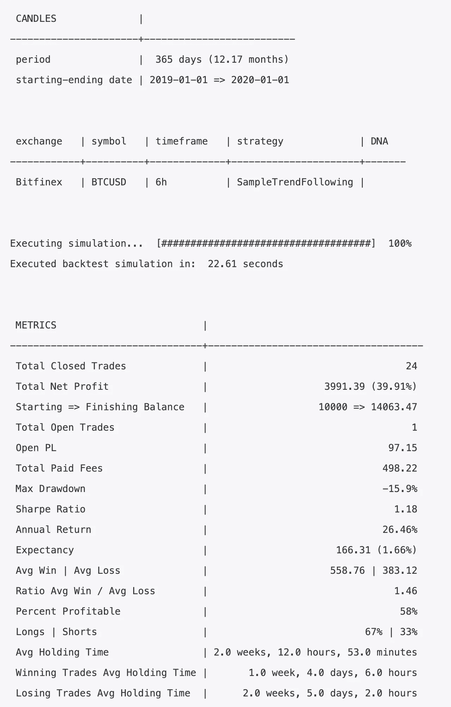
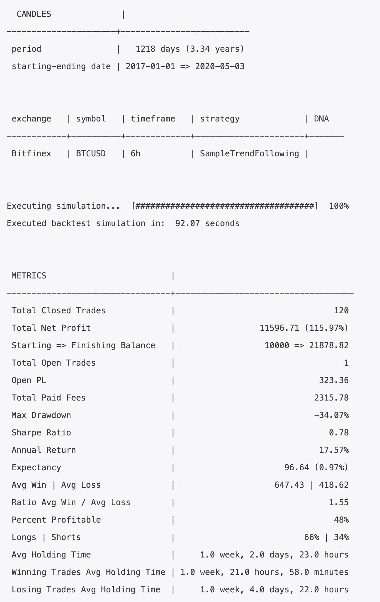

# 如何和杰西一起写 algotrading 比特币的盈利策略

> 原文：<https://towardsdatascience.com/how-to-write-a-profitable-strategy-for-algotrading-bitcoin-with-jesse-6c7064b22f1f?source=collection_archive---------41----------------------->

## 开始使用算法交易并不难


照片由 [Katerina Limpitsouni](https://undraw.co) 拍摄

在这个教程里，我要写一个和杰西交易比特币的策略。本教程的重点是让你开始使用 Jesse，这样你就可以编写自己的策略。我还会教你几个技巧，这些技巧是我多年来学到的，可以帮助我写出有利可图的策略。这大概会是一系列的文章。

本教程的重点不是给你一个牛逼的策略；这是让你开始写一个。在第一部分中，我将涵盖从:

*   如何使用技术分析
*   如何进入交易
*   如何退出交易
*   如何管理风险

首先，确保您已经安装了 Jesse。如果没有，[那就去做吧](https://docs.jesse-ai.com/docs/getting-started/)。接下来，确定你进口了蜡烛。我们现在就开始吧，因为这需要几分钟才能完成，这很好，因为我们将编写策略:

```
jesse import-candles Bitfinex BTCUSD 2016-01-01
```

# 创建策略

我们把这个策略命名为`SampleTrendFollowing`。`cd`进入您的 Jesse 项目并运行:

```
jesse make-strategy SampleTrendFollowing
```

现在打开位于`strategies/SampleTrendFollowing/__init__.py`的`SampleTrendFollowing`。这是 Jesse 生成的代码:

# 使用技术分析

我们将使用均线指标来检测市场趋势的方向。让我们用两条周期为 50 的均线代表慢速均线，周期为 21 的均线代表快速均线。

注意，我用`@property`关键字将它们定义为类属性。这允许我将它们用作`self.long`而不是`self.long()`，在我看来这更容易一些。

让我们也定义一下 ATR 指标，这是我最喜欢的设定止损价格的工具:

# 进入规则

我们的进场规则很简单:当快速均线突破慢速均线时做多，反之亦然。

# 管理风险

每个策略的一个关键部分是头寸规模。一个简单的组合头寸规模将使你受益匪浅。例如，让我们每次交易都拿总资本的 3%来冒险。

我们还需要指定我们的入门价格。简单来说，让我们用市价单建仓。

注意，我在止损和止盈目标中都使用了`ATR`指标。

虽然动态退出趋势跟踪策略是一个很好的实践，但是我在开仓的时候设置了退出点。我这样做是为了保持本教程简单。

# 路线

现在我们需要告诉 Jesse 在执行回溯测试命令时交易`SampleTrendFollowing`策略。我们还需要选择一个时间框架，和一个交易的符号。我选择了`6h`时间框架和`BTCUSD`作为我的标志。您的`routes.py`文件应该如下所示:

# 运行回溯测试

让我们看看它的表现如何:

```
jesse backtest 2019-01-01 2020-01-01
```

结果如下:



你看那个，居然有利可图！嗯，至少在 2019 年是这样。对于在`6h`时间框架内的趋势跟踪策略交易来说，这样的回溯测试足够了吗？你说了算，但如果我有数据，我会更进一步。在这种情况下，我回到 2017 年，直到今年的 5 月 3 日:



# 结论

本教程的目的是让你开始和 Jesse 一起编写策略。我将写更多这样的文章，探索 Jesse 的更多特性，比如使用多个时间框架、过滤器、事件等等。

为了获得我未来的作品和产品，请务必订阅杰西的[时事通讯](https://jesse-ai.com/)，并查看[论坛](https://forum.jesse-ai.com/)，与你我这样的量化者讨论算法交易。

**更新【5 月 26 日】:**下一篇文章继续这篇文章的结尾:
[如何在你的算法交易策略中使用多个时间框架](https://medium.com/@salehmir/how-to-use-multiple-timeframes-in-your-algotrading-strategy-8be026a890e2?source=friends_link&sk=a35c562268ca6c7c6c3d1df1cec1d7d1)

*原载于*[*https://jesse-ai.com*](https://jesse-ai.com/blog/tutorials/how-to-write-a-profitable-strategy-for-algotrading-bitcoin)*。*

***来自《走向数据科学》编辑的注释:*** *虽然我们允许独立作者根据我们的* [*规则和指导方针*](/questions-96667b06af5) *发表文章，但我们不认可每个作者的贡献。你不应该在没有寻求专业建议的情况下依赖一个作者的作品。详见我们的* [*读者术语*](/readers-terms-b5d780a700a4) *。*