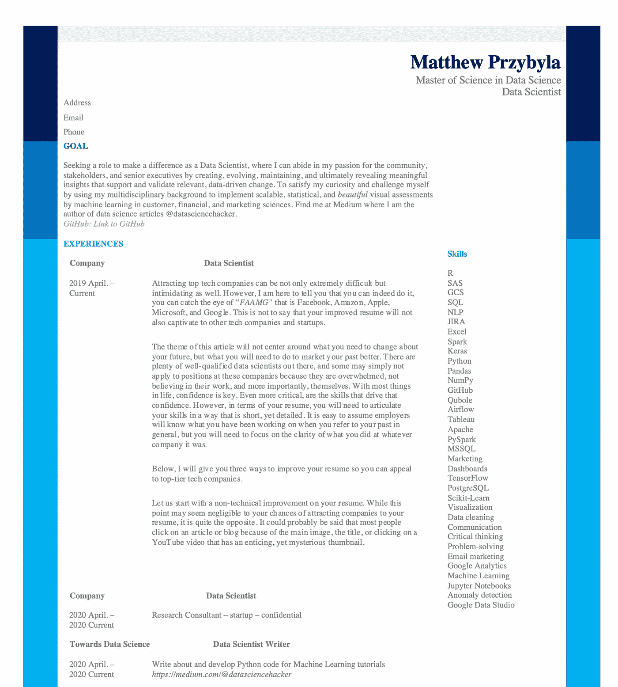

# 如何撰写一份成功的数据科学简历

> 原文：<https://towardsdatascience.com/how-to-write-a-winning-data-science-resume-aa8a60698456?source=collection_archive---------15----------------------->

## …吸引脸书、谷歌、苹果和微软等公司。


亚历克斯·哈尼在[Unsplash](https://unsplash.com/s/photos/facebook?utm_source=unsplash&utm_medium=referral&utm_content=creditCopyText)【1】上的照片。

# 目录

1.  介绍
2.  美学的
3.  目标
4.  经历
5.  技能
6.  教育/课外活动
7.  摘要
8.  参考

# 介绍

吸引顶级科技公司不仅极其困难，而且令人生畏。然而，我在这里告诉你，你确实可以做到，你可以抓住“ *FAAMG* ”的眼睛——那就是脸书、亚马逊、苹果、微软和谷歌。这并不是说你改进后的简历不会吸引其他科技公司和创业公司。

这篇文章的主题不是围绕你需要改变你的未来，而是你需要做些什么来更好地推销你的过去。就业市场上有很多合格的数据科学家，有些人可能根本不适合这些公司的职位，因为他们不知所措，不相信自己的工作，更重要的是，不相信自己。对于生活中的大多数事情，自信是关键。更重要的是，提升自信的技能。然而，就你的简历而言，你需要以一种简短而详细的方式来阐述你的技能。当你提到你的过去时，很容易假设雇主会知道你一直在做什么，但你需要专注于你在任何公司都做了什么。

> 下面，我会给你五种方法来改善你的简历，这样你就可以吸引顶级科技公司。

# 美学的

让我们从简历的非技术性改进开始。虽然这一点对于你吸引公司关注你的简历来说似乎可以忽略不计，但事实恰恰相反。可以这么说，大多数人点击一篇文章或博客是因为它的主要图片、标题，或者点击一个有着诱人但神秘的缩略图的 YouTube 视频。

> 简历中你工作的视觉表现不应该被忽视，这是有原因的。

听起来很老套，*不合群，脱颖而出*。想象一下，你是一名技术招聘人员，你每天会看到几百次同样平淡无奇的黑白墨水简历。*什么会先吸引你？这将是你简历的美感、布局和独特之处。就像形成自己的数据科学品牌一样，你应该专注于品牌化你的简历。作为一名雇主，你可以考虑聘用那些在专业但有创意的简历中投入工作的人，而不是其他人，因为这将是他们对你的第一印象。*

让我们看看我的。

像这样在网上发布我自己的简历是脆弱和可怕的，我相信它会向你展示你不需要成为一名 UX/用户界面设计师就能获得创造性的成功，但是比别人多一点创造性总是好的——任何人都可以这样做，只需要一点重新安排和组织(*或者你可以使用预制的模板——但我更喜欢自制的版本——你的自制版本*)。好的，是的，我的这个版本有一点改动(*具体来说，就是最近角色的文本和他们各自的公司名称*)。然而，它的布局和我最初的简历是一样的，还有标题、主要部分的标题、日期、目标和技能。下面来看看吧。



作者截图和文档[2]。

*那么这份简历有什么了不起的呢？*了解原因的最简单的方法是它很突出。它可能不是最好的或最有创意的，但它是我创造的符合我个性的东西。你想在符合你个性的公司找到一份工作。如果一家公司因为你的简历是蓝色的而不高兴，那么他们可能不适合你——反之亦然，也可以反过来说。当我在 LinkedIn 上发布这份简历，并在他们的网站上申请工作时，我感到紧张、脆弱和与众不同。在提交之前，我问了几个朋友他们的想法，有些人喜欢，有些人不喜欢。

> 没有完美的简历，但有更好的方式展示你的工作。

我相信我的直觉，想展示我的独创性。就像我的朋友一样，一些公司不喜欢我不拘一格的简历。然而，一些公司喜欢它，并指出(*这些公司大多是 FAAMG 公司)*，以及其他知名的大型科技公司。对我来说，这是值得一提的——这些成功的公司有很多数据科学家想去工作，欣赏创造力和个性——它得到了回报。

有争议的是，我的简历有两页。我已经听过很多次“一页长”的规则，但是只有 1%的雇主会询问简历的长度。如果你拥有它，炫耀它。向雇主展示你为达到这一步付出了多少难以置信的努力。如果他们会看你一整页的简历，他们很可能也会看你 1.68 页的简历。如果没有，那么他们很可能不会给你机会。如果你认为简历需要两页纸，那就写两页。

总而言之，简历的美感在申请过程中会有很大的影响。当然，选择最终取决于你如何设计你的布局和外观。

> 以下是关于你简历美感的关键提示

```
* find something unique about you and apply it to your resume* organize the layout in a way that lets the reader focus on each section separately* group your thoughts and work into sections: goal, experiences, skills, education, and extracurricular/awards. * give some breaks between sections so that the eyes can rest (just like how I made these points with a dark background)* tell a story with your layout: what do you want? what have you done? how did you get there?
```

# 目标

事实上，我收到了一位前脸书员工的一些建议，每当我更新我的简历或让别人知道他们的简历应该先写什么时，这位员工就一直跟着我。该部分是“*目标*部分。改善你的简历的一个好方法是包括这个目标部分，因为它向雇主展示了你在寻找什么，几乎回答了面试官经常问的“*你希望在五年内做什么”*的问题。这表明你在提前思考，有计划。此外，这会让招聘人员和/或雇主马上知道你是否合适。

目标部分应该包括你正在寻找的角色，你可以在这里具体说明。所以在我的博客里，我写的是数据科学家，但是你可以写“*寻找数据科学中的自然语言处理角色*”*。确保包括你为什么从事数据科学，以及你想用它做什么。您还可以包含一些重要的链接或用户名，这些链接或用户名指向数据科学中常用的平台。比如我链接了我的 GitHub 和博客用户名。令人惊讶的是，许多雇主指出，很高兴看到他们可以在哪里获得更多与数据科学相关的信息。*

> *以下是改进这一目标部分的主要方法:*

*   你想找什么样的角色？
*   你想要什么样的角色？
*   在企业中，你将如何处理这个角色？
*   *关于您的数据科学知识的其他链接或信息*

# 经历

简历中最重要的部分是经历部分。当然，尽量避免段落重叠。但是，在必要的地方加入更长的句子。如果你太短，对于第一次看这个项目的人来说，它可能没有那么大的吸引力——额外的几句话就可以了。

当我在简历上的每个公司的经历部分写下要点时，我总是坚持同样的规则。这条规则包括三个简单明了的要点。第一点是概述你使用的工具或编程语言。第二点是突出你实际做了什么。最后，第三点是阐明你所做的结果。那么，总的来说，你用什么来完成这个项目，它的结果是什么？例如，“利用 Jupyter 笔记本中的 Python 创建决策树分类器，帮助将手动分类过程自动化 50% ”。我真的认为这种解释你在每个主要项目中的经历的方法是吸引雇主的最好方法。它会以最快的方式向雇主、潜在的同事和利益相关者展示你对商业问题的影响。这是数据科学的基础；通过使用独特的工具解决复杂的问题来帮助业务。

你应该确保在你的经历部分包含的其他信息是公司、职位和日期。例如，'【2018 年 8 月至今在谷歌的数据科学家。

> *以下是总结的提升你的经验的关键方法部分:*

*   *你用了什么？*
*   你做了什么？
*   结果如何？

# 技能

又短又甜。这一部分是显而易见的。您将简单地列出您在数据科学中使用的所有最常用的技能。请记住，您可能希望包括像 Microsoft Office 这样的简单技能，因为，尽管这对您来说似乎是隐含的，但您不应该假设招聘人员已经了解这些知识。同样，根据你想成为的数据科学家的类型，有些技能应该比其他技能更突出。例如，如果你想专注于商业智能和产品管理数据科学，你会突出 SQL、吉拉和 Confluence。相反，如果你想吸引更多的机器学习数据科学，突出像 GCP，气流和 Kubernetes 这样的技能。此外，如果你想更突出一点，确保你的技能看起来很好，有一些模式。

> *以下是总结的提高技能的关键方法部分:*

*   *适用于数据科学类型的技能*
*   *包括非常具体的*
*   *而且还有一些非常通用的技能*

# 教育/课外活动

与技能部分一样，教育部分不需要很长。包括你的大学本科学位和研究生学位，以及他们的日期，如专业，辅修专业和专业。如果你是一名初级的数据科学家，你可能需要附上你的 GPA。

除了教育，还有课外活动。在这个部分，你还可以包含你的 GitHub 信息或类似的项目共享站点。您还可以概述您的专业、职业数据科学经验之外的关键项目。

> 如果你没有任何正式的、专业的数据科学经验，那么在“经验”部分列出那些相同的外部数据科学项目。

这些项目的例子包括完成教程、证书、训练营或在线课程(*如 Kaggle 数据科学课程*)。

> 以下是总结出的提高你的学历/课外活动的主要方法

*   *包括本科和研究生学位(如果适用)*
*   保持简洁明了
*   *突出你所完成的独特项目和证书*

# 摘要


由[paweczerwiński](https://unsplash.com/@pawel_czerwinski?utm_source=unsplash&utm_medium=referral&utm_content=creditCopyText)在 [Unsplash](https://unsplash.com/s/photos/google?utm_source=unsplash&utm_medium=referral&utm_content=creditCopyText) 上拍摄的照片。

如果您在本文中已经讲到这里，谢谢您。我想给数据科学家最适用、最简单的建议，让他们能在自己梦想的公司找到工作。我在你的简历中加入了美学、目标、经历、技能和教育/课外活动方面的改进。虽然我不能保证找到工作，但我确实认为你会改善你的简历，并有希望吸引你的梦想工作。

再一次，有保留地接受我的建议。我这篇文章的目的不仅是给你简历中这些主要部分的建议，也是给你灵感和动力，让你自己想出新点子。总而言之，你应该专注于做你自己，突出你职业生涯中最自豪的成就(*因为你的面试官会挑选你要面试的项目，所以要充分了解它们)*，找到一些独特和有创意的东西，让你的简历脱颖而出。

我可以证明我的简历截图是我的，并且已经得到了谷歌、苹果、脸书和微软等顶级公司的关注。请记住，还有其他优秀的公司。仅仅因为一家公司不是这些更大的科技公司之一，并不意味着它的价值更低，一家不同的公司可能会更有趣，更有益于体验。最终，在吸引公司之后的下一步是面试。我已经写了几篇关于数据科学和面试过程的文章，如果你想看看，现在就链接一篇，它指的是数据科学和数据分析面试过程中的共同相似之处和不同之处[4]:

[](/data-scientist-vs-data-analyst-interview-heres-the-difference-4315f8306ad3) [## 数据科学家 vs 数据分析师面试。区别就在这里。

### 面试指南。

towardsdatascience.com](/data-scientist-vs-data-analyst-interview-heres-the-difference-4315f8306ad3) 

我希望你觉得我的文章有趣且有用。祝你简历之旅和数据科学事业好运。欢迎在下面评论。感谢您的阅读！

# 参考

[1]Alex Haney 在 [Unsplash](https://unsplash.com/s/photos/facebook?utm_source=unsplash&utm_medium=referral&utm_content=creditCopyText) 上拍摄的照片，(2019)

[2] M.Przybyla，简历截图，(2020)

[3]2018 年[paweczerwi324ski](https://unsplash.com/@pawel_czerwinski?utm_source=unsplash&utm_medium=referral&utm_content=creditCopyText)在 [Unsplash](https://unsplash.com/s/photos/google?utm_source=unsplash&utm_medium=referral&utm_content=creditCopyText) 上拍摄的照片

[4] M.Przybyla，[数据科学家 vs 数据分析师访谈。区别就在这里。](/data-scientist-vs-data-analyst-interview-heres-the-difference-4315f8306ad3)(2020 年)