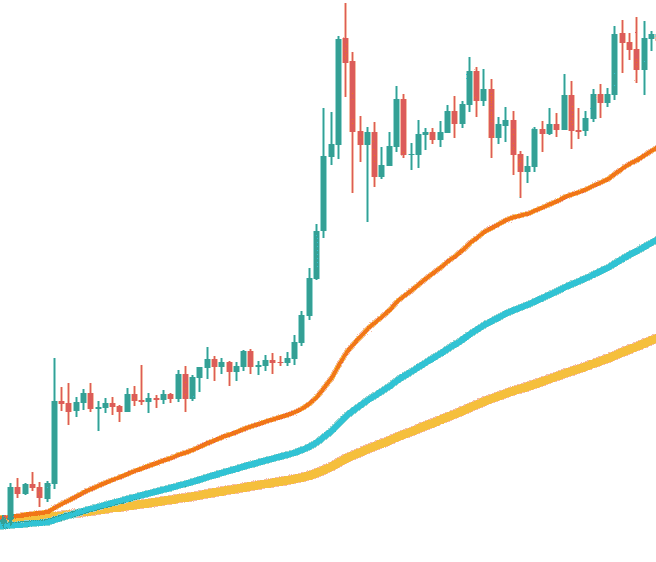
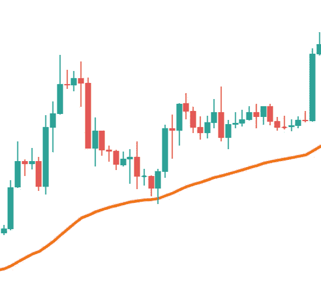
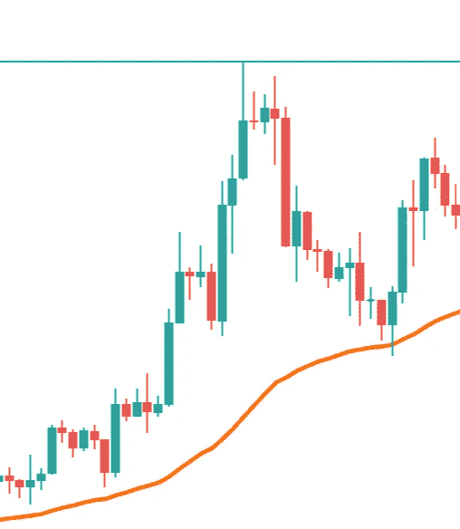
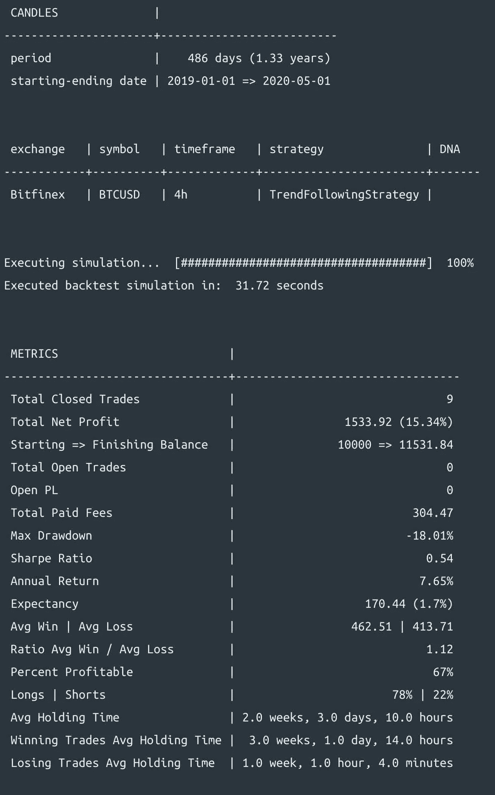

# 如何为 algotrade 比特币编写高级趋势跟踪策略

> 原文：<https://towardsdatascience.com/how-to-write-an-advanced-trend-following-strategy-to-algotrade-bitcoin-a38e47443ddc?source=collection_archive---------47----------------------->

## 趋势跟踪不再困难


照片由 [Katerina Limpitsouni](https://undraw.co/) 拍摄

无论是开始算法交易还是盈利，趋势跟踪都是最容易的。在[上一篇文章](/how-to-use-multiple-timeframes-in-your-algotrading-strategy-8be026a890e2?source=friends_link&sk=a35c562268ca6c7c6c3d1df1cec1d7d1)中，我写了一个趋势跟踪策略，通过使用更大的时间框架来确定趋势，甚至提高了它的性能。但这是一个简单的立即进入和立即退出的策略。

本教程的重点是让你从 Jesse 的一些特性开始，这些特性可以帮助你写出你会发现的大多数趋势跟踪策略。这些特征中很少是:

*   分两点退出交易，一点是固定价格，另一点是动态价格。
*   退出一半仓位后将止损更新为盈亏平衡。
*   过滤盈亏比不好的交易。
*   利用事件与交易的生命周期挂钩。

首先，我用`make-strategy`命令创建一个新策略:

```
jesse make-strategy TrendFollowingStrategy
```

我编辑我的`routes.py`文件来使用这个策略，我把时间范围设置为`4h`:

然后我打开新创建的策略文件，它看起来像这样:

# 进入规则

我想去很久，当:

*   我们处于上升趋势中(反之亦然)
*   收盘(当前)蜡烛线触及 50 均线

他们说一张图片抵得上 1000 个单词，所以这里有一张图片显示了我认为的上升趋势:



这就是我所说的当前蜡烛碰到 50 均线的意思(橙色线是 50 均线):



现在让我们为`current_candle_touches_long_ema`和`trend`写代码:

我用三根均线来确定趋势方向。我返回`1`表示上涨趋势，返回`-1`表示下跌趋势。`current_candle_touches_long_ema`很简单，我只要确保当前蜡烛线的高价大于`long_ema`线(周期为 50 的均线)并且当前蜡烛线的低价低于`long_ema`线。

# 设置进场价格和仓位大小

对于多头交易，进场价格将是当前蜡烛线的最高点。止损价格将是当前 ATR 的 3 倍，距离我的进场价格。

在这个策略中，我想一次进场交易，但在两点出场。我将在趋势的前一个高点退出我的前半部分头寸。这里是我所说的上升趋势的高点(蓝线是我的目标):



为了对此进行编码，我首先选择最后 20 根蜡烛线的最高价格。然后返回其中的最大值。

对于头寸规模，我想在每笔交易中用我总资本的 5%来冒险。为了计算`qty`，我使用了`risk_to_qty`实用程序。

当然，短线交易的情况正好相反。代码如下:

# 将止损转为盈亏平衡

正如你所看到的，我只是以获利价格退出了我一半的仓位。换句话说，在我的仓位降低后，我想移动我的止损价格以达到盈亏平衡。为了在 Jesse 中编写代码，我将使用内置的 [on_reduced_position](https://docs.jesse-ai.com/docs/strategies/events.html#on-reduced-position) 方法。

更新`self.stop_loss`是我告诉杰西更新我的止损单所需要做的。Jesse 自动选择它，取消之前的止损单，并提交新的止损单。这再简单不过了！

要了解关于事件的更多信息并查看 Jesse 中所有可用事件方法的列表，请务必阅读其[文档](https://docs.jesse-ai.com/docs/strategies/events.html#on-cancel)。

# 动态退出我交易的后半部分

对于这个策略，我打算在动态的情况下退出我的后半部分头寸。这种情况背后的想法是，当价格高度超买，即将进行严重的修正时退出。用 quant 的语言来说，我想在 RSI 指标达到 80 以上的时候退出。

首先，我将使用内置的`update_position()`方法来编写我的逻辑。只有当我们有一个未结头寸时，这个方法才会在每根新蜡烛线后执行。因此，它用于更新位置。也就是说我们不需要检查这个职位是否空缺。

这里要考虑的下一件事是，我只想退出我的后半部分头寸。换句话说，我想平仓，如果它已经减少。检查我的头寸是否已经减少的最简单的方法是使用内置的 [is_reduced](https://docs.jesse-ai.com/docs/strategies/api.html#is-reduced) 属性和[清算()](https://docs.jesse-ai.com/docs/strategies/api.html#liquidate)方法。

# 使用过滤器

到目前为止，我的策略看起来不错，让我们进行一次回溯测试，看看效果如何:

```
jesse backtest 2019-01-01 2020-05-01
```

经过大约 4%的回溯测试后，我得到一个错误:

```
Uncaught Exception: InvalidStrategy: take-profit(3601.6) must be below entry-price(3601.6) in a short position
```

错误是试图告诉我们，在某一点上，我们的策略的获利和进场价格相等(3601.6 美元)，这是不可接受的。这是一个很难调试的问题，但是在编写了最初的几个策略之后，你会很擅长和 Jesse 一起调试。

为了解释为什么会出现这个问题，我们需要再看一下获利和进场交易:

这个错误告诉我们，进场和获利在某些时候是相同的。这意味着，在这一点上，当前的蜡烛线是过去 20 根棒线中最高的。这不是我们在这个策略中想要的交易类型。

我们可以通过在我们的`should_long`方法中使用一些肮脏的 if-else 语句，或者通过使用一个专为这类情况设计的过滤器来防止这种情况发生。

过滤器只是一个返回布尔值的函数。通过返回一个`True`值来传递一个过滤器，反之亦然。我定义了一个过滤器，并命名为`reward_to_risk_filter`。这个名字可以是任何东西，但是用单词`filter`开始或结束一个过滤方法的名字通常是一个好的习惯。这个过滤器的工作是确保我们试图进入的交易是值得的。

在这一点上，杰西仍然不知道`reward_to_risk_filter()`是一个过滤器。为了让它识别我的过滤器，我需要将它添加到`filters()`方法中，这是一个返回 Python 列表的内置方法:

现在我将把`reward_to_risk_filter`作为一个**变量添加到返回列表中。**这意味着它的末尾不能有括号:

现在让我们再执行一次回溯测试:

```
jesse backtest 2019-01-01 2020-05-01
```



这次一切顺利。

# 结论

你的策略越简单，就越容易调试它们，甚至随着时间的推移改进它们。

和杰西一起写策略就像手动交易你的策略一样简单。所以下一次你在交易书上或者交易大师那里发现一个策略时，就写下代码，并进行回溯测试。

为了获得我未来的作品和产品，请务必订阅杰西的[时事通讯](https://jesse-ai.com/)，并查看[论坛](https://forum.jesse-ai.com/)与像你我这样的量化分析师讨论算法交易。

*原载于*[*https://jesse-ai.com*](https://jesse-ai.com/blog/tutorials/how-to-write-an-advanced-trend-following-strategy-to-algotrade-bitcoin)*。*

***注来自《走向数据科学》的编辑:*** *虽然我们允许独立作者根据我们的* [*规则和指导方针*](/questions-96667b06af5) *发表文章，但我们不认可每个作者的贡献。你不应该在没有寻求专业建议的情况下依赖一个作者的作品。详见我们的* [*读者术语*](/readers-terms-b5d780a700a4) *。*