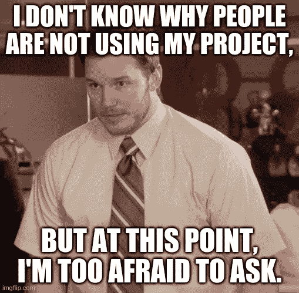
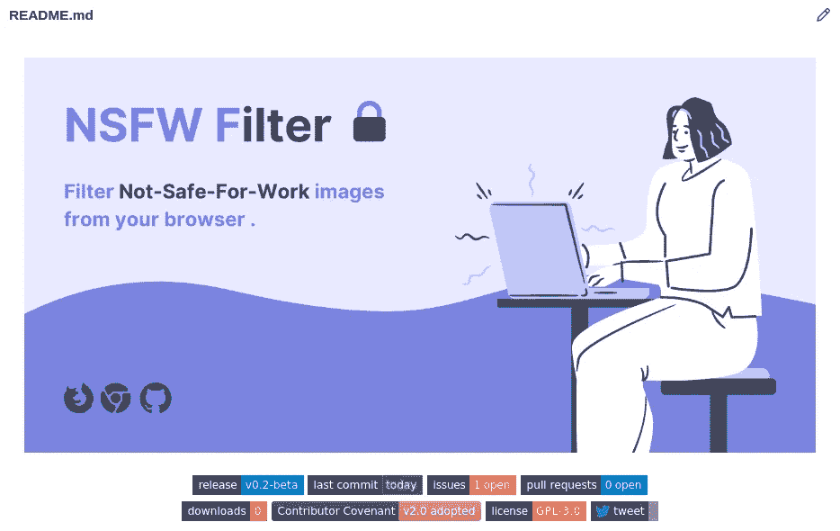
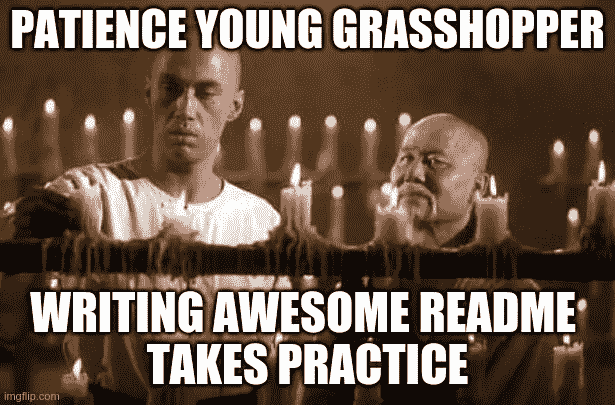

# 如何写一篇精彩的自述

> 原文：<https://towardsdatascience.com/how-to-write-an-awesome-readme-68bf4be91f8b?source=collection_archive---------24----------------------->

## 一个全面的指南写自述，脱颖而出，使人去哇！

照片由 [Pixabay](https://www.pexels.com/@pixabay) 拍摄

如果你很急，只想让模板跳到底部(**不酷**)。

其余的**酷**人准备好迈出成为**自述大师的第一步吧！**(绝对不是 clickbait)。

你刚刚创建了这个很棒的项目，并在 GitHub 上分享了它。你认为现在你可以坐以待毙，等着世界告诉你你的项目有多酷。毕竟，在过去的一个月里，你在这个极具挑战性的项目上不知疲倦地工作，对吗？

好吧，让我们后退一步，从检查你的项目的开发者或用户的角度来看。尽管你知道你的项目有多酷，知道它将如何解决一个尚未解决的紧迫问题(**直到你出现)，但**这个人会看着你的项目，想知道你到底做了什么。

如果没有人不知道如何使用你的软件，那一定是发生了非常糟糕的事情。

照片来自 [imgflip](https://imgflip.com/memegenerator/Afraid-To-Ask-Andy)

如果人们不知道你的软件是做什么的，那么他们不会使用它或为它做贡献，他们很可能会在开源软件的海洋中找到更清晰和简洁的东西。

**这就是自述文件的用武之地！**

一份好的自述文件就像是你项目的门面。这是人们在你的项目中看到的第一样东西，它给他们一个非常简短的对你的软件的介绍。

**自述开始**来自我的[NSFW**滤镜项目**](https://github.com/navendu-pottekkat/nsfw-filter)

一个好看且有帮助的自述文件可以使您的项目脱颖而出，并吸引开发人员社区的注意。

这将有助于他们理解你的项目，他们如何让项目运转起来，以及为什么他们应该做出贡献。

> **“哇，老兄！说得好！如果你知道这么多东西，为什么不告诉我们怎么写呢…”**

嘿，我**不能**告诉你有一套具体的规则，你应该遵守这些规则，不要为了一个好的自述而摇摆不定。

它**不**那样工作。

我将分享我如何为我的开源项目写自述文件，以及你在为你的项目写自述文件时应该考虑的事情，你将(希望)能够获得一些见解。

还有，记住你不会一天就成为自述大师。像所有的事情一样，**需要练习**。

我为开源做贡献已经有一段时间了，我注意到所有伟大的项目都有一个**棒极了的**自述文件。

您进入了项目页面，几分钟后您就可以启动并运行您的项目版本。

有许多**贡献者**，许多**请求**，**更新版本**被频繁发布，它们都有一个令人敬畏的自述文件的共同因素。

一个新的开发者将能够找到所有的细节开始像**安装说明**和**贡献指南**。

一个新用户将能够通过**信息截图**和**演示**找到这个项目是如何被使用的。

> “我没时间说这个，给我看看自述文件吧！”

好吧，好吧，好吧(抱歉我走得有点[麦康纳](https://www.google.com/search?gs_ssp=eJzj4tTP1Tcwys1KMzJg9BLOTSwpyUgtV8hNTs7PSyxNz0itBACjJwrr&q=matthew+mcconaughey&oq=mathew+mac&aqs=chrome.1.69i57j46l2j0l4.4760j0j7&sourceid=chrome&ie=UTF-8))。

这里是我的项目 [**NSFW** **滤镜**](https://github.com/navendu-pottekkat/nsfw-filter) 的[自述](https://github.com/navendu-pottekkat/nsfw-filter/blob/master/README.md)文件。我认为这是我写的最好的自述。

 [## 纳文杜-波特卡特/nsfw-过滤器

### 从网站过滤 NSFW 图片的网络扩展。它使用 TensorFlow JS-一个机器学习框架-来…

github.com](https://github.com/navendu-pottekkat/nsfw-filter) 

我将浏览自述文件的不同部分，我认为**对每个自述文件都是必不可少的。**

这里是本例中使用的自述文件的链接。您还可以找到一个 [**模板**自述文件](https://github.com/navendu-pottekkat/awesome-readme/blob/master/README-template.md)，您可以直接将其复制并粘贴到您的项目中。

 [## navendu-pottekkat/awesome-readme

### 项目标题应该不言自明，尽量不要弄得拗口。(尽管存在例外情况……

github.com](https://github.com/navendu-pottekkat/awesome-readme/blob/master/README.md) 

好吧，那就结束了。

我用这些来自**自述老师** ( *新推特手柄预警)的临别赠言(*智慧*)告别我的蚂蚱！*)。

照片来自 [imgflip](https://imgflip.com/memegenerator/70594782/kung-fu-grasshopper)