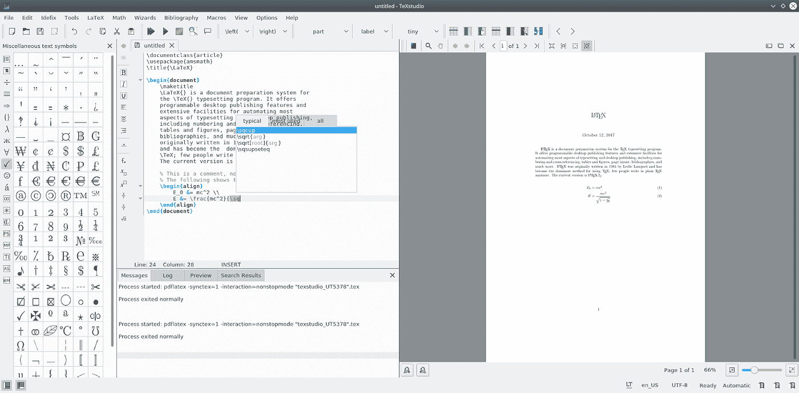
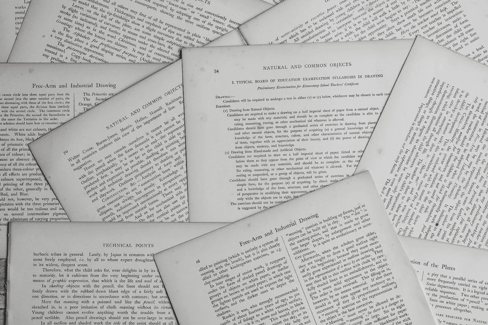

# 如何撰写和发表研究论文

> 原文：<https://towardsdatascience.com/how-to-write-and-publish-a-research-paper-3692550a5c5d?source=collection_archive---------31----------------------->

## 我希望在写和发表我的研究论文之前阅读的文章

你目前正在攻读博士学位。或者将来有兴趣做。你可能即将发表一篇科学论文，或者只是对发表你的作品感到好奇。

在这个博客里，我写了我写论文的经历。我与你分享我在科研生涯中学到的技巧和经验。我在顶级 IEEE 会议和期刊上写了+7 篇文章([IEEE Transaction on Image Processing](https://ieeexplore.ieee.org/xpl/RecentIssue.jsp%3Fpunumber=83))([EUS ipco](http://www.eusipco2018.org/)，WOSSPA，GRETSI，GDR-ISIS，…)。我还撰写了一篇发表在[天文学&天体物理学](https://aa.org/)的期刊论文。你可以在我的[谷歌学术](https://scholar.google.com/citations?user=NXUvxIMAAAAJ&hl=en&authuser=1)个人资料或 [ResearchGate](https://www.researchgate.net/profile/M_Amine_Hadj-Youcef) 个人资料中找到我的出版物列表。

我把这个博客分成两个不同的类别，没有特定的顺序:

*   与出版物需要做的事情相关的非技术部分
*   与研究相关的技术部分

🅛🅔🅣’🅢 🅖🅞

# **非技术部分**

## 📝正确的纸张格式

你需要为你的论文选择合适的格式。出版物有很多种，如会议或期刊、信件、评论、会议或期刊文章。根据您的研究阶段或您正在展示的信息水平，其中一个可能比另一个更适合您的工作，以评估您想要传达的信息并选择您的格式。

## **🔎选择会议**

如果你想提交一份会议论文，你需要选择哪一种信心，要知道这是一个你必须参加的活动。有很多会议，取决于你的研究领域，每个会议都有自己的地点和日期。所以一定要了解你所在领域的顶级会议，这很重要。如果你是博士生，不要犹豫和你的导师交流，他们通常已经有了入围的会议名单。

## 细节很重要

一旦你选择了会议，你需要注意并阅读关于截止日期、地点、作者指南、电话和提交指南以及价格的所有细节。

⚠️Yes，你必须付费才能在同行评议的期刊/会议上发表你的作品。有一个免费的出版物平台(像 Medium)，或者像 [arXiv](https://arxiv.org/) 这样的开源平台，但是没有同行评审。当然，如果是会议论文，不要忘记支付出版费和注册费+酒店。

## ⏳最后期限

关于截止日期的重要几点，首先，你不想错过！。其次，很明显，你想在截止日期前提交。通常情况下，作者会对提交的论文进行修改，这种情况经常发生，或者更新内容。知道你有可能在提交截止日期前对提交的版本进行修改。

💡你越早提交论文越好，给自己一些安慰，不要等到最后一天才提交，以免出现意外。

## 纸质 PDF 模板套件

大多数会议和期刊都提供模板工具包来生成最终的 PDF 论文。它通常以两种格式提出:Latex 的 Microsoft word。下载模板工具包并开始编辑内容。我确保你尊重格式的规则(大小，字体，警察，引文，表格，…)。

## 编辑工具

我真的推荐使用 latex，尽管与 Microsoft word 相比它很痛苦，但是相信我，使用 latex 生成的 PDF 质量非常好。

**💡我建议用 [TexStudio](https://www.texstudio.org/) 来编辑你的论文，在我看来这是最好的之一。**

TexStudio

## 要准备的其他材料

被接受的会议论文必须在会议当天提交。一般来说，有两种方式来展示你的作品:

1-展示海报

或者在观众面前演讲

在这两种情况下，你都必须准备一份额外的材料来总结你的工作，可以是海报或幻灯片，这是会议委员会所做的决定。

## 期刊论文除外

关于期刊论文，程序略有不同。一般来说，没有事件发生，所以没有截止日期，也没有事件日期。你可以随时提交期刊论文。只要确保你的研究没有过时。

# **技术部分**

## 🚀**开始写作之前**

写作前问一些问题会帮助你理解你的工作，并更好地向他人解释，例如

*   这是一个重要的问题吗？
*   收集和分析的数据对更广泛的社区有意义吗？
*   过去做了什么？
*   解释为什么解决它很重要？

首先，你需要选择一个你想解决的问题。你一定是**具体**的，不然干嘛还要费神去读博。！严肃地说，不要在别人已经解决的特定问题上工作。

## **📎文献综述**

了解其他研究人员为解决你想要解决的问题做了什么是关键。以前的方法有什么优势和局限性，这在你的步骤中非常重要和关键，因为对另一个人来说，你的研究是相关的，你需要向读者或负责你工作的大学委员会展示和说服你的贡献是值得的，你正在提议可变的研究

⚠️为了这一步，拖延症将试图成为你最亲密的朋友。只是意识到这一点，不接受它作为朋友。

💡我建议用[门德利](https://www.mendeley.com/newsfeed)来管理你的推荐人。简单易用，您可以在手机、PC 或浏览器上使用它。

门德利

这一步将定义你工作的基础，所以你将从实施一些方法开始，并了解已经做了什么，有什么限制，正如我之前所说的，从那时起你将发现还没有做什么，有时在其他研究中， 研究人员强调了他们想做什么和他们不能做什么。也许这会给你一个想法，从经验中开始，那些掌握了这一步的人会很容易进入下一步，那些没有掌握的人会很困难，我们将不得不在他们论文的结尾做这项工作。

## **🔧发展手稿:结果和写论文哪个更重要？**

## **从写论文到出结果**

你可以从写论文开始，随着研究的深入，在空白处填入内容。在这种情况下，这篇论文将推动你的研究，推动你的工作向前发展，这是一种以英语为母语的方法。

填空让你思考题目，问自己一些问题，比如我想说的题目是什么？以前做过什么？我应该提出哪种策略或方法？诸如此类。

## **从结果到写论文**

或者你可以遵循法语的方法，这种方法包括首先关注结果，然后写论文。这种方法最适用于已经了解主题并且问题已经解决的人。一旦有了结果，他就可以开始写论文了。下一个任务将是证明一个论点，并试图融入文献中的研究。

这里没有好的或错误的策略，它们都非常有效，只需选择一种方法并坚持下去。

💡如果你是博士。学生，不要犹豫和你的导师讨论这个问题。他们会指导你，带你完成博士学位。

## **📌从哪里开始写？**

科技文章通常遵循以下格式:

*   *摘要*
*   *简介*
*   *之前的研究*
*   *问题公式化*
*   *模型或方法和结果*
*   *结论*
*   *参考文献*
*   *致谢*

你论文的每一部分在向读者解释为什么你的研究提出了一个新的重要问题，以前已经做了什么，以及你的研究如何实质性地推进你的领域中扮演着不同的角色。

💡我建议你按照这个顺序:先把问题公式化，然后写你用来解决问题的方法，接着是结果。接下来，你回到引言，然后是你的结论。摘要应该写在最后。

在你起草完所有的章节后，你应该重温你的标题和作者列表，以确保它准确地代表了你的最终作品。致谢和参考文献可以在文章写完后完成。

## **🗣投稿&** **同行评审**

与你的合作者一起重复修改和更正。迭代越多越好。随着时间的推移，你会收敛到论文的最终版本。此外，让你的朋友或同事审阅论文。可能会有一些你看不到的错误。你擅长提交论文。

💡记住，在提交论文之前，一定要和你的合作者反复讨论。你必须得到他们的同意，以避免可能发生的误解或混乱。

# **结论和带走**

从我的个人经验来看，我可以告诉你，在写作时凌乱是正常的，知道那是可以的，那是不可避免的。不要不知所措。保持一致，不要忘记给自己一个喘息的机会🙂。你需要在你的写作程序中建立足够的秩序，以便能够向前推进。

好了，我希望你能从这篇博客中获得一些价值，并在你的下一篇论文中受益。💯

不溅

## **下一步做什么** ❓

*   请在评论区告诉我你的想法，或者直接在 LinkedIn 上给我发消息。
*   你采取了什么方法？
*   什么对你最有效？