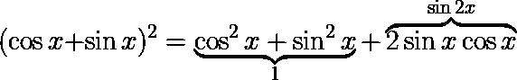

# 如何在介质上编写和渲染 LaTeX 数学公式

> 原文：<https://towardsdatascience.com/how-to-write-and-render-latex-math-formulas-on-medium-7165c2dcc54c?source=collection_archive---------23----------------------->

## 在这篇文章中，我们列出了一些在介质上书写和可视化数学公式的方法:LaTeX 到 image，unicode 转换，浏览器插件等。


安托万·道特里在 [Unsplash](https://unsplash.com?utm_source=medium&utm_medium=referral) 上拍摄的照片

每天，许多从业者通过在[媒体](https://medium.com/)上创建内容来分享技术教程和发现。然而，张贴带有数学公式的文章(例如用 [LaTeX](https://en.wikibooks.org/wiki/LaTeX) 写的方程式)是一件困难的事情，因为它在媒体上不受支持。最常见的解决方法是**将你的公式转换成图片**并添加到文章中。你可以对一个渲染的 PDF 文件进行截图，或者使用在线 LaTeX 编辑器，比如 [CodeCogs](https://www.codecogs.com/latex/eqneditor.php) 。


图片作者。在线 LaTeX 编辑器。

包含本文所附公式的图像将显示为:



这是在 Medium 上发布时添加数学公式的最简单的策略，但它不灵活，并且不适用于内嵌方程。

类似的方法包括**使用数学公式创建 Jupyter 笔记本降价，并将笔记本上传到**[**GitHub Gist**](https://gist.github.com/)。


图片作者。GitHub Gist 包含一个准备嵌入介质的乳胶配方。

然后，复制介质上的**共享**链接，结果是:

作者笔记。包含 LaTeX 公式的嵌入式 GitHub gist 示例。

老实说，这不是很花哨。

另一种在介质上添加乳胶配方的方法是使用 [TeX 到 Unicode](https://chrome.google.com/webstore/detail/tex-to-unicode/kdojinhjlhbmmbfogccabogomjpjijif?hl=it) Chrome Addon 到**转换乳胶代码到 Unicode** 。一旦安装了插件，只需选择你想转换的 LaTeX 代码，例如

```
\alpha : \mathbb{R} \to \mathbb{R}
```

按 Alt+W(您可以在配置中更改快捷键),您应该会得到等式的 unicode 版本:

```
α : ℝ → ℝ
```

这种方法不依赖于图像或嵌入对象，它可以内联工作，但在字符和布局转换方面也有限制。例如，上面的例子

```
(\cos x + \sin x)^2 =
    \underbrace{\cos^2 x + \sin^2 x}_{1} +
    \overbrace{2 \sin x \cos x}^{\sin 2x}
```

被转换成

```
(\cos x + \sin x)² =
    \underbrace{\cos² x + \sin² x}₁ +
    \overbrace{2 \sin x \cos x}^{\sin 2x}
```

当公式有点复杂时不是很有用。

最后一种在媒体上呈现数学公式的方法需要在创作者和读者的浏览器上都安装一个 **Chome addon** 。该插件被称为[数学无处不在](https://chrome.google.com/webstore/detail/math-anywhere/gebhifiddmaaeecbaiemfpejghjdjmhc/)，它应该渲染任何页面上的每一个 MathML/LaTeX 公式，也在媒体之外。在编辑过程中，你只需要把你的公式放在适当的分隔符中，如美元符号(插件应该关闭)，在阅读过程中，一旦激活插件，方程将被转换。

公式


应正确呈现:

(cosx+sinx)2=cos2x+sin2x+2sinxcosx(cos⁡x+sin⁡x)2=cos2⁡x+sin2⁡x+2sin⁡xcos⁡x(\cos x+\辛 x)^2=\cos^2 x+\sin^2 x+2 \辛 x \科斯 x

像α:R→Rα:R→R \ alpha:\ mathbb { R } \ to \ mathbb { R }这样的内联公式也应该可以工作。这种方法的缺点是需要读者安装插件(只有第一次)。当然，我们可以像这样在帖子的开头插入一个善意的提醒:

> 这个帖子包含乳胶公式。为了正确渲染它们，安装[数学任意位置](https://chrome.google.com/webstore/detail/math-anywhere/gebhifiddmaaeecbaiemfpejghjdjmhc/)插件并激活它。

你知道在介质上添加数学公式的其他方法吗？请在评论中告诉我！

## 参考资料:

[如何在介质上写数学](https://medium.com/@tylerneylon/how-to-write-mathematics-on-medium-f89aa45c42a0)
[如何在介质上使用数学公式](https://medium.com/@wjung/how-to-use-math-formula-on-medium-posting-e059dcb7c78f)

联系人:[LinkedIn](https://www.linkedin.com/in/shuyiyang/)|[Twitter](https://twitter.com/deltarule)