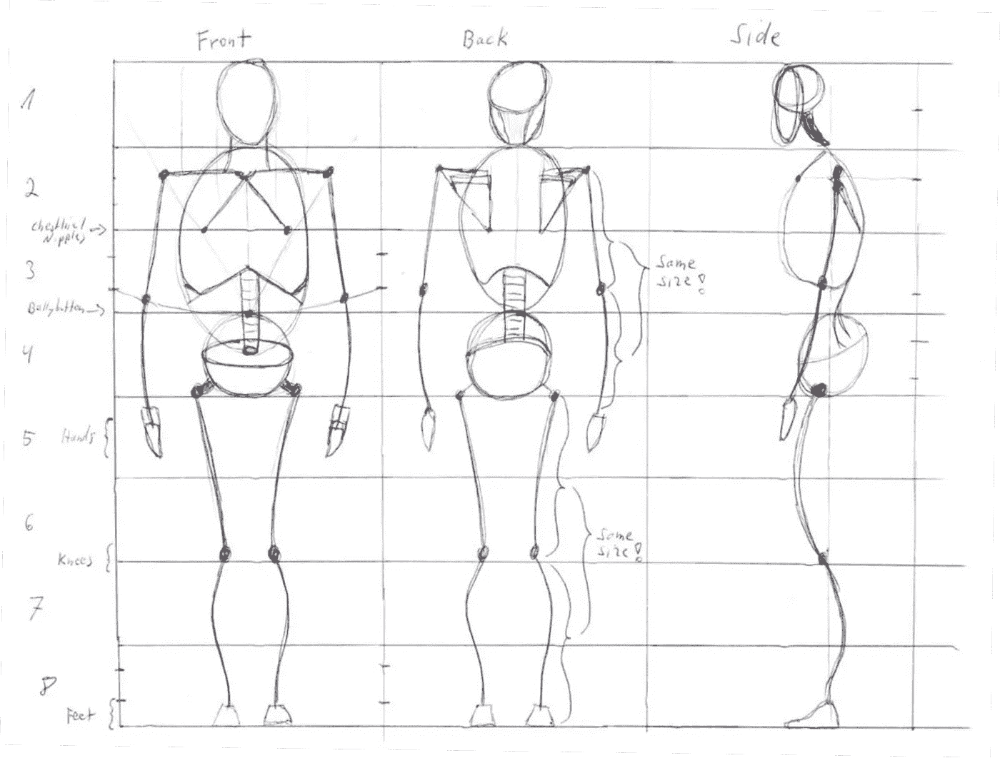

# 如何像软件工程师一样写文章

> 原文：<https://towardsdatascience.com/how-to-write-articles-like-a-software-engineer-d7a1857de81?source=collection_archive---------38----------------------->

## 有效和高效写作的缺失手册

阿里安·达尔维什在 [Unsplash](https://unsplash.com/s/photos/programming?utm_source=unsplash&utm_medium=referral&utm_content=creditCopyText) 上拍摄的照片

写一篇有效、高效的文章意味着什么？根据[剑桥词典](https://dictionary.cambridge.org/)有两个定义:

> **1。高效:充分利用时间、材料或能源等资源，不浪费任何资源。**
> 
> **2。有效的:产生预期的结果，或(指人)有技能或有能力做好某事。**

换句话说，写一篇有效的文章意味着用正确的方式写出正确的文章。鉴于我有计算机科学的背景，这听起来对我来说很熟悉。

这些定义听起来类似于您在软件工程领域经常听到的两个术语，即:

> 1.**验证**:对一个系统的测试，以证明它满足其开发的特定阶段的所有规定要求。
> 
> 2.**验证**:确保最终产品利益相关者的真实需求和期望得到满足的活动。

简单来说，验证是关于以正确的方式构建产品，而验证是关于构建正确的产品。

我越想这些相似之处，就越想构建一个软件和写一篇文章之间的其他相似之处。

计算机科学只不过是处理和解决问题的科学。算法只不过是一个配方。这个提示列表可以被看作是一个简单的算法，用来写出有效且高效的文章。或者，如果你想从软件工程师的角度来看，只需要一个清单来验证你的文章。

本质上，这篇文章只是一个微弱的尝试，来帮助自己成为一个更好的作家。帮助我自己处理混乱的过程，不要迷失在细节中而忽略了大局。这是一个非详尽的通用提示列表，您不必一步一步地遵循。你甚至不需要同意他们所有人的观点！只拿你需要的。

虽然我写这篇文章只是为了自己，但我希望其他人也能从中受益。

# 1.有主意了

在 [Unsplash](https://unsplash.com/s/photos/sprout?utm_source=unsplash&utm_medium=referral&utm_content=creditCopyText) 上由 [Majharul Islam](https://unsplash.com/@mipavelk?utm_source=unsplash&utm_medium=referral&utm_content=creditCopyText) 拍摄的照片

> "玫瑰始于花蕾，鸟儿始于蛋，森林始于种子。"马特肖纳·德里瓦约

一切从一个想法开始。不管它有多小，也不管它是关于什么的。只要你觉得值得分享。它可以是一个教程，一个个人故事，一篇书评，或者任何你喜欢写的东西。不管是什么，你应该有一种强烈的冲动把它从你的胸中拿出来。

我通常一周有几十个想法，但只有几个能坚持下来。如果某个想法在我的脑海中反复出现，我知道我必须采取行动。

你不知道吗？那你希望看到的目前不存在的是什么呢？或者你的朋友或家人有什么样的问题你可以解决？对开发软件有效的问题同样适用于写文章。只要你的想法解决了某人的问题，你就在正确的轨道上。哪怕只是你自己的问题。

以这篇文章为例。它的存在仅仅是因为我想有一种指南或清单，可以用于我未来的文章。然后我想其他人也可以从中获利。这就是了。

# 2.做你的研究

照片由[莎拉·基利安](https://unsplash.com/@rojekilian?utm_source=unsplash&utm_medium=referral&utm_content=creditCopyText)在 [Unsplash](https://unsplash.com/s/photos/mistake?utm_source=unsplash&utm_medium=referral&utm_content=creditCopyText) 拍摄

> “从别人的错误中吸取教训。你不可能活得足够长，让它们都是你自己做的。”―埃莉诺·罗斯福

每当一个特定的想法打动我时，我都很兴奋，并认为世界上还没有人写过这个特定的主题。或者曾经写过这样的软件。

我最近有了一个想法，用 Python 为不同种类的媒体类型编写一个并行的 web scraper。在快速的网络搜索之后，我发现我的想法已经被很多人关注了。可能比我聪明得多的人。如果你曾经遇到过类似的情况，那么你可能也会感到气馁。

但你不应该，因为这并不意味着它的结束。这种情况一直都在发生。只能说明你遇到了现实世界的问题。一个值得已经尝试解决它的人花时间去解决的问题。这并不意味着他们的解决方案有任何好处。

脸书逐渐取代了 MySpace，尽管他们都面临着同样的问题。

根据[维基百科](https://en.wikipedia.org/wiki/Competitor_analysis)，

> 市场营销和战略管理中的竞争对手分析是对当前和潜在竞争对手的优势和劣势的评估。

把你的想法拿出来，看看其他人是否已经尝试过解决它。他们的解决方案好吗？从他们的错误中吸取教训，并使之变得更好。汇总他们的发现，对你最初的想法有新的见解。也许你最初的想法会演变成不同的东西。更好的东西。

用一个快速的研究会议来验证你的想法。你花在早期研究阶段的时间是一项伟大的投资，因为建造一个没人想要的东西是世界上最糟糕的感觉。

打造一个人们愿意为之付费的产品。在中等文章的具体情况下，人们不是直接用他们的钱而是用他们的阅读时间支付给你。人们想要有价值的信息作为回报。

# 3.创造价值

由[莎伦·麦卡琴](https://unsplash.com/@sharonmccutcheon?utm_source=unsplash&utm_medium=referral&utm_content=creditCopyText)在 [Unsplash](https://unsplash.com/s/photos/value?utm_source=unsplash&utm_medium=referral&utm_content=creditCopyText) 上拍摄的照片

> “努力不要成为一个成功的人，而是成为一个有价值的人。看看周围的人是如何想从生活中获得比他们投入更多的东西。一个有价值的人给予的会比他得到的多。”——阿尔伯特·爱因斯坦

不管你的想法是独一无二的还是其他人已经有了相同的想法。重要的是你的产品为用户创造价值。

当谈到媒体文章时，你必须问自己这样一个问题:有人真的会通过阅读这篇文章有所收获吗？

不要模仿别人，但也不要重新发明轮子。汇总你的研究成果，并以此为基础。让它变得更好！

读者应该渴望读到你的文章，直到最后。和他们一起玩 [FOMO(害怕错过)](https://en.wikipedia.org/wiki/Fear_of_missing_out)。得到一些好的报价。人们喜欢学习新的东西。如果他们能在下一次家庭聚会上使用这些新知识来传播一些智慧，那就更好了。我在这篇文章中也是这样做的。

在增加价值的方式上要有创造性。以第 2 点中的并行 web scraper 为例。大部分提到的网页抓取库都只是命令行工具。然而，当我使用这些库来实现一个更大的、对最终客户来说易于使用的在线平台时，我突然创造了额外的价值。试着在你的文章中做同样的事情，要有创造性。

此外，想想你的产品的寿命。一个月后会过时还是一年后仍有价值？

# 4.第一个原型

由[狮式战斗机·珀奇克](https://unsplash.com/@laviperchik?utm_source=unsplash&utm_medium=referral&utm_content=creditCopyText)在 [Unsplash](https://unsplash.com/s/photos/sketch?utm_source=unsplash&utm_medium=referral&utm_content=creditCopyText) 上拍摄的照片

> “好故事不是写出来的。它们被重写了。” *—菲利斯·惠特尼*

第一个原型类似于草稿，可以用于许多目的。这可能类似于产品设计中的探索性原型设计，在创造东西的同时发现新的想法。这可能是一个概念的证明，或者是一个最低可行的产品，让你自己看看当你的想法实现时，它是否仍然有意义。

对于其他人来说，这只是为了看到他们的想法写在一个地方，以获得更清晰的画面。写下一些东西会激活不同的神经通路，而不仅仅是思考。

不管它是什么，大多数时候它都是一堆没人需要看到的脏东西。这很好。一个制陶师不是从一个成品花瓶开始，而是从一堆乱七八糟的粘土开始。你也应该这样做。允许自己写非常糟糕的内容。

每当我有一个无法摆脱的应用程序的想法时，我通常会创建一个 [Github](https://github.com/) 库，并创建一个非常小的原型和一些注释。我写糟糕的代码，只是试图让它以某种方式工作。

对于一篇文章，我通常会做一些笔记，或者只是在草稿模式下写一篇中等大小的文章，然后开始写作。我的第一个笔记包括要点，例句，标题和副标题，如何组织文章，我的文章的目标是什么。这是一个烂摊子。

你可以自己选择如何完成初稿。有些人喜欢用演绎的方式来处理它，这意味着你要从更一般的到更具体的。其他人更喜欢以归纳的方式工作，这是相反的方式。你从细节转移到更一般的东西。或者两者的混合。你觉得怎样都行。

我喜欢用一个 25 分钟的番茄时段来写我的初稿，因为这让我有时间压力。在时间压力下工作支持两个重要的法则。

[**帕金森定律**](https://en.wikipedia.org/wiki/Parkinson%27s_law) 陈述如下:

> “工作扩大以填补完成它的时间”——西里尔·诺斯古德·帕金森

另一方面， [**帕累托法则**](https://en.wikipedia.org/wiki/Pareto_principle) (也称为 80/20 法则)指出:

> "对许多事件来说，大约 80%的结果来自 20%的原因."—维尔弗雷多·帕累托

遵循这两条定律意味着我只有 25 分钟的时间来想出有价值的内容。因为我只有 25 分钟的时间，所以我更有可能只写下重要的 20%的想法，而这些想法可能对最终的产品有 80%的贡献。

此外，我不太可能走神，因为时间紧迫，我心中有一个明确的目标。

# 5.设定 SMART 目标

亚历山大·席默克在 [Unsplash](https://unsplash.com/s/photos/measurement?utm_source=unsplash&utm_medium=referral&utm_content=creditCopyText) 上拍摄的照片

> “如果你不能衡量它，你就不能改善它。” *—彼得·德鲁克*

目标很重要。这没什么新鲜的。一个目标可以是:

> “我想更好地学习编程！”

这是一个很好的目标，但它相当宽泛和不明确。你想怎么变好？需要多长时间？具体想改善什么？你想学习更多关于数据结构的知识吗？你应该有[智能目标](https://en.wikipedia.org/wiki/SMART_criteria)。 **SMART** 是项目管理领域经常使用的缩写词，代表:

*   具体的:你的目标不应该太笼统。不然你想怎么确定你达到目标的点呢？你的目标应该是具体的，你应该选择一个具体的衡量标准，告诉你什么时候你真正达到了目标。
*   可衡量的:你应该能够跟踪和量化你目标的进展。这也增加了动力，因为你现在有了一个工具来反馈自己的进展。
*   可实现的:评估你自己目前的能力，检查你是否能以目前的技能达到你的目标。尽量现实一点。少做多做是一个原则，这个原则对许多人来说是有效的，可以一步一步实现小目标。
*   相关:你的目标有助于更高的目标吗？是不是一个更大问题的子解决方案？它在多大程度上帮助了你？会带来更多收入吗？
*   有时间限制的:有时间限制的目标有助于你按计划进行。给自己设定一个截止日期可以帮助你以更有效的方式实现目标。达到一个目标是伟大的，但如果花的时间太长就不是了。

你每设定一个目标，它都应该具备这五个特征。使用任何你认为合适的工具。用一张纸写下 SMART 目标的五个栏目。你甚至可以使用 [Scrum](https://www.scrum.org/resources/what-is-scrum) 或[看板](https://kanbanize.com/kanban-resources/getting-started/what-is-kanban)板，如 [Trello](https://trello.com/) 来帮助你。在开始写文章或软件产品之前，写下 SMART 目标。从长远来看，这对你有好处。

快速达成目标是好事。快速达到正确的目标更好。

# 6.结构

[Jason Abdilla](https://unsplash.com/@jabdilla_creative?utm_source=unsplash&utm_medium=referral&utm_content=creditCopyText) 在 [Unsplash](https://unsplash.com/s/photos/axe?utm_source=unsplash&utm_medium=referral&utm_content=creditCopyText) 上拍摄的照片

> “给我六个小时砍树，我会用前四个小时磨利斧头。”—亚伯拉罕·林肯

不管你想创作的是一篇文章还是一个软件产品，它们都应该有一个合适的结构和基础。这几乎就像盖房子一样。你从地基开始，而不是屋顶。

以我的人体素描为例。如你所见，我不是专业艺术家，但这有助于解释我所追求的类比。

我自己的男性人体素描

素描在早期绘画阶段很重要。素描有助于获得正确的比例。你可以添加尽可能多的细节，试图掩盖潜在的错误，但所有的细节都无法弥补糟糕的比例。

同样的原则也适用于软件开发。你可以实现一个看起来很棒的软件，但是如果功能不正确，你不能用闪亮的按钮来弥补。

写作也不例外，在添加细节之前，先弄清楚结构和基础，可以节省你大量的时间。你的想法应该符合逻辑。一步接一步。一点一点地积累，并有一个要点要传达。

通过介绍问题或理解文章所必需的任何东西来提供一些背景。之后，提供一个问题的解决方案或主要内容。牵着读者的手，做一个引路人。

我通常根据章节和标题来考虑文章结构。我创建章节，直到我认为我的文章的每个方面都涵盖了。所有部分的总和应该产生一个连贯的乘积。只有在那之后，我才试着用细节来填充这些部分。

# 7.了解你的目标受众

埃尔蒂·梅绍在 [Unsplash](https://unsplash.com/s/photos/horror?utm_source=unsplash&utm_medium=referral&utm_content=creditCopyText) 上拍摄的照片

> “总是尽可能让观众痛苦。”—阿尔弗雷德·希区柯克

你不必照字面理解希区柯克的建议，吓跑你的用户和读者。除非这就是他们想要的。这是这里的主要信息。

买阿尔弗雷德·希区柯克或斯蒂芬·金的书的人脑子里都有某些假设。他们想通过害怕来娱乐。他们想要恐怖片、惊悚片或两者兼而有之，而不是爱情片。

你必须为合适的人制造合适的产品。为了制造合适的产品，你必须了解客户的需求和问题。你必须了解你的观众。你为谁写作？这是一个类似于软件验证的概念，定义如下:

> "确保最终产品利益相关者的真正需求和期望得到满足的活动."

软件验证试图回答这个问题:我正在构建正确的产品吗？

当你开始写文章时，你可以问自己几个关于目标读者的问题，比如:

*   他们想要艰难、无聊的事实，还是情感的过山车？
*   我写作的目的是什么？
*   根据我的听众的技能，内容是否合适？是不是太技术化了？是不是技术不够？
*   我这篇文章的要点是什么？这对我的观众有多大帮助？

试着从读者的角度看问题。孙子的一句名言说:

> “知己知彼，百战不殆。如果你了解自己但不了解敌人，那么每一次胜利都会让你遭受失败。不知己知彼，百战不殆。”——孙子

虽然读者和用户不是你的敌人…在大多数情况下…你可以从这句话中学到很多。

当你为一个不知名的观众写一些你自己都不相信自己的东西时，你肯定注定会失败。当你写了一些伟大的东西，但你不知道是为了谁，这只是一个赌博，如果你的文章会成为一个成功。最后，当你为合适的人写好内容时，你会极大地增加你的机会。

再说一次，建造没人想要的东西是世界上最糟糕的感觉。

# 8.紫色的母牛

照片由 [Unsplash](https://unsplash.com/s/photos/cow?utm_source=unsplash&utm_medium=referral&utm_content=creditCopyText) 上的 [Stijn te Strake](https://unsplash.com/@stijntestrake?utm_source=unsplash&utm_medium=referral&utm_content=creditCopyText) 拍摄

> “成功的关键是找到一种脱颖而出的方法——成为单色荷斯坦奶牛中的紫色奶牛。”——塞思·戈丁

想象一下，你开着车，经过一片满是奶牛的田野。它们可能大小不同，可能有不同的黑白图案。这是一个常见的景象，你甚至不会给他们太多的注意力。他们中没有一个是鹤立鸡群的。然而，那是你想要实现的。鹤立鸡群。你想成为每个人都立即注意到的紫色奶牛。

紫牛的例子是一个常见的商业类比。针对媒体，有[不同的方法来解决引起注意的问题](https://medium.com/blogging-guide/medium-titles-subtitles-and-kickers-ce28a5700487)，例如:

*   引人入胜的标题和副标题
*   “踢球者”
*   为搜索引擎优化定制标题和副标题
*   从 [Unsplash](https://unsplash.com/) 、 [Pexels](http://pexels.com/) 、 [Burst](https://burst.shopify.com/) 、 [The Stocks](http://thestocks.im/) 、 [Pixabay](https://pixabay.com/) 等网站免费获取你的精选图片。

用户通常只需要一秒钟来决定他们是否要点击你的文章。一个好的标题和特色图片当然会有所帮助。

同样的原则也适用于 App-store 中的应用。你必须想出有创意的方法来脱颖而出。做紫牛。

# 9.分步解决

卡洛斯·伊瓦涅斯在 [Unsplash](https://unsplash.com/s/photos/rome?utm_source=unsplash&utm_medium=referral&utm_content=creditCopyText) 上的照片

> “分而治之。”—朱利叶斯·凯撒

Julius Caesar 的这句名言也适用于计算机科学领域。[分而治之](https://en.wikipedia.org/wiki/Divide-and-conquer_algorithm)可以作为一种算法设计范例

> 该算法的工作原理是递归地将一个问题分解成两个或更多相同或相关类型的子问题，直到这些子问题变得足够简单，可以直接解决。然后将子问题的解决方案组合起来，给出原问题的解决方案。

如果你把一篇文章当成一个你想要解决的更大的问题，那么把文章分成更小的子问题是有意义的。

一方面，这为你自己创造了动力和动力，因为你现在有了小而容易的子问题，而不是一个大的、整体的问题。你可以将每个子问题与你想要达到的里程碑联系起来，这样你就创造了一种衡量你进步的方式。

另一方面，将文章分成更小的子问题也可以意味着为读者在视觉上划分文章。大多数情况下，如果读者发现文章中间没有什么停顿，他们会觉得读起来更容易。你可以使用链接、图片、视频或任何你喜欢的东西。

以这篇文章为例。我用图片把文章分成了每一部分。

# 10.整体情况

Lukasz Szmigiel 在 [Unsplash](https://unsplash.com/s/photos/forest?utm_source=unsplash&utm_medium=referral&utm_content=creditCopyText) 上拍摄的照片

> “如果你花一生的时间去分析每一次遭遇，你只会看到树，而看不到森林。”香农·阿尔德

你是否迷失在细节中？你在一个句子上写了将近十分钟吗？你难道看不见森林吗？

你必须不时后退一步，从整体上看待这个问题。如果细节无助于大局，即主要问题，那么细节就毫无意义。

休息一会儿，想一想你真正想用你的产品达到什么目的。你目前的活动对产品的贡献有多大？值得吗？

# 11.不要做一个完美主义者

布雷特·乔丹在 [Unsplash](https://unsplash.com/s/photos/better-than-perfect?utm_source=unsplash&utm_medium=referral&utm_content=creditCopyText) 上的照片

> “从根本上说，完美主义并不是对一丝不苟的热爱。是关于恐惧。害怕犯错。怕让别人失望。害怕失败。怕成功。”迈克尔·劳

有一个关于[陶瓷班](https://excellentjourney.net/2015/03/04/art-fear-the-ceramics-class-and-quantity-before-quality/)的好故事，证明了数量重于质量。

> 最高质量的作品都是由被评定数量的小组制作的。看起来，当“数量”组忙于大量的工作，并从他们的错误中学习时，“质量”组却坐在那里理论完美，最终他们的努力只剩下浮夸的理论和一堆死粘土。

不要试图想出一个完美的产品，也不要浪费太多时间对你的产品进行理论化。熟能生巧。大师失败的次数比初学者尝试的次数还要多。

写下最少的内容来表达你的观点。你可以创建一个临时附录部分，附加内容可能是也可能不是你最终文章的一部分。

记住技巧 4 中的帕累托原则:

> "对许多事件来说，大约 80%的结果来自 20%的原因."—维尔弗雷多·帕累托

当你认为你的文章差不多准备好了，就发表吧。不要浪费太多时间润色，因为你可能会花 80%的时间把文章的最后 20%写得恰到好处。你仍然可以在以后改正小错误，并采纳读者的反馈。

完成比完美更好。

# 12.让它成为一次愉快的经历

[米 PHAM](https://unsplash.com/@phammi?utm_source=unsplash&utm_medium=referral&utm_content=creditCopyText) 在 [Unsplash](https://unsplash.com/s/photos/happiness?utm_source=unsplash&utm_medium=referral&utm_content=creditCopyText) 上拍照

> 他们可能会忘记你说过的话，但他们不会忘记你带给他们的感受卡尔·布埃希纳

人类是有情感的生物。不可否认。你的文章内容也应该传达情感，使之成为一种愉快的体验。

许多软件公司都有人负责[用户体验(UX)](https://en.wikipedia.org/wiki/User_experience) :

> **用户体验** ( **UX** )是一个人对使用某个特定[产品](https://en.wikipedia.org/wiki/Product_(business))、[系统](https://en.wikipedia.org/wiki/System)或服务的情绪和态度。它包括[人机交互](https://en.wikipedia.org/wiki/Human%E2%80%93computer_interaction)和产品所有权的实用、体验、[情感](https://en.wikipedia.org/wiki/Affective)、有意义和有价值的方面。

关于如何获得愉快的用户体验，没有固定的规则。这可能是一个快速的加载时间，令人鼓舞的消息，漂亮的视觉效果。你的想象力是极限。

对于中型文章，您可以尝试使用 Medium 提供的几种格式化选项。使用文体特征，看看它们是否能让你的文章更有趣。

在我的一篇关于如何阅读科学论文的文章中，我试着非常鼓励你，因为我知道面对你的第一篇研究论文是多么困难和令人畏惧。

要有创造性，把读者想象成一个你想以善意的方式接近的好朋友。

# 13.简单点，笨蛋

照片由[蒂姆·莫斯霍尔德](https://unsplash.com/@timmossholder?utm_source=unsplash&utm_medium=referral&utm_content=creditCopyText)在 [Unsplash](https://unsplash.com/s/photos/kiss?utm_source=unsplash&utm_medium=referral&utm_content=creditCopyText) 上拍摄

> "一切都应该尽可能简单，但不能更简单。"——阿尔伯特·爱因斯坦

接吻原则是“保持简单，笨蛋”的首字母缩写。KISS 原则不仅适用于软件设计，也适用于写作。尽量使用简单的句子，让你的内容容易消化。不要把事情复杂化。乔希·考夫曼曾经说过:

> “系统越复杂，运行时间越长，就越有可能出现重大故障。”

如果你写的句子过于复杂，并且包含大量重复，你的读者会失去兴趣。要精确。

# 14.工具

Cesar Carlevarino Aragon 在 [Unsplash](https://unsplash.com/s/photos/tools?utm_source=unsplash&utm_medium=referral&utm_content=creditCopyText) 拍摄的照片

> “这可能不是问题所在。相反，问题可能是我用来尝试解决问题的工具。”克雷格·劳恩斯布鲁

没有她/他的工具，程序员什么都不是。程序员使用 ide 让他们的生活变得更简单，他们喜欢自动化。而且，大部分程序员都很懒。我也不例外。

一个作家也可以受益于各种工具，以提高效率。你可以使用像[这样的拼写检查器。你可以在文章中添加视觉辅助来支持你的内容。添加图像或视频，但要确保你没有侵犯任何版权。](https://app.grammarly.com/)

# 15.给予，它就会给你

> "因为我们正是在给予中获得的。"—弗朗西斯(阿西西的)

存在这样一个奇怪的普遍规律:慷慨付出的人得到的更多。我在这篇文章中遵循了这个原则，链接了我认为有帮助的其他文章。我使用推荐人，并在该表扬的地方给予表扬。

说到编程，同样的原则也适用于开源项目。乍一看，你似乎是免费工作的，但是你从社区获得了关于你的编程技能的有价值的反馈，从长远来看，这可能对你有更大的帮助。

与他人建立联系，你不会后悔。

# 16.首先，让它工作，然后让它变得更好

照片由[亚历克斯·科特利亚斯基](https://unsplash.com/@frantic?utm_source=unsplash&utm_medium=referral&utm_content=creditCopyText)在 [Unsplash](https://unsplash.com/s/photos/programming?utm_source=unsplash&utm_medium=referral&utm_content=creditCopyText) 上拍摄

> “让它工作，让它正确，让它快。”—肯特·贝克

这条建议和你的初稿的建议是相辅相成的。用最少的句子来表达你的观点。稍后添加细节。首先，让它发挥作用。

拥有极简主义者的心态，以迭代和渐进的方式解决问题。迭代意味着你循环工作，迭代解决问题。增量意味着你在目前已经取得的成果的基础上继续努力。使用演绎或归纳的方法，但首先要让它起作用。

# 17.不要试图推销

莎伦·麦卡琴在 [Unsplash](https://unsplash.com/s/photos/selling?utm_source=unsplash&utm_medium=referral&utm_content=creditCopyText) 上的照片

> “带着帮助客户解决问题或实现目标的想法接近他们，而不是销售产品或服务。”—布莱恩·特雷西

假设你购买了一款手机应用。你第一次启动它，只是为了看看它仍然包含恼人的弹出窗口和广告。你可能觉得被骗了。

中等文章也是如此。如果你在付费墙后发表文章，那么读者已经支付了费用，可以免费阅读这些文章。他们想要产品，仅此而已。不要因为包含附属链接和重复行动号召(CTA)而失去读者的信任。不要滥用你的文章以销售产品为主要目的。

只要努力解决他们的问题，销售就会随之而来。

# 18.把问题留在第二天解决

照片由[凯特·斯通·马西森](https://unsplash.com/@kstonematheson?utm_source=unsplash&utm_medium=referral&utm_content=creditCopyText)在 [Unsplash](https://unsplash.com/s/photos/sleep?utm_source=unsplash&utm_medium=referral&utm_content=creditCopyText) 上拍摄

> “熟能生巧。只有练习，再加上一夜的睡眠，才能达到完美。”—马修·沃克

乔希·考夫曼在他的书《前 20 小时:如何快速学习》中谈到了睡眠的重要性。他解释说，大多数学习过程不是在你练习的时候发生的，而是在你睡觉的时候。当你临睡前练习时，你会达到最好的效果。你的潜意识会处理剩下的。

即使你不在睡觉前写文章，当你被卡住的时候，在一个问题上睡觉几乎总是一个好主意。写作和编程都是创造性的工作，有时你就是无法推动它。

睡了一夜好觉后，你常常能想出一个简单的办法来解决一个看似困难的问题。

# 19.重构

照片由[叶戈尔·维克列夫](https://unsplash.com/@egor_vikhrev?utm_source=unsplash&utm_medium=referral&utm_content=creditCopyText)在 [Unsplash](https://unsplash.com/s/photos/restoration?utm_source=unsplash&utm_medium=referral&utm_content=creditCopyText) 上拍摄

> “一个直观的定义是，安全重构是不会破坏程序的重构。因为重构的目的是在不改变程序行为的情况下重构程序，所以程序在重构后的表现应该和重构前一样。”—马丁·福勒

重构是软件工程师最常听到的一个术语。重构使代码更容易阅读，而功能保持不变。你可以把同样的原则应用于一般写作。

你可能以前听过这句话:“如果读起来容易，那么写起来就很难！”。但是几乎没有人第一次就写出优雅的句子。这是一个反复修改你的作品的过程，直到它易于阅读而不丢失主要信息。

有勇气去掉句子。让你的产品精益。

# 20.营销和分销

[简·侯伯](https://unsplash.com/@jan_huber?utm_source=unsplash&utm_medium=referral&utm_content=creditCopyText)在 [Unsplash](https://unsplash.com/s/photos/tree?utm_source=unsplash&utm_medium=referral&utm_content=creditCopyText) 上拍照

> “如果一棵树倒在森林里，周围没有人听到，它会发出声音吗？—乔治·贝克莱

上面的引用很好地类比了写文章或创造任何类型的产品。你可能花了一些时间写你的文章。然而，如果一开始就没有人注意到它的存在，那该有多可悲？你所有的努力都会白费。

我最近写了一篇关于[如何备份 WordPress](https://medium.com/@christoph.schmidl/how-to-manually-backup-wordpress-daa43e37a9bd) 的文章。我在上面花了几天时间，但它没有被策划，也没有在任何地方发行。不要犯和我一样的错误。你正在阅读的这篇文章源于对我的 WordPress 文章的不满。

营销和分销几乎和产品本身一样重要。也许更重要。问问你自己:我怎样才能让尽可能多的人对我的产品感兴趣？

Medium 为此提供了不同的解决方案:

*   为你的文章使用合适的标签。如果你的文章得到了[策划](https://medium.com/the-write-brain/a-guide-to-medium-curation-7d5be2dd97db)，那么它将会出现在它所策划的主题中。你文章的策展叫做“分发”。媒体有一定的[指导方针来获得策划](https://help.medium.com/hc/en-us/articles/360006362473-Medium-s-Curation-Guidelines-everything-writers-need-to-know)。
*   将你的文章提交给出版物。大部分都有写作指南。在提交文章之前，阅读它们并应用到你的文章中。
*   查找[最活跃的媒体出版物](https://medium.com/writers-guild/the-top-10-active-medium-publications-of-2020-1f2752a618ce)，看看其中是否有合适的。

除了 Medium 的内置分发功能之外，您还可以在其他任何地方提交您的文章。搜索可能对你的内容感兴趣的在线社区，如 Reddit、论坛、脸书、Instagram。选择权在你。

# 最后的话

**我希望你喜欢这篇文章。你可以根据自己的需要随意调整这个列表。如果您对本文有任何问题或评论，请在下面留下您的评论。**

你对我的文章或项目的更新感兴趣吗？我的[简讯](https://mailchi.mp/7dea5811a5b6/christophschmidl)每月一次让你了解最新消息！

如果你想支持我，并且你还不是一个中等会员，那么请考虑通过我的推荐页面注册:[https://medium.com/@christoph.schmidl/membership](https://medium.com/@christoph.schmidl/membership)