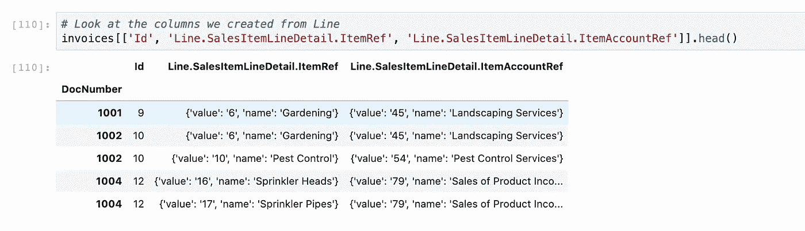

# 如何用 Python 编写 ETL 操作

> 原文：<https://towardsdatascience.com/how-to-write-etl-operations-in-python-baffbceeadf4?source=collection_archive---------7----------------------->

## 使用 Python 清理原始数据并将其转换为可接受的格式


来源: [Unsplash](https://unsplash.com/photos/EySEKaimdKo)

在本文中，您将学习如何在 Python 环境中处理 Excel/CSV 文件，以清理原始数据并将其转换为更易于接受的格式。这对**数据集成**非常有用。

本例将涉及到许多常见的 ETL 操作，如**过滤**、**减少、**、**、**和**展平**。

## 笔记

这些例子的代码可以在 GitHub [这里](https://github.com/hotgluexyz/recipes)上公开获得，还有我将带你浏览的镜像信息的描述。

这些示例依赖于两个开源 Python 包:

*   **pandas:** 一个广泛使用的开源数据分析和操作工具。更多关于他们网站[和](https://pandas.pydata.org/) [PyPi](https://pypi.org/project/pandas/) 的信息。
*   **gluestick:** 一个小型开源 Python 包，包含由 [hotglue](https://hotglue.xyz) 团队维护的用于 ETL 的 util 函数。更多关于 [PyPi](https://pypi.org/project/gluestick/) 和 [GitHub](https://github.com/hotgluexyz/gluestick) 的信息。

事不宜迟，我们开始吧！

# 介绍

这个例子利用了来自 Quickbooks 沙盒环境的样本 Quickbooks 数据，并且最初是在一个 [hotglue](https://hotglue.xyz/) 环境中创建的——一个用于初创公司的轻量级数据集成工具。

请随时关注下面 GitHub 上的 Jupyter 笔记本！

[](https://github.com/hotgluexyz/recipes/blob/master/src/basic.ipynb) [## hotgluexyz/食谱

### 用 Python 编写 ETL 转换脚本的简单示例

github.com](https://github.com/hotgluexyz/recipes/blob/master/src/basic.ipynb) 

# 第一步:读取数据

让我们从读取数据开始。

这个例子建立在 hotglue 环境上，数据来自 Quickbooks。在 hotglue 中，数据以 CSV 格式放在本地的`sync-output`文件夹中。我们将使用 [gluestick](https://pypi.org/project/gluestick/) 包通过`read_csv_folder`函数将输入文件夹中的原始数据读入熊猫数据帧字典。

通过指定`index_cols={'Invoice': 'DocNumber'}`,`Invoices`数据帧将使用`DocNumber`列作为索引。通过指定转换器，我们可以使用`ast`来解析`Line`和`CustomField`列中的 JSON 数据。

## 偷看一眼

让我们看看我们正在处理哪些数据。为了简单起见，我选择了我想要使用的列，并将其保存到`input_df`。通常在 hotglue 中，你可以使用一个字段映射来配置它，但是我在这里是手动完成的。


# 步骤 2:重命名列

让我们通过将列重命名为更易读的名称来清理数据。

```
CustomerRef__value -> CustomerId
CustomerRef__name -> Customer
MetaData_LastUpdatedTime -> LastUpdated
MetaData_CreateTime -> CreatedOn
CurrencyRef__name -> Currency
CurrencyRef__value -> CurrencyCode
```


# 第三步:提取信息

`Line`列实际上是 Quickbooks 提供的一个序列化的 JSON 对象，其中有几个有用的元素。我们需要从**展平**JSON 开始，然后**分解**成唯一的列，这样我们就可以处理数据了。

同样，我们将使用 [gluestick](https://pypi.org/project/gluestick/) 包来完成这个任务。`explode_json_to_rows`函数在一个步骤中处理展平和分解。为了避免分解这个对象的太多层次，我们将指定`max_level=1`

下面是其中的一个片段，可以让你有所了解。

```
[{
    'Id': '1',
    'LineNum': '1',
    'Amount': 275.0,
    'DetailType': 'SalesItemLineDetail',
    'SalesItemLineDetail': {
        'ItemRef': {
            'value': '5',
            'name': 'Rock Fountain'
        },
        'ItemAccountRef': {
            'value': '79',
            'name': 'Sales of Product Income'
        },
        'TaxCodeRef': {
            'value': 'TAX',
            'name': None
        }
    },
    'SubTotalLineDetail': None,
    'DiscountLineDetail': None
}]
```


# 步骤 4:筛选行

出于我们的目的，我们只想处理带有`Line.DetailType`或`SalesItemLineDetail`的行(我们不需要小计行)。这是一个常见的 ETL 操作，称为**过滤**，使用 pandas 很容易完成


# 第五步:更多爆炸

看看我们展开的`Line`列中的一些条目。您会注意到它们是 JSON 中的名称值对。



让我们再次使用[胶棒](https://pypi.org/project/gluestick/)通过`json_tuple_to_cols`功能将这些分解成新的列。我们需要指定`lookup_keys`——在我们的例子中，是`key_prop=name`和`value_prop=value`


# 第六步:更多爆炸

看一下`CustomField`栏。下面是一个条目示例


```
[{'DefinitionId': '1', 'Name': 'Crew #', 'Type': 'StringType', 'StringValue': '102'}]
```

您可以看到这是 JSON 编码的数据，指定了一个定制字段:`Crew #`，值为`102`

为了分解这个，我们需要**减少**这个，因为我们只关心`Name`和`StringValue`。我们可以使用 gluestick 的`explode_json_to_cols`功能和`array_to_dict_reducer`来完成这个任务。


# 结论

我们的最终数据如下所示。在这个示例中，我们使用一个真实世界的例子，使用基本的 Python 工具完成了几个基本的 ETL 操作。


将来，你可以随意查看开源的[热熔胶配方](https://github.com/hotgluexyz/recipes)以获得更多的样本。感谢阅读！