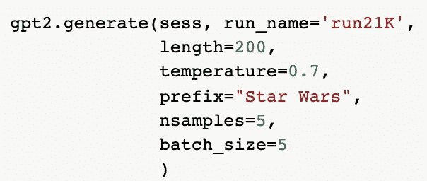
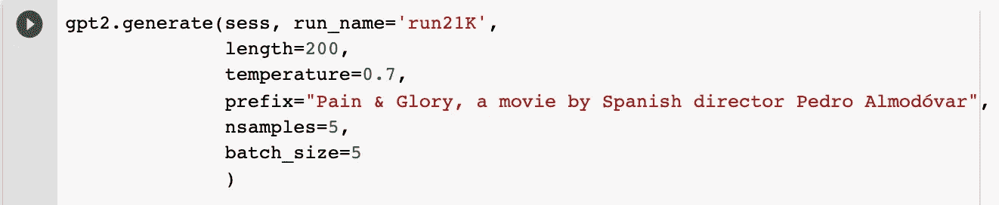
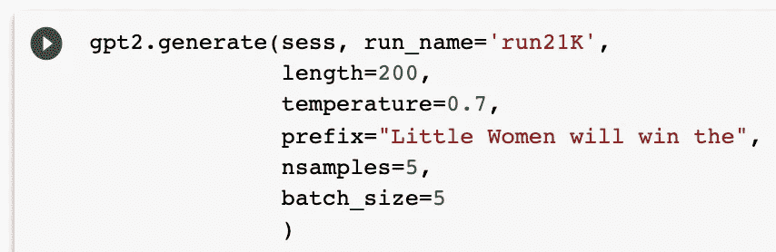

# 如何用 AI 写影评

> 原文：<https://towardsdatascience.com/how-to-write-movie-reviews-with-ai-d17f758f2ed5?source=collection_archive---------24----------------------->

## 微调 GPT-2 的短篇小说


费利克斯·穆纳拉姆在 [Unsplash](https://unsplash.com?utm_source=medium&utm_medium=referral) 拍摄的照片

想象一下，与一个人工智能合作撰写一篇中等文章，这个人工智能已经阅读了你写过的每一个单词——一个语言模型，它从你的帖子、文章、口述笔记、初稿、扫描的日记条目、研究文件、最喜欢的引用以及其他使你的写作独一无二的思想碎片中学习。

你的人工智能写作伙伴可以对你的文章进行巧妙的评论，并就如何改进你的论点提出建议。它可能会出现一些鼓舞人心的引语，你可以把它们包括进去，并提醒你提及三年前在车管所排队时你保存在智能手机上的一个奇怪想法。

人工智能不会取代作家。它将增强你的写作过程，给你一个定制的读者和编辑精确校准，以改善你的风格，声音和主题。

我等不及这个世界的到来。我自学了足够多的编码[来用人工智能工具](/how-to-fine-tune-gpt-2-so-you-can-generate-long-form-creative-writing-7a5ae1314a61)生成小说，但在我内心深处，我是一名记者——一名非虚构的讲故事者。

我想看看人工智能现在如何帮助我的非小说写作。因此，利用超级语言模型 GPT-2，我训练了一个人工智能来为电影《威胁》杂志生成电影评论。

这个简短的非小说类实验让我对未来的写作工具有了一个初步的了解，我们有一天会在写作中使用这些工具。

# 未来的电影评论

当 OpenAI 去年推出 GPT-2 语言模型时，开发者担心糟糕的演员会滥用这个工具。该公司慢慢发布了其模型的不同强度版本，仔细观察 GPT-2 的滥用权力。

他们担心它可能被用来:

> “生成误导性新闻文章
> 在线冒充他人
> 自动制作滥用或伪造内容并发布到社交媒体上
> 自动制作垃圾邮件/网络钓鱼内容”

一年后，GPT-2 完全可供平民使用，为[惊人的游戏](/the-creator-of-ai-dungeon-2-shares-gpt-2-finetuning-advice-e5800df407c9)，创意写作[实验](https://desert.glass/archive/notes-from-the-quest-factory/)，以及[配方生成](https://aiweirdness.com/post/190569291992/ai-recipes-are-bad-and-a-proposal-for-making-them)提供动力。到目前为止，我们还没有看到大规模的假非虚构文学的产生。

我相信 GPT-2 最有趣的(也是潜在危险的)应用将来自短篇小说。亚马逊评论、书籍简介和电影反应已经消耗了我们太多的在线注意力，有时还会左右人们对某个产品或艺术作品的看法。

在开始这个项目时，我选择电影评论作为我的基础材料，因为网上有大量用户生成的评论——其中一些收集在公开可用的数据集中。你可以很容易地用书评、新闻文章、体育报道或你的非小说作品建立一个数据集。

去年，我与电影威胁的编辑团队一起工作，开始开发一个能够写电影评论的人工智能。我们一起发表了一些作品，我想分享一下我们是如何训练我们的模型的。


伊利亚·安东内尔在 [Unsplash](https://unsplash.com?utm_source=medium&utm_medium=referral) 上拍摄的照片

# 认识人工智能评论者

该项目开始很简单，在我接触到能够微调 GPT-2 的工具之前。即便如此，常规模式对于电影评论来说还是很管用的。

在*电影威胁* 的[第一篇文章中，我开始用](https://filmthreat.com/features/meet-artificial-intelligence-reviewer-film-threats-computer-generated-contributor/)[与变形金刚](https://talktotransformer.com/)对话生成感人的评论。这个网站让你可以立即进入 GPT-2。你所要做的就是输入一个关于电影的问题，然后点击“完成”无需编码！

我问了 GPT-2 一个引导性的问题:“谁是第一个写影评的人工智能？”我们得到了这个最棒的计算机生成的回复(完全未经编辑):

```
“Artificial Intelligence Reviewer. It’s the robot you can pay $15 for to watch your movie while you finish making your dinner at home.”
```

GPT-2 给了我电脑生成的影评人的名字。使用这个名字和一些引导性的问题，我用这个简单的界面生成了足够的材料来写一整篇关于电影威胁的文章。

但是我想做一些更复杂的东西。在下一篇文章中，我升级了人工智能评论器——制作了一个能够产生无尽电影评论的语言模型。按需提供。

# 微调 GPT-2 来回顾电影

使用一种称为“微调”的机器学习技术，我重新训练了 GPT-2 语言模型，该模型用一个大规模的电影评论数据集为人工智能评论者提供了动力。我给饥饿机器人提供了一个巨大的电影评论数据集，给了人工智能评论者一个全新的评论电影的词汇。

你可以在我的第二篇电影威胁文章中阅读结果，将读者最喜欢的电影与计算机生成的评论进行匹配。

以下是我如何训练电影威胁的人工智能…

## 1.下载数据集

首先，你需要找到你的非虚构作品的样本——书评、亚马逊用户反馈、脚注、Twitter 帖子，或者任何你想用电脑生成的简短形式的非虚构作品。网上有很多电影评论数据集。[这是我在斯坦福人工智能实验室网站上找到的一个数据集](https://ai.stanford.edu/~amaas/data/sentiment/):

> “这是一个用于二元情感分类的数据集，包含的数据比以前的基准数据集多得多。我们提供一组 25，000 条高度极性的电影评论用于训练，25，000 条用于测试。”

## 2.微调你的 GPT-2 语言模型。

微调我的两个语言模型花了几天时间。马克斯·伍尔夫创造了[一个令人惊叹的谷歌实验室笔记本](https://minimaxir.com/2019/09/howto-gpt2/)，让这一步变得不痛不痒、自由自在。我用的是中等大小的 355M 版本的 GPT 2，因为它足够大，可以处理我的数据集，但又足够小，可以在 Google Colab 的云服务器上运行。我把我的模型训练了 23000 步。

我将训练序列分成三个较小的部分，因为 Google Colab 不会运行超过 12，000 步。

## 3.使用微调后的 GPT-2 模型生成文本。

一旦我的语言模型得到训练，我就开始生成数百条通用的电影评论。这些很有趣，但有点不集中。对于每次运行，我设置长度为 200 个字符，温度为 0 . 7，输出为 10 个样本。

## 4.尝试简单的前缀。

当您开始向模型中加载新的前缀时，真正的奇迹就发生了。它可以像给一部电影命名一样简单。这是我尝试过的第一个测试:



我们立即在《星球大战》的评论中测试了我们的超级人工智能。在几秒钟内，人工智能评论者已经生成了几条如下的精彩评论:

```
“The film’s heart is in the right place, but its arteries are seriously clogged up with syrupy clichés.”
```

但随后，AI Reviewer 跟进了对*星球大战*的滔滔不绝的评论，像这样:

```
“A big, bright, adrenaline-fueled summer entertainment that offers a lot of action and excitement, but never wastes a minute of our time.”
```

我一遍又一遍地点击“运行”，直到我用成千上万条评论填满了一个空白文档。从这些可能永无止境的《星球大战》评论中找出最好的评论需要大量的人工阅读。

## 5.试试复杂的前缀。

一旦我有了一些关注单个片名前缀的有趣材料，我就开始关注不同的导演和演员，以获得更具体的电影评论。这是事情开始变得有趣的地方，当你开始玩模型的限制。

下面是一个前缀示例:



这个前缀让我们对 2019 年我最喜欢的外语电影之一进行了疯狂的评论。电影类型的最终融合仍然让我发笑。

```
"Pain & Glory, a movie by Spanish director Pedro Almodóvar that is filled with beautiful moments and some of the most intense, beautiful scenes I've seen in a long time. The last act is nearly non-stop action and big explosions. It's epic, awesome, and bloody awesome. Feels like a cross between the Matrix, The Matrix Reloaded and Indiana Jones & The Temple Of Doom."
```

随着颁奖季的临近，我还在前缀中加入了一些新的动词，比如“赢”和“输”。



这些前缀会给你带来一大堆奥斯卡预测！像这样:

```
"Little Women will win the Academy Award for Best Picture. I have a hard time believing the real-life story that is Perry Mason's Fresh Outta Compton. The movie is a good mix of true crime and urban legend."
```

## 6.通读你所有的输出。

人工智能产生的非虚构作品总是需要人类编辑。为了找到一篇好的电影评论，我不得不阅读成百上千页无聊、奇怪甚至听起来很正常的散文。工作量很大。但我从来没说过 AI 会取代作家。这只会帮助我们写得更好。


朱利叶斯·德罗斯特在 Unsplash 上拍摄的照片

# Twitter 和超越

就像我可以构建人工智能评论器来制作搞笑和奇怪的电影评论一样，我可以用我收集的所有数字作品来训练我的 GPT-2 写作伙伴。我有至少十年的电子文本，包括笔记、研究、草稿和电子书阅读的集锦。我可以成为一个真正的写作伙伴，每当我需要创作灵感时，就重塑和刷新我的想法。

马克斯·伍尔夫(Max Woolf)的工作一直激励着我，他最近的一篇文章《[如何用 GPT-2](https://minimaxir.com/2020/01/twitter-gpt2-bot/) 构建一个生成 Twitter 文本的人工智能机器人》(How To Build a Twitter Text Generating AI Bot)，向我们展示了这些接受过简写非小说训练的语言模型如何在网上度过一生。

他还对数据集的大小提出了一些警告。如果您想要使用较小的数据集生成唯一的文本，您需要遵循以下建议:

> 请注意，如果没有大量的 tweet，模型可能很容易过度拟合并逐字输出现有的 tweet；如果是这种情况，你可能想训练更少的步数(例如 200-500)。此外，我建议只使用 124 米的“小型”和 355 米的“中型”GPT-2 型号；较大的 GPT-2 模型在小文本文档和少量输入数据上表现不佳。

仅凭这个工具，你就可以创建一个 Twitter 机器人来为你发帖，或者创建一个新的机器人来发布你喜欢的话题。随着新 GPT 协议和其他语言模型被放入新的框架中，谁知道今年年底还会有哪些工具可用呢？

作家兼创意程序员大流士·卡泽米[曾经将这些语言模型的进步比作图形艺术家早期的 Photoshop:](https://www.publishersweekly.com/pw/by-topic/industry-news/publisher-news/article/81578-will-robots-make-the-next-big-bestsellers.html)

> “如果你对写作的未来感兴趣，这绝对值得关注。这就像是 Photoshop 问世时的摄影师，因为它可能会改变媒体的游戏规则。”

我希望有一天，这些工具会帮助我们创作我们甚至还无法想象的新故事。