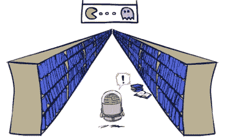

# CS 优等生如何解决问题

> 原文：<https://towardsdatascience.com/how-top-cs-students-problem-solve-17ae2c90fb96?source=collection_archive---------6----------------------->

## 加州大学伯克利分校 CS188:人工智能的尖子生给我留下了怎样的印象。

今天的尖子生赢得了从顶级公司招聘的热潮——他们展示了持续的方法来超越创新问题和创造价值。

# 领先一步

讲课时，我注意到最优秀的学生总是在我介绍 之前问我们要去哪里。支撑下两个部分的是构建概念图的清晰能力。我知道我是一个相当以思想为中心的讲师，这些学生不会错过任何一个节拍。原始计算能力令人印象深刻。

我将用一个运行中的多智能体学习竞赛来讲述这个故事，在这个竞赛中，我们希望以最佳方式解决新的 Pac-man 难题。这是为优等生设计的少量额外学分，但它最终让我们对顶尖人才的所作所为有了更深刻的了解。评分如下:

ai.berkeley.edu 来源[。](http://ai.berkeley.edu)

*   每个小球+10
*   收集所有小球+500
*   -每采取一项行动得 0.4 分
*   -1000 x(以秒为单位计算时间)

阿罗哈湖。来源—作者。

# 蛮力

我听说过很多关于加州大学伯克利分校的本科生如何努力工作的故事，但如果没有例子，很难知道这意味着什么或如何转化为实际生产力。

一名在 Pac-man 竞赛中获得第二名的学生最终运行了**一个暴力 bash 脚本，在随机种子上创建了一个反馈循环，并将新的解决方案**上传到我们试图(很差地)隐藏的测试用例中。这名学生没有被取消资格的原因是:他记录了他的方法，而我们没有为此制定规则。竞赛的一个新特点是对多个种子进行平均(对科学家来说很明显，是的)，这样从竞赛中返回的信号就不会那么直接。

## 哇，样本条目

下面是“ **wow** ”竞赛提交的摘要，看起来学生可能使用了一些可疑的做法来硬编码解决方案(硬编码将消除分数上的计算时间惩罚)，但他们设立了一个次要的类竞赛作为一个严重的工程问题。以下是他自己的一些话:

1.  将我在一个项目中的答案复制到迷你竞赛中— **645** 积分。
2.  制作一个工具，从自动评分员那里获得关于竞赛分数的**反馈**，包括每个谜题的个人分数(* *这是一个巨大的进步，因为它向黑盒测试案例*添加了反馈)。
3.  给每个吃豆人添加一个“目标数据”——通过规划和执行轨迹来减少计算(不要重新规划每一步)。
4.  为 Pac-men 添加共享数据，这样，如果一个 Pac-man 以点 A 为目标，其他 Pac-men 就会决定忽略点 A。这鼓励了每个 Pac-man 走不同的路线-1185 点。
5.  Pac-man 决定将目标点视为一面墙，而不是忽略点 A。这进一步鼓励每个 Pac-man 采取不同的路径，例如，如果两个最近的点在另一个 Pac-man 的路径上(* *)，这是对智能状态空间缩减如何帮助搜索问题的一个很好的洞察。*)。
6.  硬编码初始状态信息，以便我可以决定使用哪个 AI。然后用扫配种子。
7.  修改 pacman.py 的报告功能，以便在成功运行后，它将采取的操作复制到一个文本文件中，每个布局有一个唯一的文本文件。如果一个文本文件已经存在，那么它将该文件的分数与新建议的路径进行比较，并且只选择最佳选项。
8.  制作一个程序，将所有的人工智能结合到一个字典结构中，这样我就可以快速地复制/粘贴它。
9.  在我最好的人工智能上运行第 8 步，修改我的人工智能，如果当前布局与我的硬编码布局完全相同，它决定遵循硬编码路径；否则，它使用在步骤 4 中找到的 AI—**1226**点。
10.  在我的 AI 的大约 3 个变体上运行一次步骤 8，组合最佳结果，并更新硬编码路径— **1252** 点。
11.  修改 pacman.py，以便在一轮成功后，它分析生成的移动序列，并确定每个 Pac-man 试图到达的球，以及以什么顺序到达。(* *至关重要的工程步骤*)。
12.  运行步骤 9 一次，将新的 ai 合并到我的文件中— **1255** 点。
13.  修改我的代码，使它自动从文件中下载更好的 AI，并自我更新，这样我的 AI 就可以在没有人工干预的情况下进行改进。然后我创建了一个 bash 文件，反复运行修改后的自动分类器，从而自动改进路径。(* *第二个关键工程步骤*
14.  运行步骤 11 1 小时，并将新的 ai 合并到我的文件中。这对应的是我第六次投稿，得了 **1261** 分。
15.  通宵运行 bash 脚本。总训练时间约为 8 小时，但大部分进步都是在第一个小时内完成的——**1266**分。这个学生完成了。

从步骤 15 提交。

在这个过程中有一些严肃的见解，加上完成它的意志和动力。因此，要成为顶尖计算机科学大学的尖子生，需要的是能力和意志，让自己通过这种严格的实施过程。我不会说我有那种微调水平——也许这就是为什么我是研究生而不是软件工程师。

# 不要建立在盒子里——打破盒子

蛮力解决方案是关于建立一个更好的工具包，但最终学生输给了一个聪明的解决方案，这是一个天才的一击。

获奖作品。

在一个有 900 名学生的班级中，得分最高的人是对问题设置进行了改变的人，这使得他们的得分高得多(10%的幅度)。在一个惩罚额外行为的游戏中，这个学生让 3 个代理不采取行动，并用一个搜索代理解决了游戏。

分数——1327。

这是蛮力工程等式的另一半。**这是看似简单的事后诸葛亮，但很少有人拥有**。

来源—作者。

最优秀的学生找到了获胜的方法，并经常导致未来的规则。作为课程工作人员，细节令人印象深刻。**这是一种将产品推出门外的努力，我强烈袖手旁观这些学生的分数**。拥有这些努力和洞察力并不是成功的必要条件，但它们会带你走得很远。

我选择以我的表现来定义我自己的成功，所以我不担心试图复制任何像这样疯狂的胜利。通过**的一致性**和**的享受**，你可以拥有伟大的职业生涯，但看到一些最优秀的头脑如何分解问题也很有趣。

大约 3 年前，我在康奈尔大学完成了本科学业，大约 6 年后，我才真正试图在我的第一堂竞争性工程课中成名。我不确定是不是只是换个角度，但我已经被学生们打动了。我相信他们的努力会得到回报的。

更多关于演讲的想法可以在这里找到。

更多？订阅我关于机器人、人工智能和社会的时事通讯！

 [## 自动化大众化

### 一个关于机器人和人工智能的博客，让它们对每个人都有益，以及即将到来的自动化浪潮…

robotic.substack.com](https://robotic.substack.com/)