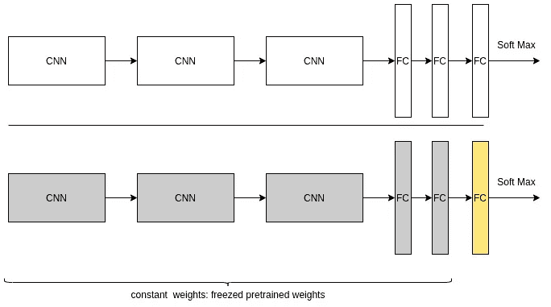
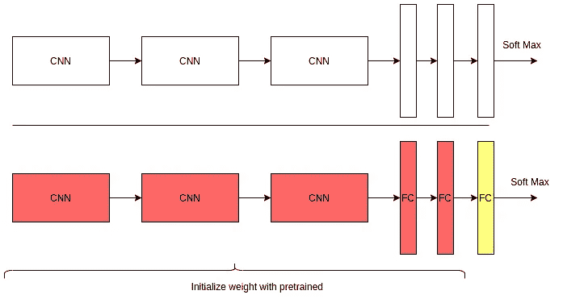
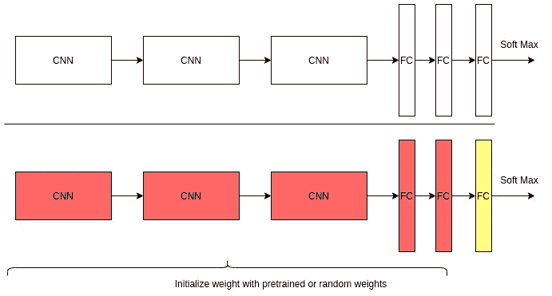

# 迁移学习是如何工作的

> 原文：<https://towardsdatascience.com/how-transfer-learning-works-a90bc4d93b5e?source=collection_archive---------33----------------------->

## “迁移学习将是 ML 成功的下一个驱动力”——吴恩达。

由 [Unsplash](https://unsplash.com?utm_source=medium&utm_medium=referral) 上的 [Element5 数码](https://unsplash.com/@element5digital?utm_source=medium&utm_medium=referral)拍摄

迁移学习是采用预训练的神经网络，并通过迁移或重新调整已学习的特征来使神经网络适应新的不同数据集的过程。例如，我们采用在 [ImageNet](http://image-net.org/) 上训练的模型，并使用该模型中学习到的权重来初始化全新数据集的训练和分类。例如，在 Sebastrian Thrun 和他的团队发表的[研究工作](https://www.nature.com/articles/nature21056.epdf?referrer_access_token=_snzJ5POVSgpHutcNN4lEtRgN0jAjWel9jnR3ZoTv0NXpMHRAJy8Qn10ys2O4tuP9jVts1q2g1KBbk3Pd3AelZ36FalmvJLxw1ypYW0UxU7iShiMp86DmQ5Sh3wOBhXDm9idRXzicpVoBBhnUsXHzVUdYCPiVV0Slqf-Q25Ntb1SX_HAv3aFVSRgPbogozIHYQE3zSkyIghcAppAjrIkw1HtSwMvZ1PXrt6fVYXt-dvwXKEtdCN8qEHg0vbfl4_m&tracking_referrer=edition.cnn.com)中，使用预先训练的模型对 129，450 张临床皮肤癌图像进行了分类，并取得了优异的结果。该方法在两个任务上与来自专家的结果达到相同水平的性能:皮肤癌识别和最致命皮肤癌任务的识别。这只是一个例子，它向我们表明，人工智能确实能够以堪比皮肤科医生的能力水平对皮肤癌进行分类。DeepMind 的 CEO 对迁移学习有这样的看法:

> “我认为迁移学习是一般智力的关键。我认为进行迁移学习的关键是获得概念性知识，这些知识是从你从哪里学到的感性细节中抽象出来的。”——戴密斯·哈萨比斯(DeepMind 首席执行官)

迁移学习对于有限的计算资源也特别有用。在某些情况下，即使是在功能强大的 GPU 机器上进行训练，许多最先进的模型也需要几天甚至几周的时间来训练。因此，为了不在长时间内重复相同的过程，迁移学习允许我们利用预先训练的权重作为起点。

从零开始学习很难做到，并且很难达到迁移学习方法中的相同性能水平。客观地说，我使用了一个 AlexNe t 架构来从头开始训练一个狗品种分类器，并在 200 个时期后达到了 10%的准确率。在 ImageNet 上预先训练的同一个 AlexNet 在与冻结重量一起使用时，在 50 个时期内实现了 69%的准确性。

迁移学习通常包括在第一层中获取预训练的权重，这些权重通常是许多数据集的通用权重，并随机初始化最后几层，然后训练它们以用于分类目的。因此，在迁移学习方法中，学习或反向传播只发生在用随机权重初始化的最后几层。同时，有几种迁移学习的方法，我们使用的方法取决于我们想要根据预训练模型的数据集进行分类的新数据集的性质。迁移学习有四种主要情景或案例。

# 转移学习场景

1.  与原始训练数据集相似的小型新数据集
2.  小但不同于原始训练数据集的新数据集
3.  与原始训练数据集相似的大型新数据集
4.  新数据集很大，但新数据不同于原始训练数据。

## 我们说的相似数据集是什么意思？

如果图像共享相似的特征，则它们是相似的。例如，猫和狗的图像会被认为是相似的，因为它们包含相似的特征，如眼睛、脸、毛发、腿等。植物的数据集将不同于动物图像的数据集，并且不会被认为是相似的。

大型数据集的频率高达一百万次。小型数据集通常在几千个的范围内

## AlexNet 架构

我会用一个 AlexNet 来演示这个程序。AlexNet 的架构如下图所示

**案例 1:小型相似数据集**

如果新数据集很小并且与原始训练数据相似:

*   移除完全连接的神经网络的末端
*   添加一个新的全连接图层，其输出维度等于新数据集中的类数。
*   随机化新的全连接层的权重；
*   冻结预训练网络的所有权重
*   训练网络以更新新的全连接层的权重

预训练模型的整个 CNN 层保持不变，即冻结，因为图像是相似的，并且它们将包含更高级别的特征。然而，这种方法有过度适应我们的小数据集的趋势。因此，原始预训练模型的权重保持不变，并且不被重新训练。

这种方法的可视化如下:

小规模相似数据集的迁移学习方法

这种方法的代码演示如下:

上面的第 3 行使我们能够冻结我们的权重，这样没有学习发生，权重保持不变。

上面的第 6 行使我们能够改变完全连接的层的输出形状。如果我们将其与原始 AlexNet 架构进行比较，我们会观察到输出大小为 1000，但在这种情况下，我们的新数据集的输出大小为 133。

## 案例 2:小而不同的数据集

如果新数据集很小并且不同于原始训练数据，则方法如下:

*   我们去掉全连接神经网络的末端和网络末端的一些 CNN 层。
*   添加一个新的全连接图层，其输出维度等于新数据集中的类数。
*   随机化新的全连接层的权重；
*   冻结剩余预训练 CNN 网络的所有权重
*   训练网络以更新新的全连接层的权重

在这种情况下，我们注意到数据集很小，但有所不同。因为我们的数据集是图像，所以我们离开网络的起点，并移除在完全连接的层之前提取更高特征的 CNN 层。然而，这种方法也有过度适应我们的小数据集的趋势。因此，原始预训练模型的权重保持不变，并且不被重新训练。

这种方法的可视化如下:

## 案例 3:大型相似数据集

如果新数据集很大并且与原始训练数据相似，则方法如下:

*   移除完全连接的神经网络的末端
*   添加一个新的全连接图层，其输出维度等于新数据集中的类数。
*   随机化新的全连接层的权重；
*   初始化预训练网络的权重
*   训练网络以更新新的全连接层的权重

由于新数据集与原始训练数据相似，因此不会从预训练网络中移除较高层要素。过度拟合不是一个潜在的问题；因此，我们可以重新训练所有的重量。

以下是如何将这种方法形象化:

大数据集和小数据集的迁移学习方法

上面的第 3 行允许我们将全连接层的输出权重从 1000 修改为 133。网络用预先训练的权重初始化，并且学习发生在网络的所有层上。

我们不需要在这里指定 requires_grad 为 False。默认值为真，因此新网络将仅使用预训练的权重作为训练过程的起点。

## 案例 4:大型且不同的数据集

如果新数据集很大并且不同于原始训练数据，则方法如下:

*   移除完全连接的神经网络的末端，并添加一个新的完全连接的层，其输出维度等于新数据集中的类的数量。
*   随机化新的全连接层的权重，并用随机权重初始化权重
*   训练网络以更新新的全连接层的权重

在这种情况下，CNN 层大部分是从零开始重新训练的。但是我们也可以用预先训练好的权重来初始化它。

以下是如何将这种方法形象化:

面向大规模不同数据集的迁移学习方法

在这种情况下，当加载我们的模型时，我们简单地指定我们不需要预训练的重量，这更多的是从零开始训练。尽管如此，最好还是不要从完全随机的权重开始。从预先训练的重量开始在实践和文献中更常见。或者，我们用类似于 [Xavier 初始化](https://www.deeplearningwizard.com/deep_learning/boosting_models_pytorch/weight_initialization_activation_functions/)、均匀分布初始化或仅仅是恒定值初始化的方法来开始或初始化我们的权重。

因此，每当你有很多图像要分类时，为什么不先尝试进行迁移学习，然后开始考虑如何调整模型，应用不同的转换技术来提高模型的性能。

感谢您一直以来的阅读。

## **一些有用的资源**

1.  [模型动物园](https://modelzoo.co/):这个网站包含了很多预先训练好的模型，你可以下载并用于你的数据集。这个 [github 页面](https://github.com/onnx/models)是另一个有用的资源，它收集了预先训练好的模型。
2.  这个[库](https://github.com/jimohafeezco/Udacity-AWS-ML/tree/master/capstone_project)包含了我用迁移学习做的狗品种分类器项目。
3.  PyTorch 关于迁移学习的教程可以在[这里](https://pytorch.org/tutorials/beginner/transfer_learning_tutorial.html)找到
4.  关于迁移学习的 Tensorflow 教程可以在[这里](https://www.tensorflow.org/tutorials/images/transfer_learning)找到
5.  关于迁移学习的 Keras 教程可以在[这里](https://keras.io/guides/transfer_learning/)找到。

## 参考

1.  Esteva、Andre、Brett Kuprel、Roberto A. Novoa、Justin Ko、Susan M. Swetter、Helen M. Blau 和巴斯蒂安·特龙。"用深度神经网络对皮肤癌进行皮肤科医生级别的分类."*性质* 542，7639 号(2017):115–118。
2.  克里日夫斯基、亚历克斯、伊利亚·苏茨基弗和杰弗里·e·辛顿。"使用深度卷积神经网络的图像网络分类."在*神经信息处理系统进展*中，第 1097–1105 页。2012.
3.  [https://www . deep learning wizard . com/deep _ learning/boosting _ models _ py torch/weight _ initial ization _ activation _ functions/](https://www.deeplearningwizard.com/deep_learning/boosting_models_pytorch/weight_initialization_activation_functions/)