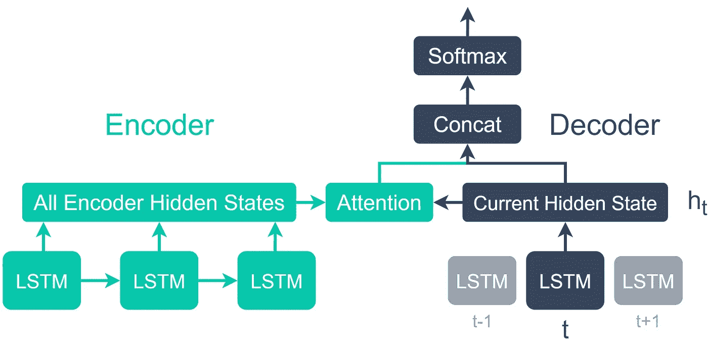
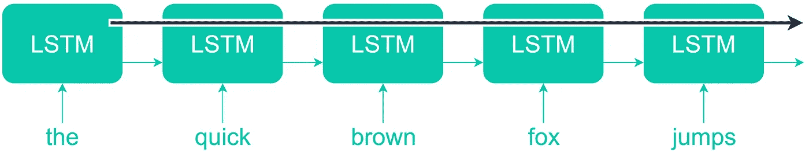
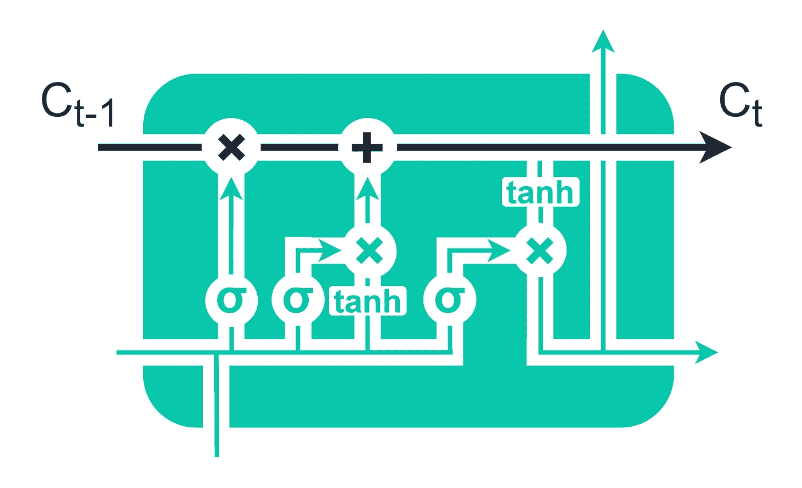
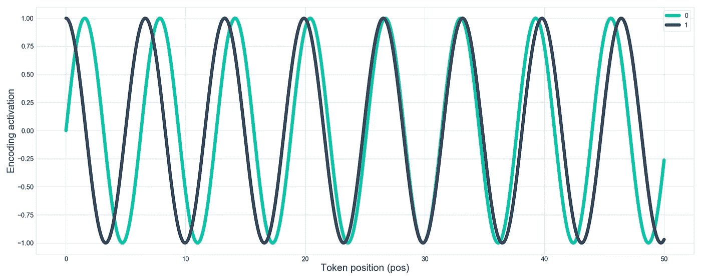
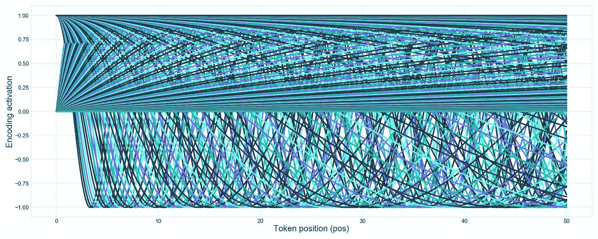
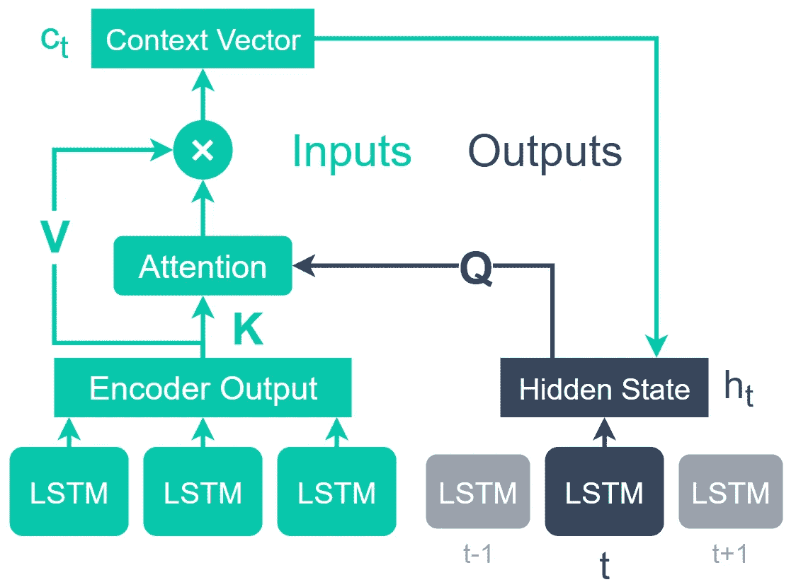
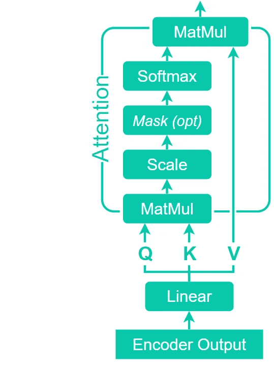
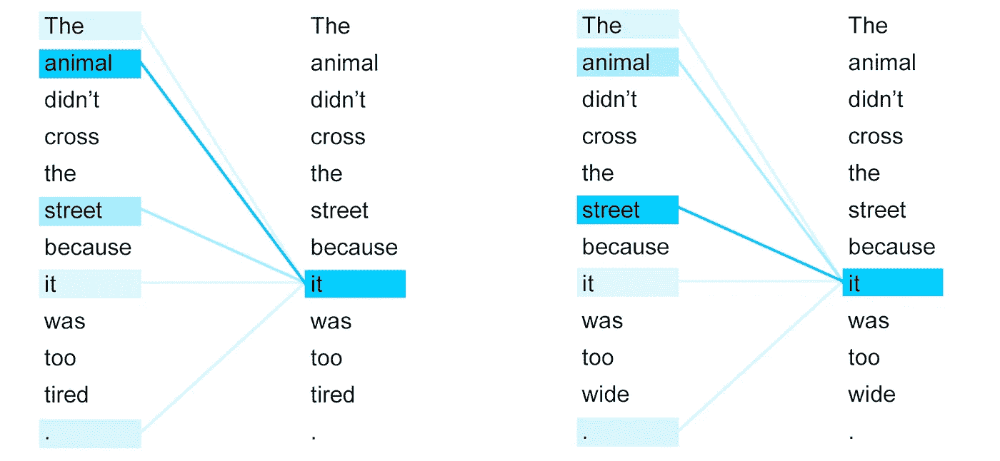
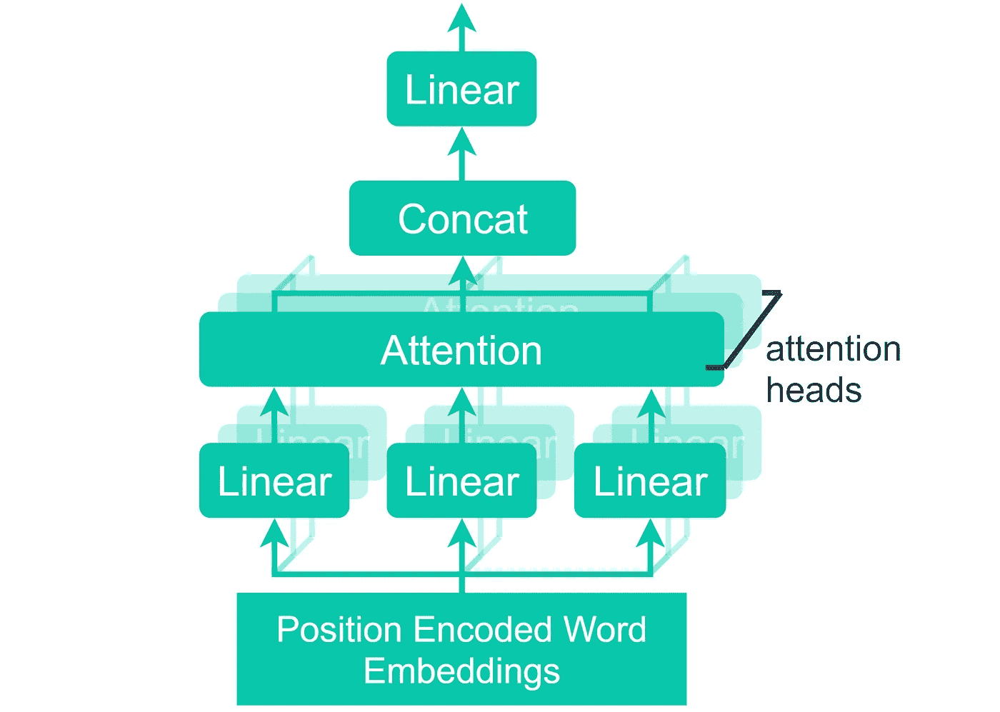
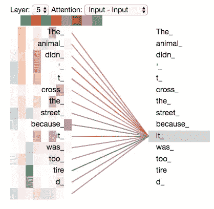

# 变压器如何工作

> 原文：<https://towardsdatascience.com/how-transformers-work-6cb4629506df?source=collection_archive---------10----------------------->

## 理解前沿自然语言处理的直观可视化指南


Johannes Plenio 在 [Unsplash](https://unsplash.com?utm_source=medium&utm_medium=referral) 上拍摄的照片

G PT-3、BERT、XLNet，所有这些都是自然语言处理(NLP)的当前艺术状态——并且它们都使用一种称为转换器的特殊架构组件。

毫无疑问，《变形金刚》是过去十年人工智能领域最大的发展之一——让我们越来越接近人类不可想象的未来。

尽管如此，尽管它们很受欢迎，但变形金刚一开始看起来可能会令人困惑。部分原因似乎是因为许多对 transformer 的“介绍”忽略了与理解 transformer 模型架构本身同样重要的上下文。

如果不先了解注意力和注意力从何而来，怎么能指望任何人掌握变形金刚的概念呢？这是不可能的。

这就是我写这篇文章的动机。我们将通过变压器模型直观地探索信息流，直观地掌握这些系统的机制——触及魔法背后的数学。

我们将涵盖:

```
**Attention**
- Attention vs Recurrence**Positional Encoding****Self-Attention****Multi-Head Attention**
```

# 注意力

注意机制早于变形金刚，最初用于增强 NLP 中以前的尖端技术——递归神经网络(RNNs)。

最初，这些 rnn 通过单点联系共享信息，这意味着大多数输入和输出单元之间没有直接连接，从而导致信息瓶颈和远程依赖性的有限性能。



注意编解码器 LSTMs。

添加了两层简单、紧密连接的神经网络，一层用于消耗所有输入值的编码器，另一层用于解码器，解码器会将当前时间步长的隐藏状态传递给注意力操作[1]。

注意操作产生一个“对齐”分数，该分数连接到解码器隐藏状态，并且执行 softmax 操作以产生输出概率。

信息通过查询、键和值张量在 rnn 和编码器-解码器之间传递。查询是从解码器隐藏状态传递的，而键值张量是从编码器隐藏状态传递的。


英法翻译任务中编码和解码神经元间的注意。图像源[1]。

当单词表征被发现具有高相似性(对齐)时，注意力操作会分配一个高分，而那些具有低相似性的单词表征会分配一个低分。

这种机制产生了一种被称为注意力的行为，即输出层中的单元可以关注输入层中特定的相关单元。

## 注意力与复发

在变形金刚和注意力之前，我们有 RNNs。由于它们的重现，这些网络非常适合语言任务。

这种循环允许神经网络记录一个单词是否出现在序列中，并考虑它周围的单词——甚至是它之前或之后很久的单词。正因为如此，人类语言的细微差别才能得到更好的体现。


**注意力的架构就是你所需要的**变压器。改编自同一篇论文。

然而，这种新的注意力机制被证明非常强大。强大到足以让 2017 年一篇名为**的论文【注意力是你所需要的全部】**推出一个没有复发的模型，用注意力完全取代它【2】——第一个变形金刚模型。

三种机制使注意力工作而不需要重现——(1)位置编码，(2)多头注意，和(3)自我注意。

# 位置编码

正如我们提到的，在《变形金刚》之前，NLP 的前沿是 rnn——特别是使用长短期记忆(LSTM)单元的 rnn。



LSTM 单元的状态作为输入传递给下一个单元。



信息可以通过单元状态(顶行)以较少的转换传递更远的距离。

本质上，这些网络能够通过将一个单元的输出状态(在 *t-1* )传递给下一个单元的输入状态(在 *t* )来考虑单词的顺序。

Transformer 模型不像 rnn 那样是顺序的，因此需要一种新的方法来保存现在缺失的顺序语义，这种语义以前允许我们考虑单词的顺序，而不仅仅是它们的存在。

为了保持单词的位置信息，在进入注意机制之前，将位置编码添加到单词嵌入中。

《注意力就是你所需要的》一文中采用的方法是为嵌入维中的每一维生成不同的正弦函数。

还记得我们之前说过 word2vec 引入了用 50 到 100 维的向量来表示单词的概念吗？这里，在 Vaswani 等人的论文中，他们使用了相同的概念，但表示一个单词的位置。


交替位置编码值。使用字位置 **pos** ，嵌入尺寸 **i** ，嵌入尺寸数量 **d_model** 。

但是，这次不是使用 ML 模型计算矢量值，而是使用修改后的正弦函数计算矢量值。



正弦之后是余弦函数。这种正弦-余弦-正弦的交替模式对于嵌入索引中的每个增量持续。

每个向量索引被分配一个交替的正弦-余弦-正弦函数(索引 0 是正弦；索引 1 是余弦)。接下来，随着索引值从零向 d(嵌入维数)增加，正弦函数频率降低。


使用总嵌入维数为 20 的前五个嵌入指数的正弦函数。嵌入索引位置显示在图例中。

这样做的最终效果就像一个有很多指针的时钟。我们输入的每一个令牌都是向前一个时间步长。第一根指针(索引 0，正弦)开始指向 12，并在 100 个时间步长内围绕时钟旋转八次，以到达序列的终点。

下一个指针(索引 1，余弦)开始指向 6，并在 100 个时间步长内绕时钟旋转略少于 8 次(比如 7.98 次)。

这种旋转(频率)随着我们增加嵌入维数的指数而减少。在到达最终指针时(A. Vaswani 等人论文中的*第 512 次*)，指针将在 100 个时间步长内从 12 点移动到 12 点过 0.001 秒。

将所有 512 个时钟指针绘制成正弦曲线，如下所示:



如果我们将时钟停在任何一个时间步长，位置 20，我们对该时间步长的位置编码是时钟指针指向的所有值的向量。

我们可以将上面同样难以控制的正弦曲线绘制到更容易理解的热图上:


我们可以在较低的嵌入维度中看到较高的频率(左侧)，随着嵌入维度的增加而降低。在第 24 维附近，频率降低了很多，以至于我们在剩余的(交替的)正弦余弦波中不再看到任何变化。

最后，这些位置编码被添加到单词嵌入中。

要将这两个向量相加，它们需要有相等的维数。Vaswani 等人对单词和位置嵌入都使用了 512-嵌入向量[2]。

# 自我关注

以前，我们使用模型输入和输出层来计算注意力——自我注意力只允许我们使用其中的一个。



LSTM 编解码器模型中的原始注意机制(左)和自我注意机制(右)。

因此，之前从输入编码器中提取的 **K** ey 和**V**value 以及从输出隐藏状态中提取的**Q**uery——我们现在从单个输入嵌入数组中获得所有三个值。

自我注意允许输入相互作用——这意味着我们可以对同一输入中单词之间的“对齐”进行编码。例如:



用两个略有不同的短语自我关注。来源[3]。

第一张图片(左)显示，当最后一个单词是“累”时，单词“它”的注意力集中在“动物”上。当最后一个字改成‘宽’的时候，‘它’的注意力就把焦点转移到了‘街’上。

当通过自我注意单元时，单词之间的这种关系被编码到张量中。


英法翻译任务中编码和解码神经元间的注意。图像源[1]。

正常注意力只会在输入和输出序列之间执行这种操作——如上面的热图所示。

# 多头注意力

多头关注是第一个变形金刚成功的关键因素。没有它，结果显示它的表现比它的重复出现的前辈更差。



多头注意是指并行处理多个注意‘头’。这些多个头的输出被连接在一起。

在我们产生了我们的位置编码单词嵌入张量之后——我们将它们传递给多头注意力单元。“多头”部分意味着我们实际上是在并行运行多个自我关注单元。

一旦多个注意力单元并行处理了我们的张量，结果就会连接在一起，通过线性单元调整大小，并传递到下一步。



两个头(左)和八个头(右)的多头注意力示例[5]。

现在，使用多头注意力的力量来自于同时包含几个*代表子空间*。这允许一个子空间识别出 **it** 和**累**之间的关系，以及另一个子空间识别出 **it** 和**狗**之间的关系。

变压器模型中不需要多头关注。BERT 是世界上最强大的 NLP 模型之一，它将单头注意力单元和前馈单元串联起来，但没有利用多头注意力[4]。

关于变形金刚的介绍就到此为止。我们涵盖了:

*   RNNs 和编码器-解码器机制
*   注意编码器-解码器
*   注意和变形金刚
*   位置编码
*   多头注意力
*   自我关注

所有这些都是非常抽象的概念，很难让我们理解。然而，它们构成了 NLP 中现代标准的基础，并产生了真正的下一级结果，因此值得花时间去研究。

我希望这篇文章能够帮助您更好地理解这些概念，以及它们如何在 Transformer 中结合在一起。如果你想了解更多，我在 [YouTube 上发布了编程/ML 教程](https://www.youtube.com/channel/UCv83tO5cePwHMt1952IVVHw)！

如果你有任何问题、想法或建议——通过 [Twitter](https://twitter.com/jamescalam) 或在下面的评论中联系。

感谢阅读！

# 参考

[1] D. Bahdanau 等人，[联合学习对齐和翻译的神经机器翻译](https://arxiv.org/abs/1409.0473) (2015)，ICLR

[2] A. Vaswani 等人，[注意力是你所需要的全部](https://arxiv.org/abs/1706.03762) (2017)，NeurIPS

[3] J. Uszkoreit， [Transformer:一种新颖的用于语言理解的神经网络架构](https://ai.googleblog.com/2017/08/transformer-novel-neural-network.html) (2017)，谷歌 AI 博客

[4] J. Devlin 等人， [BERT:用于语言理解的深度双向转换器的预训练](https://arxiv.org/abs/1810.04805) (2019)，ACL

[5] J .阿拉玛，[《图解变形金刚》](https://jalammar.github.io/illustrated-transformer/) (2018)，GitHub

[6] I. Sutskever 等人，[用神经网络进行序列间学习](https://arxiv.org/abs/1409.3215) (2014)，NeurIPS

[7] K. Cho 等人，[使用用于统计机器翻译的 RNN 编码器-解码器学习短语表示](https://arxiv.org/abs/1406.1078) (2014)，EMNLP

## [🤖《变形金刚》课程 NLP 的 70%折扣](https://bit.ly/nlp-transformers)

如果你想更好地理解过去十年 NLP 中变形金刚的起源，我会在本文中详细介绍:

[](/evolution-of-natural-language-processing-8e4532211cfe) [## 自然语言处理的发展

### 对过去十年自然语言处理的直观视觉解释

towardsdatascience.com](/evolution-of-natural-language-processing-8e4532211cfe) 

**所有图片均由作者提供，除非另有说明*