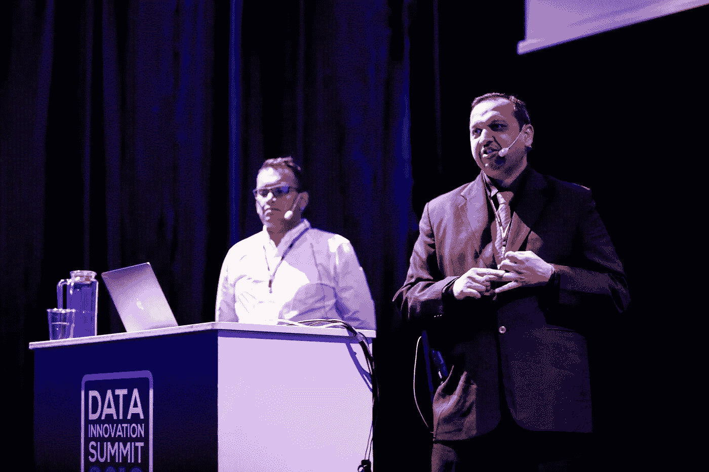
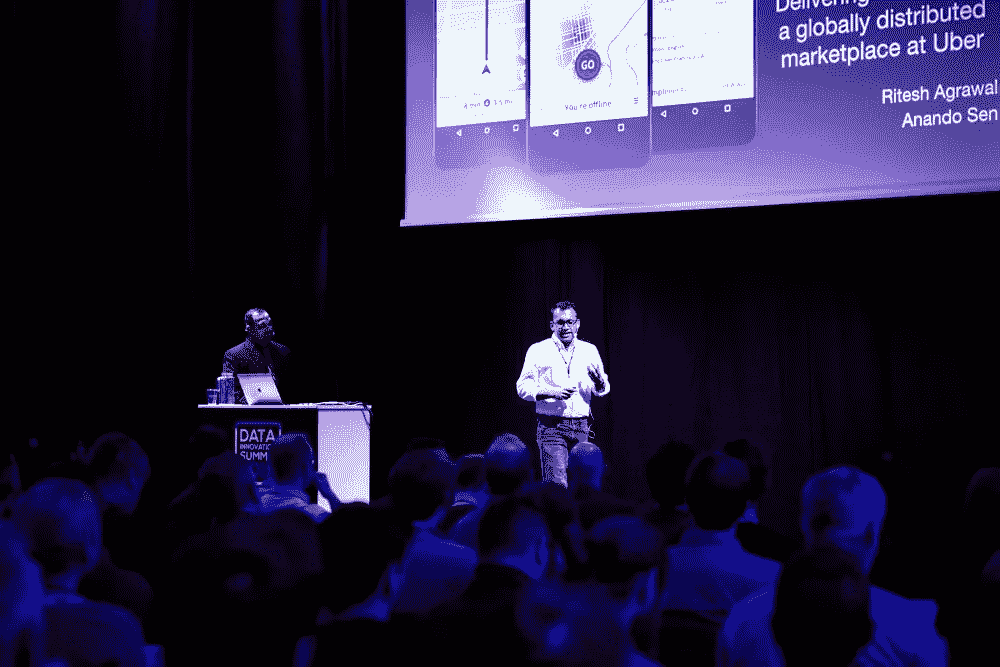

# 优步如何通过 ML 提供卓越的客户体验

> 原文：<https://towardsdatascience.com/how-uber-delivers-exceptional-customer-experience-with-ml-c208887a616f?source=collection_archive---------30----------------------->

## 在全球范围内提供卓越的客户体验

照片由[丹金](https://unsplash.com/@danielcgold)在 [Unsplash](https://unsplash.com/photos/kARZuSYMfrA) 上拍摄

全球各地的品牌，无论大小，都竭尽全力为顾客服务。他们知道他们的生意和他们最不满意的顾客一样成功。

我们之前在一篇[文章](https://hyperight.com/can-ml-really-help-deliver-exceptional-customer-experience/)中介绍了优步案例研究的一部分，该文章讲述了数字时代客户体验的转变，以及全球品牌用来让客户脸上露出笑容的方法。

数字时代带来了技术，使我们能够获得大量关于客户偏好、行为和痛点的数据，使用人工智能和人工智能分析这些数据，并获得关于如何相应地塑造我们的产品和服务的超级具体的见解。

照片由 [Kon Karampelas](https://unsplash.com/@konkarampelas) 在 [Unsplash](https://unsplash.com/photos/9BbkkdurAnU) 上拍摄

优步知道如何利用机器学习来取悦他们的客户。

在接受 Hyperight 采访时，优步的技术主管 Ritesh Agrawal 强调了优步的[基于 ML 的功能，这些功能有助于增强骑手的体验](https://www.youtube.com/watch?v=PWqWK8Bo_ZQ&t=1s):

*   基于乘车历史和经常旅行的目的地的个性化目的地建议。
*   一键式聊天——一个智能回复系统，让乘客和司机可以通过应用内消息轻松沟通。该系统使用机器学习和 NLP 来预测对常客问题的回答。司机只需点击一个按钮就可以回复。
*   弥合供需差距——优步的系统预测时间段和区域的需求将会增加，并相应地提醒司机。满足提货时间的需求有助于优步保持客户满意度并提高客户保留率。

但是，人工智能和机器学习在优步的一个关键应用是检测和解决用户体验事件，以确保他们的应用程序在任何时候都是正常运行和可靠的。

Hyperight AB 在[数据创新峰会上的照片](https://datainnovationsummit.com/#gallery) /版权所有

## 推出像《速度与激情》这样的改变

在 2019 年的 [**数据创新峰会**](https://datainnovationsummit.com/) 上，Ritesh Agrawal 和阿南朵·森讲述了他们的故事，讲述了优步如何在一个非常分散的市场中快速而安全地扩展，以及他们遇到的挑战和他们为让司机和乘客都满意而做出的不断变化。

阿南朵强调，每天都有成千上万的人依靠优步去工作、通勤或开车去优步谋生。这就是为什么优步认真对待他们的工作，检测用户问题并尽快修复，同时尽可能以最安全的方式进行。

Hyperight AB 在[数据创新峰会](https://datainnovationsummit.com/#gallery)上的照片/版权所有

每个月，优步都会进行 1200 次代码更改和 22000 次配置更改，这使得该应用程序可以针对其运行的每个城市进行调整。然而，以极快的速度对应用程序、分布式系统和基础设施进行变更会导致可靠性问题。

为了衡量这款应用是否始终可靠，优步衡量了三个关键绩效指标:

*   可用性——乘客是否能够叫到车并完成旅程。
*   等待时间——完成整个叫车流程、系统流程、屏幕转换、标签功能所需的时间。
*   信息、地图、价格、折扣的准确性。

阿南朵指出，向用户交付变更的速度和他们的整体服务可靠性之间有很强的相关性。

## 跟踪面向用户的事件

这种关联最重要的一点是，优步能够检测面向用户的事件，并将其归因于他们的代码或配置，让人们修复它们，并快速推出缓解措施。

“检测和解决事故的时间应该是主要公司的关键绩效指标之一”，阿南朵建议。然而，仅仅认识到这个问题是不够的。

他解释说，如果他们在数据管道的开端就发现问题，成本几乎是不存在的。当在推广阶段发现问题时，成本开始上升。这就是为什么快速移动、检测和解决以减少用户糟糕体验的爆炸半径至关重要，而不是影响 100 万用户，而是影响 10，000 个用户。

图片由[freestocks.org](https://www.pexels.com/@freestocks)上[Pexels.com](http://freestocks.org)

从数据科学家的角度来看，Ritesh 专注于将这样一个模糊的问题(作为一个事件)转化为具体的、可操作的项目。

当他们仔细查看事件报告，试图了解错误的来源时，他们发现 40%的事件是与代码相关的更改，但 20%是与配置相关的更改。问题在于构建代码和配置的人与应用配置变更的城市运营团队之间的脱节。

视频由[hyperlight AB](https://hyperight.com/)——[向全球分布式市场传递变革——优步的里泰什·阿格拉瓦尔和优步的阿南朵·森](https://www.youtube.com/watch?v=6CtrumbjAk4)

由于在超过 64 个城市运营，优步应用程序根据不同的位置定制了不同的产品选择。例如，旧金山的车辆选择是电动自行车，而在德里，应用程序提供自动。每个城市的产品选择由配置决定。此外，每个城市的促销和地图都可以通过配置来实现。

正如 Ritesh 解释的那样，配置的最大好处是它允许创建一个全球应用程序，但针对本地城市性能进行优化。最重要的是，它提供了实验能力。

然而，它并非没有挑战。Ritesh 说，配置很难审查，因为它们是立即推出的。配置中的每一项更改都适用于全球所有应用程序用户。因此，如果配置有错误，它将随更新一起推出。

为了取得控制权，他们开始考虑构建一个 ML 解决方案，通过检查来自配置的信号来自动检测应用程序是否有任何问题。它们将这些信号与配置前的信号进行比较，并执行 A/B 测试，以确认是否发生了错误。

图片由[奥斯丁·迪斯特尔](https://unsplash.com/@austindistel)在 [Unsplash](https://unsplash.com/photos/pjWbUrkUefU) 上拍摄

## 从利用 ML 和数据科学交付快速和激情的用户体验中学到的东西

Ritesh 强调，对于像优步这样的全球广泛使用的应用程序，定制是必要的，但与此同时，他们必须关注可靠性。

事故总是会发生，但关键是要尽快发现它们。检测和解决关键绩效指标的时间有助于优步处理这些事件。

此外，在基础设施层面部署 ML 解决方案时，Ritesh 建议不要从一个全新的系统开始。相反，他们利用他们的开发人员和工程师正在使用的系统，并对其应用自动化。工程师应该能够理解 ML 模型并将错误与实际代码联系起来。

最终从商业角度来看，阿南朵得出结论，投资回报率真的很重要。应对 ML 解决方案、基础设施、培训和部署的投资与检测到的事故数量和爆炸半径的减小进行权衡。每一个成功的数据科学和基于机器学习的努力都应该建立在双向道路上，投资与投资回报挂钩，这样才能长期持续。

*本文原载于 Hyperight.com***。**