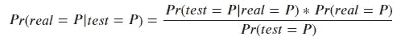
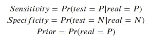
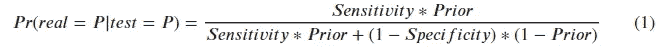
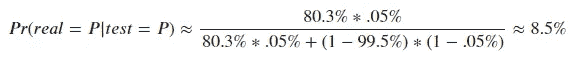
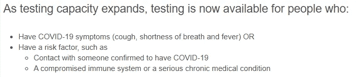
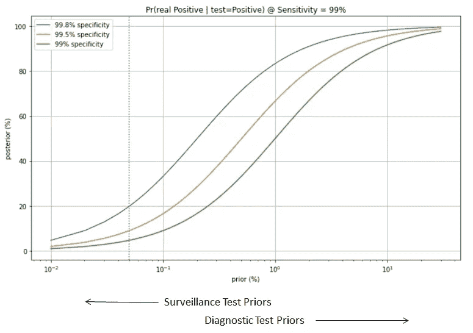

# 新冠肺炎监督测试的可信度有多高？

> 原文：<https://towardsdatascience.com/how-un-trustworthy-are-the-covid-19-surveillance-tests-3e5ab9134944?source=collection_archive---------53----------------------->

## 测试结果的贝叶斯推断

Graham Ruttan 在 [Unsplash](https://unsplash.com/s/photos/covid-19-tests?utm_source=unsplash&utm_medium=referral&utm_content=creditCopyText) 上拍摄的照片

随着新冠肺炎疫情的延长，重新开放经济的需要日益强烈。为了做好准备，最近进行了一些调查，试图确定这种疾病的流行程度。截至 2020 年 4 月 25 日，美国进行了三项新冠肺炎抗体监测试验:

1.  加州[圣克拉拉县](https://www.sfgate.com/news/editorspicks/article/Santa-Clara-antibody-test-coronavirus-results-case-15208216.php)调查于 4 月 3~4 日进行。估计有 2.49%~4.16%的人已被感染。
2.  加州[洛杉矶县](https://www.nytimes.com/2020/04/21/us/los-angeles-antibody-testing-coronavirus.html)调查于 4 月 10~11 日进行。据估计，该县 2.8%~5.6%的成年人口已被感染。
3.  纽约州在四月下旬进行了调查。据估计，纽约市有 21%的人被感染，全州各县有 3%~17%的人被感染。

这些数字令人震惊。他们翻译成我们大多数人应该已经有几十个直接的熟人被新冠肺炎感染了。这可能是真的吗？

让我们深入了解一下。圣克拉拉县调查预印本的第一作者 Eran Bendavid 是斯坦福大学的医学副教授。洛杉矶县调查是由南加州大学进行的。两家都相当有声望。然而，截至 2020 年 4 月 25 日，圣克拉拉县调查没有经过同行评审，洛杉矶县调查也没有预印本。纽约调查的信息甚至更少。我们知道科学关乎事实，而不是名声。那么如何快速判断这些数字的可信度呢？

让我们首先浏览一下圣克拉拉县调查的主要内容。

该调查测试了 3300 人，其中 50 人结果呈阳性(粗患病率 50/3300 = 1.5%)。在对更能代表该县人口的邮政编码、种族和性别进行调整后，他们估计患病率为 2.49%~4.16%。然后他们将这个数字乘以圣克拉拉县的人口数(大约 190 万)，得出结论:

> 这些流行率估计数表明，截至 4 月初，圣克拉拉县有 48，000 至 81，000 人感染，比确诊病例数多 50-85 倍。

现在你可以看到预印本基本上把测试阳性当作被感染(真正的阳性)。尽管这看起来很直观，但实际上是正确的吗？让我们正式地说，

> 假设一个人被检测为阳性，这个人是真正阳性的概率是多少？

一旦我们框定了关键问题，使用贝叶斯规则就很简单了(“P”表示正面，“N”表示负面，如下所示):

因为灵敏度、特异性和先验被定义为:

我们可以用全概率定律展开分母，代入上面三项，然后就有了*后验*估计:

在预印本中，敏感性估计为 80.3%(95 可信区间为 76.0–88.4%)，特异性估计为 99.5%(95 可信区间为 99.2–99.7%)。

对于*先验*，我们可以使用人口患病率作为起点。4/3~4/4 圣克拉拉县累计确诊病例约 1100 例  。除以全县人口 190 万，可以得到 0.05%左右的先验。

将这些数字代入等式(1)，我们将得到

这意味着，**即使一个人被检测为阳性，这个人仍然很可能是阴性的**！

这个结果起初看起来似乎是反直觉的，难道我们不应该期待一个阳性结果表明一个感染者吗？

这是钥匙。我们平时在新闻中遇到的确诊计数，是通过一种基于 RNA 的“诊断检测”来确定的，而不是基于抗体的“监测检测”。除了在灵敏度、特异性和许多其他方面的差异，一个主要的差异是在**测试参与者**中——诊断测试通常需要一些原因来怀疑一个人被感染，而监测测试的参与者是普通公众。用数学术语来说，测试参与者的*先验*是不同的。

例如，以下是伊利诺伊州公共卫生部网站[上的诊断测试指南](https://www.dph.illinois.gov/covid19/testing-guidance)(截至 2020 年 4 月 26 日):

只要想想你的许多直接朋友满足了这些要求，你就可以估计出这些诊断测试参与者中被感染的*先验*概率可能比普通大众高 100 倍。因此，**来自诊断测试参与者的阳性测试结果确实最有可能指示真正的阳性(病毒的存在)。**

有人可能会说，上述 0.05%的先验概率太低了，因为许多真正的感染者没有去检测。这是一个合理的考虑，所以我们可以用不同的方法来估计先验。例如，测试阳性率(给定有症状的人)通常来自 10%~30%⁴.如果我们认为一个有症状的人被感染的可能性是 50-100 倍，那么我们可以得出 0.2%-0.5%的先验。但是，即使有 0.5%的先验，给出肯定结果的后验概率也只有 45%，或者和掷硬币差不多。

下面是在不同的先验和特异性水平下，给定阳性检测结果，成为真正阳性的概率图。来自圣克拉拉公众的先验在左边是虚线，来自诊断测试参与者的先验在右边的某处。因此，来自不同参与者的积极结果具有非常不同的含义。

现在很清楚，即使圣克拉拉调查的样本代表了人口，其患病率估计也可能被夸大了约 10 倍。难怪这份预印本招致了专家们对 T4 的大量批评。正如哥伦比亚大学统计学和政治学教授 Andrew Gelman 在他的博客中写道:

> “我认为上述论文的作者应该向我们所有人道歉……我们浪费了时间和精力来讨论这篇论文，因为它的主要卖点是一些数据，而这些数据本质上是统计错误的产物。”

对于洛杉矶县和纽约州的另外两项调查，信息的缺乏阻碍了详细的讨论。但是从结果来看，他们看起来和圣克拉拉县的研究相似。因此，在进一步的信息披露之前，我们应该怀疑这些结果。

## 进一步讨论:

有人可能会想，给定一个阳性监测测试结果，如果那个人真的呈阳性的几率如此之低，那么这个结果告诉我们什么？

我的回答可以分为两个方面:

1.  为了计算抗体流行率，这类阳性病例不应计算在内(或必须适当扣除)。提高后验概率的一种方法是进行独立的随访测试。并且后续检测必须再次显示阳性，才能确认抗体的存在(不同于病毒的存在)。
2.  然而，出于预防的目的，态度是不同的。即使一个人仍然最有可能是消极的，他积极的机会也比普通大众高得多。因此，他应该进行诊断测试，检查病毒是否仍然存在，或者他的主要接触者应该采取措施加以保护。

## 参考资料:

1.  加州圣克拉拉县新冠肺炎抗体血清阳性率:[https://www . medrxiv . org/content/10.1101/2020 . 04 . 14 . 20062463 v1](https://www.medrxiv.org/content/10.1101/2020.04.14.20062463v1)

2.南加州大学洛杉矶县研究:抗体检测的早期结果显示新冠肺炎感染人数远超
洛杉矶县确诊病例数:[https://content . gov delivery . com/accounts/cala County/bulletins/2877402？reqfrom =份额](https://content.govdelivery.com/accounts/CALACOUNTY/bulletins/2877402?reqfrom=share)

3.约翰霍普金斯大学新冠肺炎数据来源:[https://github.com/CSSEGISandData/COVID-19](https://github.com/CSSEGISandData/COVID-19)

4.加州的测试数据不可靠。我采取了圣克拉拉项目前 2 周的数据(3/22 ~ 4/4)。从执行的大约 101k 次总测试中，阳性总数为 10.7k。所以阳性率~10.6%。伊利诺伊州的检测数据稍微可靠一点，其阳性率在那段时间内波动在 20%左右。