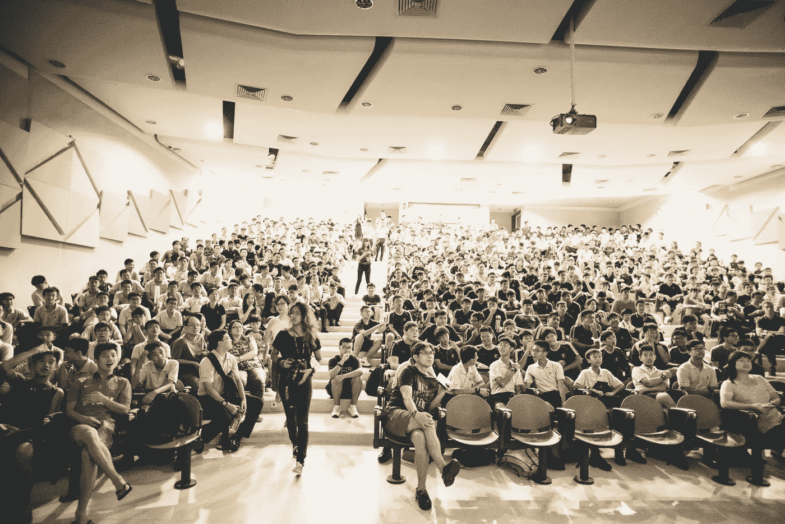

# 如何利用冠状病毒危机启动你的数据科学职业生涯

> 原文：<https://towardsdatascience.com/how-use-the-coronavirus-crisis-to-kickstart-your-data-science-career-5dd0453549a0?source=collection_archive---------29----------------------->

## 随着全球经济衰退，谷歌、亚马逊等公司正在大举招聘

从招聘潮中获利，找到你的理想工作。布鲁克·卡吉尔在 [Unsplash](https://unsplash.com/s/photos/career?utm_source=unsplash&utm_medium=referral&utm_content=creditCopyText) 上的照片

  T 数据科学的伟大之处在于你可以在家完美地完成它。也就是说，如果全球疫情没有在外面肆虐，你没有孩子在家上学，没有老人需要照顾，你也不会面临导致数百万人失业的经济衰退——可能包括你。

如果这让你觉得你在往下看，你并不孤单。为了度过危机，数百家科技公司正在进行大规模裁员，其中包括硅谷的数十家初创公司。

这对你来说是个千载难逢的机会。

随着大多数公司解雇他们心爱的员工，其他公司也开始大肆招聘。想想[亚马逊](https://www.amazon.jobs/en/job_categories/data-science)，[脸书](https://www.facebook.com/careers/areas-of-work/data/?teams[0]=Data%20%26%20Analytics)，[苹果](https://appleinsider.com/articles/20/04/08/apple-will-still-hire-1000-interns-during-coronavirus-pandemic)，[谷歌](https://careers.google.com/jobs/results/103340634112172742-data-scientist-engineering/)。

 [## 脸书数据科学家访谈

### 脸书数据科学家的职位是科技界最令人垂涎的职位之一。Jay Feng 解释了如何着陆。

towardsdatascience.com](/the-facebook-data-scientist-interview-38556739e872) 

理论很简单:以前在其他地方工作的数千名有才华的数据科学家突然变得有空了。这意味着就业市场的高供给和低竞争。

因此，从一家大型科技公司的角度来看，他们可以以较低的收购成本雇佣大量员工——此外，这些人甚至可以接受比通常提供的更低的工资和更少的福利。因为这总比失业好。

如果你想在你梦想的公司得到一份数据科学的工作，现在正是时候。但你不能坐视不管，任其自然发展。你必须努力让自己受到关注。展示你有才华，愿意并且能够抓住机会。以下是方法。

## 1.给你的 LinkedIn 拉皮条

这是一个求职平台。当然，你也可以推销你的其他社交媒体——你应该这样做。但是你的首要任务是在 LinkedIn 上找到一个杀手级的平台。

尽管这个平台的设计非常直观，我还是建议遵循 LinkedIn 的指南来做好一切。

尝试填写每个个人资料部分。添加一张背景照片，添加一些技能，关注你所在行业的名人。也加入一些相关的团体。

此外，没有办法添加个人资料照片。是的，你在照片上看起来总是很蠢。在角落里看到自己的影像感觉很尴尬。我明白了。但还是要做。一张你看起来很丑的糟糕照片总比没有照片好。一旦有了更好的照片，你可以随时更换。

试着用你的个人资料讲一个故事。想想一个很酷的标题:“XYZ 公司的数据科学家”很无聊。这个怎么样:“为 XYZ 公司解开数据的秘密”。好多了！尽量想出标题和描述，不要反映你做什么，而是你是谁。

 [## 2020 年改善 LinkedIn 档案的 20 个步骤

### 如何利用 LinkedIn 打造你的个人品牌，由 LinkedIn 自己讲解。

business.linkedin.com](https://business.linkedin.com/en-uk/marketing-solutions/blog/posts/content-marketing/2017/17-steps-to-a-better-LinkedIn-profile-in-2017) 

## 2.修改你的简历

招聘人员平均在你的简历上花[7 秒](https://www.glassdoor.co.uk/blog/7-second-cv/)。是的，你没听错。七个。

所以要珍惜这七秒钟。另一个人在七秒钟内会看到什么？在那个时候，你的简历能传达什么信息？

我用大量的视觉元素、颜色对比和清晰的信息来突出我的作品。我想让招聘人员知道我花了一些心思，我很勇敢，我知道我是谁。这是我最近的一份简历:

一个可能的科学合作的作者最近的简历。出于隐私考虑，省略了一些联系方式。

请注意，我使用了一些带有星星、其他符号和时间线的视觉语言。我还添加了我在任何地方都使用的同一张个人资料照片——这就是个人品牌 101。你可以随意模仿我的任何技巧。

当然，你很难用一个标准的 word 文件得到这样的设计。我用 Adobe Illustrator 做了这个简历。你也可以使用 Figma，它非常好用，而且花费更少。您将花几个小时摆弄图形细节，但这是值得的。真的。

## 3.定期发送申请

发出申请往好了说是耗时，往坏了说是令人焦虑。但是现在你已经做了一份很棒的简历，是时候向世界展示你的实力了！

不管你是担心自己会失业，还是已经失业了——当你刚刚寄出 24 份申请，然后又担心两个星期都得不到一个答复时，那就太可怕了。我去过那里。

但是掌握一项不舒服的活动的最好方法是有规律地做。即使你有一份稳定的工作，发出申请也没有坏处。你可以随时撤回。即使在这种情况下，你也可以在未来几年建立有价值的联系。

如果你的工作不那么稳定，你会失去什么呢？目前，计划每周发出五份申请。或者你需要多少。不过，要注重质量。也可以申请那些你认为不是百分百合格的工作。你能得到的最糟糕的答案是不。

这实际上也行得通。照片由 [chuttersnap](https://unsplash.com/@chuttersnap?utm_source=unsplash&utm_medium=referral&utm_content=creditCopyText) 在 [Unsplash](https://unsplash.com/s/photos/conference?utm_source=unsplash&utm_medium=referral&utm_content=creditCopyText) 上拍摄

## 4.去虚拟聚会

你的人脉就是你的净资产。

想想你是怎么找到上一份工作的。是冷冰冰的申请和几次面试吗？或者你认识一个人，而这个人又认识另外一个人，这个人给了你一个很好的介绍给你现在的雇主？

如果是后者，欢迎来到大多数人找工作的方式。尤其是好工作。这是关系网，伙计！

如果你想得到一份好工作，你需要认识一些人。你怎么找到他们的？通过活动、聚会、会议等等。

但是现在我们都被困在家里，看不到现实生活中的事情。坏消息？这是一个好消息，因为这意味着你可以节省大量的旅行费用！改为在[虚拟聚会](https://www.kdnuggets.com/meetings/index.html)上链接。

当然，与演讲者和其他参与者面对面的会后自助餐式的闲聊是不可能的。但是你可以通过提出聪明的问题或者自己做出贡献来让自己受到关注。

像在 Zoom 或 Skype 上一样，向您感兴趣的发言人或任何参与者发送私人消息。告诉他们你有多重视他们的谈话或个人资料。

一开始可能会显得很尴尬，你会想知道他们是怎么看你的。所以不要发垃圾邮件，要尊重。如果你照着做，会有比你想象的更多的人回应你。

## 5.做演出

不管你有没有工作，不管你银行里有没有足够的现金，都要去演出！

即使他们报酬很低或者根本没有钱。即使你只是偶然在 Upwork 或 Fiverr 上得到它们。即使你的妈妈或邻居只是请你帮忙。

这样做的目的是不要让自己被工作压得喘不过气来。相反，音乐会是一个与新朋友联系和展示你工作的绝佳机会。

在我找到现在的职位之前，我免费工作了整整两年。然后我又实习了整整一年，工资还不够我一半的开销。为了收支平衡，我到处做其他的演出。这并不容易，但它让我走到了今天。

即使现在我有一个相当安全的位置，我继续做演出。付不付没多大关系。每次我都把它视为一个机会，让人们加入到一个在某个时候可以防弹的网络中。

演出的目的是了解人们。你认识的人越多，有人给你薪水的机会就越大。把你推荐给其他人，他们会给你一个更大的。

给人跑腿。他们会将你添加到他们的网络中。在 [Unsplash](https://unsplash.com/s/photos/tweet?utm_source=unsplash&utm_medium=referral&utm_content=creditCopyText) 上由 [Austin Distel](https://unsplash.com/@austindistel?utm_source=unsplash&utm_medium=referral&utm_content=creditCopyText) 拍摄的照片

## 6.开始写博客(或者推特风暴，如果你觉得懒的话)

不要等着别人来问你的意见。给他们。

写作也许是建立你个人品牌的最好机会。人们会了解你如何表达自己，你如何思考，什么对你来说是重要的。

此外，一堆漂亮的文章会让人们浏览你的作品集，并深入你的世界。还记得人们花在你简历上的 7 秒钟吗？试着写出足够多——足够好——的内容，让招聘人员愿意花七个小时在你的个人资料上。

我选择 Medium 作为平台不仅是因为它是付费的，还因为我喜欢这个社区。每次我点击发布，都会有很棒的事情发生。有人留下了非常鼓舞人心的评论。一个有着惊人个人资料的陌生人在 LinkedIn 上与我联系。一位名人加入了我在 Twitter 上人数不多但越来越多的粉丝。每次我点击发布，我就扩大了我的关系网。

*你的人脉就是你的净资产。你写的每一个字都会让它成长一点。*

也许你对自己的写作技巧没有印象。当我开始使用 Medium 时，我对我的并不满意。没关系！

你可以从小步开始。如果你不喜欢全文写作，也许你喜欢发微博。目标是每天发两条你感兴趣的微博。

你的目标是一致性，而不是完美。你不会在一天之内写出一部精彩的小说或一条流行的微博。你也不会在一天之内与比尔·盖茨或勒布朗·詹姆斯联系起来。你可能一辈子都不会。

但是如果你坚持下去，你会建立联系并产生你真正引以为豪的作品。最棒的是，这给了你一份工作。

 [## 数据科学入门终极指南

### 我是如何在不到 6 个月的时间里获得数据科学工作机会的

towardsdatascience.com](/the-ultimate-guide-to-getting-started-in-data-science-234149684ef7) 

# 你的时间到了

世界正在分崩离析，但这不是世界末日。

没人说这会很容易。但是，尽管有这么多的痛苦和悲剧，这场前所未有的危机中蕴藏着前所未有的机遇。

四大正在大肆招聘，就像其他有能力的公司一样。

无论你已经失业，或者你认为你可能会失业，或者你有一份稳定的工作，但认为你可能需要升级——这些公司正在寻找你。所以，让自己受到关注吧！