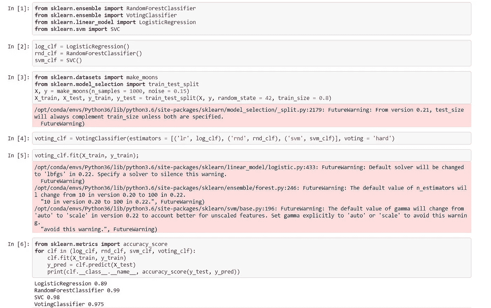

# 投票分类器如何工作！

> 原文：<https://towardsdatascience.com/how-voting-classifiers-work-f1c8e41d30ff?source=collection_archive---------19----------------------->


图片来源:我

## 用于增强分类的 scikit-learn 功能

分类是一种重要的机器学习技术，通常用于预测分类标签。对于进行二元预测或预测离散值，这是一种非常实用的方法。分类器是分类模型的另一个名称，可能用于预测某人是否适合某项工作，或者用于对商店中多个对象的图像进行分类。

分类和其他机器学习技术一样，使用数据集。数据集是来自不同变量的多个值的组合。在获得最佳数据集之后，它被分成两部分:训练集和测试集。训练集通常占数据集的较大比例。它可能会占用数据集的 70%到 90%。

训练集被插入到机器学习算法中，以创建一个预测模型，并增加了一个称为交叉验证的步骤。交叉验证是一种很好的方法，可以确保构建的模型不会过度适应训练集，并且还可以优化模型的通用性。然后，该模型可以用于预测测试集中的标签。通过诸如混淆矩阵、精确度分数、召回分数、F1 分数、roc auc 分数的度量，将预测的标签进一步与实际测试集标签进行比较。

一旦分类模型的构建完成，就可以将数据点的值插入到算法中，并且算法通过基于变量的输入将特定标签归属于该数据点来做出决定。

现在想象一下，如果要求不同的分类方法根据数据实例的输入做出决策。肯定会有不同的答案。这就是**投票分类器**发挥作用的地方。

# 什么是投票分类器？

投票分类器是一种使用多个分类器进行预测的分类方法。当数据科学家或机器学习工程师对使用哪种分类方法感到困惑时，它非常适用。因此，使用来自多个分类器的预测，投票分类器基于最频繁的一个进行预测。

在现实生活中，数据科学家可能会对使用随机森林分类器还是逻辑回归器来根据花朵的尺寸预测花朵的类型感到困惑。

使用上面的提示，下面创建了一个分步指南，介绍如何通过 Jupyter 笔记本使用 python 来构建投票分类器。

从下面的代码开始，可以使用 scikit-learn 导入分类器。

```
**from** **sklearn.ensemble** **import** RandomForestClassifier 
**from** **sklearn.linear_model** **import** LogisticRegression 
**from** **sklearn.neighbors** **import** KNeighborsClassifier
**from** **sklearn.ensemble** **import** VotingClassifier
```

通过 Jupyter 笔记本使用 python，可以访问 scikit-learn 的集成功能，并导入投票分类器。在上面的代码中有三个其他分类器:随机森林分类器、逻辑回归器和 KNearest 邻居分类器。这三个将归因于如下所示的对象:

```
log_clf = LogisticRegression()
rnd_clf = RandomForestClassifier()
knn_clf = KNeighborsClassifier()
```

然后，为投票分类器创建一个对象。投票分类器有两个基本的超参数:估计器和投票。**估计器**超参数为上述三个分类器的对象创建一个列表，同时为它们指定名称。**投票**超参数设置为硬或软。

如果设置为硬，投票分类器将根据出现最多的预测做出判断。否则，如果设置为软，它将使用加权方法来做出决定。我建议在使用偶数个分类器时将其设置为软，因为它采用了加权方法；在使用奇数个分类器时，将其设置为硬，因为它采用了“多数人投票”方法。

```
vot_clf = VotingClassifier(estimators = [('lr', log_clf), ('rnd', rnd_clf), ('knn', knn_clf)], voting = 'hard')
```

像任何其他机器学习算法一样，投票分类器用于将训练数据集的自变量与因变量进行拟合

```
**from sklearn.datasets import** load_iris 
**from sklearn.model_selection import** train_test_splitiris = load_iris()
x, y = iris['data'], iris['target']
x_train, x_test, y_train, y_test = train_test_split(X, y, random_state = 42, train_size = 0.85)vot_clf.fit(x_train, y_train)
```

拟合后，它可用于进行预测，并测量其预测的准确性。

```
pred = vot_clf.predict(x_test)
accuracy_score(y_test, pred)
```

下图显示了投票分类器如何用作数据集的预测模型，并与其他分类器进行了比较。代码最初是从 Aurelion Geron 的书*中获得的，用 Scikit-Learn 和 TensorFlow 的概念、工具和技术构建智能系统的实践机器学习*，我在 Jupyter 笔记本上运行了它们。



显示用于创建投票分类器的代码单元的图像

# 结论

投票分类器是一种出色的分类方法，因为其方法利用多个分类器的集体判断来预测数据点。我建议其他有抱负的数据科学家和机器学习狂热者尝试一下。

感谢您的阅读！