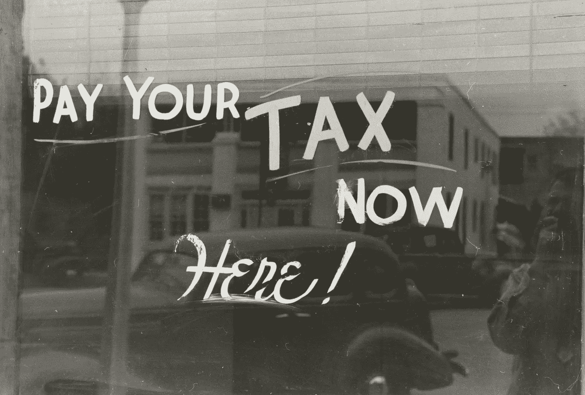
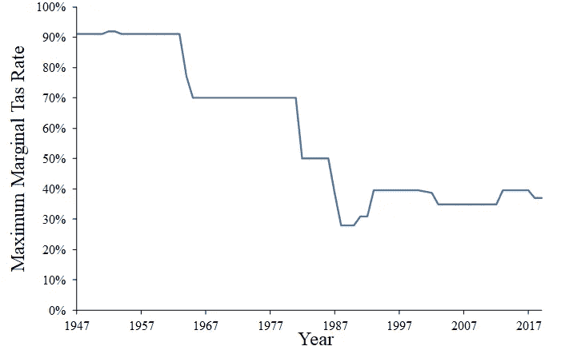
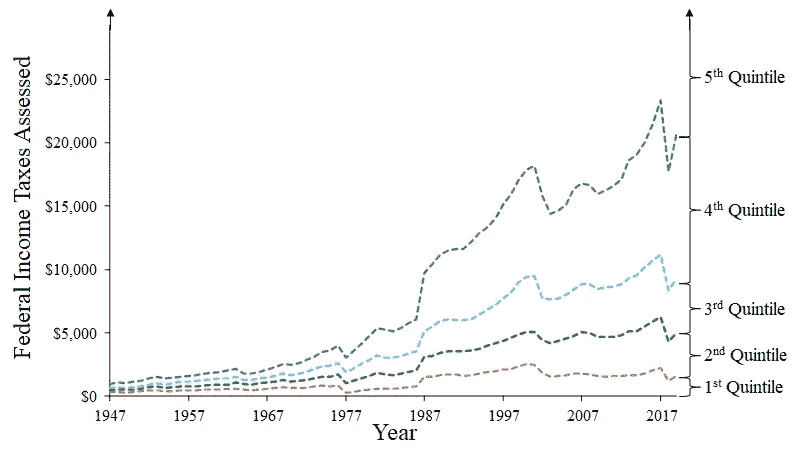
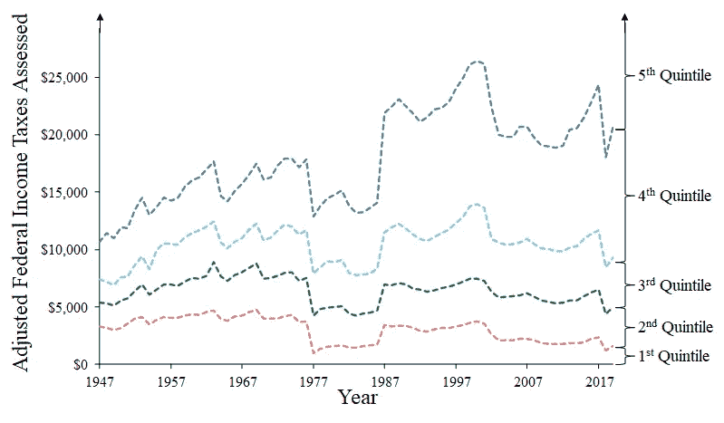
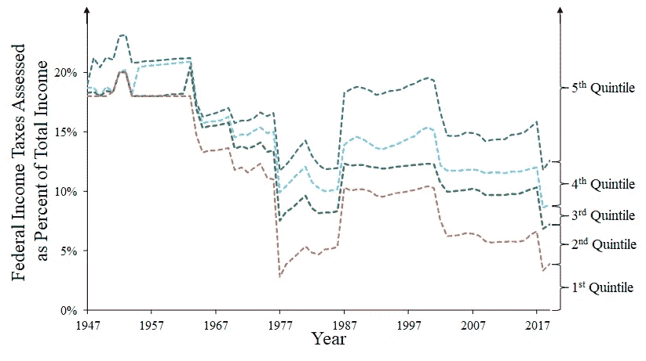
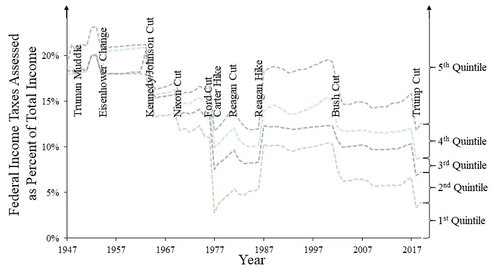

# 美国“伟大”的时候税收怎么样？

> 原文：<https://towardsdatascience.com/how-was-taxation-when-america-was-great-24836359aae7?source=collection_archive---------41----------------------->

供图[纽约公共图书馆](https://unsplash.com/photos/kAJLRQwt5yY?utm_source=unsplash&utm_medium=referral&utm_content=creditShareLink)公共领域收藏

# 了解税收和历史

记得有个人说他要“让美国再次成为伟大的 T2”。那么，美国以前什么时候伟大过？已经澄清了。[那是 20 世纪 40 年代末和 50 年代](https://www.cnn.com/2016/03/26/politics/donald-trump-when-america-was-great/index.html)。不管人们是否同意这一评价，这就是他所指的时代。我们就这样吧。所以，如果我们要谈论美国的“伟大”，我们也需要考虑美国政府是如何运作的，有一件事与今天非常不同，那就是所得税的结构。现在，税收对于“让美国再次伟大”的人群来说是一件大事，正如我们所知，所以看看当他们认为美国“伟大”时税收是什么样的会很有用。

是的，这是分析数据的另一个原因。别拿你的呕吐袋。这是其中一次，我将向你们展示如何用非常简单的方法得出有趣的结论。我还展示了如何根据如何对相同的起始数据应用简单的方法来得出非常不同的结论。这是有趣的部分。我认为，任何涉及政治或政治话题的公开文件(以及大多数未公开文件)都有一个议程。数字通常只是用来支持议程的。这并不意味着这些数字是谎言，而是意味着你必须*思考*才能知道这些数字是否合理。

恰好税收基金会的人公布了 1913 年至 2013 年的所有美国税级，2014 年至 2019 年的可以从多个来源查找。所以，我可以公布每年的最高税率，然后就到此为止！

呜哇呜哇！看那个。喔喔喔！该死。他们的税在很久以前就已经很高了！结案了，该死！

号码

在美国评估的总所得税是*而不是*最高税级。相反，我们增加了税收。例如:第一笔 10，000 美元的税率为零的税收制度。50，000 美元以下按 5%的税率征税，50，000 美元以上按 10%的税率征税。10 万美元要交多少税？是一万美元吗？没有。就是 0 美元(10%×10，000 美元)加上 2000 美元(5%×(50，000 美元—10，000 美元))加上 5，000 美元(10%×(100，000 美元— %50，000 美元))= 7，000 美元。这比仅将最高税率应用于总收入要少 30%。只引用最高边际税率是愚蠢的——或者不诚实的。

所以，要了解 T2 实际的税收评估，你需要收入。我下载了[表 F-1。美国人口普查中五分之一和前 5%家庭的收入限制。这张表总结了从 1947 年到 2019 年(到目前为止)美国家庭收入的每五分之一和最高 5%的最低收入的界限。我希望我可以使用“家庭收入”而不是“家庭”，但我所能获得的信息并不能追溯到那么远的家庭。为什么是家庭？“家庭”的人口普查定义排除了相当多的人。但我不得不尽我所能。](https://www2.census.gov/programs-surveys/cps/tables/time-series/historical-income-families/f01ar.xlsx)

然后，我计算了那一年按各个收入水平评估的联邦所得税总额，包括标准化免税。我使用的税率和免税额度是已婚夫妇每年共同申请的，没有孩子。如果有人想支付我的咨询费，我很乐意把它变得更复杂。鉴于缺乏具体的可用数据(我可以找到)，我不得不接受和承认一个严重的过度。

无论如何，当我做所有这些简单的计算(使用 Excel)时，我对 1947-2019 年的税收评估得到了什么？

漂亮的颜色！这些线条显示的是每一个收入五分位的界限。WTF 是收入五分位数？这就是工作原理。根据最接近的收入水平，将美国家庭分成五个同等大小的群体。五:金特，明白了吗？第三个五分位数是非常重要的五分位数。包含中位数的是五分位数。什么是中位数？中等收入是指处于中间的收入——一半的美国家庭收入较低，一半的家庭收入较高。因此，第三个五分位数是对“美国家庭平均收入”的最佳估计，还有一点回旋的余地。

因此，显而易见的是，税收一直在上涨，偶尔还会小幅下跌，结案，码头和垃圾，干草叉，20 世纪 50 年代是包裹在独角兽冰棒棒上的税收天堂。

号码

这个图表是不诚实的骗子使用的诡计，被白痴所相信。1955 年的一美元比 2019 年的一美元值钱得多，所以对一美元征税意味着拿走更多的价值。幸运的是，随着时间的推移，有很多方法可以调整每美元的价值变化，例如[消费者价格指数](https://www.measuringworth.com/datasets/uscpi/)。就拿“当时的美元”乘以(2019 年的 CPI)/(无论何时的 CPI)。“实际美元”或“调整后美元”税收变成:

嗯，嗯，那么，好吧，所以它没有*看起来那么糟糕，但仍然，那些“生产者”的税收仍然较低，对不对？什么事？*

号码

事情是这样的，即使是“通货膨胀调整”也不能说明一个完整的故事。即使是经通胀调整的收入也随着时间发生了变化。如果你处理的是人口，那么每个五分之一人口的构成可能会以与通货膨胀率不匹配的方式变化。此外，CPI 是一个估计值，所以它有任何估计固有的问题，与估计收入水平相混合。还有什么合理的方式来表示所得税的影响呢？

我提名收入的百分之。只要计算一下税单，除以税前总收入，你就得到:你收入的*部分*被申报。这与通货膨胀和类似的时间效应无关。这也很容易理解:如果一件事需要你收入的十分之一，我们都可以理解十分之一，无论是时代、单位还是价值。当然，这个百分比是否计算得当是另一回事。因为我不是不道德的，我试着公开我是如何做的，并应用适当的方法(见上文)。

那么，我们看到了什么？首先，如果我们看看第一至第四个五分位数(因为第五个五分位数可以一直达到理论上的无限收入)，那么“美国伟大的时代”也是所有美国人的最高有效净税率，而不仅仅是最富有的人！针刮擦声，酒馆安静下来，钢琴演奏者合上键盘藏了起来。自那以后的一个巨大变化是，自 20 世纪 50 年代以来，美国最贫穷和最富有的人之间的有效净税率已经扩大。因此，显而易见，随着税收的变化，遭受最大“痛苦”的人是最富有的人。对于 80%的美国人来说，没有什么能达到 20 世纪 50 年代的高点。这就是我对美国伟大时期所得税的看法。

那么，在解决了这个问题(请假装我解决了)之后，我们还能从这个图表中得到什么呢？让我们补充一些历史笔记:

这将“税务事件”叠加在前面的图表上。名字是我自己想出来的。杜鲁门混乱时期是杜鲁门的第一个当选任期，试图将国家的税收制度恢复到和平时期的水平。事情发展到这一步，最终征收了更高的税。艾森豪威尔改革指的是降低一些人的税收，但提高另一些人的税收的改革，主要是因为标准扣除额的计算方式发生了变化。

最终，这一体系变得非常不受欢迎，以至于 JFK 在 1963 年提议减税，并由 LBJ 在 1964 年签署，因此有了肯尼迪/约翰逊减税计划。没有什么比成功更成功的了，所以尼克松又一次减税。然而，尼克松也提出了一个永远不受欢迎的替代最低税。

正如已经注意到的，如果按照五分位数来看，联邦所得税要求的收入百分比往往会在两次削减之间攀升。有时，这可能是由于随着时间的推移税率的内在变化。其他时候，这是由于五分之一人口随着时间的推移变得更加富裕。无论哪种方式，都有潜移默化，人们会注意到。因此，一项减税措施接踵而至。

在下一个案例中，我们看到(按申报收入的百分比)有史以来最大的联邦所得税削减——福特减税，我们几乎从未听说过——人们肯定想知道为什么。这一削减特别有利于收入最低的五分之一至第三个五分之一。这(几乎)是美国的一个大免税期。卡特很快实施了系统性的增税，几年后情况变得更糟。福特-卡特事件可能是美国经济史上一个最古怪时代的产物。可能没人能做对。无论如何，卡特仍然对 80%的美国人提出了最低的实际净所得税要求。

随后是里根著名的“减税”。看着它。它得到了如此多的播放和赞扬，而且是最小的减税。与所有其他减税措施相比，这是微不足道的。此外，里根接着说出了他最肮脏的秘密:里根增税是二战结束以来美国历史上最大的增税。这可能是乔治·布什在选举中失败的一个重要原因。

直到 2001 年，情况一直相当稳定。如果说有什么不同的话，那就是第三个五分之一人口的收入范围扩大了。现在，某些养尊处优的贵宾犬和他们的比特犬走狗制造了大量的噪音，关于所得税是如何失去控制的，或者一些这样的废话，但事实是，就声称的收入百分比而言，80%的美国家庭的情况相当稳定。

因此，我们得到了 JW·布什的又一次减税。它基本上让人们回到了里根当选前的支付水平(按收入百分比计算)。这似乎已经为四届总统任期带来了稳定的结果。

尽管如此，尽管 80%的美国家庭的税收负担比 20 世纪 80 年代末和 90 年代经济繁荣时期要小得多，但再次减税被认为是必要的，因此特朗普在 2018 年实施了减税。从那以后，除了直接的影响，还没有时间看到更多的影响，但 2019 年声称的收入百分比的上升奇怪地让人想起了税收的“卡特反弹”——只是说。

如果你注意到了，税收干预的时间似乎变得更长了。从 1947 年到 1986 年，这段时间大约是 1-2 个总统任期。从 1986 年开始，总统可能更愿意与前任的税级合作，除非税改是总统的一个具体理论要点。

# 分析方法

我的方法非常简单。我只是用了算术，冗长乏味的算术。然后我用 Excel 把它标出来，用 PowerPoint 把标出来，就这样了。如果你想追踪我的意大利面 Excel，我已经把文件放在这里了。