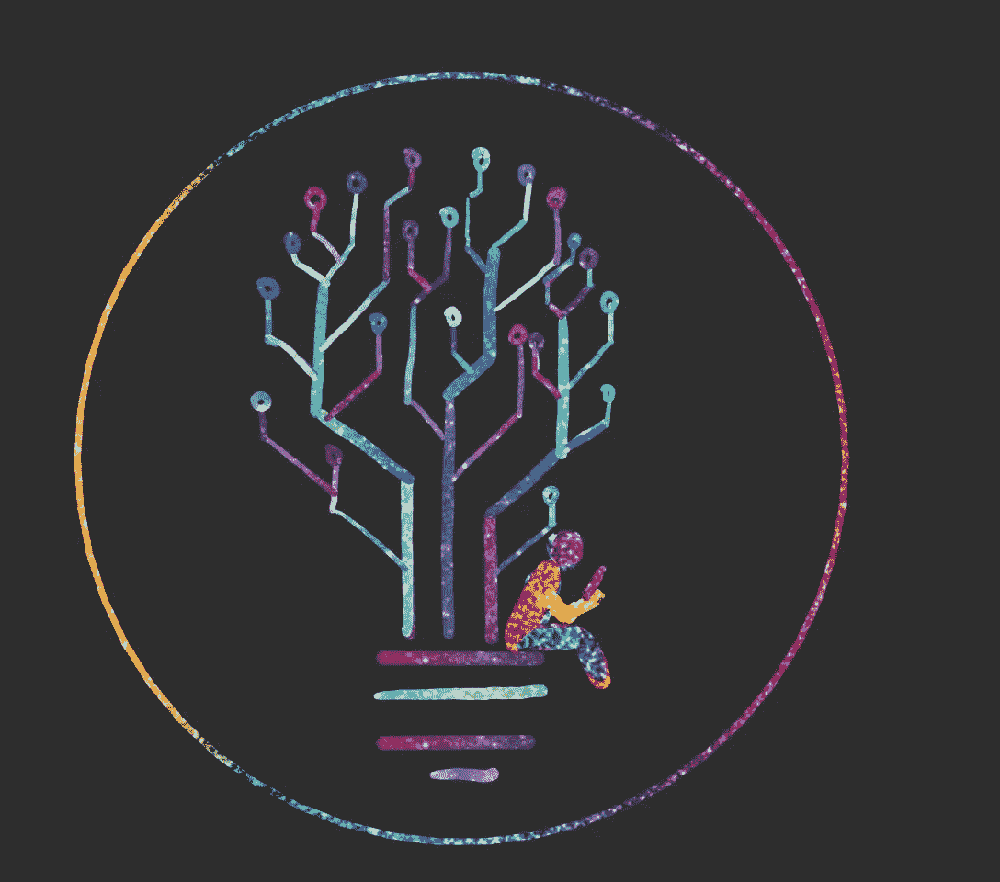

# 我们如何构建一个科技落后的世界

> 原文：<https://towardsdatascience.com/how-we-are-constructing-a-world-of-ill-technology-90f5e0ac907e?source=collection_archive---------56----------------------->

## 我们能从历史中学到什么来为一个更公平的社会发展技术。

来源:[德尔菲娜·莱昂](https://medium.com/u/b845cbad5218?source=post_page-----90f5e0ac907e--------------------------------)

今天的技术几乎完全脱离了任何政治或道德委员会和规则，然而，它们是操纵和强化我们现代世界偏见的弱点。

> **机器学习很容易使用，但很难掌握。**

在学习电子工程的时候，我不断地“偶然”遇到有偏见的技术。例如，每当*不代表*或*已经有偏见的* 数据被扔进机器学习算法，而没有特别检查它是否有偏见的结构时，就会发生这种情况。结果将只是这种偏见的一种反映，并强化我们这个有偏见的社会。

例如，一个用*偏倚数据*训练的应用程序是[亚马逊内部招聘工具](https://www.reuters.com/article/us-amazon-com-jobs-automation-insight/amazon-scraps-secret-ai-recruiting-tool-that-showed-bias-against-women-idUSKCN1MK08G)，它正在解雇女性候选人，因为它是根据历史招聘决策训练的。

*非代表性数据*的一个例子是，当我用机器学习训练一个人脸识别应用程序，并主要给它输入白人的照片。结果将是白人比其他人更容易被认出来。不幸的是，市场上大多数人脸识别工具都有偏见，正如[国家标准与技术研究所(NIST)公布的 2019](https://www.nist.gov/news-events/news/2019/12/nist-study-evaluates-effects-race-age-sex-face-recognition-software) 。正如 NIST 的研究表明的那样，大多数工具在有色人种和女性中的假阳性率(错误识别)明显高于白人男性，从 10 到 100 倍不等。当这种工具被出售给像警察部门这样的机构并导致更多的不平等时，这就变得特别成问题。

这些例子无一例外，而是数字化和自动化的常见伴随物。现在想象一下我们的未来，我们已经在自动化房地产代理、贷款、招聘、新闻、风险评估等等，使用之前提到的有偏见的算法。

然而，仅仅远离这种新技术并不能解决问题，因为这只会产生更多的误解，从而创造更糟糕的技术，而且最重要的是，它会使我们受到外部技术的操纵。

因此，这个问题需要进一步关注，任何人都必须考虑和理解，尤其是参与技术开发的人。

# 但是这个问题更深层

当一个少数群体存在于一个主要资产较少的社会中时，他们就进入了种族主义的恶性循环。以美国 PoC(有色人种)的历史为例，这一切都始于一段压迫和暴政的漫长历史，并导致了至今仍然存在的根深蒂固的系统性种族主义。

> “个体的意图并不是系统性邪恶的必要条件。”—杰米·阿平-里奇

简单地说，这是因为压迫结束后，有色人种几乎没有资本或住房等资产，并被排除在权力职位之外。政治忽视了完全不公平的事件，如红线，房地产转向，或对 GI 法案的特权待遇，该法案只支持白人积累财富，并允许将其传递给下一代。因此，几十年来出现了巨大的财富差距，最灾难性的问题是人们倾向于颠倒因果关系。因此，有色人种在被捕时被无意识地视为更有犯罪倾向，在申请工作时更不合适，在贷款时更不可靠，这些都已被大量研究揭示。

Rehavi 和 Starr 在 2014 年发布了《进一步包括刑事司法中的种族差异》，其中黑人获得的刑期比因相同罪行被捕的可比白人多近 10%[1]。
Bertrand & Mullainathan 在 2004 年指出，白人名字比非裔美国人多 50%的面试机会。最后，Rugh 等人(2015 年)披露，他们样本中的黑人借款人每月支付额外的 5-11%以上[3]。

修复种族主义制度的解决方案极其复杂，因此，应该彻底检查制度是否存在任何歧视性基础。

# 我们最年轻的考试机构

没有从历史中学到建立一个没有偏见和歧视的机构是多么重要，我们已经在一遍又一遍地犯同样的错误，很少有人解决这个问题。

> **“如果数字化转型做得好，就像毛毛虫变成蝴蝶，但如果做得不好，你得到的只是一只非常快的毛毛虫。”乔治·维斯特曼，麻省理工学院斯隆数字经济项目负责人**

技术影响着我们的生活，影响着我们做出的决定，影响着我们购买的产品，影响着我们计划的旅行，甚至影响着我们的心态和政治观点。

Epstein [4]的研究表明，在选举前，搜索引擎对犹豫不决的选民的影响高达 20%,在某些人口统计群体中甚至更高。总之，这些工具允许滥用来决定选举的结果，这给搜索引擎和它们的算法带来了巨大的力量，因此从道德的角度来看不应该被忽视。

此外，我们这一代人从 YouTube、Instagram、Twitter、抖音或网飞等平台上消费大量信息，这些平台上的算法定义并推荐内容。虽然还没有达成一致，如果推荐系统正在创造或相反打破“过滤泡沫”，很明显他们拥有显著的影响。过滤气泡描述了这样一个问题，即用户只看到与他们先前存在的信念一致的内容[5]。然而，这种现象在没有这些系统的情况下就已经存在，因为寻找证实而不是反证是人类本性的一部分，因此推荐系统准确地拾取了这种愿望。尽管如此，现在完全取决于开发商如何处理这一困境，而这是一个伦理和社会学问题。

# 现在怎么办？

如果你是因为不知情而在开发有偏见的技术，那也没关系。无知再也不能成为借口了！这个话题对我们的未来至关重要，不容忽视，这意味着我们都必须为之努力。

> 种族主义遗留法律和现代种族主义做法都是同一个系统的一部分，现在需要改变―达珊·斯托克斯

如果你参与了技术的发展，你必须经常批判性地检查你的系统，并意识到它在道德标准方面的普遍弱点。你要为你的贡献负责，意识不到它所造成的影响是致命的。

然而，对于不道德的实施没有管辖权，这就是为什么工程师和科学家不承担责任，特别是因为它经常与生产力和竞争力相冲突。这种权衡相当复杂，难以平衡，因此我们需要工程师、科学家和社会学家与政治家共同努力，积极开发适当的基础设施。最近[欧洲委员会提出了一份白皮书](https://ec.europa.eu/info/sites/info/files/commission-white-paper-artificial-intelligence-feb2020_en.pdf)，其中包含未来处理人工智能的指导方针，值得一读。然而，它没有引起人们的注意，也没有找到保持生产力和技术进步的解决方案。最终，这可能会成为成功和失败的转折点:在进步和意义之间找到平衡。

每个人都可以并且应该为此做出贡献的一件事是提高意识和提供知识，而不是无知或被动。

最后，如果我们照顾好我们的发明，其结果甚至可以成为解决方案的一部分，将我们的社会从非种族主义者重新定义为反种族主义者。

# 参考

[1]马里特·雷哈维；Starr，Sonja B. (2014 年):联邦刑事判决中的种族差异。摘自:《政治经济学杂志》第 122 卷第 6 期，第 1320-1354 页。DOI: 10.1086/677255。

[2] Bertrand，Marianne Mullainathan，send hil Emily 和 Greg 比 Lakisha 和 Jamal 更适合工作吗？劳动力市场歧视的实地实验美国经济评论 94 4 991–1013 2004 10.1257/0002828042002561[https://www.aeaweb.org/articles?id=10.1257/0002828042002561](https://www.aeaweb.org/articles?id=10.1257/0002828042002561)

[3] Rugh JS，Albright L，Massey DS .种族、空间和累积劣势:次级贷款崩溃的案例研究。 *Soc Probl* 。2015;62(2):186–218.doi:10.1093

[4] R. Epstein 和 R. E. Robertson，“搜索引擎操纵 effect (seme)及其对选举结果的可能影响”，第 112 卷，第 33 期，第 e 4512-e 4521 页，2015 年。

[5] Pariser，e,《过滤泡沫:新的个性化网络如何改变我们的阅读方式和思维方式》。企鹅，纽约，2011。