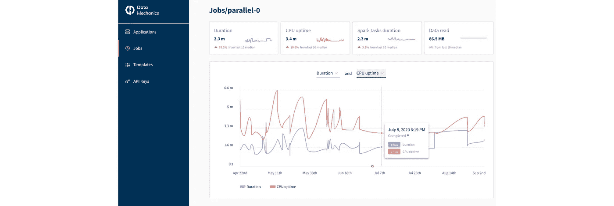
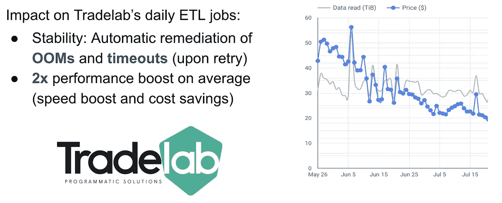
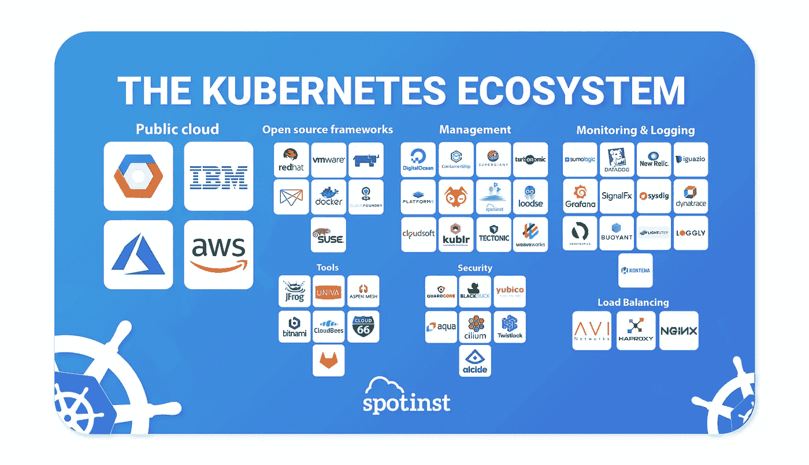
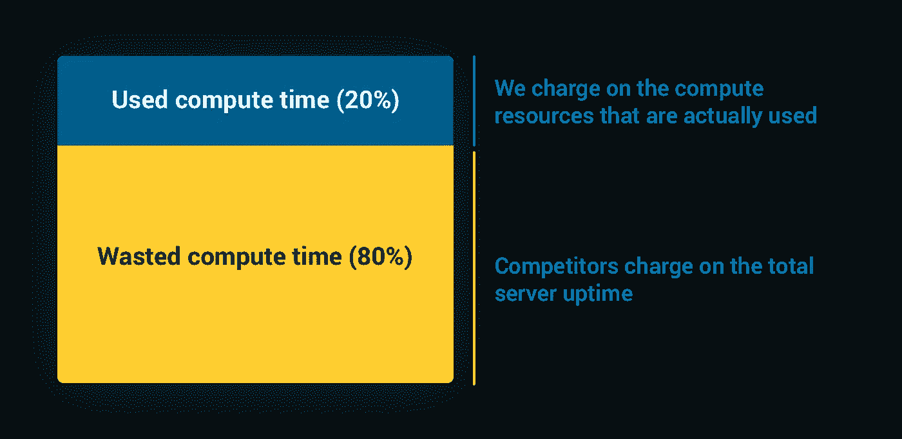

# 我们如何在 Kubernetes 上构建无服务器 Spark 平台——数据机制视频之旅

> 原文：<https://towardsdatascience.com/how-we-built-a-serverless-spark-platform-video-tour-of-data-mechanics-583d1b9f6cb0?source=collection_archive---------41----------------------->

## 我们在 Data Mechanics 的使命是让数据工程师和科学家能够轻松地在大型数据集上构建管道和模型。

我们在 [Data Mechanics](https://www.datamechanics.co/blog-post/video-tour-of-data-mechanics-the-serverless-spark-platform) 的使命是让数据工程师和数据科学家能够在大型数据集上构建管道和模型，只需在他们的笔记本电脑上运行脚本即可。让他们专注于他们的数据，而我们处理基础架构管理的机制。

因此，我们建立了一个无服务器的 [Spark](https://www.datamechanics.co/apache-spark) 平台，一个更易于使用和更高性能的替代服务，如亚马逊 EMR、谷歌 Dataproc、Azure HDInsight、Databricks、Qubole、Cloudera 和 Hortonworks。

在本视频中，我们将向您介绍我们平台的产品及其一些核心特性:

1.  如何将 Jupyter 笔记本连接到平台，与 Spark 互动
2.  如何使用我们的 API 或气流集成以编程方式提交应用程序
3.  如何从我们的控制面板监控 Spark 应用的日志和指标
4.  如何随着时间的推移跟踪工作的成本、稳定性和性能(重复性应用)

Spark 和产品之旅的数据力学介绍

# 是什么让数据力学成为一个无服务器的 Spark 平台？

# 我们的自动驾驶功能

我们的平台动态地、持续地优化您的每个 Spark 应用的基础设施参数和 Spark 配置，使它们保持稳定和高性能。以下是我们调整的一些参数:

*   容器大小(内存、CPU) —保持应用程序稳定(避免内存不足错误)，优化节点上容器的二进制打包，并通过解决应用程序的瓶颈(内存限制、CPU 限制、I/O 限制)来提升应用程序的性能
*   Spark 用来提高其并行度的默认分区数量。
*   磁盘大小、随机存取和 I/O 配置，以确保数据传输阶段以最佳速度运行。

我们的自动调优功能是在一个循环应用程序的过去运行中训练出来的。它会自动对代码或输入数据的变化做出反应，这样您的应用程序就可以随着时间的推移保持稳定和高性能，而无需您的手动操作。

来源:我们 2019 Spark 峰会关于[如何为 Apache Spark](https://databricks.com/session_eu19/how-to-automate-performance-tuning-for-apache-spark) 自动化性能调优的演示

除了自动调整，我们的第二个自动驾驶功能是自动缩放。我们支持两种级别的自动缩放:

*   在应用程序级别:每个 Spark 应用程序根据负载动态调整其执行器数量(动态分配)
*   在集群级别:Kubernetes 集群自动向云提供商添加和删除节点

这种模式让每个应用程序完全独立工作(拥有自己的 Spark 版本、依赖项和资源)，同时始终保持基础设施的成本效益。

# 我们的云原生容器化

数据机制部署在我们客户的云账户中的 Kubernetes 集群上(而大多数其他平台仍然在 Hadoop 的调度器 [YARN](https://hadoop.apache.org/docs/current/hadoop-yarn/hadoop-yarn-site/YARN.html) 上运行 Spark)。

这种部署模式具有以下主要优势:

*   无懈可击的安全模式:我们客户的敏感数据保存在他们的云账户和 VPC 中。
*   原生 docker 支持:我们的客户可以为 Apache Spark ( **更新:截至 2021 年 4 月**这些映像现已在 [DockerHub](https://hub.docker.com/r/datamechanics/spark) 上公开，或者他们可以构建自己的 Docker 映像，以可靠的方式打包他们的依赖关系。进一步了解由此产生的[基于 Docker 的开发人员工作流](https://www.datamechanics.co/blog-post/spark-and-docker-your-spark-development-cycle-just-got-ten-times-faster)的优势。
*   与 Kubernetes 生态系统的丰富工具集成。
*   与云无关:数据机制在 AWS、GCP 和 Azure 上可用。

来源:[在 Kubernetes 上运行 Apache Spark 的利与弊](https://www.datamechanics.co/blog-post/pros-and-cons-of-running-apache-spark-on-kubernetes)(而不是 YARN)

# 我们的无服务器定价模式

竞争数据平台的定价模型基于服务器的正常运行时间。对于每种类型的实例，他们都会按小时收费，不管这个实例是否真的用于运行 Spark 应用。这给 [Spark 开发人员](https://www.datamechanics.co/apache-spark)带来了负担，他们需要高效地管理他们的集群，并确保他们不会因为过度供应或并行性问题而浪费资源。

相反，[数据力学费](https://www.datamechanics.co/pricing)是基于所有 Spark 任务的持续时间总和(Spark 分配的工作单位，以毫秒精度报告)。这意味着我们的平台只有在用户真正工作的时候才能赚钱。我们不赚钱:

*   当一个应用程序完全空闲时(因为您从笔记本电脑上休息了一会儿，忘记缩减您的集群)
*   当您的大多数应用程序资源都在等待一个落后的任务完成时
*   当运行 Spark 驱动程序专用操作时(纯 scala 或 python 代码)

因此，数据机制会在您的应用闲置时积极缩减其规模，以便我们降低您的云成本(而不影响我们的收入)。事实上，我们在您的云成本上节省的成本将覆盖或通常超过我们收取的服务费。

# 我想试试这个，我如何开始？

太好了！第一步是[向我们的团队预订一个演示](https://calendly.com/datamechanics/demo),这样我们可以更多地了解您的使用案例。在初次聊天后，我们将邀请您加入共享的 slack 频道——我们使用 Slack 来提供支持，我们在那里非常积极。我们将向您发送如何授予我们对您选择的 AWS、GCP 或 Azure 帐户的权限的说明，一旦我们获得这些权限，我们将部署数据机制，您将准备好开始使用我们的[文档](https://docs.datamechanics.co/)。

还有一些我们在这篇文章中没有涉及的功能，比如我们对 spot/preemptable 节点的支持，我们对私有集群(与互联网断开)的支持，我们的 Spark UI 替换项目，我们与 CI/CD 工具和机器学习模型跟踪和服务工具的集成。所以，如果你想了解更多，请继续关注[并联系](https://www.datamechanics.co/contact)。