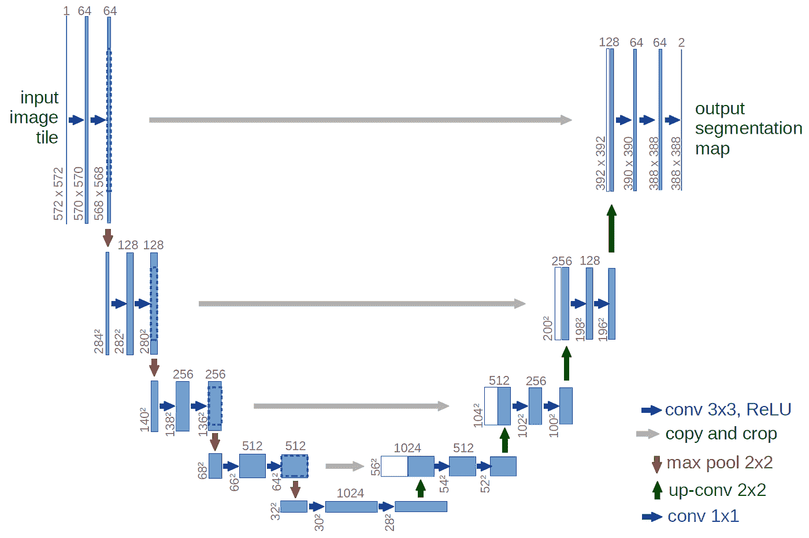

# 我们如何用迁移学习构建一个易于使用的图像分割工具

> 原文：<https://towardsdatascience.com/how-we-built-an-easy-to-use-image-segmentation-tool-with-transfer-learning-546efb6ae98?source=collection_archive---------5----------------------->

## *标记图像，预测新图像，可视化神经网络，所有这些都在一个 Jupyter 笔记本中(并使用 Docker Hub 共享所有内容！)*


作者:[黄珍妮](https://www.linkedin.com/in/jennyhuang6/)，[伊恩·亨特-伊萨克](https://github.com/ianhi)，[威廉·帕恩](https://www.linkedin.com/in/william-palmer-72b5ab12b/)

[GitHub 回购](https://github.com/ianhi/AC295-final-project-JWI)

# **简介**

在新图像上训练图像分割模型可能会令人望而生畏，尤其是当您需要标记自己的数据时。为了使这项任务更容易和更快，我们建立了一个用户友好的工具，让您在一个 Jupyter 笔记本上建立整个过程。在以下部分，我们将向您展示我们的工具如何让您:

1.  手动标记您自己的图像
2.  通过迁移学习建立有效的细分模型
3.  可视化模型及其结果
4.  将您的项目共享为 Docker 图像

该工具的主要优势是**易于使用**、**全在一个平台**，以及**与现有数据科学工作流程**完美集成。通过交互式小部件和命令提示符，我们建立了一种用户友好的方式来标记图像和训练模型。最重要的是，所有的东西都可以在一个 Jupyter 笔记本上运行，这样就可以快速轻松地构建模型，而不需要太多的开销。最后，通过在 Python 环境中工作并使用 Tensorflow 和 Matplotlib 等标准库，该工具可以很好地集成到现有的数据科学工作流中，使其成为科学研究等用途的理想选择。

例如，在微生物学中，分割细胞的显微图像可能非常有用。然而，随着时间的推移跟踪细胞很容易导致需要分割数百张图像，这对于手动操作来说非常困难。在本文中，我们将使用酵母细胞的显微图像作为我们的数据集，并展示我们如何构建我们的工具来区分背景、母细胞和子细胞。

# **1。标签**

有许多现有的工具可以为图像创建带标签的遮罩，包括 [Labelme](https://github.com/wkentaro/labelme) 、 [ImageJ](https://imagej.net/Welcome) ，甚至还有图形编辑器 [GIMP](https://www.gimp.org/) 。虽然这些都是很棒的工具，但它们不能集成到 Jupyter 笔记本中，这使得它们更难与许多现有的工作流一起使用。幸运的是， [Jupyter Widgets](https://ipywidgets.readthedocs.io/en/latest/) 让我们可以轻松地制作交互式组件，并将它们与 Python 代码的其余部分连接起来。

要在笔记本中创建训练遮罩，我们需要解决两个问题:

1.  用鼠标选择图像的一部分
2.  轻松切换图像并选择要标记的类别

为了解决第一个问题，我们使用了 Matplotlib 小部件后端和内置的 [LassoSelector](https://matplotlib.org/3.1.1/gallery/widgets/lasso_selector_demo_sgskip.html) 。LassoSelector 处理绘制一条线来显示您所选择的内容，但是我们需要一点自定义代码来将遮罩绘制为覆盖图:

类来管理 Jupyter 笔记本中 Matplotlib 的套索选择器

对于第二个问题，我们使用 ipywidgets 添加了好看的按钮和其他控件:


我们结合了这些元素(以及像滚动缩放这样的改进)来制作一个标签控制器对象。现在我们可以拍摄酵母的显微图像并分割母细胞和子细胞:

套索选择图像标签演示

您可以检查整个对象，这使您可以滚动缩放，右键单击平移，并在此选择多个类别。

现在我们可以在笔记本上标注少量图片，保存到正确的文件夹结构中，开始训练 CNN！

# **2。模特培训**

## **型号**

[U-net](https://arxiv.org/pdf/1505.04597.pdf) 是一种卷积神经网络，最初设计用于分割生物医学图像，但已成功用于许多其他类型的图像。它建立在现有的卷积网络上，可以更好地处理很少的训练图像，并进行更精确的分割。这是一个最先进的模型，使用`[segmentation_models](https://github.com/qubvel/segmentation_models)`库也很容易实现。



图片来自 https://arxiv.org/pdf/1505.04597.pdf

U-net 是独特的，因为它使用交叉连接(上图中的灰色箭头)将编码器和解码器结合在一起。这些跳过连接从下采样路径中相同大小的部分交叉到上采样路径。当您向上采样时，这将创建输入到模型中的原始像素的意识，这已被证明可以提高分割任务的性能。

尽管 U-net 很棒，但如果我们不给它足够的训练例子，它就不会很好地工作。考虑到手动分割图像是多么乏味，我们只手动标记了 13 幅图像。这么少的训练样本，似乎不可能训练出一个有几百万参数的神经网络。为了克服这一点，我们需要**数据增强**和**迁移学习**。

## **数据增强**

当然，如果您的模型有很多参数，您将需要相应数量的训练示例来获得良好的性能。使用我们的小数据集的图像和面具，我们可以创建新的图像，这将是深刻的和有用的我们的模型作为我们的原始图像。

我们如何做到这一点？我们可以翻转图像，以一定角度旋转它，向内或向外缩放它，裁剪它，平移它，甚至通过添加噪声来模糊图像，但最重要的是，我们可以对这些操作进行**组合**来创建许多新的训练示例。


增强图像的例子

与分类相比，图像数据扩充在分割方面还有一个复杂性。对于分类，您只需要扩大图像，因为标签将保持不变(0 或 1 或 2……)。然而，对于分割，标签(它是一个遮罩)也需要与图像同步变换。为此，我们使用了带有自定义数据生成器的`[albumentations](https://albumentations.readthedocs.io/en/latest/)`库，因为据我们所知，`Keras ImageDataGenerator` 目前不支持“图像+蒙版”的组合。

使用白蛋白进行图像分割的定制数据生成器

## **迁移学习**

即使我们现在已经创建了 100 个或更多的图像，这仍然不够，因为 U-net 模型有超过 600 万个参数。这就是迁移学习发挥作用的地方。

[转移学习](https://machinelearningmastery.com/transfer-learning-for-deep-learning/)让你把一个在一个任务上训练过的模型，重新用于另一个类似的任务。它大大减少了你的训练时间，更重要的是，它可以产生有效的模型，即使是像我们这样的小规模训练。例如，像 MobileNet、Inception 和 DeepNet 这样的神经网络通过对大量图像进行训练来学习特征空间、形状、颜色、纹理等。然后我们可以*通过获取这些模型权重并稍微修改它们以激活我们自己的训练图像中的模式来转移所学的*。

现在我们如何用 U-net 使用迁移学习？我们使用了`segmentation_models`库来完成这项工作。我们使用您选择的深度神经网络的层(MobileNet、Inception、ResNet)和图像分类的参数发现训练(ImageNet ),并将它们用作您的 U-net 的前半部分(编码器)。然后，使用您自己的扩充数据集训练解码器层。

**组装在一起**

我们将所有这些放在一个分段模型类中，您可以在这里找到。创建模型对象时，您会得到一个交互式命令提示符，您可以在其中自定义 U-net 的各个方面，如损失函数、主干等:

细分模型定制演示

经过 30 个周期的训练，我们达到了 95%的准确率。注意，选择一个好的损失函数是很重要的。我们首先尝试了交叉熵损失，但该模型无法区分外观相似的母细胞和子细胞，并且由于看到的非酵母像素比酵母像素多得多的类别不平衡，该模型的性能很差。我们发现使用骰子损失给了我们更好的结果。骰子损失与联合分数的交集(IOU)相关联，并且通常更适合于分段任务，因为它提供了最大化预测和基础真实掩码之间的重叠的激励。


我们的模型预测的例子与真实的面具相比较

# **3。可视化**

现在我们的模型已经训练好了，让我们使用一些可视化技术来看看它是如何工作的。我们按照 Ankit Paliwal 的教程来做。你可以在他对应的 [GitHub 库](https://github.com/anktplwl91/visualizing_convnets)中找到实现。在本节中，我们将在我们的酵母细胞分割模型上可视化他的两种技术，中间层激活和类激活的热图。

## **中间层激活**

第一种技术在测试图像上显示了网络前向传递中中间层的输出。这让我们可以看到输入图像的哪些特征在每一层都被突出显示。输入测试图像后，我们可视化了网络中某些卷积层的前几个输出:


某些编码器层的输出


某些解码器层的输出

在编码器层中，靠近输入的滤波器检测更多的细节，而靠近模型输出的滤波器检测更多的一般特征，这是可以预料的。在解码器层，我们看到相反的模式，从抽象到更具体的细节，这也是可以预期的。

## **课程激活热图**

接下来，我们看看类激活图。这些热图可让您了解影像的每个位置对于预测输出类别的重要性。在这里，我们可视化了酵母细胞模型的最后一层，因为类别预测标签将在很大程度上依赖于它。


一些样本图像上的类激活热图

我们从热图中看到，细胞位置和部分图像边界被正确激活，这有点令人惊讶。

我们还查看了教程中的最后一项技术，它显示了每个卷积滤波器最大限度地响应哪些图像，但可视化对于我们特定的酵母细胞模型来说并不太有用。

# **4。制作和共享 Docker 图像**

找到一个很棒的模型并试图运行它，却发现它由于神秘的依赖问题而无法在您的环境中工作，这是非常令人沮丧的。我们通过为我们的工具创建一个 Docker 映像来解决这个问题。这允许我们完全定义代码运行的环境，一直到操作系统。对于这个项目，我们基于 Jupyter Docker 栈中的`jupyter/tensorflow-notebook`图像制作 Docker 图像。然后我们添加了几行代码来安装我们需要的库，并将 GitHub 库的内容复制到 Docker 映像中。如果你好奇，你可以在这里看到我们的最终文档。最后，我们将该图像推送到 Docker Hub，以便于分发。您可以通过运行以下命令来尝试一下:

```
sudo docker run -p 8888:8888 ianhuntisaak/ac295-final-project:v3 \
-e JUPYTER_LAB_ENABLE=yes
```

# **结论和未来工作**

该工具让您能够以用户友好的方式轻松地在新图像上训练分割模型。虽然它可以工作，但在可用性、定制和模型性能方面仍有改进的空间。未来，我们希望:

1.  通过使用 html5 画布构建自定义 Jupyter 小部件来改进套索工具，以减少手动分段时的滞后
2.  探索新的损失函数和模型(如在宽核数据集 [上预先训练的](https://bioimage.io/?model=2D%20UNet%20Nuclei%20Broad))[U-net)](https://bioimage.io/?model=2D%20UNet%)作为迁移学习的基础
3.  使解释可视化更容易，并向用户建议改善结果的方法

# **致谢**

我们要感谢我们的 Pavlos Protopapas 教授和[哈佛应用计算 295 课程](https://harvard-iacs.github.io/2020-AC295/)教学人员的指导和支持。